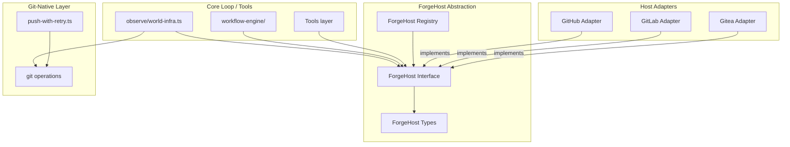
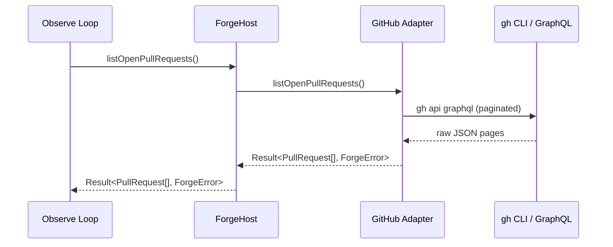
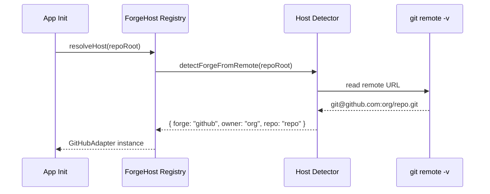

# Design Document: Forge Host Adapter

## Overview

The ForgeHost adapter introduces a clean separation between git-native operations and forge-host-specific code (GitHub, GitLab, Gitea, etc.) in the TypeScript layer. This mirrors the existing F# `CredentialSource` pattern where "GitHub is a plugin, not git-native." The core observe loop and tools consume a `ForgeHost` interface — they never name a host directly.

The current TypeScript layer mixes `gh` CLI calls with `git` operations across multiple directories (`git/`, `observe/`, `archive/`, `pr-preservation/`, `refresh-github-worldview/`, `github-accelerator-measurement/`). This design establishes a 3-layer architecture: git-native (pure `git` ops), ForgeHost abstraction (host-agnostic interface + types), and host adapters (concrete implementations per forge).

## Architecture



## Sequence Diagrams

### PR State Query Flow



### Adapter Resolution Flow



## Components and Interfaces

### Component 1: ForgeHost Interface

**Purpose**: The single contract that all forge adapters implement. The core loop and tools depend only on this interface.

**Interface**:
```typescript
interface ForgeHost {
  readonly forgeName: string;

  // --- PR state ---
  listOpenPullRequests(opts?: ListPrOpts): Promise<Result<readonly PullRequest[], ForgeError>>;
  getPullRequest(number: number): Promise<Result<PullRequest, ForgeError>>;
  getPrGateState(number: number): Promise<Result<PrGateState, ForgeError>>;
  listMergedPullRequests(opts?: ListMergedPrOpts): Promise<Result<readonly PullRequest[], ForgeError>>;

  // --- PR actions ---
  resolveThread(threadId: string, body: string): Promise<Result<void, ForgeError>>;
  resolveThreadsBatch(threads: readonly ThreadResolution[]): Promise<Result<BatchResult, ForgeError>>;
  createPullRequest(opts: CreatePrOpts): Promise<Result<PullRequest, ForgeError>>;
  enableAutoMerge(prNumber: number, method?: MergeMethod): Promise<Result<void, ForgeError>>;
  addPrComment(prNumber: number, body: string): Promise<Result<CommentRef, ForgeError>>;

  // --- Issues ---
  listOpenIssues(opts?: ListIssueOpts): Promise<Result<readonly Issue[], ForgeError>>;
  createIssue(opts: CreateIssueOpts): Promise<Result<Issue, ForgeError>>;

  // --- CI state ---
  getCheckStatus(ref: string): Promise<Result<CheckRollup, ForgeError>>;
  listPendingRuns(ref: string): Promise<Result<readonly CiRun[], ForgeError>>;

  // --- Repository info ---
  getRepoInfo(): Promise<Result<RepoInfo, ForgeError>>;
  getBranchProtection(branch: string): Promise<Result<BranchProtection, ForgeError>>;

  // --- Git data API (bypass for saturated push) ---
  createBlob(content: string, encoding?: "utf-8" | "base64"): Promise<Result<string, ForgeError>>;
  createTree(tree: readonly TreeEntry[], baseTree?: string): Promise<Result<string, ForgeError>>;
  createCommit(opts: CreateCommitOpts): Promise<Result<string, ForgeError>>;
  updateRef(ref: string, sha: string, force?: boolean): Promise<Result<void, ForgeError>>;
}
```

**Responsibilities**:
- Define the complete surface area for forge host interactions
- All methods return `Result<T, ForgeError>` — never throw
- Lazy implementation allowed: adapters may return `ForgeError.NotSupported` for unimplemented capabilities

### Component 2: ForgeHost Types

**Purpose**: Host-agnostic data types consumed by the core loop. No host-specific fields leak through.

```typescript
// --- Result type (matches project convention: Result-over-exception) ---
type Result<T, E> =
  | { readonly ok: true; readonly value: T }
  | { readonly ok: false; readonly error: E };

// --- Error type ---
interface ForgeError {
  readonly kind: ForgeErrorKind;
  readonly message: string;
  readonly retryable: boolean;
  readonly raw?: unknown;
}

type ForgeErrorKind =
  | "not-supported"      // adapter hasn't implemented this method
  | "auth-failure"       // credentials invalid or expired
  | "rate-limited"       // API rate limit hit
  | "not-found"          // resource doesn't exist
  | "network"            // transient network failure
  | "parse-failure"      // response couldn't be parsed
  | "permission-denied"  // valid auth but insufficient permissions
  | "internal";          // unexpected adapter error

// --- PR types ---
interface PullRequest {
  readonly number: number;
  readonly title: string;
  readonly headRef: string;
  readonly baseRef: string;
  readonly state: PrState;
  readonly isDraft: boolean;
  readonly mergeStateStatus: MergeStateStatus;
  readonly reviewDecision: ReviewDecision | null;
  readonly url: string;
  readonly updatedAt: string;
  readonly author: string;
}

type PrState = "open" | "merged" | "closed";
type MergeStateStatus = "clean" | "blocked" | "dirty" | "unstable" | "unknown";
type ReviewDecision = "approved" | "changes-requested" | "review-required" | null;
type MergeMethod = "merge" | "squash" | "rebase";

interface PrGateState {
  readonly number: number;
  readonly state: PrState;
  readonly gate: "clean" | "blocked" | "dirty" | "unstable" | "unknown";
  readonly checks: CheckSummary;
  readonly requiredChecks: CheckSummary;
  readonly unresolvedThreads: number;
  readonly autoMerge: "armed" | "none";
  readonly mergeCommit: string | null;
  readonly warnings: readonly string[];
  readonly nextAction: NextAction;
}

interface CheckSummary {
  readonly ok: number;
  readonly inProgress: number;
  readonly pending: number;
  readonly failed: number;
}

type NextAction =
  | "wait-ci"
  | "fix-failed-checks"
  | "resolve-threads"
  | "rebase"
  | "verify-merge"
  | "none";

// --- Thread types ---
interface ThreadResolution {
  readonly threadId: string;
  readonly body: string;
}

interface BatchResult {
  readonly resolved: number;
  readonly failed: readonly { threadId: string; error: ForgeError }[];
}

// --- Issue types ---
interface Issue {
  readonly number: number;
  readonly title: string;
  readonly body: string;
  readonly state: "open" | "closed";
  readonly url: string;
  readonly labels: readonly string[];
}

// --- CI types ---
interface CheckRollup {
  readonly ref: string;
  readonly checks: readonly CiCheck[];
  readonly summary: CheckSummary;
  readonly requiredSummary: CheckSummary;
}

interface CiCheck {
  readonly name: string;
  readonly status: "queued" | "in-progress" | "completed";
  readonly conclusion: CiConclusion | null;
  readonly required: boolean;
}

type CiConclusion =
  | "success" | "neutral" | "skipped"
  | "failure" | "cancelled" | "timed-out"
  | "startup-failure" | "action-required" | "stale";

interface CiRun {
  readonly id: string;
  readonly name: string;
  readonly status: "queued" | "in-progress";
  readonly headSha: string;
}

// --- Repository info ---
interface RepoInfo {
  readonly owner: string;
  readonly name: string;
  readonly defaultBranch: string;
  readonly isPrivate: boolean;
  readonly url: string;
}

interface BranchProtection {
  readonly requiredChecks: readonly string[];
  readonly requiresReview: boolean;
  readonly requiredReviewCount: number;
  readonly dismissesStaleReviews: boolean;
}

// --- Git data API types ---
interface TreeEntry {
  readonly path: string;
  readonly mode: "100644" | "100755" | "040000" | "160000" | "120000";
  readonly type: "blob" | "tree" | "commit";
  readonly sha: string;
}

interface CreateCommitOpts {
  readonly message: string;
  readonly tree: string;
  readonly parents: readonly string[];
}

// --- Options ---
interface ListPrOpts {
  readonly limit?: number;
  readonly orderBy?: "updated" | "created";
}

interface ListMergedPrOpts {
  readonly limit?: number;
  readonly since?: string; // ISO 8601
}

interface CreatePrOpts {
  readonly title: string;
  readonly body: string;
  readonly head: string;
  readonly base: string;
  readonly draft?: boolean;
}

interface ListIssueOpts {
  readonly limit?: number;
  readonly labels?: readonly string[];
}

interface CreateIssueOpts {
  readonly title: string;
  readonly body: string;
  readonly labels?: readonly string[];
}

interface CommentRef {
  readonly id: string;
  readonly url: string;
}
```

### Component 3: ForgeHost Registry

**Purpose**: Detects the forge from git remote URLs and instantiates the correct adapter. Single entry point for the core loop.

```typescript
interface ForgeHostRegistry {
  resolveHost(repoRoot: string): Promise<Result<ForgeHost, ForgeError>>;
  resolveHostFromRemote(remoteUrl: string): Result<ForgeHost, ForgeError>;
  registerAdapter(pattern: RegExp, factory: AdapterFactory): void;
}

type AdapterFactory = (owner: string, repo: string) => ForgeHost;
```

**Responsibilities**:
- Parse git remote URL to determine forge host (github.com, gitlab.com, gitea instances, etc.)
- Instantiate the correct adapter with owner/repo context
- Support custom registrations for self-hosted instances
- Return `ForgeError.NotFound` when no adapter matches the remote

### Component 4: GitHub Adapter

**Purpose**: Concrete `ForgeHost` implementation using `gh` CLI and GitHub GraphQL/REST APIs.

```typescript
class GitHubAdapter implements ForgeHost {
  readonly forgeName = "github";

  constructor(
    private readonly owner: string,
    private readonly repo: string,
  ) {}

  // Implements all ForgeHost methods via `gh` CLI calls
  // Maintains same exit-code semantics as existing tools
  // Uses spawnSync for CLI calls (matches project pattern)
}
```

**Responsibilities**:
- Wrap all `gh` CLI calls behind the ForgeHost interface
- Handle GraphQL pagination transparently
- Map GitHub-specific response shapes to ForgeHost types
- Classify errors (auth, rate-limit, not-found, network) into `ForgeErrorKind`
- Support the AI attribution footer pattern for comments

## Data Models

### ForgeHost Detection Model

```typescript
interface DetectedForge {
  readonly forge: "github" | "gitlab" | "gitea" | "bitbucket" | "sourcehut" | "codeberg" | "unknown";
  readonly owner: string;
  readonly repo: string;
  readonly host: string; // e.g. "github.com", "gitlab.company.com"
}
```

**Validation Rules**:
- Remote URL must be parseable as SSH (`git@host:owner/repo.git`) or HTTPS (`https://host/owner/repo.git`)
- Owner and repo must be non-empty strings
- Host must resolve to a known forge pattern or registered custom adapter

### Result Model

```typescript
// Re-exported from a shared location for consistency
type Result<T, E> =
  | { readonly ok: true; readonly value: T }
  | { readonly ok: false; readonly error: E };

function ok<T>(value: T): Result<T, never> {
  return { ok: true, value };
}

function err<E>(error: E): Result<never, E> {
  return { ok: false, error };
}

function forgeError(kind: ForgeErrorKind, message: string, retryable = false): ForgeError {
  return { kind, message, retryable };
}
```

## Algorithmic Pseudocode

### Remote URL Detection Algorithm

```typescript
function detectForgeFromRemote(repoRoot: string): Result<DetectedForge, ForgeError> {
  // Step 1: Read git remote URL
  const remoteResult = spawnSync("git", ["remote", "get-url", "origin"], {
    cwd: repoRoot,
    encoding: "utf8",
  });
  if (remoteResult.status !== 0) {
    return err(forgeError("not-found", "no git remote 'origin' found"));
  }
  const url = remoteResult.stdout.trim();

  // Step 2: Parse SSH or HTTPS URL
  const sshMatch = url.match(/^git@([^:]+):([^/]+)\/(.+?)(?:\.git)?$/);
  const httpsMatch = url.match(/^https?:\/\/([^/]+)\/([^/]+)\/(.+?)(?:\.git)?$/);

  const [host, owner, repo] = sshMatch
    ? [sshMatch[1], sshMatch[2], sshMatch[3]]
    : httpsMatch
      ? [httpsMatch[1], httpsMatch[2], httpsMatch[3]]
      : [null, null, null];

  if (!host || !owner || !repo) {
    return err(forgeError("parse-failure", `cannot parse remote URL: ${url}`));
  }

  // Step 3: Classify host
  const forge = classifyHost(host);

  return ok({ forge, owner, repo, host });
}

function classifyHost(host: string): DetectedForge["forge"] {
  if (host === "github.com" || host.includes("github")) return "github";
  if (host === "gitlab.com" || host.includes("gitlab")) return "gitlab";
  if (host.includes("gitea") || host.includes("codeberg.org")) return "gitea";
  if (host.includes("bitbucket")) return "bitbucket";
  if (host.includes("sr.ht")) return "sourcehut";
  return "unknown";
}
```

### Error Classification Algorithm

```typescript
function classifyGhError(status: number, stderr: string): ForgeError {
  const lower = stderr.toLowerCase();

  if (lower.includes("401") || lower.includes("authentication") || lower.includes("auth token")) {
    return forgeError("auth-failure", stderr, false);
  }
  if (lower.includes("403") || lower.includes("permission") || lower.includes("forbidden")) {
    return forgeError("permission-denied", stderr, false);
  }
  if (lower.includes("404") || lower.includes("not found") || lower.includes("could not resolve")) {
    return forgeError("not-found", stderr, false);
  }
  if (lower.includes("rate limit") || lower.includes("429") || lower.includes("secondary rate")) {
    return forgeError("rate-limited", stderr, true);
  }
  if (lower.includes("timeout") || lower.includes("connection") || lower.includes("network")) {
    return forgeError("network", stderr, true);
  }
  if (status === 5 || (status >= 500 && status < 600)) {
    return forgeError("network", stderr, true); // 5xx is transient
  }
  return forgeError("internal", `gh exit ${status}: ${stderr}`, false);
}
```

## Key Functions with Formal Specifications

### Function: listOpenPullRequests

```typescript
async function listOpenPullRequests(opts?: ListPrOpts): Promise<Result<readonly PullRequest[], ForgeError>>
```

**Preconditions:**
- Adapter is initialized with valid owner/repo
- `gh` CLI is available on PATH
- `opts.limit` if provided is a positive integer

**Postconditions:**
- On success: returns array of PRs in the specified order
- All returned PRs have `state === "open"`
- Array length ≤ `opts.limit` (default: 100)
- Each PR has all required fields populated (no undefined)
- On error: returns a classified ForgeError with appropriate `retryable` flag

### Function: resolveThreadsBatch

```typescript
async function resolveThreadsBatch(threads: readonly ThreadResolution[]): Promise<Result<BatchResult, ForgeError>>
```

**Preconditions:**
- `threads` is non-empty array
- Each `threads[i].threadId` is a valid GraphQL node ID
- Each `threads[i].body` is non-empty string

**Postconditions:**
- `result.resolved + result.failed.length === threads.length`
- Each thread is attempted exactly once
- Partial success is reported (not all-or-nothing)
- Order of processing matches input order

### Function: detectForgeFromRemote

```typescript
function detectForgeFromRemote(repoRoot: string): Result<DetectedForge, ForgeError>
```

**Preconditions:**
- `repoRoot` is a valid filesystem path
- A git repository exists at `repoRoot`

**Postconditions:**
- On success: `owner` and `repo` are non-empty strings
- On success: `forge` is one of the recognized forge types
- If remote URL is unparseable: returns `ForgeError` with kind `"parse-failure"`
- If no remote exists: returns `ForgeError` with kind `"not-found"`
- No side effects (read-only operation)

## Example Usage

```typescript
import { resolveForgeHost } from "../forge-host/registry";
import type { ForgeHost, Result, ForgeError, PullRequest } from "../forge-host/types";

// --- Example 1: Resolve the adapter from the repo root ---
const hostResult = await resolveForgeHost(process.cwd());
if (!hostResult.ok) {
  console.error(`Cannot resolve forge: ${hostResult.error.message}`);
  process.exit(1);
}
const forge: ForgeHost = hostResult.value;

// --- Example 2: List open PRs (the observe loop pattern) ---
const prsResult = await forge.listOpenPullRequests({ limit: 20 });
if (prsResult.ok) {
  const clean = prsResult.value.filter((pr) => pr.mergeStateStatus === "clean");
  console.log(`${clean.length} merge-ready PRs`);
} else if (prsResult.error.retryable) {
  // schedule retry
} else {
  console.error(`PR fetch failed: ${prsResult.error.message}`);
}

// --- Example 3: Batch resolve threads (replaces batch-resolve-pr-threads.ts coupling) ---
const batchResult = await forge.resolveThreadsBatch([
  { threadId: "PRRT_abc123", body: "Acknowledged — self-heals on queue drain." },
  { threadId: "PRRT_def456", body: "Name attribution is legitimate per policy." },
]);
if (batchResult.ok) {
  console.log(`Resolved: ${batchResult.value.resolved}, Failed: ${batchResult.value.failed.length}`);
}

// --- Example 4: PR gate query (replaces poll-pr-gate.ts direct gh calls) ---
const gateResult = await forge.getPrGateState(917);
if (gateResult.ok) {
  const gate = gateResult.value;
  console.log(`PR #${gate.number}: gate=${gate.gate}, next=${gate.nextAction}`);
}

// --- Example 5: Lazy adapter (GitLab with partial support) ---
const createResult = await forge.createBlob("hello", "utf-8");
if (!createResult.ok && createResult.error.kind === "not-supported") {
  // Fall back to git-native push
}
```

## Error Handling

### Error Scenario 1: Authentication Failure

**Condition**: `gh auth token` returns empty or `gh api` returns 401
**Response**: Return `ForgeError { kind: "auth-failure", retryable: false }`
**Recovery**: Caller logs the error; the autonomous loop can invoke `gh auth refresh` via the existing `auth/gh-auth-refresh-wrapper.ts`

### Error Scenario 2: Rate Limiting

**Condition**: GitHub API returns 403 with `X-RateLimit-Remaining: 0` or 429 response
**Response**: Return `ForgeError { kind: "rate-limited", retryable: true }` with reset time in `raw`
**Recovery**: Caller backs off until reset time; composes with existing `GiteaRateLimitTier` pattern in `workflow-engine/gitea-world.ts`

### Error Scenario 3: Partial Batch Failure

**Condition**: Some threads in a `resolveThreadsBatch` call fail while others succeed
**Response**: Return `ok` result with `BatchResult` showing both resolved count and individual failures
**Recovery**: Caller can retry just the failed thread IDs; no rollback of successful resolutions

### Error Scenario 4: Adapter Not Found

**Condition**: Git remote URL doesn't match any registered adapter pattern
**Response**: Return `ForgeError { kind: "not-found", message: "no adapter for host: <url>" }`
**Recovery**: Tools that require forge interaction fail gracefully; git-native operations continue unaffected

## Testing Strategy

### Unit Testing Approach

- Test `detectForgeFromRemote` with various URL formats (SSH, HTTPS, custom domains)
- Test `classifyGhError` with representative stderr output samples
- Test GitHub adapter methods using fixture JSON (existing pattern in `github/fixtures/`)
- Test `classifyHost` mapping for all supported forges

### Property-Based Testing Approach

**Property Test Library**: fast-check

- Round-trip properties for type serialization (PullRequest → JSON → PullRequest)
- URL detection invariants across random valid/invalid URLs
- Error classification completeness (every gh exit code maps to exactly one ForgeErrorKind)
- BatchResult arithmetic invariant (resolved + failed.length === input.length)

### Integration Testing Approach

- Smoke tests using `gh` CLI against the actual repo (gated behind env flag)
- Fixture-based tests for GraphQL response parsing (existing pattern)
- Compose with existing `poll-pr-gate.test.ts` fixture infrastructure

## Performance Considerations

- All `gh` CLI calls use `spawnSync` with bounded `maxBuffer` (64MB, matching existing pattern)
- Timeouts on all external calls (30s default, matching `world-infra.ts` pattern)
- GraphQL pagination for PR lists (100 items per page, matching `refresh-github-worldview/refresh.ts`)
- No in-memory caching in v1 — the observe loop already runs on a tick cadence that bounds call frequency

## Security Considerations

- No secrets stored in adapter state — credentials flow through `gh` CLI auth (already manages token lifecycle)
- AI attribution appended to all posted comments (preserves existing `github/ai-attribution.ts` pattern)
- Command args passed as arrays to `spawnSync` — never shell-interpolated (injection-safe)
- `ForgeError.raw` field may contain sensitive info — callers must not log it to shared surfaces

## Dependencies

- `gh` CLI (existing dependency; GitHub adapter)
- `node:child_process` (spawnSync — existing pattern)
- `node:fs` / `node:path` (for fixture loading in tests)
- `fast-check` (property-based testing)
- No new external npm packages required

## Correctness Properties

*A property is a characteristic or behavior that should hold true across all valid executions of a system — essentially, a formal statement about what the system should do. Properties serve as the bridge between human-readable specifications and machine-verifiable correctness guarantees.*

### Property 1: URL Detection Round Trip

For any valid git remote URL (SSH or HTTPS format) containing a host, owner, and repo, `detectForgeFromRemote` shall produce a `DetectedForge` where re-constructing the URL from `host`, `owner`, `repo` yields the original (modulo `.git` suffix and protocol prefix).

**Validates: Requirements 3.5**

### Property 2: Error Classification Completeness

For any non-zero exit code and arbitrary stderr string from `gh` CLI, `classifyGhError` shall return a `ForgeError` with a valid `ForgeErrorKind` — never throw, never return undefined.

**Validates: Requirements 2.2**

### Property 3: Batch Result Arithmetic

For any non-empty array of `ThreadResolution` inputs to `resolveThreadsBatch`, the result's `resolved + failed.length` shall equal the input array's length.

**Validates: Requirements 4.4**

### Property 4: Adapter Interface Completeness

For any `ForgeHost` implementation that returns `not-supported` for a method, calling that method shall return a well-formed `Result` with `ok: false` and `error.kind === "not-supported"` — never throw.

**Validates: Requirements 1.5**

### Property 5: PR List State Invariant

For any successful result from `listOpenPullRequests`, every element in the returned array shall have `state === "open"`.

**Validates: Requirements 2.6**

### Property 6: ForgeError Retryable Classification Consistency

For any `ForgeError`, if `kind` is `"rate-limited"` or `"network"`, then `retryable` shall be `true`. If `kind` is `"auth-failure"`, `"not-supported"`, or `"permission-denied"`, then `retryable` shall be `false`.

**Validates: Requirements 1.6**
