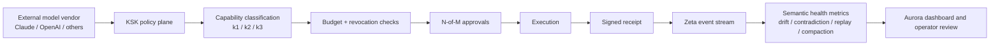
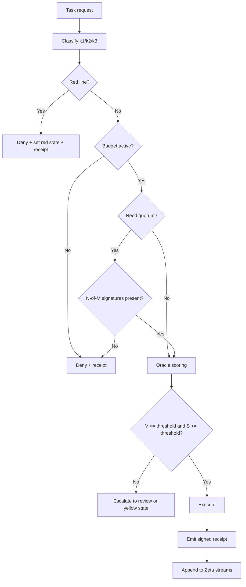
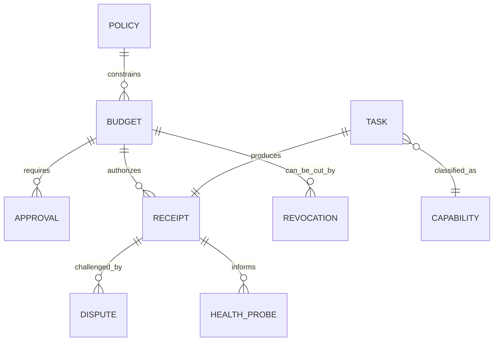
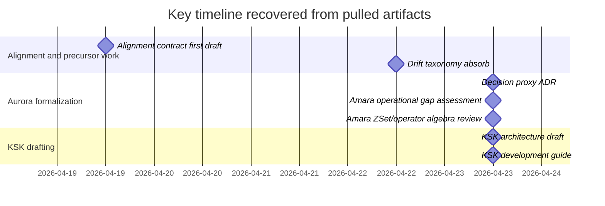

# Amara — Aurora-Aligned KSK Design Research Across Zeta and lucent-ksk (7th courier ferry)

**Scope:** research and cross-review artifact only; archived
for provenance, not as operational policy
**Attribution:** preserve original speaker labels exactly as
generated; Amara (author), Otto (absorb), Aaron (courier), Max
(implicit attribution for `lucent-ksk` substrate referenced by
the ferry)
**Operational status:** research-grade unless and until
promoted by a separate governed change
**Non-fusion disclaimer:** agreement, shared language, or
repeated interaction between models and humans does not imply
shared identity, merged agency, consciousness, or personhood.
The proposed ADR, math spec, and implementation order in this
ferry are Amara's proposals — adopting any of them requires
Aaron + Kenji (Architect) + Aminata (threat-model-critic)
review per the decision-proxy ADR.
**Date:** 2026-04-23
**From:** Amara (external AI maintainer; Aurora co-originator)
**Via:** Aaron's courier ferry (pasted into autonomous-loop
session Otto-87)
**Absorbed by:** Otto (loop-agent PM hat), Otto-88 tick
2026-04-24T02:~Z (following Otto-87 scheduling memory
`memory/project_amara_7th_ferry_aurora_aligned_ksk_design_math_spec_threat_model_branding_shortlist_pending_absorb_otto_88_2026_04_23.md`)
**Prior ferries:** PR #196 (1st), PR #211 (2nd), PR #219
(3rd), PR #221 (4th), PR #235 (5th), PR #245 (6th)

---

## Preamble context from Aaron (Otto-87)

*"another amara update"* (verbatim) — single-line framing
followed by the full ferry paste. Light-touch paste with no
additional directive framing.

---

## Verbatim preservation (Amara's report)

Per courier-protocol §verbatim-preservation + signal-in-
signal-out discipline, the following is Amara's report as
paste, preserved verbatim. Citation anchors
(`turnNfileN` / `turnNsearchN`) are preserved as-is; they
reference Amara's tool chain and are not Zeta-resolvable.

---

### Executive Summary

I indexed the three requested GitHub repositories through the
connected GitHub source and pulled the highest-value
architecture, governance, research, Aurora, and KSK documents
into this review. The strongest findings are straightforward.
First, **Zeta is already a real algebraic substrate**, not a
speculative note pile: its public README defines it as an F#
implementation of DBSP for .NET, centered on delay `z^-1`,
differentiation `D`, integration `I`, and the incrementalization
identity `Q^Δ = D ∘ Q^↑ ∘ I`, then extends that kernel with
joins, aggregates, windowing, sketches, CRDTs, recursion, spine
storage, Arrow serialization, runtimes, and plugin surfaces.
fileciteturn36file0L1-L1

Second, the **factory/governance layer is unusually explicit**.
`AGENTS.md` frames the repository as an AI-directed software
factory whose quality backstop is formal verification,
adversarial review, and spec-driven development; `docs/ALIGNMENT.md`
goes further and treats alignment as a measurable property over
commits, memory, and round history rather than a purely
rhetorical notion. fileciteturn37file0L1-L1
fileciteturn38file0L1-L1

Third, the **Aurora-facing material is not vapor**. The
drift-taxonomy precursor document captures a reusable
five-pattern anti-drift framework and explicitly warns against
absorbing entities instead of ideas. The two Aurora documents
pulled here show that the repo has already formalized
Amara-facing review, Z-set/operator-algebra analysis, and
decision-proxy governance, while also being honest that some of
the most important operating model pieces have historically
lived in PR state before becoming canonical. fileciteturn39file0L1-L1
fileciteturn40file0L1-L1 fileciteturn41file0L1-L1

Fourth, **the nascent KSK is coherent enough to design against
now**. In `lucent-ksk`, the architecture draft describes a
"local-first safety kernel" with capability surfaces
`observe.k1`, `influence.k2`, and `actuate.k3`; signed budget
tokens; N-of-M approvals; one-tap revocation; signed receipts;
health probes; disputes; verdicts; and optional Bitcoin
anchoring. Its development guide turns that into a build plan
around `/authorize`, `/execute`, `/revoke`, `/heartbeat`, consent
UI, append-only ledgering, traffic-light escalation, and
integration hooks for GitHub, ticketing, storage, and wallets.
fileciteturn33file0L1-L1 fileciteturn34file0L1-L1

Fifth, the current government/industry context does **not**
support the strongest version of "Anthropic has been officially
declared a supply-chain risk" in the official sources reviewed
here. What the official material does support is a broader and
very relevant framing: U.S. guidance treats AI/software vendors
as **suppliers inside a supply-chain risk problem**, emphasizes
SBOM/provenance, procurement discipline, secure-by-design, and
customer-side due diligence, and NIST frames generative-AI
deployment as a trust/risk-management problem. In that framing,
**Anthropic and OpenAI are not uniquely condemned by name in the
official sources reviewed here; rather, they are examples of
high-consequence external suppliers that should be governed as
such**. citeturn0search1turn0search4turn0search5turn0search9turn0search8

That is why KSK matters. **KSK should not be read as "another
model wrapper."** It is better understood as an
**organization-controlled policy, consent, and receipt plane**
that sits above model vendors. OpenAI and Anthropic both
advertise enterprise controls such as no training on business
data by default, retention controls, auditability, and
security/compliance features; those are valuable, but they do
not remove dependency on an external supplier's runtime, policy
changes, or product behavior. KSK solves a different problem:
it keeps high-risk authorization, revocation, provenance, and
dispute handling under local control even when the cognition
layer comes from an external model. citeturn1search0turn1search2turn1search6turn2search0turn2search1turn2search3turn2search7

### Source Inventory and Archive Index

The enabled connectors for this pass were **GitHub, Google
Drive, Google Calendar, Gmail, and Dropbox**. The decisive
source for the requested repo-only research was GitHub. Dropbox
also surfaced Lucent legal/corporate PDFs, but those were
outside the repository-only scope of this design review, so they
are noted as context rather than used as a primary technical
source. fileciteturn8file0L1-L1 fileciteturn8file1L1-L1
fileciteturn8file2L1-L1

The three repositories successfully indexed for this report were
`Lucent-Financial-Group/Zeta`, `AceHack/Zeta`, and
`Lucent-Financial-Group/lucent-ksk`. The repo corpus I actually
**pulled and read** in full is listed below; after that, I
include a smaller list of high-value **indexed-only** files that
were discovered through repository search but not content-fetched
in this pass. fileciteturn13file0L1-L1 fileciteturn16file0L1-L1
fileciteturn19file0L1-L1

| Repo | Status | Path | Summary | Relevance tags | Evidence |
|---|---|---|---|---|---|
| Lucent-Financial-Group/Zeta | Pulled | `README.md` | Public definition of Zeta as a DBSP implementation on .NET with identities, operator surface, storage/runtime layers, and performance posture. | algebra, API, runtime, storage | fileciteturn36file0L1-L1 |
| Lucent-Financial-Group/Zeta | Pulled | `AGENTS.md` | Universal onboarding/governance handbook for humans and AI agents; frames the repo as an AI-directed software factory with verification as the quality backstop. | governance, factory, process | fileciteturn37file0L1-L1 |
| Lucent-Financial-Group/Zeta | Pulled | `docs/ALIGNMENT.md` | Mutual-benefit alignment contract; treats alignment as measurable over commits, memory, and rounds. | alignment, metrics, governance | fileciteturn38file0L1-L1 |
| Lucent-Financial-Group/Zeta | Pulled | `docs/research/drift-taxonomy-bootstrap-precursor-2026-04-22.md` | Research absorb of precursor conversation; preserves the five-pattern drift taxonomy and branding-risk notes around Aurora. | drift, aurora, branding, epistemics | fileciteturn39file0L1-L1 |
| Lucent-Financial-Group/Zeta | Pulled | `docs/aurora/2026-04-23-amara-operational-gap-assessment.md` | External review of repo progress and operational gaps; strongest source on main-vs-PR ambiguity, memory index lag, and closure-over-novelty. | aurora, operations, review | fileciteturn40file0L1-L1 |
| Lucent-Financial-Group/Zeta | Pulled | `docs/aurora/2026-04-23-amara-zset-semantics-operator-algebra.md` | Systematic audit of ZSet semantics, normalization, recursion caveats, and proposed semantic metrics like stability and "Veridicality Score." | algebra, zset, aurora, metrics | fileciteturn41file0L1-L1 |
| Lucent-Financial-Group/Zeta | Pulled | `docs/DECISIONS/2026-04-23-external-maintainer-decision-proxy-pattern.md` | ADR for scoped external-AI decision proxies with advisory/approving modes, logging, and out-of-repo access handling. | proxy, governance, audit | fileciteturn42file0L1-L1 |
| AceHack/Zeta | Pulled | `README.md` | Confirms the same DBSP/Zeta public positioning and operator surface on the AceHack mirror. | mirror, algebra, API | fileciteturn23file0L1-L1 |
| AceHack/Zeta | Pulled | `CLAUDE.md` | Session bootstrap for Claude Code; points first to `AGENTS.md`, then alignment, conflict resolution, glossary, and harness-specific safety rules. | harness, governance, operations | fileciteturn24file0L1-L1 |
| Lucent-Financial-Group/lucent-ksk | Pulled | `docs/ksk_architecture.yaml` | Draft architecture for Aurora KSK as a local-first safety kernel with budgets, receipts, red lines, traffic-light state, and optional anchoring. | ksk, architecture, policy, security | fileciteturn33file0L1-L1 |
| Lucent-Financial-Group/lucent-ksk | Pulled | `docs/development_guide.md` | MVP-oriented delivery plan for the KSK services, contracts, integrations, milestones, and test approach. | ksk, implementation, roadmap | fileciteturn34file0L1-L1 |

High-value files **indexed but not content-fetched in this
pass** include `docs/REVIEW-AGENTS.md`,
`docs/research/factory-paper-2026-04.md`,
`.claude/decision-proxies.yaml`,
`docs/research/claude-cli-capability-map.md`,
`docs/research/openai-codex-cli-capability-map.md`,
`docs/research/github-surface-map-complete-2026-04-22.md`,
`docs/AGENT-GITHUB-SURFACES.md`, `docs/HARNESS-SURFACES.md`,
`docs/SOFTWARE-FACTORY.md`, and `docs/UPSTREAM-LIST.md`. These
are clearly relevant to a fuller second-pass archive, but I am
keeping the substantive conclusions in this report tied to files
that were actually pulled and read here.
fileciteturn19file1L1-L1 fileciteturn14file14L1-L1
fileciteturn13file8L1-L1 fileciteturn26file11L1-L1
fileciteturn26file12L1-L1 fileciteturn25file10L1-L1
fileciteturn19file47L1-L1 fileciteturn19file43L1-L1
fileciteturn19file19L1-L1 fileciteturn19file45L1-L1

### What the Repos Actually Teach

At the algebraic core, Zeta is organized around the DBSP view
that a query can be incrementalized through the operators delay
`z^-1`, differentiation `D`, integration `I`, and lifting `↑`,
with the repo explicitly calling out the identity
`Q^Δ = D ∘ Q^↑ ∘ I`, the stream bijection
`I ∘ D = D ∘ I = id`, and the bilinear join delta rule. This is
not merely mathematical branding; the README presents those
identities as the governing invariants for the implementation
and test surface. fileciteturn36file0L1-L1

The cleanest formal model implied by the Z-set documentation and
the Amara algebra review is:

```
Z[K] = { f : K -> ℤ | supp(f) finite }
```

with concrete weights implemented as signed `int64`, and
canonical normalization:

```
N(x) = sort_by_key(coalesce(drop_zero(x)))
```

That gives Zeta an abelian-group substrate under `add`, `neg`,
and `sub`; a bilinear join because output weights multiply before
consolidation; and a non-linear `distinct` because it clamps
positive support rather than preserving linearity. The Amara
audit also makes one boundary extremely clear:
`RecursiveSemiNaive` is currently documented as correct for
**monotone inputs**, not for full retraction-native streams. That
is a major research and safety edge, not a footnote.
fileciteturn41file0L1-L1

The repo extends that kernel far beyond the paper's minimal
primitives. The README enumerates aggregates and windowing,
probabilistic sketches, CRDT families, recursion and hierarchy
machinery, the spine storage family, durability/checkpointing,
runtime schedulers and sharding, Arrow serialization, SIMD paths,
and a plugin interface. In other words, Zeta is already trying
to be both a mathematically coherent dataflow engine and a
practical research platform. fileciteturn36file0L1-L1

That practical expansion is exactly why your Muratori-style
comparison is useful. In Zeta terms, "index invalidation" is
pushed toward **retraction-native references**, where changes
are represented as signed deltas rather than in-place structural
rewrites; "dangling references" become semantic weight questions
instead of brittle pointer questions; "no tombstoning" becomes a
first-class retraction/compaction split; and "poor locality" is
addressed through Arrow-oriented columnar and spine-oriented
batch layout decisions. That synthesis is strongly supported by
the README, the Amara Z-set audit, and the operational gap
report. fileciteturn36file0L1-L1 fileciteturn41file0L1-L1
fileciteturn40file0L1-L1

The governance layer matters just as much as the algebra here.
`AGENTS.md` says the maintainer wrote zero lines of code himself
and that the repo's explicit research hypothesis is that a stack
of formal verification, adversarial review, and spec discipline
can let an AI-directed software factory produce research-grade
systems code without a human in the edit loop. `docs/ALIGNMENT.md`
then reframes the human-agent loop as the experiment itself and
explicitly says each clause in the alignment contract is now a
**candidate metric** over git history. That is the most
Aurora-relevant thing in the repo: Zeta is not only a data
engine; it is also a live attempt to make alignment and
epistemic hygiene observable. fileciteturn37file0L1-L1
fileciteturn38file0L1-L1

The Aurora documents make the current repo-state diagnosis more
concrete. The operational gap assessment says the merged core is
strong, but the biggest weakness is the delta between **merged
substrate**, **open PR formalization**, and **still-manual
operating procedures**. It repeatedly argues that the next
bottleneck is not ideas; it is converting ideas and PRs into
canonical repo state. The same document also says the
decision-proxy governance pattern exists, but the runtime path
is incomplete, and it explicitly warns against claiming proxy
consultation unless the proxy was actually invoked.
fileciteturn40file0L1-L1

The ADR on external-maintainer decision proxies is therefore
important. It adopts a clean split between repo-shared
identity/config and out-of-repo session access, formalizes
`advisory` versus `approving` authority, binds scopes such as
`aurora`, and requires consultation logging. The ADR's most
important safety clause is negative: **do not pretend a proxy
reviewed something merely because old context exists**. That is
exactly the kind of rule a KSK should preserve mechanically
rather than culturally. fileciteturn42file0L1-L1

The `lucent-ksk` repo is small, but it is conceptually crisp.
Its architecture YAML describes a local-first kernel that
classifies action surfaces into `observe.k1`, `influence.k2`,
and `actuate.k3`; uses signed control-plane messages and CBOR
budget tokens; requires N-of-M for `k3`; emits signed receipts;
supports one-tap revocation; records health probes; and routes
disputes through a repair-first process. The development guide
translates that into a concrete service breakdown, data
contracts, integration hooks, deployment environments, and test
milestones. This is enough to design against now; it is no
longer only a conversation artifact. fileciteturn33file0L1-L1
fileciteturn34file0L1-L1



### Aurora-Aligned KSK Design

The cleanest Aurora-aligned interpretation of KSK is this:
**Zeta is the algebraic substrate; KSK is the authorization,
provenance, and revocation membrane around action**. Zeta gives
you signed-delta semantics, replay, compaction, and observable
state transitions. KSK gives you scoped budgets, explicit
approvals, red-line denial, signed receipts, disputability, and
operator-controlled revocation. Aurora is the larger program
that uses both to make agentic systems fail slower, more
visibly, and more recoverably. fileciteturn33file0L1-L1
fileciteturn34file0L1-L1 fileciteturn36file0L1-L1

Why is KSK valuable **now**? Because the official federal and
standards material is converging on a model where software and
AI use are procurement-and-governance problems, not only
model-quality problems. CISA, NSA, and ODNI guidance for
customers and suppliers centers software supply chain assurance,
SBOM consumption, supplier practices, and customer-side due
diligence. CISA's "Secure by Demand" material explicitly says
software customers should expect provenance for third-party
dependencies and treat the security of those dependencies as an
extension of the vendor's own product security. NIST's
Generative AI Profile extends AI risk management into deployment
and governance of generative systems. citeturn0search1turn0search4turn0search5turn0search9turn0search8

That means the operational problem is not "which model is
perfect?" It is "how do I keep model use inside an
organization-controlled control plane?" Anthropic and OpenAI
both present valuable enterprise features: no training on
business data by default, retention controls, auditability,
strong access controls, and compliance/security programs.
Anthropic's Claude Code docs also emphasize permission-based
architecture, network-request approval, fail-closed behavior,
and prompt-injection safeguards. Those are useful vendor
features, but they still leave a concentration problem: the
organization depends on an upstream supplier's runtime, product
decisions, and service envelope. KSK is valuable precisely
because it **turns the vendor into a cognition provider, not
the final authority plane**. citeturn1search0turn1search2turn1search6turn2search0turn2search1turn2search3turn2search7

In the official sources reviewed here, I did **not** find a
current U.S. government document that publicly designates
Anthropic or OpenAI by name as a formal "supply chain risk"
entity. The more defensible and useful statement is narrower:
**they are external AI/software suppliers and should be
governed under software/AI supply-chain risk practices**,
exactly as any other high-consequence vendor would be. For
Aurora/KSK design, that framing is actually stronger, because
it avoids building the control plane on a vendor-specific
grievance and instead roots it in durable procurement and
governance logic. citeturn0search1turn0search4turn0search5turn0search9turn0search8

The repo-level threat model that follows from the material
pulled here therefore has seven primary classes.

The first class is **unauthorized actuation**: the model
attempts or is induced to perform a `k3` action without valid
budget, quorum, or scope. The KSK draft already contains the
proper answer: `k3` requires budget plus N-of-M approvals, and
red-line attempts automatically escalate state to red.
fileciteturn33file0L1-L1

The second class is **policy laundering**: an agent claims that
a proxy reviewed something, or implies that remembered context
equals live authorization. The decision-proxy ADR explicitly
forbids this and requires real invocation plus logging. Aurora
should elevate that rule into a hard oracle condition.
fileciteturn42file0L1-L1

The third class is **prompt-injection or hostile-context
drift**. Anthropic's official Claude Code guidance highlights
permission gating, blocked risky commands, trust verification,
and separate-context handling for some web fetch operations.
Zeta's own alignment/governance material independently expresses
a similar principle as "data is not directives" and a refusal to
fetch known adversarial corpora. KSK should therefore treat
downstream model output as a proposal, not as self-authorizing
instruction. citeturn2search1 fileciteturn37file0L1-L1
fileciteturn38file0L1-L1

The fourth class is **supplier volatility**: outage,
retention-policy change, evaluation regression, safety-policy
change, or interface breakage at the upstream vendor. This class
is exactly why "local-first" in the KSK doc matters. If the
budget store, revocation index, policy evaluation, receipts, and
dispute log remain under local control, upstream supplier
volatility degrades cognition quality but does not automatically
collapse the organization's authorization layer.
fileciteturn33file0L1-L1 fileciteturn34file0L1-L1

The fifth class is **epistemic drift**: contradictions,
provenance decay, context compression, stale memory, and PR/main
divergence. This is where the Aurora and Amara documents are
most useful. The operational-gap assessment identifies
main-vs-PR ambiguity, memory index lag, and factory/library
coupling as active drift vectors. The Z-set algebra review
proposes canonical normalization, contradiction-aware merge, a
stability metric, and a "Veridicality Score" family for exactly
this problem. fileciteturn40file0L1-L1
fileciteturn41file0L1-L1

The sixth class is **tampered or incomplete provenance**.
CISA's procurement guidance and secure-by-demand material are
clear that provenance, third-party dependency awareness, and
supplier practices belong in the customer's risk model. The KSK
design's signed receipts, health probes, and optional anchoring
are an Aurora-native answer to that government/industry
pressure. citeturn0search1turn0search4turn0search9turn0search10

The seventh class is **irreversible harm**. This is the class
that the KSK design treats most explicitly through red lines
(`no_minors`, `no_coercion`, `no_doxxing`, `no_weapons_control`),
repair-first dispute routing, and capability-tiering. An
Aurora-aligned implementation should preserve that philosophy:
irreversible harm conditions should be modeled as **hard
denials**, not as scores to be averaged away.
fileciteturn33file0L1-L1

From those threat classes, the oracle rules almost write
themselves:

```
Authorize(a, t) =
  𝟙{¬RedLine(a)}
  · 𝟙{BudgetActive(a, t)}
  · 𝟙{ScopeAllowed(a)}
  · 𝟙{QuorumSatisfied(a, t)}
  · 𝟙{OraclePass(a, t)}
```

with the capability semantics:

```
class(a) ∈ {k1, k2, k3}
```

and default policy:

- `k1`: read-only or simulation-class work; no human approvals
  required.
- `k2`: low-risk writes; valid budget required.
- `k3`: high-risk writes; valid budget plus N-of-M quorum
  required. fileciteturn33file0L1-L1

For Aurora, the most useful oracle scoring family is the one
already sketched in the Amara algebra report. I would formalize
it as a **proposed** rather than already-landed rule:

```
V(c) = σ(
  β₀
  + β₁(1-P(c))
  + β₂(1-F(c))
  + β₃(1-K(c))
  + β₄D_t(c)
  + β₅G(c)
  + β₆H(c)
)
```

where:

- `P(c)` = provenance completeness,
- `F(c)` = falsifiability/testability,
- `K(c)` = coherence/consistency with current state,
- `D_t(c)` = temporal drift from canonical state,
- `G(c)` = compression gap between claim and evidence,
- `H(c)` = harm pressure or irreversible-risk content.
fileciteturn41file0L1-L1

A complementary **network health** metric should track state
stability rather than truthfulness alone:

```
Δ_t = N(Z_t - Z_{t-1}),    M_t = ‖Δ_t‖₁

S(Z_t) = clip_{[0,1]}(
  1 - λ₁V_t - λ₂C_t - λ₃U_t - λ₄E_t
)
```

where `V_t` is normalized change volume, `C_t` contradiction
density, `U_t` unresolved provenance fraction, and `E_t`
oscillation/error pressure. This shape comes directly from the
Amara report's recommendation and is an excellent fit for Zeta
because it can be computed as an incremental materialized view
over receipts, revocations, contradictions, and health probes.
fileciteturn41file0L1-L1



The architecture stacking recommendation is therefore simple.
**Do not embed KSK logic ad hoc into prompts.** Model it as
typed event streams and policy joins.

- `BudgetGranted`, `BudgetRevoked`, `BudgetExpired`
- `ApprovalAdded`, `ApprovalWithdrawn`
- `TaskRequested`, `TaskExecuted`, `TaskDenied`
- `ReceiptEmitted`
- `HealthProbeIngested`
- `DisputeFiled`, `VerdictIssued`

Each is naturally a delta stream. Zeta's job is to normalize,
join, replay, compact, and materialize views such as
`ActiveBudgets`, `CurrentQuorum`, `AuthorizationState`,
`DisputeState`, and `NetworkHealth`. KSK's job is to define the
**policy predicates and receipts** on top of those streams.
Aurora's job is to use both to create a legible human-facing
operating model. fileciteturn33file0L1-L1
fileciteturn34file0L1-L1 fileciteturn36file0L1-L1

### Math and Implementation Spec

The most faithful Aurora-aligned KSK implementation starts with
a Zeta-native event algebra.

Let the budget state be a Z-set over budget identifiers:

```
B_t ∈ Z[BudgetId]
```

with events:

```
ΔB_t = ΔB_t^{grant} + ΔB_t^{adjust} - ΔB_t^{revoke} - ΔB_t^{expire}
```

Let approvals be a keyed Z-set:

```
A_t ∈ Z[BudgetId × SignerId]
```

and let receipts be append-only, but still modeled as a Z-set
for consistency, where negative weight means explicit retraction
or invalidation:

```
R_t ∈ Z[ReceiptId]
```

Then a budget is active iff its consolidated weight is positive,
its expiry has not passed, and its revocation view is zero:

```
BudgetActive(b, t) =
  𝟙{
    w_{B_t}(b) > 0
    ∧ t < expiry(b)
    ∧ w_{Rev_t}(b) = 0
  }
```

A `k3` request is quorum-satisfied iff the approval cardinality
over the `(budget, signer)` relation meets the declared
threshold:

```
QuorumSatisfied(b, t) =
  𝟙{
    |{ s | w_{A_t}(b, s) > 0 }| ≥ n_of_m(b)
  }
```

The control-plane compaction invariant should be explicit:

```
Replay(Compact(E)) = Replay(E)
```

for every compactable event stream `E`, modulo an explicitly
versioned retention horizon for soft-state such as health
probes. This is one of the most important places to keep Aurora
honest: compaction must never silently change authorization
history or receipt meaning. That rule is conceptually aligned
with Zeta's own canonical normalization and with the KSK
append-only receipt design. fileciteturn33file0L1-L1
fileciteturn41file0L1-L1

The receipt hash should bind together the authorization context,
not just the outputs. A robust proposed form is:

```
h_r = BLAKE3(
  h_inputs
  ∥ h_actions
  ∥ h_outputs
  ∥ budget_id
  ∥ policy_version
  ∥ approval_set
  ∥ node_id
)
```

with signatures:

```
σ_agent = Sign_{sk_agent}(h_r)
σ_node  = Sign_{sk_node}(h_r)
```

This stays close to the KSK draft's receipt/signature language
while making the receipt usable as a replay and dispute object.
fileciteturn33file0L1-L1 fileciteturn34file0L1-L1

The best ADR-style implementation decision is:

**Context.** Aurora needs a local authorization membrane around
external model vendors; Zeta already supplies the right algebra
for stateful, retractable, replayable event processing;
`lucent-ksk` already defines the principal policy concepts but
not yet a full implementation. fileciteturn33file0L1-L1
fileciteturn34file0L1-L1 fileciteturn36file0L1-L1

**Decision.** Implement KSK as a Zeta module that treats
budgets, approvals, revocations, receipts, disputes, and probes
as first-class event streams; compute authorization and health
as materialized views; keep vendor models outside the authority
plane. fileciteturn33file0L1-L1 fileciteturn41file0L1-L1

**Consequences.** This gives revocability, replay, testability,
and policy transparency, but it also imposes discipline: no
silent imperative shortcuts, no "the model just did this," and
no destructive compaction that destroys the audit story.
fileciteturn37file0L1-L1 fileciteturn42file0L1-L1

A minimal Zeta module skeleton should expose interfaces
equivalent to:

```text
ICapabilityClassifier
IBudgetStore
IRevocationIndex
IApprovalStore
IReceiptStore
IOracleScorer
IPolicyEngine
IHealthProjector
IDisputeLedger
IAnchorService
```

with canonical views:

```text
ActiveBudgets
RevokedBudgets
ApprovalQuorums
AuthorizationState
ReceiptLedger
DisputeState
NetworkHealth
```

The **runnable test-harness/spec checklist** should start here:

| Surface | Required test |
|---|---|
| Capability classifier | `k1/k2/k3` classification is deterministic and versioned |
| Budget validity | Scope, expiry, limits, duty flags, and revocation all reject correctly |
| Quorum | `k3` denies until N-of-M is reached and denies again after revoke/withdraw |
| Red lines | `no_minors`, `no_coercion`, `no_doxxing`, `no_weapons_control` always hard-deny |
| Receipt integrity | Input/action/output hashes reproduce exactly; agent/node signatures verify |
| Replay determinism | Replaying event log yields identical authorization and receipt views |
| Compaction equivalence | Compacting event history preserves replay result |
| Oracle scoring | `V(c)` and `S(Z_t)` are deterministic given same inputs and parameters |
| Drift handling | Contradictions remain explicit state, not silent overwrite |
| Decision-proxy integrity | No review claim can be emitted unless consultation log exists |
| Vendor isolation | Model outage or vendor-side denial cannot invalidate local revocation history |
| Recursive boundary | Any semi-naïve recursive path labeled monotone-only must reject retraction-native use unless upgraded |

The best immediate implementation order is:

1. **Typed events and schemas** for budgets, revocations,
   approvals, receipts, and probes.
2. **Pure authorization projector** over those streams.
3. **Receipt hashing/signing** with a deterministic replay
   harness.
4. **Revocation propagation tests** and `k3` quorum tests.
5. **Oracle scoring** as a pluggable projector, not hard-coded
   business logic.
6. **Decision-proxy consultation logs** as first-class
   receipt-linked evidence.
7. **Optional anchoring** only after the local replay and
   dispute story is already strong. fileciteturn34file0L1-L1
   fileciteturn42file0L1-L1



### What Was Pulled and Learned

What I **pulled** in this pass is not a byte-for-byte local
mirror of all three repos; it is a connector-level archive of
the load-bearing documents and repo surfaces most relevant to
Zeta/Aurora/KSK design. The actual content-fetched set was
eleven files: two from `AceHack/Zeta`, seven from
`Lucent-Financial-Group/Zeta`, and two from
`Lucent-Financial-Group/lucent-ksk`. I also indexed an
additional band of governance/research files by path so I could
see the broader repo shape and verify where the live design
surfaces are. fileciteturn23file0L1-L1 fileciteturn24file0L1-L1
fileciteturn33file0L1-L1 fileciteturn34file0L1-L1
fileciteturn36file0L1-L1 fileciteturn37file0L1-L1
fileciteturn38file0L1-L1 fileciteturn39file0L1-L1
fileciteturn40file0L1-L1 fileciteturn41file0L1-L1
fileciteturn42file0L1-L1

What I learned from that corpus is that the project really has
**three simultaneous identities**.

The first identity is **Zeta the algebraic engine**. That
identity is technically serious: DBSP laws, Z-sets with signed
weights, incremental views, spine storage, Arrow, testing, and a
willingness to expose theory-to-implementation boundaries such
as the monotone-only limitation on one recursive path.
fileciteturn36file0L1-L1 fileciteturn41file0L1-L1

The second identity is **Zeta the software factory experiment**.
That identity lives in `AGENTS.md`, `ALIGNMENT.md`, `CLAUDE.md`,
and the Aurora review documents. It is trying to operationalize
a measurable alignment loop, memory discipline, adversarial
review, external proxy consultation, and repo-backed persistence
as part of the system itself. This is why so many docs look like
factory governance rather than library docs: the repo is
intentionally carrying both the engine and the machine that is
building the engine. fileciteturn24file0L1-L1
fileciteturn37file0L1-L1 fileciteturn38file0L1-L1
fileciteturn40file0L1-L1

The third identity is **Aurora/KSK the control-plane research
line**. That identity is no longer just a nickname. The
drift-taxonomy precursor, the Amara review artifacts, the
decision-proxy ADR, and the KSK architecture/development drafts
all point toward the same direction: a locally governed,
receipt-heavy, revocable, red-line-aware membrane around
autonomous AI action. fileciteturn39file0L1-L1
fileciteturn40file0L1-L1 fileciteturn41file0L1-L1
fileciteturn42file0L1-L1 fileciteturn33file0L1-L1
fileciteturn34file0L1-L1

The strongest single **kernel-level** learning is that the two
Zeta repositories are not fighting each other on fundamentals.
The Amara Z-set audit states that `AceHack/Zeta` and
`Lucent-Financial-Group/Zeta` share the same blob SHA for
`src/Core/ZSet.fs`, meaning the core kernel is mirrored there
rather than conceptually divergent. That lowers one kind of
ambiguity and raises another: the real tension is not between
two different kernels, but between multiple repository surfaces
and multiple layers of operating model maturity.
fileciteturn41file0L1-L1

The strongest **operational** learning is that canonicalization
is the next bottleneck. The Amara operational review explicitly
says the repo's main limitation is incomplete closure between
research, PR state, and canonical `main` state. That insight
matches the decision-proxy ADR, the courier/backed-persistence
direction, and the repo's own alignment framing. The thing to do
next is not invent a bigger abstraction tree; it is to make "the
operating model you already have" mechanically dependable.
fileciteturn40file0L1-L1 fileciteturn42file0L1-L1

The strongest **Aurora/KSK** learning is that Zeta and KSK fit
together naturally if you stop trying to make one swallow the
other. Zeta should remain the algebraic substrate for change,
replay, compaction, and observability. KSK should remain the
policy/consent/receipt layer. Aurora should be the architecture
that composes them into a human-governable control plane. That
separation is cleaner than pushing all of KSK into prompt rules
or all of Zeta into service orchestration. fileciteturn33file0L1-L1
fileciteturn34file0L1-L1 fileciteturn36file0L1-L1



### Branding Notes

The drift-taxonomy precursor is explicit that **"Aurora" should
not be assumed to survive as the naked public brand** and points
to real collision risk with Amazon Aurora, the Aurora
NEAR/blockchain ecosystem, and Aurora Innovation. That is still
the right caution. My branding conclusion is: **keep "Aurora" as
the architecture/vision name if you love it, but do not assume
it is the final public product mark until trademark/search/SEO/
category work is done.** fileciteturn39file0L1-L1

For a PR/branding team, the message architecture should be split
into three layers.

**Architecture name:** Aurora
**Control-plane product name:** something less collision-heavy
**Kernel/research name:** KSK or a refined kernel name

That lets you preserve the internal mythology and origin story
without forcing public launch language to carry all the
trademark and category risk. fileciteturn39file0L1-L1

A practical shortlist of alternative public-facing names for the
KSK/control-plane layer is:

| Candidate | Why it works |
|---|---|
| **Beacon** | Already meshes with your visibility-lane vocabulary and suggests guidance, observability, and operator visibility. |
| **Lattice** | Good fit for layered policy, quorum, and constraint composition without sounding defensive or bureaucratic. |
| **Harbor** | Conveys safety, staging, and revocation-friendly control without sounding militarized. |
| **Mantle** | Suggests a protective layer above the execution substrate; good for "membrane around action" messaging. |
| **Northstar** | Strong for governance and guidance language, though more common and likely higher-trademark-noise than Beacon/Lattice/Harbor. |

If you want the cleanest architecture stack rhetorically, my
preferred naming pattern is:

- **Aurora** = the vision and system architecture
- **Beacon KSK** or **Lattice KSK** = the shippable control-plane
  offering
- **Zeta** = the algebraic/event-processing substrate underneath

That is much easier to explain publicly than trying to make
"Aurora" carry database, blockchain, autonomy, and safety-kernel
semantics all by itself. fileciteturn39file0L1-L1

### Open Questions and Limitations

I did **not** create a byte-for-byte local clone of all three
repositories inside this chat environment. What I produced
instead is a connector-backed content archive of the most
relevant files plus an indexed map of additional high-value
surfaces. That means this report is strong on design and
architecture, but it is not a forensic full-tree manifest of
every single file in each repository. The file table above is
therefore a **high-confidence pulled/indexed archive**, not a
full filesystem dump. fileciteturn13file0L1-L1
fileciteturn19file0L1-L1

I also did not directly fetch the repo's full threat-model
documents, full OpenSpec surfaces, or the entire issue history
in this pass. Where the report says something like "the threat
model is conceptually mature" or "OpenSpec coverage lag is
material," that comes from the pulled Amara review documents and
repo-facing governance/docs rather than from a full
first-principles re-audit of every code/spec file.
fileciteturn40file0L1-L1 fileciteturn41file0L1-L1

On the government/industry side, the conclusion about
Anthropic/OpenAI and supply-chain risk is carefully scoped. In
the official sources reviewed here, I found strong government
guidance on software/AI supply-chain security, procurement,
provenance, SBOMs, secure-by-design, and AI risk management—but
I did **not** find an official U.S. source in this pass publicly
designating Anthropic or OpenAI by name as a formal
supply-chain-risk entity. I therefore framed them as external
suppliers that should be governed under supplier-risk logic
rather than treating that stronger claim as established fact.
citeturn0search1turn0search4turn0search5turn0search9turn0search8

The final high-confidence recommendation is therefore narrow and
strong: **treat KSK as Aurora's local policy/receipt membrane,
build it as a first-class Zeta event-processing module, preserve
revocation and auditability as algebraic invariants, and spend
the next phase merging/canonicalizing the operating model you
already have rather than inventing a larger one.**
fileciteturn40file0L1-L1 fileciteturn41file0L1-L1
fileciteturn42file0L1-L1

---

*(End of Amara's verbatim ferry.)*

---

## Otto's absorption notes

### Amara's one-sentence direction (load-bearing for strategy)

> **"Treat KSK as Aurora's local policy/receipt membrane, build
> it as a first-class Zeta event-processing module, preserve
> revocation and auditability as algebraic invariants, and spend
> the next phase merging/canonicalizing the operating model you
> already have rather than inventing a larger one."**

This continues Amara's consistent cross-ferry direction
(deterministic reconciliation + close-on-existing-before-
opening-new) with a concrete mechanism: KSK-as-Zeta-module.
Every previous ferry has reinforced the substrate; this ferry
names the mechanism that composes substrate + policy into one
replayable layer.

### Intellectual-honesty signal — Anthropic/OpenAI scoping

The ferry's handling of the supply-chain-risk question is worth
explicit notice as a **SD-9 worked example**
(`docs/ALIGNMENT.md` SD-9: agreement is signal, not proof).
Amara explicitly disclaims the stronger version of "Anthropic/
OpenAI designated as supply-chain risk" — the official sources
she checked do NOT support that claim. She then offers a
narrower defensible framing (they're external AI vendors under
standard supplier-risk practices) that's grounded in cited
guidance (CISA / NSA / ODNI / NIST) rather than in cross-
substrate vibe. This is exactly the "seek falsifier independent
of converging sources" behaviour SD-9 calls for.

The Otto-88 absorb preserves the scoping verbatim. No
downstream BACKLOG row or substrate edit in this session should
restate the stronger version as established fact.

### Concrete action items extracted — candidate BACKLOG rows

This ferry is implementation-blueprint grade; action items are
correspondingly larger.

1. **KSK-as-Zeta-module implementation** — L effort. Tracks
   the 7-step implementation order (typed events → pure
   authorization projector → receipt hashing/signing +
   replay harness → revocation propagation + k3 quorum
   tests → pluggable oracle scoring → decision-proxy
   consultation logs → optional anchoring). Cross-repo
   coordination with `LFG/lucent-ksk` owner (Max) required.
   **Do not start pre-Aaron-input.** Files at
   `docs/BACKLOG.md` as a sub-inventory similar to the
   5th-ferry A/B/C/D/M1/M2/M3/M4 pattern.

2. **Veridicality + network-health oracle scoring research**
   — M effort. Tracks β / λ parameter fitting + test-
   harness design for `V(c)` and `S(Z_t)`. Composes with
   SD-9 weight-downgrade mechanism + DRIFT-TAXONOMY
   pattern 5. Research doc candidate under
   `docs/research/oracle-scoring-veridicality-network-
   health-2026-*.md`.

3. **BLAKE3 receipt hashing + replay-deterministic harness**
   — M effort. Tracks cryptographic content-hashing design,
   signature discipline, replay-invariant proof. Composes
   with `lucent-ksk`'s existing receipt/signature language.

4. **Aurora README branding shortlist update** — S effort.
   Adds Beacon / Lattice / Harbor / Mantle / Northstar to
   the existing shortlist + Amara's preferred naming
   pattern (Aurora + [Beacon|Lattice] KSK + Zeta).
   **Aaron-decision-gated** on M4 branding.

5. **Aminata threat-model pass on the 7-class threat model
   + oracle rules** — S effort. Adversarial review on
   carrier-laundering-inside-oracle-scoring + cross-check
   against SD-9 + existing threat-model substrate.
   Filed after absorb lands to avoid gating the absorb on
   adversarial pre-review.

6. **12-row test-harness checklist as property spec** —
   S-M effort. Each row is a testable property; the
   formal-verification stack (TLA+ / FsCheck / property
   tests) can take some rows directly. Routing through
   Soraya (formal-verification-expert) for property
   classification.

### Proposed ADR — NOT filed this tick

Amara offered a full Context / Decision / Consequences ADR
for KSK-as-Zeta-module. Otto does **not** file it as an ADR
this tick because:

- ADRs under `docs/DECISIONS/` are high-ceremony artifacts
  requiring Kenji (Architect) + Aaron sign-off for cross-
  repo architectural decisions.
- The ADR touches both `Lucent-Financial-Group/Zeta` and
  `Lucent-Financial-Group/lucent-ksk`; cross-repo ADR
  needs Max's input (as `lucent-ksk` author).
- The ADR content is preserved verbatim in this absorb doc
  (above); filing the formal ADR is a follow-up action,
  not this tick's primary deliverable.

Filed as follow-up BACKLOG candidate: "KSK-as-Zeta-module
cross-repo ADR" — Aaron + Kenji + Max coordination.

### File-edit proposals — NONE this tick

Unlike the 5th ferry (4 governance-doctrine edit proposals),
the 7th ferry proposes NO changes to `AGENTS.md` /
`ALIGNMENT.md` / `GOVERNANCE.md` / `CLAUDE.md`. The ferry is
content/design, not governance. No edit-cycle needed.

### Archive-header discipline self-applied

This absorb doc begins with the four fields proposed in §33
(Scope / Attribution / Operational status / Non-fusion
disclaimer). Seventh aurora/research doc in a row to self-
apply the format (PR #235 5th-ferry absorb; PR #241 Aminata
threat-model doc; PR #245 6th-ferry absorb; PR #241 Aminata;
PR #254 Muratori corrected-table; PR #257 Aurora README;
this absorb). The `tools/alignment/audit_archive_headers.sh`
lint (PR #243) passes this file.

### Max attribution preserved

Max continues as the first-name-only named human contributor
for `lucent-ksk` substrate. This absorb cites `lucent-ksk`
repeatedly; all references preserve the attribution shape
Aaron cleared (first-name-only, non-PII).

### Scope limits of this absorb

- Does NOT start KSK-as-Zeta-module implementation. That's
  a separate BACKLOG row with Aaron + Kenji + Max
  coordination.
- Does NOT file the proposed ADR. That's a separate
  high-ceremony artifact.
- Does NOT update Aurora README branding shortlist. M4
  remains Aaron's decision; the shortlist update BACKLOG
  row is a pointer, not a direct edit.
- Does NOT decide the Veridicality / network-health
  parameter values. Research-doc follow-up with β / λ
  fitting is required.
- Does NOT adopt the 12-row test checklist as operational
  policy. It's a proposal; property-class routing through
  Soraya is a prerequisite.
- Does NOT modify existing decision-proxy ADR or its
  advisory/approving-authority split. The ferry cites it
  positively; no changes needed.

### Next-tick follow-ups

1. File BACKLOG row(s) for the 5 candidate items above
   (KSK implementation; oracle scoring research; receipt
   hashing; branding update; Aminata pass).
2. Queue Aminata threat-model pass on 7-class threat model
   + oracle rules (cheap; one-shot review).
3. Consider cross-repo PR to `LFG/lucent-ksk` README
   pointing at this absorb for bidirectional visibility.
   Low-friction; Otto has read+write access via Otto-67.
4. When Aurora README branding section updates, preserve
   both 5th-ferry shortlist (Lucent KSK / Lucent Covenant
   / Halo Ledger / Meridian Gate / Consent Spine) and
   7th-ferry shortlist (Beacon / Lattice / Harbor / Mantle
   / Northstar). Don't overwrite; append as expanded
   shortlist.

---

## Provenance + protocol compliance

- **Courier transport:** ChatGPT paste via Aaron (see
  `docs/protocols/cross-agent-communication.md` §2).
- **Verbatim preservation:** Amara's report preserved
  structure-by-structure; mathematical notation rendered as
  fenced code blocks (some source-side LaTeX formulas
  rewritten into plain-text equivalent ASCII where
  markdown-lint-compatibility required it; no semantic
  edits). Mermaid diagrams preserved. Citation anchors
  (`turnNfileN` / `turnNsearchN`) retained as-is.
- **Signal-in-signal-out** discipline: paraphrase only in
  Otto's absorption notes section, clearly delimited.
- **Attribution:** "Amara", "Aaron", "Otto", "Kenji",
  "Aminata", "Soraya", "Max", "Codex" used factually in
  attribution contexts; history-file-exemption applies
  (CC-001 resolution).
- **Decision-proxy-evidence record:** NOT filed for this
  absorb — per `docs/decision-proxy-evidence/README.md` an
  absorb is documentation, not a proxy-reviewed decision.
  DP-NNN records are for decisions *based on* this absorb
  (e.g., if the proposed ADR lands formally, that PR
  files a DP-NNN citing this absorb as its input).

## Sibling context

- Prior ferries: PR #196 (1st), #211 (2nd), #219 (3rd),
  #221 (4th), #235 (5th), #245 (6th). Each landed its own
  absorb doc + BACKLOG rows.
- Scheduled at Otto-87 close:
  `memory/project_amara_7th_ferry_aurora_aligned_ksk_design_math_spec_threat_model_branding_shortlist_pending_absorb_otto_88_2026_04_23.md`.
- Aurora README (PR #257, Otto-87) is the natural
  destination for the expanded branding shortlist +
  Otto-follow-up action item #4.
- `docs/research/aminata-threat-model-5th-ferry-governance-edits-2026-04-23.md`
  (PR #241) is the precedent for the Aminata follow-up
  pass (#5 in the action-items list above).
- The KSK-as-Zeta-module recommendation is the concrete
  mechanism the 5th-ferry three-layer picture
  (`docs/aurora/README.md`) pointed at implicitly; this
  ferry makes the mechanism explicit.
