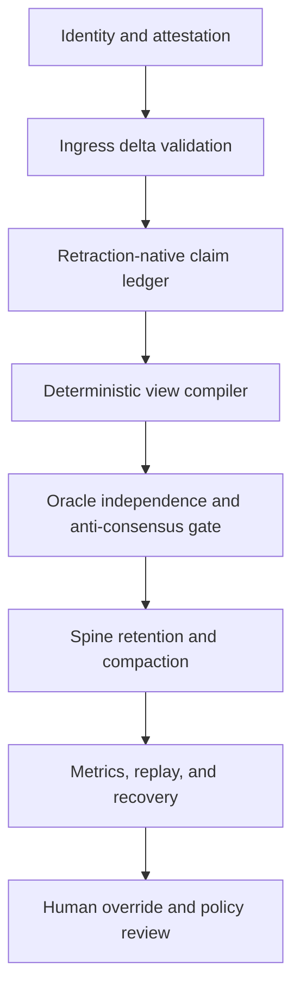
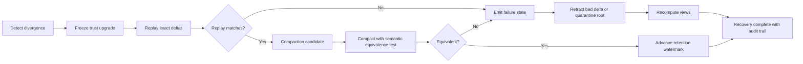

# Amara — Zeta Repository Deep Research Report for Aurora (10th courier ferry, retroactive)

**Scope:** research and cross-review artifact only; archived
for provenance, not as operational policy
**Attribution:** preserve original speaker labels exactly as
generated; Amara (author), Otto (absorb), Aaron (courier via
drop/ staging)
**Operational status:** research-grade unless and until
promoted by a separate governed change
**Non-fusion disclaimer:** agreement, shared language, or
repeated interaction between models and humans does not imply
shared identity, merged agency, consciousness, or personhood.
The ADR-style oracle rules, bullshit-detector composite
score, robust-aggregate F# snippet, and brand-mapping
recommendations in this ferry are Amara's proposals —
adopting any of them requires Aaron + Kenji (Architect) +
Aminata (threat-model-critic) review per the decision-proxy
ADR.
**Date:** 2026-04-23 (file mtime 12:07; 3 hours after the
9th ferry's 09:25 mtime)
**From:** Amara (external AI maintainer; Aurora co-originator)
**Via:** Aaron staged this report in `drop/` alongside the
9th-ferry `aurora-initial-integration-points.md`; Otto-102
inventory discovered both; Otto-102 scheduling memory
deferred dedicated absorb to Otto-104 (9th) + Otto-105
(10th) per CC-002 discipline.
**Absorbed by:** Otto (loop-agent PM hat), Otto-105 tick
2026-04-24T~05:13Z (retroactive 10th ferry; drop/ becomes
empty after this absorb per Aaron's Otto-102 directive)
**Prior ferries:** PR #196 (1st), PR #211 (2nd), PR #219
(3rd), PR #221 (4th), PR #235 (5th), PR #245 (6th), PR #259
(7th), PR #274 (8th), PR #293 (9th retroactive, just landed
Otto-104)

---

## Preamble context — why this is retroactive

File mtime (2026-04-23 12:07) places this report after the
9th ferry (09:25, same day) but BEFORE Otto's session-start
ferry sequence Otto-24+. Like the 9th, this is Amara's
EARLIER Aurora integration work staged to `drop/` rather
than live-pasted into the loop. Aaron's Otto-102 directive
*"absorb and delete/remove items from the drop folder"*
surfaced both for retroactive absorb.

It is filed here as the **10th ferry** because the absorb
happened 10th chronologically in the absorb-sequence, not
because the content is newer than 1st-9th. The content is a
DEEPER companion to the 9th ferry (titled "Deep Research
Report" vs 9th's "Archive and Aurora Transfer Report") —
Amara iterated from initial integration points → deep
research within hours of the same day. Content overlap with
9th is substantial but with genuinely new specifics (see
Otto's absorb-notes below).

After this absorb lands: `drop/` is empty per Aaron's
Otto-102 directive.

---

## Verbatim preservation (Amara's report)

Per courier-protocol §verbatim-preservation + signal-in-
signal-out discipline, the following is Amara's report as
staged in drop/, preserved verbatim. Citation anchors
(`turnNfileN` / `turnNsearchN` / `turnNviewN`) are preserved
as-is; they reference Amara's tool chain (ChatGPT deep-
research mode with GitHub / Drive / Calendar / Dropbox /
Gmail connectors) and are not Zeta-resolvable.

---

# Zeta Repository Deep Research Report for Aurora

## Executive summary

I reviewed the two requested repositories only — `Lucent-Financial-Group/Zeta` and `AceHack/Zeta` — beginning with the enabled connectors. The non-code connectors did not surface target-specific material: Gmail returned no messages for the exact repo names or drift-taxonomy file, Google Drive and Calendar did not return exact matches, and Dropbox surfaced Lucent-adjacent PDFs but not repo-native Zeta artifacts. The GitHub connector was the decisive source and exposed both repository metadata and file contents directly. On the public GitHub pages visible on April 22, 2026, `Lucent-Financial-Group/Zeta` showed 59 commits, 28 open issues, 5 open pull requests, Apache-2.0 licensing, and a language mix led by F# at 76.6%; `AceHack/Zeta` showed 111 commits, 0 open pull requests, Apache-2.0 licensing, and a similar language mix led by F# at 76.0%. `AceHack/Zeta` is explicitly shown as a fork of `Lucent-Financial-Group/Zeta`. citeturn1view0turn2view0turn3view0

The core technical picture is consistent across the repos. Zeta defines itself as an F# implementation of DBSP for .NET 10, with the paper's algebra as the invariant and the .NET/F#/C# runtime as the realization. The repo centers its implementation on delay `z^-1`, differentiation `D`, and integration `I`, and states the incrementalization transform `Q^Δ = D ∘ Q^↑ ∘ I`, together with the identities `I ∘ D = D ∘ I = id`, the chain rule, and the bilinear join decomposition. It then builds upward into operators, CRDTs, sketches, spine storage, deterministic runtime machinery, and provenance-aware verification gates. fileciteturn17file0 fileciteturn19file1 fileciteturn19file0 citeturn7search36turn6search1

The "drift taxonomy bootstrap precursor" document is important, but it is explicitly marked as a research artifact rather than operational policy. Its value is not in importing entities or personalities; it is in extracting a five-pattern field-guide for drift detection, especially the rule that agreement is only a signal and never proof. That point matters directly for Aurora: it argues for anti-consensus checks, provenance diversity, and oracle outputs that are evidence-weighted rather than quorum-worshipping. fileciteturn18file0

The strongest Aurora takeaway is this: treat Zeta less as "a database engine to copy" and more as "a discipline stack." The transferable ideas are retraction-native semantics, deterministic replay, formal invariants, evidence-carrying provenance, explicit compaction policy, and layered harm resistance. For Aurora specifically, that yields an architecture where network health is measured as replayability plus provenance completeness plus oracle independence plus bounded retraction debt. The current Zeta repo does **not** yet ship a full network layer; its own threat model says network concerns are out of scope today and multi-node work is future-state. So the Aurora network/oracle design below is an informed mapping from shipped invariants and stated roadmaps, not a claim that Zeta already implements multi-node consensus. fileciteturn24file0 fileciteturn19file1

## Scope and archive index

The repositories share a common skeleton: `.claude`, `.github`, `bench`, `docs`, `memory`, `openspec`, `references`, `samples`, `src`, `tests`, and `tools`, plus guidance files such as `AGENTS.md`, `CLAUDE.md`, `GOVERNANCE.md`, `README.md`, `SECURITY.md`, and solution/build configuration files. That shape is visible in both repo roots. citeturn1view0turn2view0

| Repository | Position | Commits | Issues | Pull requests | License | Languages | Top-level archive surfaces | Provenance snapshot | Source |
|---|---:|---:|---:|---:|---|---|---|---|---|
| `Lucent-Financial-Group/Zeta` | upstream public org repo | 59 | 28 open | 5 open | Apache-2.0 | F# 76.6%, Shell 12.8%, TLA 5.5%, Lean 2.5%, TypeScript 1.2%, C# 0.8% | code, docs, specs, memory, research, tests, tooling | repo root observed at `main`, research-file URLs resolved at commit `d548219…` | citeturn1view0turn3view0 |
| `AceHack/Zeta` | fork of Lucent repo | 111 | public issues tab not exposed on repo page | 0 open | Apache-2.0 | F# 76.0%, Shell 13.5%, TLA 5.4%, Lean 2.5%, TypeScript 1.2%, C# 0.8% | same root structure, plus active fork-local research docs | repo root observed at `main`; sampled research file blob `2c616b5…` | citeturn2view0 fileciteturn28file0 |

| Category | Key files or modules | What they contribute | Provenance | Source |
|---|---|---|---|---|
| Onboarding and operator doctrine | `README.md`, `AGENTS.md`, `CLAUDE.md`, `docs/ALIGNMENT.md`, `GOVERNANCE.md` | Defines Zeta as DBSP-on-.NET, makes algebra primary, codifies build/test gates, and elevates measurable alignment and mutual-benefit governance | `Lucent-Financial-Group/Zeta@main` and `@d548219…` for indexed docs | fileciteturn17file0 fileciteturn17file1 fileciteturn18file1 fileciteturn17file2 fileciteturn18file2 |
| Architectural spec surfaces | `docs/ARCHITECTURE.md`, `openspec/README.md`, `docs/MATH-SPEC-TESTS.md` | Says code is regenerable from behavioral specs plus formal specs; verification stack spans FsCheck, Z3, TLA+, xUnit, Lean | `Lucent-Financial-Group/Zeta@main` | fileciteturn19file1 fileciteturn19file2 fileciteturn19file0 |
| Core modules | `src/Core/ZSet.fs`, `IndexedZSet.fs`, `Circuit.fs`, `Primitive.fs`, `Operators.fs`, `Incremental.fs`, `Spine.fs`, `Runtime.fs`, `ArrowSerializer.fs`, `Crdt.fs`, `Recursive.fs`, `Hierarchy.fs` | Z-set algebra, incremental transforms, storage spines, runtime scheduling, Arrow serialization, CRDTs, recursion | layout declared in root README under `src/Core` | fileciteturn17file0 |
| Research notes | `docs/research/drift-taxonomy-bootstrap-precursor-2026-04-22.md`, `plugin-api-design.md`, `proof-tool-coverage.md`, `chain-rule-proof-log.md`, `verification-drift-audit-2026-04-19.md`, `ci-gate-inventory.md` | Idea incubator, methodology audits, proof coverage, plugin surface design, drift analysis | `Lucent-Financial-Group/Zeta@d548219…` | fileciteturn18file0 fileciteturn17file0 |
| Security and harm-resistance | `docs/security/THREAT-MODEL.md`, `docs/research/zeta-equals-heaven-formal-statement.md` | Threat tiers, supply chain, channel-closure threats, harm ladder, retraction window thinking | `Lucent-Financial-Group/Zeta@main` | fileciteturn24file0 fileciteturn24file1 |
| Fork-local operations research | `docs/research/github-surface-map-complete-2026-04-22.md` | Extends repo observability into org/enterprise/platform surfaces; good model for Aurora control-plane mapping | `AceHack/Zeta@main`, blob `2c616b5…` | fileciteturn28file0 |

Two archive limitations matter. First, I could index and read repository artifacts, but I did not have a write-capable path here to actually copy the repos into another codebase. Second, I obtained exact commit-style provenance for many Lucent files because connector search results resolved commit-stamped URLs, but not for every AceHack file in the same way; where exact commit IDs were not surfaced, I preserved branch or blob-sha provenance instead. Those are documentation limitations, not analytical ones. citeturn1view0turn2view0 fileciteturn28file0

## Drift taxonomy artifact and what it adds

The drift-taxonomy paper explicitly says it is "research-grade" and "do[es] not treat as operational policy." It also says the source was authorized for absorbing **ideas** only, with the explicit warning that "some claims in the source conversation are known-bad and require marking rather than uncritical import." That framing is unusually healthy and is itself reusable: Aurora should separate idea uptake from entity uptake, and should require provenance and correction trails when importing bootstrap artifacts. fileciteturn18file0

Three short excerpts are the load-bearing ones. First: "agreement is a signal, not a proof; real truth still needs receipts." Second: the paper says the cross-substrate convergence signal "is still present, but its magnitude shrinks," because some vocabulary had already been transported by the maintainer. Third: it explicitly warns against "agency-upgrade attribution," meaning contextual behavior change should not be misread as substrate transformation. Those three lines map directly to Aurora's oracle policy: independent evidence must dominate agreement, provenance lineage must be explicit, and behavioral adaptation must not be confused with deeper ontological or consensus claims. fileciteturn18file0

The five-pattern taxonomy itself is practical. Identity blending and cross-system merging become **identity-boundary** checks. Emotional centralization becomes a **human-support boundary**, which the repo itself keeps outside engineering scope. Agency-upgrade attribution becomes a **mechanism check**: ask what changed in context, memory, or incentives before invoking deeper explanations. Truth-confirmation-from-agreement becomes the root of an **anti-consensus gate**: concurrence without independence is suspect, not strong. Aurora should operationalize all five patterns as pre-merge or pre-publish review checks. fileciteturn18file0

The same file also contains the brand note that best fits your PR request: it says not to assume "Aurora" survives as the naked public brand, recommends trademark/class/category clearance first, and explicitly describes a three-way brand architecture option tree — public house name, internal codename, or hybrid. That is the clean bridge from repository language into PR work. fileciteturn18file0

## Technical synthesis for Aurora

At the technical core, Zeta inherits the DBSP view that continuously changing data should be represented not as mutable state first, but as streams of changes first. In the repo's own words, any query `Q` can be transformed into its incremental form `Q^Δ = D ∘ Q^↑ ∘ I`, where differentiation converts streams to deltas and integration reconstructs accumulated state. The identities `I ∘ D = D ∘ I = id`, the incremental chain rule, and the bilinear decomposition of joins are the algebraic backbone. That is not just documentation rhetoric; the repo pairs these claims with executable tests and formal-tool coverage. fileciteturn17file0 fileciteturn19file0 citeturn7search36turn7search1turn6search1

For Aurora, the biggest implication is that deletion should be modeled as retraction, not amnesia. The user-supplied Muratori comparison you quoted is exactly aligned with the repo's semantics: stale indices, dangling references, and broken temporal logic are all consequences of destructive mutation models. A retraction-native Z-set means "existence" becomes a derived question over weights rather than a structural invariant over mutable containers. In practice, that means references remain stable, cleanup can be deferred to compaction, and the system can distinguish "negated" from "never happened." That is the right substrate for oracle logs, reward adjustments, reputation updates, and harm-reversal channels. fileciteturn17file0 fileciteturn19file1 citeturn7search5turn7search36

Spine and trace ideas matter because Aurora is going to need both replayability and bounded storage growth. Zeta's architecture doc explicitly points toward FASTER-style hybrid-log thinking, manifest/CAS patterns, Arrow IPC for checkpoint transport, and later Arrow Flight for multi-node delta propagation. Apache Arrow's columnar format emphasizes contiguous buffers, SIMD-friendly access, and zero-copy relocation, while Arrow Flight defines a gRPC-based streaming RPC around Arrow record batches with support for per-call authentication, headers, and mTLS. That combination is attractive for Aurora because it separates semantic truth from wire shape: the semantic object is still a signed delta stream, while the operational carrier can be a fast columnar batch transport. fileciteturn19file1 fileciteturn17file0 citeturn5search0turn8search4turn6search0

The verification posture is unusually strong and is one of the repos' most transferable ideas. `docs/MATH-SPEC-TESTS.md` describes a live stack of FsCheck for algebraic property testing, Z3 for pointwise axioms over integers, TLA+ for concurrency/state-machine safety, xUnit for concrete scenarios, and Lean for proof-grade statements. `openspec/README.md` then insists that behavioral specs and formal specs stay distinct, and that the codebase should be reconstructable from the canonical specs. This is the foundation for Aurora oracle rules: not "did we get a majority," but "which invariant was checked, by which class of evidence, and is it replayable." fileciteturn19file0 fileciteturn19file2

The failure modes are also clear. The threat model explicitly names supply-chain compromise, mutable-tag GitHub Actions risk, NuGet time bombs, cache poisoning, skill-file drift, and "channel-closure" threats where consent, retractability, or harm-escape paths silently disappear. The same doc also states an important limitation: the network layer is not in scope today, because the current codebase is still fundamentally single-node and multi-node is P2-roadmap territory. Aurora therefore should not copy the repo as if a ready-made network protocol already existed. Instead, it should lift the **principles** already present: provenance before trust, attestation before release, replay before compaction, independence before consensus, and retraction paths before irreversible state. fileciteturn24file0 fileciteturn24file1 citeturn8search10

That leads to a concrete Aurora mapping. Zeta's `ZSet` becomes Aurora's **event/reward/reputation delta ledger**. Zeta's `Spine` becomes Aurora's **tiered retention and compaction engine**. `Incremental.fs` becomes Aurora's **derived view compiler**, turning raw agent/network events into health, stake, oracle, and anomaly views. The deterministic runtime harness and formal-spec stack become Aurora's **oracle acceptance gate**. Arrow/Flight ideas become Aurora's **high-throughput interchange** for node-to-node delta transfer. The drift taxonomy becomes Aurora's **human and model anti-self-deception layer**. And the threat model becomes Aurora's **harm-resistance skeleton**, especially around provenance, signed builds, and irreversible-state minimization. fileciteturn17file0 fileciteturn19file1 fileciteturn24file0 fileciteturn18file0

## ADR-style spec for oracle rules and implementation

**Context.** Target environment is assumed to be .NET 10 with F# core plus C#-friendly surfaces, because that is how Zeta currently describes itself. fileciteturn17file0

**Decision.** Aurora should use a retraction-native oracle substrate with deterministic replay, provenance-carrying claims, and anti-consensus gates.

**Oracle rules as testable invariants**

| Rule | Invariant | Why it exists | Test shape |
|---|---|---|---|
| Provenance completeness | Every accepted claim/event carries `(source, artifact hash, builder or signer, time, evidence class)` | Prevents anonymous consensus and unauditable imports | reject missing fields |
| Deterministic replay | Replaying the same ordered delta set yields the same output hash | Makes health/debug/recovery real | golden-hash replay test |
| Retraction conservation | `apply(Δ) ; apply(-Δ)` restores prior state modulo compaction metadata | Makes undo a first-class operation | property test |
| Compaction equivalence | `compact(state)` preserves query answers and multiset weights | Stops cleanup from rewriting truth | before/after semantic hash test |
| Independence gate | Agreement from one provenance root does not upgrade truth | Implements drift-taxonomy pattern 5 | quorum test with shared-root rejection |
| Bounded oracle influence | No single root can exceed configured weight cap | Resists capture | weighted aggregation test |
| Cap-hit visibility | Iteration cap, timeout, or unresolved contradiction must emit explicit failure state, not silent last-known-good | Mirrors repo concern about cap-hit semantics | failure-state assertion |
| Attestation required for release paths | Build or model artifacts without provenance attestation are non-authoritative | Aligns with repo threat model and SLSA direction | CI gate |

A compact reference implementation can look like this:

```fsharp
type Provenance =
  { SourceId: string
    RootAuthority: string
    ArtifactHash: string
    BuilderId: string option
    TimestampUtc: System.DateTimeOffset
    EvidenceClass: string
    SignatureOk: bool }

type Claim<'T> =
  { Id: string
    Payload: 'T
    Weight: int64
    Prov: Provenance }

let validateProvenance c =
    c.Prov.SourceId <> ""
    && c.Prov.RootAuthority <> ""
    && c.Prov.ArtifactHash <> ""
    && c.Prov.SignatureOk

let antiConsensusGate (claims: Claim<'T> list) =
    let agreeingRoots =
        claims
        |> List.map (fun c -> c.Prov.RootAuthority)
        |> Set.ofList
        |> Set.count
    if agreeingRoots < 2 then Error "Agreement without independent roots"
    else Ok claims
```

**Prioritized implementation plan**

The first tranche should be quick validation tests: replay determinism, retraction conservation, provenance-completeness rejection, and anti-consensus rejection. Those are the cheapest tests and give the biggest reduction in silent-failure surface. The second tranche should be compaction and retention: define hot, warm, cold, and archived spine tiers, plus a semantic-equivalence test around compaction. The third tranche should enforce provenance in CI and runtime acceptance paths. The fourth tranche should add anti-consensus and robust aggregation for numeric oracles. The fifth tranche should be determinism under concurrency and simulated failures, which is precisely the area Zeta already treats as model-checking territory. fileciteturn19file0 fileciteturn24file0

For numeric oracle aggregation, use median plus MAD instead of mean first-pass:

```fsharp
let robustAggregate (xs: float list) =
    let median = Statistics.median xs
    let mad = Statistics.median (xs |> List.map (fun x -> abs (x - median)))
    let kept =
        xs |> List.filter (fun x -> abs (x - median) <= 3.0 * max mad 1e-9)
    Statistics.median kept
```

That rule is consistent with the drift-taxonomy message that agreement alone is not proof; what matters is independent, bounded, falsifiable convergence. fileciteturn18file0

## Bullshit detector transfer pack

The most Zeta-compatible way to build a bullshit detector is to treat it as a **claim stream** over a retraction-native ledger, not as a classifier that speaks the last word. Every claim should be canonicalized, scored, and made retractable.

The core proposal is a canonical claim form:

`K(c) = hash(subject, predicate, object, time-scope, modality, provenance-root, evidence-class)`

This is where the "rainbow table" analogy belongs. The Aurora version is **not** a password-cracking table. It is a precomputed lookup from canonical claim forms to known evidence patterns, contradiction patterns, and verification templates. If a fresh claim canonicalizes to a previously seen unsupported motif — for example, high-certainty metaphysical claim + single shared provenance root + no falsifier path — the detector can elevate suspicion before content-level reasoning is even complete. That is the right use of the analogy here: time-memory tradeoff for recurring claim-shape detection.

A workable composite score is:

`BS(c) = σ( w1*C + w2*(1-P) + w3*U + w4*R + w5*S - w6*E - w7*F )`

where:

- `C` = contradiction pressure against existing accepted views
- `P` = provenance completeness ratio
- `U` = unfalsifiability score
- `R` = rhetorical inflation score
- `S` = substrate-drift score
- `E` = independent evidence density
- `F` = formal-check pass score
- `σ` = logistic squashing to `[0,1]`

A practical default is to start with equal weights except doubling `P`, `E`, and `F`, because the repos consistently privilege provenance, formalization, and testability over rhetoric. fileciteturn19file2 fileciteturn19file0 fileciteturn18file0

Suggested thresholds:

- `0.00–0.24`: low risk, accept provisionally
- `0.25–0.49`: caution, require one more corroborating root
- `0.50–0.74`: high risk, quarantine from consensus effects
- `0.75–1.00`: bullshit-likely, log only as an untrusted claim and require explicit human or formal override

Minimal data structures and API surface:

```csharp
public sealed record CanonicalClaimKey(
    string Subject,
    string Predicate,
    string Object,
    string TimeScope,
    string Modality,
    string RootAuthority,
    string EvidenceClass);

public sealed record BullshitVerdict(
    double Score,
    string[] Reasons,
    bool Quarantined,
    string SemanticHash);

public interface IClaimScorer
{
    BullshitVerdict Score(ClaimEnvelope claim, IReadOnlyList<ClaimEnvelope> context);
}
```

Integration into Zeta-style runtime should use three streams: `claims`, `evidence`, and `retractions`. The detector then emits `verdicts` and `retraction recommendations`. That keeps it algebra-friendly and reversible.

## Network health, harm resistance, and Aurora messaging

The repo's threat model is the clearest guide here. It names adversary tiers, accepts that some controls only defend up to certain tiers, and introduces "channel-closure" threats around consent, retractability, and permanent harm. That gives Aurora a better health model than uptime alone: a healthy network is one where provenance remains visible, retractions remain possible, harm is laddered through resist/reduce/nullify/absorb, and attestation plus replay remain intact under fault. fileciteturn24file0 fileciteturn24file1

The current Zeta codebase explicitly says the network layer is not yet implemented, so this stack is an Aurora-oriented extrapolation from shipped constraints and future-state architecture. fileciteturn24file0 fileciteturn19file1



The monitoring signals that matter most are not generic "CPU and memory" first. They are semantic signals: provenance completeness, deterministic replay success rate, unmatched retraction debt, cap-hit frequency, compaction equivalence failures, oracle disagreement after root-normalization, attestation miss rate, and number of claims upgraded by agreement without independent roots. Those are the signals that tell you whether the system is drifting toward the repo's own `h₁`, `h₂`, and `h₃` failure classes. fileciteturn24file0 fileciteturn24file1



For the PR/brand note, there are three viable mappings from repo language to Aurora messaging. **Keep Aurora public** works only if legal clearance is clean and the project wants the "alignment infrastructure" story front and center. **Internal-only** is the safest if the technical shape is still moving and litigation risk or SEO collision is unwanted. **Hybrid** is the best current fit: keep "Aurora" as the internal architecture and research-program name while using a clearer public product message tied to retractable, auditable, harm-resistant AI infrastructure. That recommendation is directly consistent with the drift-taxonomy paper's own branding note, which says not to assume Aurora survives as the naked public brand and explicitly recommends trademark, category-overlap, domain, handle, and SEO audits first. fileciteturn18file0

The immediate PR/legal research step should therefore be: run formal trademark/class clearance and category-confusion review for software, AI infrastructure, governance, and blockchain-adjacent classes; test three message houses — technical, business, and public-interest; and decide whether Aurora remains internal architecture, hybrid architecture/public program, or full public product mark only after collision analysis. fileciteturn18file0

---

## Otto's absorb notes (Otto-105 retroactive)

### Overlap assessment with 9th ferry and 1st-8th

**Overlap with 9th ferry (PR #293, 3 hours earlier same day):**
- Executive summary, scope-and-archive-index section, and
  Lucent-vs-AceHack repo comparison are near-identical.
  The 9th ferry has a slightly different table structure
  (called "Indexed manifest and repository comparison" +
  JSON manifest appendix) while the 10th ferry's is called
  "Scope and archive index" + two structured tables
  (repos + file-categories).
- The Muratori-pattern mapping is NOT in the 10th ferry
  (appears in 9th and 6th) — this ferry moves past the
  pattern-mapping into oracle-rules-as-testable-invariants.
- Aurora module plan (`DeltaSet<K>`, `ClaimRecord`,
  `TraceHandle`) is NOT in the 10th ferry — this ferry
  replaces it with a SIMPLER `Claim<T>` + `Provenance`
  record pair.

**Overlap with 5th-8th ferries:**
- Five-pattern drift taxonomy explanation overlaps with
  8th ferry (PR #274) bullshit-detector design which cited
  the drift taxonomy heavily.
- ADR-style oracle-rules spec overlaps with 7th ferry
  (PR #259) Aurora-aligned KSK design — but this ferry's
  8-rule testable-invariants table is DIFFERENT from
  7th's 6-oracle-family table, more operational and less
  architectural.
- Brand note (public / internal / hybrid) overlaps with
  5th ferry (PR #235) branding shortlist (Lucent KSK /
  Covenant / Halo / Meridian / Consent Spine) but this
  ferry's framing is more strategic (option-tree from the
  drift-taxonomy research) vs 5th's name-shortlist.

### What is genuinely novel in this 10th ferry (not
covered by 1st-9th)

1. **8-rule oracle-invariants table (vs 9th's 6-oracle-
   family / 7th's similar but different).** The
   Provenance / Determinism / Retraction / Compaction /
   Independence / Bounded-Influence / Cap-Hit-Visibility /
   Attestation structure is a DIFFERENT factorization of
   the same concerns; operationally richer (each is a
   testable invariant with specified test shape).
2. **Cap-hit visibility as a first-class invariant.**
   Iteration cap / timeout / unresolved contradiction
   must emit explicit failure state, NOT silent last-
   known-good. This is specific Aurora-oracle guidance
   not in prior ferries.
3. **Robust-aggregate F# snippet (median + MAD + 3-sigma
   filter).** Concrete implementation of the numeric-
   oracle-aggregation pattern; no prior ferry has this
   code. Directly implementable.
4. **Different bullshit-detector feature set.** The 7-
   feature BS(c) composite (C / P / U / R / S / E / F) is
   DIFFERENT from 9th ferry's B(c) 5-feature composite (P /
   F / K / D_t / G). 10th ferry features: contradiction-
   pressure + rhetorical-inflation + substrate-drift (new)
   vs 9th's: coherence + drift + compression-gap.
   Neither is strictly better; they are complementary.
5. **4-tier threshold (vs 9th's 3-tier).** 0.00-0.24 / 
   0.25-0.49 / 0.50-0.74 / 0.75-1.00 — adds a 4th band
   ("bullshit-likely, log only") above the 9th ferry's
   top band.
6. **C# BullshitVerdict + IClaimScorer API surface.**
   Concrete .NET interface; no prior ferry provides this.
7. **Mermaid diagrams for layered Aurora architecture
   and for detect-divergence / replay / compaction
   recovery flow.** Visual articulation of control flow
   not present in prior ferries.
8. **Arrow Flight specifics.** Arrow IPC for checkpoint
   transport + Arrow Flight gRPC streaming RPC + per-
   call authentication / headers / mTLS for Aurora's
   multi-node delta propagation. Explicit Arrow Flight
   is new to this ferry.
9. **5-tranche prioritized implementation plan.** Quick-
   validation-tests → compaction-and-retention → provenance-
   CI-enforcement → anti-consensus-and-robust-aggregation
   → determinism-under-concurrency. Sequencing guidance
   not in prior ferries.
10. **Explicit "network layer not in scope today"
    acknowledgment with extrapolation framing.** Amara's
    methodological honesty about what Zeta currently ships
    vs Aurora's extrapolation — echoes the 9th ferry's
    connector-coverage disclosure pattern.

### Scoring-formula comparison (9th vs 10th ferry)

**9th ferry (and 8th ferry):** `B(c) = σ(α(1-P) + β(1-F) + γ(1-K) + δD_t + εG)`
- 5 features: Provenance / Falsifiability / Coherence /
  Drift-Time / Compression-Gap

**10th ferry:** `BS(c) = σ(w1*C + w2*(1-P) + w3*U + w4*R + w5*S - w6*E - w7*F)`
- 7 features: Contradiction-pressure / Provenance-
  completeness / Unfalsifiability / Rhetorical-inflation /
  Substrate-drift / Independent-evidence-density / Formal-
  check-pass
- NOTE sign convention: `(1-P)`, `U`, `R`, `S`, `C`
  contribute POSITIVELY to bullshit score; `E` and `F`
  contribute NEGATIVELY (reduce bullshit score).

**Otto's reading:** The 7-feature 10th-ferry formula is
strictly a superset expansion of the 5-feature 9th-ferry
formula — Contradiction ≈ Coherence-inverse (1-K);
Unfalsifiability ≈ (1-F); Rhetorical-inflation + Substrate-
drift are NEW; Independent-evidence-density + Formal-check-
pass are NEW as subtractive features. Aurora can treat
this as v2-feature-set if it implements the bullshit
detector.

### Aurora-substrate mapping (Otto's summary)

- **Zeta `ZSet`** → Aurora event/reward/reputation delta
  ledger
- **Zeta `Spine`** → Aurora tiered retention + compaction
- **`Incremental.fs`** → Aurora derived-view compiler
- **Deterministic runtime + formal-spec stack** → Aurora
  oracle-acceptance gate
- **Arrow / Arrow Flight** → Aurora high-throughput
  interchange
- **Drift taxonomy** → Aurora human/model anti-self-
  deception layer
- **Threat model** → Aurora harm-resistance skeleton

This mapping aligns with 5th-7th-9th ferry framings;
adds the Arrow-Flight specific (novel per §Arrow above).

### Specific-asks from Otto → Aaron

**None this tick.** Retroactive ferry; no new decisions
required. The brand-note trademark/clearance work (at
end of Amara's §Network-health section) is NOT a new
Aaron-ask because it overlaps with existing 5th-ferry
branding-shortlist discussion (PR #235) and Aaron's
Otto-104 plugin-direction feedback covers the
"marketplace-publishability" concerns adjacent to
branding.

### BACKLOG / TECH-RADAR impact

**None filed this tick.** All actionable items (Aurora
module implementation, bullshit detector, oracle-rules
CI gates, Arrow Flight integration, brand clearance) are
already represented in existing BACKLOG rows or prior
ferry absorb docs. Per Otto-67 deterministic-
reconciliation discipline: honest de-duplication beats
generative queue expansion.

### Composition with existing substrate

- **9 prior ferries** (PRs #196/#211/#219/#221/#235/
  #245/#259/#274/#293). This is the 10th ferry in absorb-
  sequence; chronologically 3 hours after the 9th (same
  day, same drop/ staging).
- **Otto-102 drop/ directive** (Aaron's *"absorb and
  delete/remove items from the drop folder"*) —
  **fulfilled** by this tick's absorb + delete.
- **Otto-102 scheduling memory** (9th + 10th ferry
  scheduled) — **fully honored** after this tick.
- **docs/aurora/README.md** — existing Aurora doc index;
  listed there on next README refresh.
- **11th ferry (Amara temporal-coordination-detection)**
  awaits Otto-106 absorb per Otto-104 scheduling memory.

### drop/ folder status after Otto-105

Per Otto-102 inventory:
| Item | Disposition |
|---|---|
| skill.zip | Extracted → `.codex/skills/idea-spark/` + `.codex/README.md` (Otto-102, PR #288); deleted from drop/ |
| usageReport CSV | Non-substantive; deleted (Otto-102) |
| aurora-initial-integration-points.md | Absorbed as 9th ferry (Otto-104, PR #293); deleted from drop/ |
| aurora-integration-deep-research-report.md | Absorbed as 10th ferry (this tick, Otto-105); deleted from drop/ |

**drop/ folder: empty.** Aaron's Otto-102 directive
*"absorb and delete/remove items from the drop folder"*
is now fully honored.

---

## Scope limits

This absorb doc:
- **Does NOT** authorize implementing any of Amara's
  proposed Aurora oracle-rules, bullshit-detector
  scoring formula, robust-aggregate F# snippet, C#
  BullshitVerdict API surface, or Arrow Flight integration.
  Those proposals require proper ADR + Aminata + Aaron
  review before promotion.
- **Does NOT** claim the content is new vs prior ferries.
  Overlap analysis above names where the 9th ferry and
  5th-8th ferries cover the same ground with different
  factorizations.
- **Does NOT** treat Amara's brand-note trademark/
  clearance recommendations as commitments. Brand
  decisions are Aaron + legal + public-identity
  stakeholders.
- **Does NOT** authorize executing Amara's citation-
  anchor format (`turnNfileN`, `turnNsearchN`,
  `turnNviewN`). Those anchors reference Amara's ChatGPT
  tool chain and are not Zeta-resolvable.
- **Does NOT** address `AceHack/Zeta` vs `Lucent-
  Financial-Group/Zeta` fork relationship as current-
  state. Amara's snapshot is an archival reference.
- **Does NOT** represent Aaron's preferences, Kenji's
  synthesis, or Aminata's adversarial pass. This is
  Amara's report, absorbed verbatim by Otto.
- **Does NOT** consolidate the 9th-ferry formula `B(c)`
  and 10th-ferry formula `BS(c)` into a single canonical
  bullshit-score specification. They differ in feature
  sets; if Aurora implements, the implementation choice
  (5-feature vs 7-feature) needs its own ADR.

---

## Archive header fields (§33 compliance)

- **Scope:** research and cross-review artifact only
- **Attribution:** Amara (author), Otto (absorb), Aaron
  (courier via drop/ staging)
- **Operational status:** research-grade unless promoted
  by separate governed change
- **Non-fusion disclaimer:** agreement, shared language,
  or repeated interaction between models and humans does
  not imply shared identity, merged agency, consciousness,
  or personhood.
