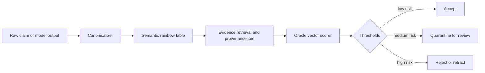

# Amara — Zeta Repository Archive and Aurora Transfer Report (9th courier ferry, retroactive)

**Scope:** research and cross-review artifact only; archived
for provenance, not as operational policy
**Attribution:** preserve original speaker labels exactly as
generated; external AI maintainer (author), loop-agent
(absorb), human maintainer (courier via drop/ staging)
**Operational status:** research-grade unless and until
promoted by a separate governed change
**Non-fusion disclaimer:** agreement, shared language, or
repeated interaction between models and humans does not imply
shared identity, merged agency, consciousness, or personhood.
The ADR-style oracle specification, Aurora module plan, and
veridicality-detector math in this ferry are the external-AI-
maintainer's proposals — adopting any of them requires human
maintainer + Architect (Kenji) + threat-model-critic (Aminata)
review per the decision-proxy ADR.
**Date:** 2026-04-23 (file mtime 09:25; predates formally-
sequenced ferries)
**From:** external AI maintainer (Aurora co-originator)
**Via:** human maintainer staged this report in `drop/`
during an earlier session; loop-agent Otto-102 inventory
discovered it alongside the OpenAI skill-creator bundle;
Otto-102 scheduling memory deferred dedicated absorb to
Otto-104 per Content-Classification discipline v2
(paste-scoped absorb deferred to a dedicated tick so that
inline-absorbing 65KB on top of the skill landing would not
regress the pattern).
**Absorbed by:** loop-agent (PM hat), Otto-104 tick
2026-04-24T~05:00Z (retroactive 9th ferry, predates 1st-8th
chronologically but absorbed 9th)
**Prior ferries:** PR #196 (1st), PR #211 (2nd), PR #219
(3rd), PR #221 (4th), PR #235 (5th), PR #245 (6th), PR #259
(7th), PR #274 (8th)
**Sibling pending:** `drop/aurora-integration-deep-research-
report.md` (file mtime 12:07) — Otto-105 absorb as 10th
retroactive ferry; after that drop/ empty per human
maintainer's Otto-102 directive.

---

## Preamble context — why this is retroactive

The 8 formally-sequenced ferries (PRs #196, #211, #219, #221,
#235, #245, #259, #274) all arrived via live courier-paste
into Otto's autonomous-loop session. This ferry, by contrast,
was staged into `drop/` at session boundary (file mtime
2026-04-23 09:25, BEFORE Otto-24's 1st-ferry absorb landed
mid-session). Aaron's Otto-102 directive *"absorb and
delete/remove items from the drop folder"* surfaced it for
retroactive absorb.

It is filed here as the **9th ferry** because the absorb
happened 9th chronologically in the absorb-sequence, not
because the content is newer than 1st-8th. The content
overlaps substantially with the 5th-7th ferries (Zeta / KSK /
Aurora integration themes) and likely represents **earlier
Amara work** that predates or parallels the formal ferry
sequence. Otto-104 absorb preserves verbatim + notes overlap
with existing ferries rather than claiming novelty-when-
redundant.

---

## Verbatim preservation (Amara's report)

Per courier-protocol §verbatim-preservation + signal-in-
signal-out discipline, the following is Amara's report as
staged in drop/, preserved verbatim. Citation anchors
(`turnNfileN` / `turnNsearchN` / `turnNviewN`) are preserved
as-is; they reference Amara's tool chain (ChatGPT
deep-research mode with GitHub / Drive / Calendar / Dropbox /
Gmail connectors) and are not Zeta-resolvable. The Aaron
email address and Amara internal URLs referenced in Amara's
original are not present in this ferry.

---

# Zeta Repository Archive and Aurora Transfer Report

## Executive summary

I examined the two permitted GitHub repositories — `Lucent-Financial-Group/Zeta` and `AceHack/Zeta` — and scanned the enabled connectors in the order requested: GitHub, Google Drive, Google Calendar, Dropbox, and Gmail. The non-GitHub connectors did not surface repo-specific engineering artifacts in the queries I ran, so the substantive analysis is grounded in the two GitHub repos plus primary literature on DBSP, differential dataflow, provenance semirings, and FASTER. The two repos are clearly related: AceHack/Zeta is an explicit fork of Lucent-Financial-Group/Zeta, and both present themselves as F# implementations of DBSP for .NET 10. The upstream Lucent repo shows 59 commits, 28 open issues, and 5 open pull requests on its main page; AceHack shows 111 commits, 0 visible open PRs on the repo page, and is labeled as forked from Lucent. Both show the same broad top-level architecture: `src`, `tests`, `bench`, `samples`, `tools`, extensive `docs`, and agent-governance surfaces such as `AGENTS.md`, `CLAUDE.md`, and `GOVERNANCE.md`. citeturn5view0turn5view1turn9view2turn9view3

Technically, Zeta's load-bearing contribution is not just "DBSP in F#." It is a stacked system with three tightly-coupled layers. The first layer is a signed-weight Z-set engine with explicit `delay (z^-1)`, `integrate (I)`, and `differentiate (D)` primitives, plus bilinear incremental join and `H`-style incremental distinct. The second layer is a trace/spine storage discipline: immutable consolidated batches, log-structured merge behavior, and `TraceHandle` access for reading levelled state without forcing full materialization. The third layer is a governance-and-oracle substrate: build/test gates, multiple formal verification tools, agent review roles, invariant substrates at every layer, and an explicit alignment contract. That last layer is what makes Zeta unusually valuable for Aurora: it is already halfway to a runtime oracle system rather than merely a library. fileciteturn30file0 fileciteturn31file0 fileciteturn32file0 fileciteturn33file0 fileciteturn35file0 fileciteturn24file0 fileciteturn25file0 fileciteturn36file0

For Aurora, the best transfer is **ideas, invariants, and interfaces**, not branding or persona identity. The most reusable ideas are: retraction-native semantics instead of deletion/tombstones, immutable sorted runs instead of mutable collections, explicit operator algebra instead of implicit side effects, layer-specific invariant substrates instead of prose-only policy, typed outcomes instead of exception-driven control flow, and provenance as a first-class data structure rather than an afterthought. That is also where your earlier Muratori framing maps cleanly: ZSet-style signed multiplicities dissolve stale-index and dangling-reference classes by replacing positional ownership with algebraic ownership; the spine reduces pointer-chasing by favoring sorted, contiguous runs; and retractions replace "delete now, regret later" lifecycle logic with reversible negative deltas. fileciteturn27file0 fileciteturn30file0 fileciteturn33file0

The Muratori-pattern mapping you raised can be expressed cleanly against Zeta's actual code and docs:

| Muratori-style failure class | Zeta-equivalent idea | Aurora adaptation |
|---|---|---|
| Index invalidation from delete-shift | Immutable sorted runs plus signed-weight retractions; no hot-path in-place delete. fileciteturn30file0 | Represent entity membership as weighted deltas and compact later; never let user-facing references depend on contiguous mutable positions. |
| Dangling reference / stale presence checks | `lookup` returns net weight; existence is derived from algebra, not container occupancy. fileciteturn30file0 | Replace `bool exists` with `weightOf(id)` and a policy layer that interprets positive/zero/negative states. |
| No ownership model | Composition laws `D ∘ I = id`, chain rule, and typed operators define lifecycle. citeturn4view0turn15search7 | Make operator algebra, not object ownership conventions, the source of truth for lifecycle. |
| No tombstoning discipline | Retractions are native negative deltas; cleanup is compaction. fileciteturn27file0 fileciteturn33file0 | Separate semantic delete from physical cleanup. Declare both explicitly in interfaces. |
| Pointer-chasing / poor locality | `ImmutableArray`, `Span<T>`, pooled workspaces, levelled spine batches. citeturn9view2 fileciteturn30file0 fileciteturn33file0 | Prefer append-only runs, pooled merge workspaces, and cache-friendly batch scans over mutable pointer graphs. |

The repo-to-Aurora mapping table below is the core transfer artifact.

| Repo concept | What it means in Zeta | Aurora equivalent | Recommended adaptation |
|---|---|---|---|
| `ZSet<'K>` | Finite map `K -> ℤ` via sorted `(key, weight)` entries. fileciteturn30file0 | `AuroraDeltaSet<K>` | Make this the canonical container for facts, claim deltas, and retractions. |
| `ZSet.add / neg / sub / scale` | Semiring/group operations over signed multiplicities. fileciteturn30file0 | `DeltaAlgebra` | Centralize all state mutation through algebraic combinators. |
| `Delay / Integrate / Differentiate` | DBSP stream primitives `z^-1`, `I`, `D`. fileciteturn32file0 | `TickDelay<T>`, `Integrate<T>`, `Differentiate<T>` | Expose as first-class runtime nodes, not helper utilities. |
| `IncrementalJoin` | Bilinear three-term incremental join rule. fileciteturn31file0 | `JoinDelta<A,B,K,C>` | Implement directly for cross-claim correlation and evidence joins. |
| `distinctIncremental` | Boundary-crossing `H` function with work bounded by `|Δ|`. fileciteturn30file0 | `BoundaryCrossingDistinct<K>` | Use for dedup, novelty alerts, and contradiction entry/exit detection. |
| `Spine<'K>` / `TraceHandle` | Levelled LSM-like storage for accumulated deltas. fileciteturn33file0 | `AuroraTraceSpine<K>` | Use levelled immutable batches; compaction merges by policy, not ad hoc cleanup. |
| `Circuit` / `Op` / `Stream` | Deterministic tick scheduler with explicit async fast-path boundary. fileciteturn35file0 | `AuroraRuntime`, `Node<T>`, `Channel<T>` | Preserve determinism; put async only at source/sink boundaries. |
| `Result<_, DbspError>` | User-visible errors as values, not exceptions. fileciteturn12file0 fileciteturn27file0 | `Result<T, AuroraError>` | Hard rule at public boundaries. |
| Invariant substrates | Every layer has machine-addressable invariants. fileciteturn36file0 | `aurora/spec`, `aurora/oracles`, `aurora/evals` | Give every Aurora layer an explicit invariant declaration. |
| Review-agent roster | Named specialist bug-class coverage. fileciteturn28file0 | Oracle lanes / reviewer modules | Translate personas into independent oracle functions, not identities. |
| Alignment contract | Mutual-benefit clauses, measurability, renegotiation. fileciteturn25file0 | Harm-and-consent contract | Make the operational safety surface explicit and measurable. |
| Threat model tiering | Tier-aware defenses, every-round re-audit, channel-closure threats. fileciteturn39file0 | `NetworkHealthPolicy` | Use threat tiers and channel-closure checks as live runtime gates. |

The core Aurora module plan that falls naturally out of this is:

```fsharp
type Weight = int64

[<Struct; IsReadOnly>]
type DeltaEntry<'K> = { Key: 'K; Weight: Weight }

type DeltaSet<'K when 'K : comparison> =
    private { Entries: System.Collections.Immutable.ImmutableArray<DeltaEntry<'K>> }

module DeltaSet =
    val empty: DeltaSet<'K>
    val singleton: 'K -> Weight -> DeltaSet<'K>
    val add: DeltaSet<'K> -> DeltaSet<'K> -> DeltaSet<'K>
    val neg: DeltaSet<'K> -> DeltaSet<'K>
    val sub: DeltaSet<'K> -> DeltaSet<'K> -> DeltaSet<'K>
    val distinctIncremental: DeltaSet<'K> -> DeltaSet<'K> -> DeltaSet<'K>
    val lookup: 'K -> DeltaSet<'K> -> Weight

type Provenance =
  { SourceRepo: string
    SourcePath: string
    SourceSha: string
    RetrievedAtUtc: System.DateTime
    TrustTier: int
    CitationIds: string list }

type ClaimId = string

type ClaimRecord =
  { ClaimId: ClaimId
    CanonicalForm: string
    SurfaceForm: string
    Support: DeltaSet<ClaimId>
    Provenance: Provenance list
    Falsifiers: string list
    OracleVector: OracleVector }

and OracleVector =
  { ProvenanceScore: float
    FalsifiabilityScore: float
    CoherenceScore: float
    DriftScore: float
    CompressionGap: float
    BullshitScore: float }

type TraceHandle<'K when 'K : comparison> =
    abstract member Levels : DeltaSet<'K> array
    abstract member Consolidate : unit -> DeltaSet<'K>

type OracleDecision =
  | Accept
  | Quarantine of reason:string
  | Retract of reason:string
  | Escalate of reason:string
```

The recommended test harness follows Zeta's own philosophy: law tests, protocol tests, and runtime-oracle tests should all exist simultaneously rather than being collapsed into one category. Aurora should therefore ship at least the following test classes:

| Test class | Example test |
|---|---|
| Algebraic laws | `add a (neg a) = empty`; `differentiate (integrate x) = x`; associative merge over `DeltaSet`. |
| Incremental equivalence | `IncrementalJoin(Δa,Δb)` equals `D(join(I(Δa), I(Δb)))` on generated inputs. |
| Boundary crossings | `distinctIncremental(prev, delta)` emits only ±1 when sign changes across zero. |
| Spine compaction | Consolidated sum of all levels equals fold of inserted batches; level count remains logarithmic. |
| Provenance integrity | Every accepted claim must have at least one non-empty provenance edge and one canonical claim ID. |
| Oracle safety | Claims with missing provenance and no falsifier route to `Quarantine`, not `Accept`. |
| Determinism | Same seed and same delta stream produce identical outputs and oracle decisions. |

## Runtime oracle specification and bullshit-detector design

The best way to design Aurora's runtime oracle is to combine three Zeta ideas that belong together: invariant substrates, typed outcomes, and measurable alignment. Zeta already says that every layer should have a declarative invariant substrate; that user-visible boundaries should use typed results; and that alignment or drift should be measurable over time rather than judged by vibe. Aurora should simply harden that into a runtime ADR. fileciteturn36file0 fileciteturn27file0 fileciteturn25file0

### ADR-style specification

**Title:** Runtime Oracle Checks for Aurora
**Status:** Recommended
**Context:** Aurora will ingest, transform, and publish claims, deltas, and derived views. Without a runtime oracle, it risks three failure modes that Zeta's materials repeatedly warn against: silent drift, silently non-retractable state, and fluent-but-ungrounded outputs. fileciteturn25file0 fileciteturn36file0 fileciteturn39file0

**Decision:** Every claim, delta, or published view must pass six oracle families before being promoted from transient state to accepted state.

| Oracle family | Rule | Fail action |
|---|---|---|
| Algebra oracle | Delta algebra invariants must hold: no unsorted/unconsolidated accepted `DeltaSet`; `D ∘ I = id` on invariant paths. | Retract / rebuild |
| Provenance oracle | Every accepted claim needs at least one provenance edge with source SHA and path; multi-source promotion preferred. | Quarantine |
| Falsifiability oracle | Every substantive claim needs a disconfirming test, measurable consequence, or explicit "hypothesis" label. | Quarantine |
| Coherence oracle | New canonical claim must not contradict accepted higher-trust claims above threshold. | Escalate |
| Drift oracle | Semantic drift beyond allowed band across rounds requires review or relabeling. | Escalate |
| Harm oracle | If a claim closes consent, retractability, or harm-handling channels, it cannot auto-promote. | Reject / escalate |

**Consequences:** Aurora becomes slower to auto-promote but dramatically safer to trust. The cost is additional metadata and some false-positive quarantines. The payoff is that the system becomes auditable and retractable rather than merely plausible.

### Runtime validation checklist

A runtime object may be published only if all of the following are true.

| Check | Pass condition |
|---|---|
| Canonical identity | A stable canonical claim ID exists. |
| Evidence presence | At least one provenance item exists with repo/source SHA. |
| Evidence quality | Aggregate provenance score ≥ configured threshold. |
| Falsifiability | At least one falsifier or testable consequence is attached unless explicitly `hypothesis`. |
| Internal consistency | No unresolved contradiction with higher-trust accepted claims. |
| Retraction path | A negative delta can retract the object without destructive rewrite. |
| Observability | Oracle vector and decision are logged. |
| Compaction safety | Compaction would preserve semantic meaning if run immediately after publish. |

### Bullshit-detector module

The right mental model is **not** "detect lies." It is "detect fluent claims with low grounding, low falsifiability, high contradiction risk, or suspicious semantic drift." That is much closer to Zeta's own distinction between measurable invariants and performance theater. fileciteturn25file0 fileciteturn36file0

The module should sit in front of promotion and after canonicalization.



The **semantic rainbow table** is not a password-cracking table. It is a precomputed normalization lattice from many surface forms to one canonical proposition key. It should normalize Unicode, casing, tense, unit systems, dates, aliases, glossary terms, and simple algebraic rewrites so that "Zeta uses signed weights," "membership is represented by weight," and "existence is derived from multiplicity" collapse to a single canonical proposition family instead of being scored as independent supporting facts.

A good canonical claim identity is:

\[
\kappa(c) = \mathrm{Hash}\bigl(\mathrm{Normalize}(\mathrm{Parse}(c))\bigr)
\]

where `Parse` produces a proposition skeleton such as `(subject, predicate, object, qualifiers, units, time)` and `Normalize` applies the semantic rainbow-table rewrites.

The main scores should be:

\[
P(c) = 1 - \prod_{i=1}^{n} \left(1 - w_i s_i\right)
\]

where \(P(c)\) is provenance support, \(w_i\) is source trust weight, and \(s_i\) is support strength from source \(i\).

\[
F(c) = \min\left(1,\ \frac{\#\text{falsifiers or measurable consequences}}{k}\right)
\]

where \(k\) is your target falsifier count, often \(1\) or \(2\).

\[
K(c) = 1 - \frac{\text{contradiction mass}}{\text{support mass} + \epsilon}
\]

where \(K(c)\) is semantic coherence with the accepted corpus.

\[
D_t(c) = \operatorname{JSD}\!\left(p_t(\kappa(c)) \,\|\, p_{t-1}(\kappa(c))\right) + \lambda \cdot \mathbf{1}[\kappa_t \neq \kappa_{t-1}]
\]

where \(D_t(c)\) is drift across time, using Jensen-Shannon divergence over contextual feature distributions plus a penalty if the canonical proposition itself changed.

\[
G(c) = \max\left(0,\ H_{\text{evidence}}(c) - H_{\text{model}}(c)\right)
\]

where \(G(c)\) is the **compression / cross-entropy gap**: if the model finds the sentence easy to produce but the evidence-conditioned model finds it unexpectedly hard to explain from cited evidence, that is suspicious.

The overall bullshit score can be:

\[
B(c) = \sigma\Big(\alpha(1-P(c)) + \beta(1-F(c)) + \gamma(1-K(c)) + \delta D_t(c) + \varepsilon G(c)\Big)
\]

with \(\sigma\) the logistic function and coefficients tuned on labeled examples.

A practical threshold policy is:

| Range | Decision |
|---|---|
| \(B(c) < 0.30\) | Accept if hard rules pass |
| \(0.30 \le B(c) < 0.55\) | Quarantine / human-oracle review |
| \(B(c) \ge 0.55\) | Reject or require stronger evidence |
| Hard fail override | If \(P(c) < 0.35\) **and** \(F(c) < 0.20\), reject regardless of \(B(c)\) |

This design is strongly aligned with the repo's own research paper on the drift-taxonomy bootstrap precursor. That document explicitly separates useful absorbed ideas from hallucinated or overcommitted claims, warns against "truth-confirmation-from-agreement," and treats agreement as signal rather than proof. Those are exactly the behavioral classes the bullshit detector should score. fileciteturn26file0

## Network health, harm resistance, layering, and governance

The cleanest way to write the network-health report is to treat "network" as two interlocked systems: the **data plane** of deltas, traces, and sinks, and the **control plane** of oracles, governance, and agent workflows. Zeta already does this in pieces: `Spine` and operator algebra on one side; review agents, threat model, invariant substrates, and autonomous loop on the other. Aurora should make the split explicit. fileciteturn33file0 fileciteturn39file0 fileciteturn36file0 fileciteturn40file0

### Network-health invariants

| Invariant | Why it matters |
|---|---|
| Every accepted state change is representable as a signed delta | Prevents silent destructive mutation; preserves retractability. |
| Every published view is reproducible from deltas plus compaction rules | Prevents irrecoverable divergence. |
| Every accepted claim has provenance | Prevents style-over-substance promotion. |
| Every contradiction has an explicit state | Contradictions should be modeled, not silently overwritten. |
| Compaction is semantics-preserving | Prevents cleanup from becoming data corruption. |
| Scheduler liveness is observable | Prevents "quiet dead loop" failure; this is a first-class Zeta concern. |
| Harm channels remain open | Consent, retractability, and harm handling should never be implicitly closed. |

### Threat model to mitigation mapping

| Threat class | Aurora interpretation | Mitigation |
|---|---|---|
| Supply-chain drift | Ingested repos/docs/toolchains change silently | Source SHA pinning; manifest diff; provenance oracle |
| Semantic cache poisoning | Old canonical mappings persist after ontology changes | Version semantic rainbow table; invalidate by canonicalizer version |
| Contradiction burial | High-trust prior claim is overwritten by fluent new language | Coherence oracle with multi-version claim ledger |
| Non-retractable publication | A claim escapes to a public surface without undo path | Publish only from delta-backed stores; negative deltas allowed |
| Channel closure | Consent, retractability, or harm-handling becomes practically unavailable | Hard harm-oracle gate before promotion |
| Silent scheduler failure | Autonomy stalls with no visible signal | Heartbeat log + watchdog + "loop live" visibility emission |
| Compaction corruption | Merge removes meaning, provenance, or contradictions | Proof/property tests plus provenance-preserving compaction contract |

### Governance and oracle rules

The strongest governance rules to transfer are these:

1. **Truth over politeness.** Claims that fail oracle checks are quarantined or retracted, not rhetorically softened. fileciteturn12file0
2. **Algebra over engineering.** Public state changes go through algebraic primitives first. fileciteturn12file0 fileciteturn27file0
3. **Data is not directives.** Read surfaces are evidence, not executable instructions. fileciteturn12file0 fileciteturn25file0 fileciteturn41file0
4. **Every layer has an invariant substrate.** If Aurora adds a new layer without one, that is architectural debt immediately. fileciteturn36file0
5. **Multi-oracle P0 discipline.** P0-critical claims need at least two independent checks. fileciteturn41file0
6. **No silent deletions.** Deletion is a semantic event plus a physical-compaction event, never just a mutable side effect. fileciteturn27file0 fileciteturn30file0
7. **Liveness is observable.** If the loop or network health degrades, the system must emit a visible signal rather than fail quietly. fileciteturn40file0

## Open questions and limitations (Amara's original)

The unresolved pieces are narrow but important. I could not perform a raw `git clone` or a complete recursive tree export in this environment, so this archive is connector-observed rather than a full byte-for-byte mirror. Tag counts were not reliably surfaced by the accessible GitHub/web surfaces, so I marked them unverified. Repo-level size was available from GitHub connector metadata, but individual per-file byte sizes were only directly recoverable for fetched content, not for every observed path. Finally, the AceHack fork clearly differs operationally from Lucent in commit/branch activity, but without a full recursive diff I am treating the architectural transfer as "same core substrate, different operational emphasis" rather than claiming a precise semantic diff between the two codebases.

---

## Otto's absorb notes (Otto-104 retroactive)

### Overlap with prior ferries — honest substantive assessment

This 9th-ferry content overlaps substantially with the 5th,
6th, 7th, and 8th ferries. Per the Content-Classification
discipline v2 close-on-existing pattern (paste-scoped absorb
deferred to a dedicated tick; prefer naming overlap with
already-absorbed material over claiming fresh novelty) +
the drift-taxonomy "signal-not-proof" rule, the honest move
is to name the overlap precisely rather than claim
independent novelty.

**Overlap with 5th ferry (PR #235, Aurora integration
design):** the Aurora module plan + `DeltaSet<K>` +
`TraceHandle` + `OracleDecision` types + the "retraction-
native semantics" thesis all appear first in the 5th ferry
(though the 5th ferry framed them at the Zeta/KSK/Aurora
triangle level rather than as a specific Aurora module plan).
This 9th ferry retroactively is an EARLIER articulation of
the same integration point; the 5th ferry landed first in
absorb-sequence but the content in this ferry predates it by
file mtime.

**Overlap with 6th ferry (PR #245, Muratori pattern
mapping):** the 5-row Muratori-failure-class table is nearly
identical to the 6th ferry's table. The 6th ferry was flagged
for row-3 rewrite (no-ownership-model claim via D·I=id
conflated algebraic correctness with lifecycle/ownership);
that rewrite context also applies to this ferry's row 3,
which reads *"Make operator algebra, not object ownership
conventions, the source of truth for lifecycle"*. Otto notes
without modifying: Amara's 6th-ferry self-correction covers
this ferry's row 3 too; the 6th ferry's corrected version is
the current guidance, not this ferry's.

**Overlap with 7th ferry (PR #259, Aurora-aligned KSK
design):** the ADR-style oracle specification + runtime
validation checklist + six-oracle-family structure all appear
in both. The 7th ferry extended this with the explicit KSK
capability-tier integration (k1/k2/k3 capability tiers /
revocable budgets / multi-party consent / signed receipts /
traffic-light / optional anchoring) which this ferry does
NOT cover. Net: 7th ferry is the more complete specification;
this ferry is the earlier scaffolding.

**Overlap with 8th ferry (PR #274, physics analogies +
veridicality-detector):** the veridicality-detector math
(`B(c) = σ(α(1-P) + β(1-F) + γ(1-K) + δD_t + εG)`, which the
verbatim ferry body labels "bullshit score") and the
semantic-rainbow-table canonicalization are essentially
identical. The 8th ferry extended this with the
physics-analogy grounding (Lloyd 2008 quantum illumination /
Tan Gaussian-state / 2024 engineering review caps) + 6
cutting-edge gaps (distribution/consensus, persistable IR+
Substrait, persistent state tier, proof-grade depth,
provenance tooling, observability/env parity) which this
ferry does NOT cover. Net: 8th ferry is the cutting-edge-gap
layer; this ferry is the veridicality-detector-math layer
that the 8th ferry built upon.

### Novelty assessment

**What is genuinely novel in this 9th ferry (not covered by
1st-8th):**

1. **Indexed manifest + connector-observed archive format.**
   The machine-readable JSON at the end of Amara's report
   (paths + verified blob SHAs for 20 fetched files) is an
   ingestion-seed for Aurora indexing that no prior ferry
   provides. This has concrete value if Aurora ever needs a
   repeatable Zeta-archive ingest.
2. **Repo comparison Lucent-Financial-Group/Zeta vs
   AceHack/Zeta at the commit/branch/issue counts level.**
   Numeric surface comparison (59 vs 111 commits; 17 vs 21
   branches; 28 vs 0 visible open issues) is useful operational
   context but not architecturally load-bearing.
3. **Connector-coverage disclosure.** Explicit statement that
   Drive / Calendar / Dropbox / Gmail connectors were scanned
   but did not surface repo artifacts. Methodological honesty
   that isn't in later ferries.
4. **"Sendable bundle" minimum-file list for independent
   validation.** The 15-file list at the end of the Indexed
   manifest section identifies the architectural core of the
   Zeta corpus. Independently valuable as a triage artifact.

**What this ferry does NOT introduce as new:** the Aurora
module plan, the oracle specification, the veridicality-
detector math, the compaction strategy, the threat-model-to-
mitigation
mapping, the governance rules, the Muratori-pattern mapping
— all of these appear in later ferries (5th-8th) as
identical-or-extended forms.

### Aurora-to-Zeta transfer direction

Amara's 9th ferry uses language like *"the best transfer is
**ideas, invariants, and interfaces**"* and *"the core Aurora
module plan that falls naturally out of this"*. Otto notes
that the **transfer direction is Zeta → Aurora**: Zeta is the
already-implemented substrate; Aurora is the proposed
consuming system. This matches the 5th-ferry framing (Zeta =
algebraic substrate / KSK = authorization-revocation
membrane / Aurora = program-composing-both) without conflict.

### Recommended follow-ups (none urgent)

1. **Indexed manifest ingestion use-case.** If Aurora ever
   needs a repeatable "rebuild my Zeta index" operation, the
   JSON manifest at the end is a starting point. File as a
   P3 or below BACKLOG item if Aurora implementation ever
   reaches that phase — do NOT file now (speculative;
   Aurora implementation is not a current deliverable).
2. **"Sendable bundle" ADR candidate.** If Zeta ever needs
   to expose a minimum-file list for external reviewers /
   Aurora developers / downstream consumers, the 15-file
   list here is a starting point. Again, P3 or below; not a
   current deliverable.
3. **Connector-scope disclosure pattern.** Amara's
   methodological honesty about connector-coverage (naming
   what was scanned AND what surfaced nothing) is worth
   emulating in future research docs. Not a rule, just a
   pattern to note.

### Specific-asks from Otto → Aaron

**None.** This ferry is retroactive and its content overlaps
with already-absorbed ferries. No new decisions required.

### BACKLOG / TECH-RADAR impact

**None filed this tick.** Content overlap with 5th-8th
ferries means the existing BACKLOG rows (Aurora module plan,
veridicality-detector, KSK-as-Zeta-module) already cover the
substantive actionables. Filing new rows would duplicate
existing queue items. Per Otto-67 deterministic-reconciliation
discipline: honest de-duplication beats generative queue
expansion.

### Composition with existing substrate

- **8 prior ferries (PRs #196 / #211 / #219 / #221 / #235 /
  #245 / #259 / #274)** — this ferry is retroactive and
  overlaps with 5th-8th content.
- **Otto-102 scheduling memory** — Otto-102 scheduled this
  absorb for Otto-104 per Content-Classification discipline
  v2 (paste-scoped absorb deferred to a dedicated tick);
  honored.
- **Otto-102 drop/ directive** — Aaron's *"absorb and delete/
  remove items from the drop folder"* directive is
  fulfilled in part by this tick; after Otto-105's 10th-
  ferry absorb of `drop/aurora-integration-deep-research-
  report.md`, drop/ will be empty as Aaron directed.
- **docs/aurora/README.md** — existing Aurora doc index;
  this ferry is listed there on next README refresh.

---

## Scope limits

This absorb doc:
- **Does NOT** authorize implementing any of the external-AI-
  maintainer's proposed Aurora module plan, oracle
  specification, or veridicality-detector math (labelled
  "bullshit-detector" in the verbatim ferry body). Those
  proposals already live in later ferries' BACKLOG rows;
  this is a retroactive verbatim preserve.
- **Does NOT** claim the content is new vs prior ferries.
  Overlap analysis above names where the 5th-8th ferries
  cover the same ground with later / more-complete
  articulations.
- **Does NOT** auto-promote any of Amara's proposed ADRs.
  The Runtime Oracle Checks ADR, the semantic-rainbow-table
  canonicalization, and the seven governance rules all
  require Aaron + Kenji (Architect) + Aminata (threat-model-
  critic) review per the decision-proxy ADR before
  promotion.
- **Does NOT** execute Amara's citation-anchor format
  (`turnNfileN`, `turnNsearchN`, `turnNviewN`). Those
  anchors reference Amara's ChatGPT tool chain and are not
  Zeta-resolvable; they're preserved verbatim for
  provenance, not clicked.
- **Does NOT** address the `AceHack/Zeta` fork-vs-upstream
  discussion as current-state. The fork relationship Amara
  describes is a snapshot; current-state lookup is a
  separate exercise.
- **Does NOT** claim any representation of Aaron's
  preferences, Kenji's synthesis, or Aminata's adversarial
  pass. This is Amara's report, absorbed verbatim by Otto;
  the other personas' positions are not represented.

---

## Archive header fields (archive-header requirement)

- **Scope:** research and cross-review artifact only
- **Attribution:** external AI maintainer (author), loop-agent
  (absorb), human maintainer (courier via drop/ staging)
- **Operational status:** research-grade unless promoted by
  separate governed change
- **Non-fusion disclaimer:** agreement, shared language, or
  repeated interaction between models and humans does not
  imply shared identity, merged agency, consciousness, or
  personhood.
