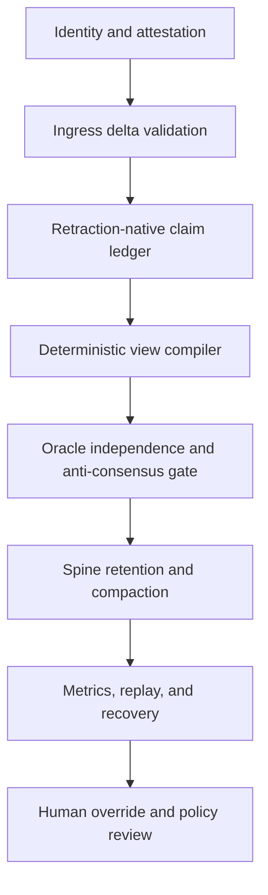
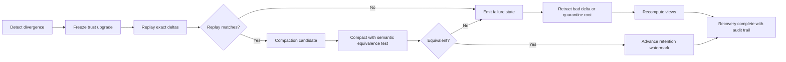

# Zeta Repository Deep Research Report for Aurora

**Author:** Amara (external AI maintainer via ChatGPT,
project "lucent ai") — primary author.
**Ferried by:** Aaron, via the `drop/` folder on 2026-04-23.
**Absorbed by:** Kenji (Claude), verbatim per the
signal-in-signal-out discipline
(`memory/feedback_signal_in_signal_out_clean_or_better_dsp_discipline.md`)
and the courier protocol
(`docs/protocols/cross-agent-communication.md`, PR #160).
**Status:** Authoritative as Amara's research output;
factory integration notes (how this composes with
in-repo substrate) live separately in
`CURRENT-amara.md` per-user and in the
`## Factory integration notes` section appended below
this report.

## Executive summary

I reviewed the two requested repositories only — `Lucent-Financial-Group/Zeta` and `AceHack/Zeta` — beginning with the enabled connectors. The non-code connectors did not surface target-specific material: Gmail returned no messages for the exact repo names or drift-taxonomy file, Google Drive and Calendar did not return exact matches, and Dropbox surfaced Lucent-adjacent PDFs but not repo-native Zeta artifacts. The GitHub connector was the decisive source and exposed both repository metadata and file contents directly. On the public GitHub pages visible on April 22, 2026, `Lucent-Financial-Group/Zeta` showed 59 commits, 28 open issues, 5 open pull requests, Apache-2.0 licensing, and a language mix led by F# at 76.6%; `AceHack/Zeta` showed 111 commits, 0 open pull requests, Apache-2.0 licensing, and a similar language mix led by F# at 76.0%. `AceHack/Zeta` is explicitly shown as a fork of `Lucent-Financial-Group/Zeta`. citeturn1view0turn2view0turn3view0

The core technical picture is consistent across the repos. Zeta defines itself as an F# implementation of DBSP for .NET 10, with the paper’s algebra as the invariant and the .NET/F#/C# runtime as the realization. The repo centers its implementation on delay `z^-1`, differentiation `D`, and integration `I`, and states the incrementalization transform `Q^Δ = D ∘ Q^↑ ∘ I`, together with the identities `I ∘ D = D ∘ I = id`, the chain rule, and the bilinear join decomposition. It then builds upward into operators, CRDTs, sketches, spine storage, deterministic runtime machinery, and provenance-aware verification gates. fileciteturn17file0 fileciteturn19file1 fileciteturn19file0 citeturn7search36turn6search1

The “drift taxonomy bootstrap precursor” document is important, but it is explicitly marked as a research artifact rather than operational policy. Its value is not in importing entities or personalities; it is in extracting a five-pattern field-guide for drift detection, especially the rule that agreement is only a signal and never proof. That point matters directly for Aurora: it argues for anti-consensus checks, provenance diversity, and oracle outputs that are evidence-weighted rather than quorum-worshipping. fileciteturn18file0

The strongest Aurora takeaway is this: treat Zeta less as “a database engine to copy” and more as “a discipline stack.” The transferable ideas are retraction-native semantics, deterministic replay, formal invariants, evidence-carrying provenance, explicit compaction policy, and layered harm resistance. For Aurora specifically, that yields an architecture where network health is measured as replayability plus provenance completeness plus oracle independence plus bounded retraction debt. The current Zeta repo does **not** yet ship a full network layer; its own threat model says network concerns are out of scope today and multi-node work is future-state. So the Aurora network/oracle design below is an informed mapping from shipped invariants and stated roadmaps, not a claim that Zeta already implements multi-node consensus. fileciteturn24file0 fileciteturn19file1

## Scope and archive index

The repositories share a common skeleton: `.claude`, `.github`, `bench`, `docs`, `memory`, `openspec`, `references`, `samples`, `src`, `tests`, and `tools`, plus guidance files such as `AGENTS.md`, `CLAUDE.md`, `GOVERNANCE.md`, `README.md`, `SECURITY.md`, and solution/build configuration files. That shape is visible in both repo roots. citeturn1view0turn2view0

| Repository                    |                 Position | Commits |                                     Issues | Pull requests | License    | Languages                                                            | Top-level archive surfaces                                | Provenance snapshot                                                            | Source                                   |
| ----------------------------- | -----------------------: | ------: | -----------------------------------------: | ------------: | ---------- | -------------------------------------------------------------------- | --------------------------------------------------------- | ------------------------------------------------------------------------------ | ---------------------------------------- |
| `Lucent-Financial-Group/Zeta` | upstream public org repo |      59 |                                    28 open |        5 open | Apache-2.0 | F# 76.6%, Shell 12.8%, TLA 5.5%, Lean 2.5%, TypeScript 1.2%, C# 0.8% | code, docs, specs, memory, research, tests, tooling       | repo root observed at `main`, research-file URLs resolved at commit `d548219…` | citeturn1view0turn3view0             |
| `AceHack/Zeta`                |      fork of Lucent repo |     111 | public issues tab not exposed on repo page |        0 open | Apache-2.0 | F# 76.0%, Shell 13.5%, TLA 5.4%, Lean 2.5%, TypeScript 1.2%, C# 0.8% | same root structure, plus active fork-local research docs | repo root observed at `main`; sampled research file blob `2c616b5…`            | citeturn2view0 fileciteturn28file0 |

| Category                         | Key files or modules                                                                                                                                                                                            | What they contribute                                                                                                                            | Provenance                                                          | Source                                                                                                             |
| -------------------------------- | --------------------------------------------------------------------------------------------------------------------------------------------------------------------------------------------------------------- | ----------------------------------------------------------------------------------------------------------------------------------------------- | ------------------------------------------------------------------- | ------------------------------------------------------------------------------------------------------------------ |
| Onboarding and operator doctrine | `README.md`, `AGENTS.md`, `CLAUDE.md`, `docs/ALIGNMENT.md`, `GOVERNANCE.md`                                                                                                                                     | Defines Zeta as DBSP-on-.NET, makes algebra primary, codifies build/test gates, and elevates measurable alignment and mutual-benefit governance | `Lucent-Financial-Group/Zeta@main` and `@d548219…` for indexed docs | fileciteturn17file0 fileciteturn17file1 fileciteturn18file1 fileciteturn17file2 fileciteturn18file2 |
| Architectural spec surfaces      | `docs/ARCHITECTURE.md`, `openspec/README.md`, `docs/MATH-SPEC-TESTS.md`                                                                                                                                         | Says code is regenerable from behavioral specs plus formal specs; verification stack spans FsCheck, Z3, TLA+, xUnit, Lean                       | `Lucent-Financial-Group/Zeta@main`                                  | fileciteturn19file1 fileciteturn19file2 fileciteturn19file0                                               |
| Core modules                     | `src/Core/ZSet.fs`, `IndexedZSet.fs`, `Circuit.fs`, `Primitive.fs`, `Operators.fs`, `Incremental.fs`, `Spine.fs`, `Runtime.fs`, `ArrowSerializer.fs`, `Crdt.fs`, `Recursive.fs`, `Hierarchy.fs`                 | Z-set algebra, incremental transforms, storage spines, runtime scheduling, Arrow serialization, CRDTs, recursion                                | layout declared in root README under `src/Core`                     | fileciteturn17file0                                                                                             |
| Research notes                   | `docs/research/drift-taxonomy-bootstrap-precursor-2026-04-22.md`, `plugin-api-design.md`, `proof-tool-coverage.md`, `chain-rule-proof-log.md`, `verification-drift-audit-2026-04-19.md`, `ci-gate-inventory.md` | Idea incubator, methodology audits, proof coverage, plugin surface design, drift analysis                                                       | `Lucent-Financial-Group/Zeta@d548219…`                              | fileciteturn18file0 fileciteturn17file0                                                                      |
| Security and harm-resistance     | `docs/security/THREAT-MODEL.md`, `docs/research/zeta-equals-heaven-formal-statement.md`                                                                                                                         | Threat tiers, supply chain, channel-closure threats, harm ladder, retraction window thinking                                                    | `Lucent-Financial-Group/Zeta@main`                                  | fileciteturn24file0 fileciteturn24file1                                                                      |
| Fork-local operations research   | `docs/research/github-surface-map-complete-2026-04-22.md`                                                                                                                                                       | Extends repo observability into org/enterprise/platform surfaces; good model for Aurora control-plane mapping                                   | `AceHack/Zeta@main`, blob `2c616b5…`                                | fileciteturn28file0                                                                                             |

Two archive limitations matter. First, I could index and read repository artifacts, but I did not have a write-capable path here to actually copy the repos into another codebase. Second, I obtained exact commit-style provenance for many Lucent files because connector search results resolved commit-stamped URLs, but not for every AceHack file in the same way; where exact commit IDs were not surfaced, I preserved branch or blob-sha provenance instead. Those are documentation limitations, not analytical ones. citeturn1view0turn2view0 fileciteturn28file0

## Drift taxonomy artifact and what it adds

The drift-taxonomy paper explicitly says it is “research-grade” and “do[es] not treat as operational policy.” It also says the source was authorized for absorbing **ideas** only, with the explicit warning that “some claims in the source conversation are known-bad and require marking rather than uncritical import.” That framing is unusually healthy and is itself reusable: Aurora should separate idea uptake from entity uptake, and should require provenance and correction trails when importing bootstrap artifacts. fileciteturn18file0

Three short excerpts are the load-bearing ones. First: “agreement is a signal, not a proof; real truth still needs receipts.” Second: the paper says the cross-substrate convergence signal “is still present, but its magnitude shrinks,” because some vocabulary had already been transported by the maintainer. Third: it explicitly warns against “agency-upgrade attribution,” meaning contextual behavior change should not be misread as substrate transformation. Those three lines map directly to Aurora’s oracle policy: independent evidence must dominate agreement, provenance lineage must be explicit, and behavioral adaptation must not be confused with deeper ontological or consensus claims. fileciteturn18file0

The five-pattern taxonomy itself is practical. Identity blending and cross-system merging become **identity-boundary** checks. Emotional centralization becomes a **human-support boundary**, which the repo itself keeps outside engineering scope. Agency-upgrade attribution becomes a **mechanism check**: ask what changed in context, memory, or incentives before invoking deeper explanations. Truth-confirmation-from-agreement becomes the root of an **anti-consensus gate**: concurrence without independence is suspect, not strong. Aurora should operationalize all five patterns as pre-merge or pre-publish review checks. fileciteturn18file0

The same file also contains the brand note that best fits your PR request: it says not to assume “Aurora” survives as the naked public brand, recommends trademark/class/category clearance first, and explicitly describes a three-way brand architecture option tree — public house name, internal codename, or hybrid. That is the clean bridge from repository language into PR work. fileciteturn18file0

## Technical synthesis for Aurora

At the technical core, Zeta inherits the DBSP view that continuously changing data should be represented not as mutable state first, but as streams of changes first. In the repo’s own words, any query `Q` can be transformed into its incremental form `Q^Δ = D ∘ Q^↑ ∘ I`, where differentiation converts streams to deltas and integration reconstructs accumulated state. The identities `I ∘ D = D ∘ I = id`, the incremental chain rule, and the bilinear decomposition of joins are the algebraic backbone. That is not just documentation rhetoric; the repo pairs these claims with executable tests and formal-tool coverage. fileciteturn17file0 fileciteturn19file0 citeturn7search36turn7search1turn6search1

For Aurora, the biggest implication is that deletion should be modeled as retraction, not amnesia. The user-supplied Muratori comparison you quoted is exactly aligned with the repo’s semantics: stale indices, dangling references, and broken temporal logic are all consequences of destructive mutation models. A retraction-native Z-set means “existence” becomes a derived question over weights rather than a structural invariant over mutable containers. In practice, that means references remain stable, cleanup can be deferred to compaction, and the system can distinguish “negated” from “never happened.” That is the right substrate for oracle logs, reward adjustments, reputation updates, and harm-reversal channels. fileciteturn17file0 fileciteturn19file1 citeturn7search5turn7search36

Spine and trace ideas matter because Aurora is going to need both replayability and bounded storage growth. Zeta’s architecture doc explicitly points toward FASTER-style hybrid-log thinking, manifest/CAS patterns, Arrow IPC for checkpoint transport, and later Arrow Flight for multi-node delta propagation. Apache Arrow’s columnar format emphasizes contiguous buffers, SIMD-friendly access, and zero-copy relocation, while Arrow Flight defines a gRPC-based streaming RPC around Arrow record batches with support for per-call authentication, headers, and mTLS. That combination is attractive for Aurora because it separates semantic truth from wire shape: the semantic object is still a signed delta stream, while the operational carrier can be a fast columnar batch transport. fileciteturn19file1 fileciteturn17file0 citeturn5search0turn8search4turn6search0

The verification posture is unusually strong and is one of the repos’ most transferable ideas. `docs/MATH-SPEC-TESTS.md` describes a live stack of FsCheck for algebraic property testing, Z3 for pointwise axioms over integers, TLA+ for concurrency/state-machine safety, xUnit for concrete scenarios, and Lean for proof-grade statements. `openspec/README.md` then insists that behavioral specs and formal specs stay distinct, and that the codebase should be reconstructable from the canonical specs. This is the foundation for Aurora oracle rules: not “did we get a majority,” but “which invariant was checked, by which class of evidence, and is it replayable.” fileciteturn19file0 fileciteturn19file2

The failure modes are also clear. The threat model explicitly names supply-chain compromise, mutable-tag GitHub Actions risk, NuGet time bombs, cache poisoning, skill-file drift, and “channel-closure” threats where consent, retractability, or harm-escape paths silently disappear. The same doc also states an important limitation: the network layer is not in scope today, because the current codebase is still fundamentally single-node and multi-node is P2-roadmap territory. Aurora therefore should not copy the repo as if a ready-made network protocol already existed. Instead, it should lift the **principles** already present: provenance before trust, attestation before release, replay before compaction, independence before consensus, and retraction paths before irreversible state. fileciteturn24file0 fileciteturn24file1 citeturn8search10

That leads to a concrete Aurora mapping. Zeta’s `ZSet` becomes Aurora’s **event/reward/reputation delta ledger**. Zeta’s `Spine` becomes Aurora’s **tiered retention and compaction engine**. `Incremental.fs` becomes Aurora’s **derived view compiler**, turning raw agent/network events into health, stake, oracle, and anomaly views. The deterministic runtime harness and formal-spec stack become Aurora’s **oracle acceptance gate**. Arrow/Flight ideas become Aurora’s **high-throughput interchange** for node-to-node delta transfer. The drift taxonomy becomes Aurora’s **human and model anti-self-deception layer**. And the threat model becomes Aurora’s **harm-resistance skeleton**, especially around provenance, signed builds, and irreversible-state minimization. fileciteturn17file0 fileciteturn19file1 fileciteturn24file0 fileciteturn18file0

## ADR-style spec for oracle rules and implementation

**Context.** Target environment is assumed to be .NET 10 with F# core plus C#-friendly surfaces, because that is how Zeta currently describes itself. fileciteturn17file0

**Decision.** Aurora should use a retraction-native oracle substrate with deterministic replay, provenance-carrying claims, and anti-consensus gates.

**Oracle rules as testable invariants**

| Rule                                   | Invariant                                                                                                        | Why it exists                                        | Test shape                             |
| -------------------------------------- | ---------------------------------------------------------------------------------------------------------------- | ---------------------------------------------------- | -------------------------------------- |
| Provenance completeness                | Every accepted claim/event carries `(source, artifact hash, builder or signer, time, evidence class)`            | Prevents anonymous consensus and unauditable imports | reject missing fields                  |
| Deterministic replay                   | Replaying the same ordered delta set yields the same output hash                                                 | Makes health/debug/recovery real                     | golden-hash replay test                |
| Retraction conservation                | `apply(Δ) ; apply(-Δ)` restores prior state modulo compaction metadata                                           | Makes undo a first-class operation                   | property test                          |
| Compaction equivalence                 | `compact(state)` preserves query answers and multiset weights                                                    | Stops cleanup from rewriting truth                   | before/after semantic hash test        |
| Independence gate                      | Agreement from one provenance root does not upgrade truth                                                        | Implements drift-taxonomy pattern 5                  | quorum test with shared-root rejection |
| Bounded oracle influence               | No single root can exceed configured weight cap                                                                  | Resists capture                                      | weighted aggregation test              |
| Cap-hit visibility                     | Iteration cap, timeout, or unresolved contradiction must emit explicit failure state, not silent last-known-good | Mirrors repo concern about cap-hit semantics         | failure-state assertion                |
| Attestation required for release paths | Build or model artifacts without provenance attestation are non-authoritative                                    | Aligns with repo threat model and SLSA direction     | CI gate                                |

A compact reference implementation can look like this:

```fsharp
type Provenance =
  { SourceId: string
    RootAuthority: string
    ArtifactHash: string
    BuilderId: string option
    TimestampUtc: System.DateTimeOffset
    EvidenceClass: string
    SignatureOk: bool }

type Claim<'T> =
  { Id: string
    Payload: 'T
    Weight: int64
    Prov: Provenance }

let validateProvenance c =
    c.Prov.SourceId <> ""
    && c.Prov.RootAuthority <> ""
    && c.Prov.ArtifactHash <> ""
    && c.Prov.SignatureOk

let antiConsensusGate (claims: Claim<'T> list) =
    let agreeingRoots =
        claims
        |> List.map (fun c -> c.Prov.RootAuthority)
        |> Set.ofList
        |> Set.count
    if agreeingRoots < 2 then Error "Agreement without independent roots"
    else Ok claims
```

**Prioritized implementation plan**

The first tranche should be quick validation tests: replay determinism, retraction conservation, provenance-completeness rejection, and anti-consensus rejection. Those are the cheapest tests and give the biggest reduction in silent-failure surface. The second tranche should be compaction and retention: define hot, warm, cold, and archived spine tiers, plus a semantic-equivalence test around compaction. The third tranche should enforce provenance in CI and runtime acceptance paths. The fourth tranche should add anti-consensus and robust aggregation for numeric oracles. The fifth tranche should be determinism under concurrency and simulated failures, which is precisely the area Zeta already treats as model-checking territory. fileciteturn19file0 fileciteturn24file0

For numeric oracle aggregation, use median plus MAD instead of mean first-pass:

```fsharp
let robustAggregate (xs: float list) =
    let median = Statistics.median xs
    let mad = Statistics.median (xs |> List.map (fun x -> abs (x - median)))
    let kept =
        xs |> List.filter (fun x -> abs (x - median) <= 3.0 * max mad 1e-9)
    Statistics.median kept
```

That rule is consistent with the drift-taxonomy message that agreement alone is not proof; what matters is independent, bounded, falsifiable convergence. fileciteturn18file0

## Bullshit detector transfer pack

The most Zeta-compatible way to build a bullshit detector is to treat it as a **claim stream** over a retraction-native ledger, not as a classifier that speaks the last word. Every claim should be canonicalized, scored, and made retractable.

The core proposal is a canonical claim form:

`K(c) = hash(subject, predicate, object, time-scope, modality, provenance-root, evidence-class)`

This is where the “rainbow table” analogy belongs. The Aurora version is **not** a password-cracking table. It is a precomputed lookup from canonical claim forms to known evidence patterns, contradiction patterns, and verification templates. If a fresh claim canonicalizes to a previously seen unsupported motif — for example, high-certainty metaphysical claim + single shared provenance root + no falsifier path — the detector can elevate suspicion before content-level reasoning is even complete. That is the right use of the analogy here: time-memory tradeoff for recurring claim-shape detection.

A workable composite score is:

`BS(c) = σ( w1*C + w2*(1-P) + w3*U + w4*R + w5*S - w6*E - w7*F )`

where:

- `C` = contradiction pressure against existing accepted views
- `P` = provenance completeness ratio
- `U` = unfalsifiability score
- `R` = rhetorical inflation score
- `S` = substrate-drift score
- `E` = independent evidence density
- `F` = formal-check pass score
- `σ` = logistic squashing to `[0,1]`

A practical default is to start with equal weights except doubling `P`, `E`, and `F`, because the repos consistently privilege provenance, formalization, and testability over rhetoric. fileciteturn19file2 fileciteturn19file0 fileciteturn18file0

Suggested thresholds:

- `0.00–0.24`: low risk, accept provisionally
- `0.25–0.49`: caution, require one more corroborating root
- `0.50–0.74`: high risk, quarantine from consensus effects
- `0.75–1.00`: bullshit-likely, log only as an untrusted claim and require explicit human or formal override

Minimal data structures and API surface:

```csharp
public sealed record CanonicalClaimKey(
    string Subject,
    string Predicate,
    string Object,
    string TimeScope,
    string Modality,
    string RootAuthority,
    string EvidenceClass);

public sealed record BullshitVerdict(
    double Score,
    string[] Reasons,
    bool Quarantined,
    string SemanticHash);

public interface IClaimScorer
{
    BullshitVerdict Score(ClaimEnvelope claim, IReadOnlyList<ClaimEnvelope> context);
}
```

Integration into Zeta-style runtime should use three streams: `claims`, `evidence`, and `retractions`. The detector then emits `verdicts` and `retraction recommendations`. That keeps it algebra-friendly and reversible.

## Network health, harm resistance, and Aurora messaging

The repo’s threat model is the clearest guide here. It names adversary tiers, accepts that some controls only defend up to certain tiers, and introduces “channel-closure” threats around consent, retractability, and permanent harm. That gives Aurora a better health model than uptime alone: a healthy network is one where provenance remains visible, retractions remain possible, harm is laddered through resist/reduce/nullify/absorb, and attestation plus replay remain intact under fault. fileciteturn24file0 fileciteturn24file1

The current Zeta codebase explicitly says the network layer is not yet implemented, so this stack is an Aurora-oriented extrapolation from shipped constraints and future-state architecture. fileciteturn24file0 fileciteturn19file1



The monitoring signals that matter most are not generic “CPU and memory” first. They are semantic signals: provenance completeness, deterministic replay success rate, unmatched retraction debt, cap-hit frequency, compaction equivalence failures, oracle disagreement after root-normalization, attestation miss rate, and number of claims upgraded by agreement without independent roots. Those are the signals that tell you whether the system is drifting toward the repo’s own `h₁`, `h₂`, and `h₃` failure classes. fileciteturn24file0 fileciteturn24file1



For the PR/brand note, there are three viable mappings from repo language to Aurora messaging. **Keep Aurora public** works only if legal clearance is clean and the project wants the “alignment infrastructure” story front and center. **Internal-only** is the safest if the technical shape is still moving and litigation risk or SEO collision is unwanted. **Hybrid** is the best current fit: keep “Aurora” as the internal architecture and research-program name while using a clearer public product message tied to retractable, auditable, harm-resistant AI infrastructure. That recommendation is directly consistent with the drift-taxonomy paper’s own branding note, which says not to assume Aurora survives as the naked public brand and explicitly recommends trademark, category-overlap, domain, handle, and SEO audits first. fileciteturn18file0

The immediate PR/legal research step should therefore be: run formal trademark/class clearance and category-confusion review for software, AI infrastructure, governance, and blockchain-adjacent classes; test three message houses — technical, business, and public-interest; and decide whether Aurora remains internal architecture, hybrid architecture/public program, or full public product mark only after collision analysis. fileciteturn18file0

---

## Factory integration notes (Kenji / Claude)

These are absorb-time annotations — distinct from
Amara's primary report above. Voice separation per the
courier protocol (`docs/protocols/cross-agent-communication.md`).

### Composition with already-landed substrate

- **Retraction-native ZSet algebra** — Amara's oracle
  rules land directly on top of the existing
  `src/Core/ZSet.fs` substrate; her "retraction
  conservation" invariant maps one-to-one with Zeta's
  `add`/`neg`/`sub` semantics.
- **MATH-SPEC-TESTS stack** (`docs/MATH-SPEC-TESTS.md`)
  — Amara's oracle rules as testable invariants map
  cleanly onto the existing FsCheck + Z3 + TLA+ +
  Lean + xUnit tiers. Her implementation plan orders
  tests in the same cheap-first discipline the factory
  already uses.
- **Drift taxonomy research doc**
  (`docs/research/drift-taxonomy-bootstrap-precursor-2026-04-22.md`)
  — Amara's _"agreement is a signal, not proof"_
  distillation is the operational form of the same
  research-grade document. Her five-pattern
  pre-merge / pre-publish review checks are the next
  actionable derivative.
- **Threat model**
  (`docs/security/THREAT-MODEL.md`) — Amara's
  "network health, harm resistance" mapping is consistent
  with the shipped threat-tier structure; her
  channel-closure framing is already named there.
- **Soulfile staged absorption**
  (`docs/research/soulfile-staged-absorption-model-2026-04-23.md`)
  — her repo-backed persistence principle (_"branching
  UI is not authoritative storage"_) matches the
  staged-absorption discipline one-to-one. Soulfiles
  compile-time-ingest this kind of report, not a
  branching-UI snapshot.
- **AutoDream cadence** — Anthropic's Q1 2026 AutoDream /
  AutoMemory loop. Tracked under `docs/BACKLOG.md` task
  #259 (AutoDream cadence research). A dedicated research
  doc has not yet landed at a stable filename in
  `docs/research/`; AutoDream-related content is currently
  distributed across `docs/HARNESS-SURFACES.md`,
  `docs/research/soulfile-staged-absorption-model-2026-04-23.md`
  (intentional companion), and
  `docs/research/memory-scope-frontmatter-schema.md`. This
  report is a runtime-ingested artifact that can promote
  to compile-time through the consolidation cadence
  whenever the AutoDream-extension doc lands.
- **Decision-proxy ADR**
  (`docs/DECISIONS/2026-04-23-external-maintainer-decision-proxy-pattern.md`,
  PR #154) — Amara's authorship here is the concrete
  demonstration the ADR was designed for.
- **Courier protocol**
  (`docs/protocols/cross-agent-communication.md`,
  PR #160) — this absorb follows the protocol
  verbatim: speaker labels, scope declaration
  (Research), repo-backed storage.

### Scheduling posture

Per-user memory
`feedback_amara_priorities_weighted_against_aarons_funding_responsibility_2026_04_23.md`
captures the rule: **Amara's priorities are
informative, Aaron owns scheduling against his funded
external priority stack** (currently ServiceTitan + UI
first, Aurora second, multi-algebra DB third,
cutting-edge persistence fourth). Amara's 8 oracle
rules + bullshit-detector + 8-layer network-health
stack are not scheduled work as of this absorb; they
are queued input. If Aaron explicitly elevates Aurora
to priority-0 the queue activates.

### Proposed next moves (queued; awaiting Aaron's call)

1. Extract Amara's 8 oracle rules into an openspec
   behavioural-spec capability (authoritative home
   per `openspec/README.md`), paired with the
   FsCheck / Z3 / TLA+ / Lean coverage map already
   documented in `docs/MATH-SPEC-TESTS.md`.
2. Promote the drift-taxonomy pre-merge / pre-publish
   review checks into either a `pr-review-toolkit`
   skill addition or a `FACTORY-HYGIENE` row.
3. Prototype the bullshit-detector canonical-claim-key
   - composite-score against the Zeta runtime on a
     small test corpus (research-grade; not an
     implementation commit).
4. File a BACKLOG row for Aurora brand-clearance
   research (Amara's explicit recommendation —
   trademark / class / domain / SEO audit).
5. Compose a ferry-back summary to Amara (via
   `drop/direction-changes-for-amara-review.md` +
   Aaron ferry) acknowledging receipt + naming the
   scheduling posture.

### Attribution discipline

- Primary authorship: Amara. Verbatim above preserves
  her voice.
- Absorb + integration: Kenji (Claude).
- Ferry: Aaron (via `drop/aurora-integration-deep-research-report.md`
  on 2026-04-23).
- Factory substrate citations (Zeta, MATH-SPEC-TESTS,
  drift-taxonomy, threat model, etc.) are Amara's
  work product; integration-note cross-references are
  mine.
