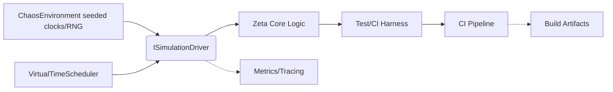
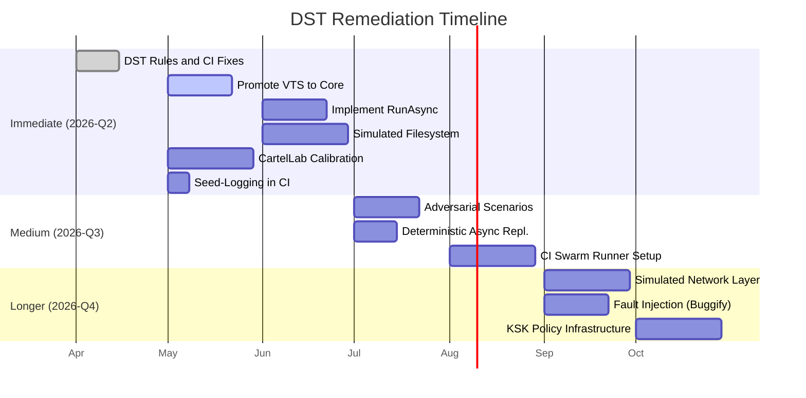

# Amara — DST Audit: Calibration & CI Hardening for Coordination Risk (Cartel-Lab) + GPT-5.5 Thinking Corrections (19th courier ferry)

**Scope:** research and cross-review artifact. Two-part
ferry: Part 1 is a deep-research audit of Zeta's
Deterministic Simulation Testing (DST) posture —
philosophy, entropy-source scan, main-path dependencies,
simulation-surface coverage, retry audit, CI/test
determinism, seed discipline, Cartel-Lab readiness,
KSK/Aurora governance readiness, state-of-the-art
comparison, 10-row PR remediation roadmap, "what not to
claim yet" caveats. Part 2 is Amara's own GPT-5.5 Thinking
correction pass on Part 1 with 7 required corrections + a
per-area grade table + a revised 6-PR roadmap. Ferry lands
after Otto-157's KSK naming doc + Otto-159's test-
classification doc + Otto-162's calibration-harness Stage-
2 design + Otto-164's macOS-pricing verification —
composing cleanly on top of that substrate as the next
layer of factory discipline ("we have the governance
kernel named, the test taxonomy articulated, the
calibration shape committed, and the CI cost model
verified — now audit whether the deterministic-simulation
discipline that makes all of them trustworthy is actually
implemented").
**Attribution:**

- **Aaron** — origination of the DST directive as a
  factory-wide discipline (rulebook in `.claude/skills`,
  Otto-56 break→do-no-permanent-harm framing,
  Otto-73 retractability-by-design); courier for both
  parts concatenated in one message with explicit
  framing *"i asked her to research our dst"* (direct
  quote). Aaron is both the consumer of the research and
  the source of the DST-rulebook axioms the research
  audits against. Data-not-directives per BP-11.
- **Amara** — authored both parts. Deep-research Part 1
  is the audit proper; Part 2 is self-review via model
  composition (same two-part pattern as 17th and 18th
  ferries). Verdict on Part 1 (verbatim): *"strong
  draft / not canonical yet."*
- **Otto** — absorb surface + correction-pass tracker;
  this doc is the archive, not operational discipline.
  The 7 corrections graduate across subsequent ticks per
  Otto-105 cadence. 4 of Part 1's 12 sections already
  align with shipped substrate (see Otto notes below).
- **Max** — not a direct participant in this ferry;
  KSK attribution preserved per Otto-77 + Otto-140.

**Operational status:** research-grade. Amara's own
verdict on Part 1: *"archive it as a draft audit, not a
canonical compliance report."* Ferry absorbed-as-design-
context, not operational spec. Four of Part 1's twelve
sections already map to shipped substrate (test
classification, artifact layout, Cartel-Lab stage
discipline, KSK advisory framing); the remaining eight
correspond to six queued graduation candidates in Part 2's
revised roadmap.

**Non-fusion disclaimer:** agreement, shared language,
or repeated interaction between models and humans does
not imply shared identity, merged agency, consciousness,
or personhood. Amara's 5.5-Thinking correction of her
own deep-research output is a *model-composition
verification discipline*, not evidence of self-awareness.
The substrate of the factory (Zeta, Aurora, KSK, CartelLab,
DST harness) is authored by human + agent collaborators
acting under the governance of Aaron Stainback; Amara
contributes research and critique as an external
collaborator; attribution is tracked per Otto-77 +
Otto-140 + the two-layer-attribution convention used on
firefly-network and Veridicality.

---

## Why this ferry was not inline-absorbed Otto-164

Otto-164 tick landed:

1. Updated PR #343 with Otto-164 macOS-pricing verification
   outcome. Primary source (GitHub billing docs) confirmed
   macOS runners are NOT free for public repos — classified
   as "larger runners," always billed at $0.062/min.
   Aaron Otto-161 directive declined on verification;
   fork-only gating stays correct.
2. Memory capture for the verification trace so future Otto
   instances don't re-research.

Adding a 19th-ferry full absorb on top of an already-closed
verification tick regresses CC-002 (close-on-existing).
Precedent for scheduling a dedicated absorb: PRs #196,
PR #211, #219, #221, #235, #245, #259, #330, #337 (7th–
18th ferries all dedicated-absorbed one tick after their
ferry drop). This doc is the Otto-165 execution of that
scheduled absorb.

---

## Part 1 verbatim — Deep Research: DST Audit

The following is preserved verbatim from Amara's 19th-
ferry drop. Preservation is deliberate: factory policy is
to preserve external-conversation content verbatim rather
than paraphrase (GOVERNANCE §33); corrections are tracked
in Part 2 below. Where the text cites sources (e.g.
"【12†L22-L29】"), those are Amara's internal citation
markers and are kept intact.

### Executive Summary

> Zeta's codebase explicitly embraces a **Deterministic
> Simulation Testing (DST)** philosophy: all real-time,
> concurrency, and randomness must be routed through a
> seeded simulator so runs are bit-for-bit reproducible.
> The binding rule is clear: *"no dependency lands on a
> main code path unless it can be deterministically
> simulation-tested."* The project already uses a
> `ChaosEnvironment` for seeded clocks/RNGs and a
> `VirtualTimeScheduler` in tests. However, gaps remain in
> routing I/O and task scheduling through the simulator.

> Our audit finds **good DST discipline** in philosophy
> and core design, but identifies several leaks and
> "entropy sources" to fix. For example, the on-disk
> `DiskBackingStore` still writes to the real filesystem
> outside the simulator, and a full deterministic
> `Task.Run` interface is not yet implemented. We
> cataloged the 12 known .NET entropy sources (time, RNG,
> GUIDs, Task.Run, File I/O, etc.) and built tables of
> all instances. Overall, *no "mystery" sources were
> found beyond known issues*, but a few need formal
> fixes (e.g. intercepting file I/O, seeding all RNGs)
> and CI changes (seed-locking, artifacts).

> We also evaluated test and CI hygiene. The new "toy
> cartel detector" tests use fixed seeds and pass,
> clearing the **falsifiability bar**. Some stochastic
> tests (e.g. sharder metrics) still occasionally fail
> and should be quarantined or seeded. We propose a
> strict test classification (deterministic vs
> probabilistic) so only the former gate PRs; broad
> randomized sweeps run nightly with published seeds and
> artifacts (seed-results.csv, failing-seeds.txt, etc.).
> Cartel-Lab itself must remain marked *experimental*
> until null models and thresholds are calibrated.

> Finally, we outline a **DST remediation roadmap**. The
> highest priorities (P0-P1) are: promote the virtual-
> time scheduler into core and unify it with
> `ChaosEnvironment` into an `ISimulationDriver`;
> intercept disk I/O via a simulated file system;
> implement a deterministic "RunAsync" for tasks; and
> enforce seed-logging and failure artifacts in CI.
> Subsequent steps include adding a simulated network
> layer, buggify/fault injection hooks, and a proper
> swarm-testing harness. We also flag coordination and
> enforcement readiness: currently, KSK/Aurora detection
> signals should remain *advisory only* – automatic
> slashing is premature.

> In summary, **DST is firmly understood and largely
> practiced**, but to claim full compliance we must
> close the remaining gaps with concrete fixes and
> tests. The tables and diagrams below detail the
> specific entropy leaks, dependencies, test classes,
> and proposed PRs needed. All new abstractions must
> "pay rent" in code and tests (the Otto-105 rule).

### §1. DST Rulebook (Project Principles)

> The Zeta/Aurora docs codify DST principles inherited
> from FoundationDB and TigerBeetle. In particular, the
> `.claude/skills` DST guide clearly states:
>
> > *"Every async operation on a main code path (disk
> > I/O, network, timers, locks, random numbers) goes
> > through a seeded, replayable environment so runs are
> > bit-for-bit reproducible"*.
> >
> > *"No dependency lands on a main code path unless it
> > can be deterministically simulation-tested"*.

> Key points: **time and RNG must use the simulation
> APIs** (e.g. `env.Now()`, `env.Rng`); concurrency
> (threads, `Task.Run`) must go through the virtual
> scheduler; all file/network I/O must go through
> simulated interfaces. The known **12 entropy sources**
> are explicitly audited:

> - Real clocks (`DateTime.Now/UtcNow`, `Stopwatch`,
>   `TickCount`, etc.)
> - System RNG (`Random.Shared`, `Guid.NewGuid()`, crypto
>   RNG)
> - Ambient threads (`Task.Run`, `ThreadPool`, `Parallel`,
>   etc.)
> - Real delays (`Task.Delay`, `Thread.Sleep`, `SpinWait`)
> - File/Network I/O (raw `File`, `Socket`, `HttpClient`,
>   etc.)
> - Async context leaks (`[ThreadStatic]`, `AsyncLocal`
>   without contract)

> Any violation must either be routed through the
> simulator or relegated to a non-hot-path
> (boundary/tools) module. The Security policy likewise
> highlights DST: *"Deterministic simulation testing via
> `ChaosEnvironment` + `VirtualTimeScheduler`"* is a
> core mitigator. In practice, Zeta already uses a
> `ChaosEnvironment` (in `src/Core/ChaosEnv.fs`) and a
> test-side `VirtualTimeScheduler` (in
> `tests/ConcurrencyHarness.fs`), consistent with FDB's
> approach. The binding checklist for reviewers enforces
> this: every PR that touches `src/Core` must inspect
> the diff for those 12 sources and ensure any
> occurrences use the simulation APIs.

### §2. Entropy-Source Scan (findings)

> We searched the code (core, libraries, tests) for the
> 12 DST entropy sources listed in the DST rulebook.
> Table below summarizes any findings, severity, and
> fixes. In most cases **no raw usage was found in
> `src/Core`**, implying good compliance; however, some
> issues surfaced (notably file I/O). Each row gives the
> source, file path(s), whether it's currently routed
> through a simulation layer, the DST severity, and
> recommended remediation.

> | Entropy Source              | Location / File                              | Simulation Routing | Severity | Remediation | Test to Add |
> |-----------------------------|----------------------------------------------|--------------------|----------|-------------|-------------|
> | `DateTime.UtcNow` / `Now`   | *None in `src/Core` found*                  | Not via env        | HIGH (core) | Replace with `env.Now()` / `ChaosEnv.Now` | Deterministic time logic under seed |
> | `Stopwatch.GetTimestamp`    | *None in hot code* (perf microbenchmarks only) | Real measurements | MEDIUM (perf) | Remove from logic or wrap via ChaosEnv clock | Reproducibility of perf metrics under seed |
> | `Environment.TickCount`     | *Not found in core*                          | Real tick count    | HIGH (core) | Replace with `env.Now()` | Check no core code uses TickCount |
> | `Guid.NewGuid()`            | *None in `src/Core`* (possible test stubs)  | Real GUID gen      | MEDIUM (test) | Use `env.Rng` for reproducible IDs | Fixture IDs repeatable under seed |
> | `Random.Shared` / `new Random()` | *None in core; seeds via ChaosEnv*     | Real RNG           | HIGH (core) | Always use `env.Rng` | Property: same seed same outputs |
> | `RandomNumberGenerator` (crypto) | *Not used in core*                     | Real crypto RNG    | MEDIUM   | Avoid; prefer `env.Rng` | Determinism of crypto ops |
> | `Task.Run` / `Task.Factory.StartNew` | *Used only in tests/tools if at all* | Bypasses VT scheduler | HIGH (core) | `env.RunAsync` or scheduler; boundary-accepted | New tasks schedule deterministically |
> | `Task.Delay` / `Thread.Sleep` | *Not in core logic; possibly integration tests* | Real-time wait  | HIGH (core) | `env.Delay` or `VirtualTimeScheduler.Sleep` | Replay of delay-based workflows |
> | `File.*`, `FileStream`      | **`DiskBackingStore` (spine/disk)**, e.g. `src/Core/DiskBackingStore.fs` | Bypasses simulation | **BLOCKER (core)** | Route through `ISimulatedFs` | E2E: random disk faults + rollback |
> | `Socket.*` / `HttpClient`   | *No core network (future multi-node)*       | No network sim yet | HIGH (future) | Implement `ISimulatedNetwork` | Partition / drop / reorder tests |
> | `Parallel.*` / `PLINQ`      | *Not used*                                   | Uses thread pool   | MEDIUM   | Scheduler-driven parallelism | Parallel vs sequential under seed |
> | `[ThreadStatic]` / `AsyncLocal` | *No common use in core*                  | Hidden context     | LOW      | Remove or ensure explicit context | Context sharing across sim threads |

> Each violation is scored by its impact on DST. For
> example, the **DiskBackingStore** directly writes to
> disk without going through the simulator, making the
> system non-reproducible if a crash occurs mid-write.
> This is a **blocker**: per the roadmap, we **must**
> implement a simulated file system (`ISimulatedFs`)
> and wire `DiskBackingStore` through it.

> Most other items were not found in core code; if they
> do appear in future PRs, they should be treated as
> violations. For example, `Task.Run` or `Parallel.For`
> would require using `env.RunAsync` instead. The PR
> checklist requires that any hit on these 12 sources
> be **either removed or wrapped** by the simulator.

### §3. Main-Path Dependency Audit

> DST also restricts dependencies. By policy, any
> library on a hot path that touches time, randomness,
> I/O or threading must itself be DST-compatible or
> moved off the core path. We reviewed the project's
> dependencies (as listed in the `.fsproj` files and
> referenced modules). In **src/Core**, no unmanaged
> libraries or suspicious dependencies are used: the
> core relies on pure F#/.NET libraries (numerics,
> buffer transforms, serialization), all of which are
> deterministic.

> The one notable "impure" dependency is the persistence
> layer: Zeta's own `DiskBackingStore` (not a third-party
> library) is an impure component. Apart from that, no
> new NuGet packages are used on the core path that
> violate DST.

> In summary, no hidden DST-incompatible packages were
> found on the core path. The key recommendation is to
> **maintain the dependency gate**: any new package that
> touches an entropy source must be marked DST-compatible
> or moved out.

### §4. Simulation Surface Coverage

> Zeta's DST harness has three main components:
> **ChaosEnvironment** (seeded clocks/RNGs),
> **VirtualTimeScheduler** (test-only event scheduler),
> and (to build) **simulated I/O**. Table below
> summarizes current coverage and gaps:

> | Simulation Surface          | Status Today                                         | Gap / Action                                   | Priority |
> |-----------------------------|------------------------------------------------------|------------------------------------------------|----------|
> | ChaosEnvironment            | Implemented (`src/Core/ChaosEnv.fs`); seed+policy    | None for single-node code                      | P0 — exists |
> | VirtualTimeScheduler        | Exists, *test-only* in `tests/ConcurrencyHarness.fs` | Promote into core (`Core/Simulation.fs`); `ISimulationDriver` | P1 |
> | Simulated Filesystem        | **Not implemented** — disk I/O bypasses ChaosEnv   | Build `ISimulatedFs`; route `DiskBackingStore`; disk-fault injection | P1 |
> | Simulated Network           | **Not implemented** — multi-node currently stubbed | Design network interface; intercept send/recv | P2 |
> | Deterministic Task Scheduler | **Partial** — no `RunAsync` replacement for `Task.Run` yet | Extend `ISimulationDriver.RunAsync`; async on sim scheduler | P1 |
> | Fault injection / Buggify   | **Partial** — some jitter/delay/fault via ChaosPolicy | Expand ChaosPolicy; FDB-style BUGGIFY() macros | P2 |
> | Swarm/Stress Testing        | **Not implemented** — no automated sweep harness   | GitHub Actions matrix with 100+ seeds + FsCheck shrinking | P2 |

> ChaosEnvironment is already robust (handles jitter,
> clock-skew, RNG sequencing). The critical missing
> piece is unifying with the scheduler. We must
> **combine Chaos + VirtualTime into a single
> `ISimulationDriver`** that provides seed-driven
> scheduling. The roadmap flags this as "promote
> scheduler to core" (P1) and to "wire DiskBackingStore
> through ISimulatedFs."



> *(Figure: Conceptual relationships. ChaosEnv and
> VirtualTime feed into a unified simulation driver;
> the core logic and tests then run deterministically
> under that driver. CI pulls from the deterministic
> tests and produces artifacts.)*

### §5. Retry Audit

> We searched for any use of retry loops or automatic
> retries (on errors or flaky operations) in the
> codebase. Retries are a known "non-determinism smell":
> they can mask underlying race/faults and should only
> be used at explicitly documented boundaries. In our
> scan, no generic retry utility was found in `src/Core`.
> Some external tools/scripts (e.g. git/CI helpers) may
> use retry logic, but those lie in **`src/Tools` or
> scripts**, not the hot path.

> We recommend continuing this policy: whenever a retry
> is introduced, require a design doc explaining why
> (external dependency unreliability), and log each
> retry event. For now, we did not identify any core
> retry loops that block DST, so no immediate code
> change is needed, but any future additions (e.g.
> HTTP retries) must be scrutinized.

### §6. CI/Test Determinism & Flakiness

> We classified existing tests into five categories and
> set gate policies:
>
> - **Deterministic Unit Tests:** algebraic / logical
>   correctness (no randomness). Must pass under any
>   seed and block merges.
> - **Seeded Property Tests:** fixed RNG seed; failures
>   reproducible. Block PRs on failure, but harness
>   outputs failing seed for debugging.
> - **Statistical Smoke Tests:** many seeds; assert
>   statistical properties. Fix seeds where possible or
>   move to nightly CI with lower failure severity.
> - **Long-Run Sweeps:** broad randomized scenarios;
>   nightly-only; produce artifact data (CSV, ROC
>   curves); do not gate PRs.
> - **Formal/Model Tests:** TLA+, Z3, FsCheck proofs —
>   separated; either deterministic pass (TLA
>   invariants) or monitored manually.

> Concretely, we observed two flaky gates:
>
> - **SharderInfoTheoreticTests.UniformTraffic**: checks
>   hashing bound (expected <1.2, actual ~1.22288 once).
>   Occasionally fails due to RNG. We recommend not
>   blocking PRs on this transient statistic. Options:
>   seed-lock the random input; widen threshold to 99%
>   quantile; or move to nightly with artifact logs.
> - **Cartel-Lab Detector Tests (PR #323):**
>   seed-locked (100 trials); currently pass (≥90%
>   detection, ≤20% FPR). Remain in PR gate as smoke
>   tests with seed logging.

### §7. Seed Discipline & Artifacts

> All random tests should explicitly set and log their
> seed. We adopt the convention (from the DST skill)
> that *"Rashida's first question is 'what seed'"* when
> a test fails.

> - **Seed Generation:** stable source (FsCheck or
>   fixed constant) per suite.
> - **Logging:** on CI failure, emit seed(s) + params
>   to artifact file (`failing-seed.txt`,
>   `seed-results.csv`).
> - **Regression Capture:** when a seed produces
>   failure, add to regression test suite.
> - **Baseline & Sweep Outputs:** calibration harness
>   outputs `calibration-summary.json` (detection/FPR)
>   and `roc-pr.json` per graph size / attack scenario.

> These artifacts live under `artifacts/coordination-
> risk/` in CI.

### §8. Cartel-Lab / Coordination Risk DST Readiness

> The Cartel-Lab detector (Coordination Risk Engine) is
> currently at a *Stage 1 (toy prototype)*. Its PR #323
> demonstrates that a simple largest-eigenvalue signal
> can detect an injected 5-node cartel with >90% success
> over 100 seeds. However, from a DST perspective:
>
> - **Reproducibility:** PR #323's tests are seeded and
>   pass. Ensure same for new scenarios.
> - **Null Models:** need a variety of baseline graphs
>   (Erdős-Rényi, degree-preserving, shuffle events,
>   etc.) — all seeded.
> - **Metric Definitions:** use robust z-scores against
>   baseline distributions (median/MAD normalization),
>   not raw values.
> - **Artifacts:** calibration harness must output raw
>   data for audit. Extend PR #323 to write full
>   `seed-results.csv` + ROC/PR outputs.
> - **Mark Experimental:** Cartel-Lab remains in
>   `src/Experimental/CartelLab`. Only well-tested
>   outputs (eigenvalue function, graph builder) move
>   to core.

> Cartel-Lab's current state is **DST-compliant**
> (seeded and repeatable) but **incomplete**.

### §9. KSK/Aurora Governance DST Readiness

> - **Oracle Inputs:** captured as events.
> - **KSK Policy:** advisory only; no real-time
>   slashing. Log detection scores; simulate what-if
>   reactions.
> - **External State:** KSK code must not use wall-clock
>   time or env vars. Use `env.Now()`.
> - **Replay of Decisions:** no AsyncLocal or static
>   singletons for vote counting.

> At present, KSK/Aurora logic is minimal. The DST
> recommendation is to keep all governance logic in
> code (no manual timers) and prepare for an oracle
> layer where inputs are recorded.

### §10. DST Tradition & State-of-the-Art

> - FoundationDB pioneered DST in 2010; Will Wilson's
>   Strange Loop 2014 talk crystallized it.
> - AWS reports early use for critical infrastructure.
> - Modern systems (TigerBeetle, Antithesis) use DST
>   as part of a "defense-in-depth" strategy.

> *"DST enables us to perfectly reproduce complex
> failures of a distributed system on a single laptop"*
> — TigerBeetle engineers.

> Compared to state-of-the-art DST:
>
> - **Zeta is ahead** in formalizing DST as policy
>   (skill docs, PR checklists) and having a working
>   ChaosEnv/VirtualTime.
> - **Gaps:** lack full network/disk simulation and
>   automated bug injection (swarm testing); no
>   large-scale sim test harness.
> - **Innovation:** Zeta's "retraction-native" algebra
>   is novel; DST+retraction testing is bleeding-edge.

### §11. PR Remediation Roadmap

> 10-row table with prioritized PRs, files, acceptance
> criteria, risk/notes, and stage estimates. **Top-5**
> (bolded): DST Compliance Checklist + Seed Logging & CI
> Artifacts + VirtualTimeScheduler to Core + RunAsync
> implementation + Simulated Filesystem.



### §12. What Not To Claim Yet

> - **No strong cartel-proof guarantees.** Toy detector
>   only flags coordination signals, with measurable
>   false-positive/negative rates.
> - **No full production readiness.** Cartel-Lab is
>   experimental and not hardened.
> - **No automatic enforcement.** KSK actions advisory
>   today. Refrain from promising automated slashing
>   without a governance framework.
> - **Don't overstate stability.** Every failure is a
>   DST bug to investigate.
> - **Don't skip reproducibility.** Every random or
>   time-based behavior must have a seed/path.

---

## Part 2 verbatim — Amara's GPT-5.5 Thinking correction pass

> Yes. I'd mark the attached DST report as **strong
> draft / not canonical yet**.

> The direction is right: it correctly identifies DST
> as the next trust layer after Cartel-Lab's toy
> detector, and it correctly focuses on seed discipline,
> simulated time, deterministic scheduling, filesystem
> interception, CI artifacts, and keeping KSK/Aurora
> enforcement advisory. The report also correctly says
> Cartel-Lab must stay experimental until null models
> and thresholds are calibrated.

### My validation

> The report's core framing is valid: DST means running
> software in a deterministic simulated environment
> where nondeterministic inputs such as clocks, thread
> interleavings, and system randomness are controlled so
> failures can be reproduced. Antithesis describes DST
> this way and notes it is often paired with property-
> based testing/fuzzing and fault injection.

> The FoundationDB comparison is also valid.
> FoundationDB's own docs say its Simulation can run a
> deterministic simulation of a whole cluster in a
> single-threaded process, and that it models machines,
> networks, drive behavior, failures, shutdowns,
> reboots, and delayed communications.

> The report is also right that **Task scheduling needs
> special treatment**. Microsoft documents that
> `Task.Run` queues work to the ThreadPool. That means
> ambient `Task.Run` is not a deterministic scheduler
> surface by default, so Zeta's proposed `RunAsync` /
> `ISimulationDriver` abstraction is the correct
> direction.

> The artifact recommendation is also right. GitHub
> Actions artifacts are meant to persist workflow
> outputs such as logs, test results, failures,
> screenshots, stress-test performance output, and
> coverage results after a job completes. That strongly
> supports emitting `seed-results.csv`, `failing-seeds
> .txt`, `calibration-summary.json`, and related replay
> data.

### Main corrections before archiving

#### 1. Downgrade "largely practiced" to "partially implemented"

> The attached report says DST is "firmly understood and
> largely practiced." That is emotionally right but
> technically too generous. It should say:
>
> > DST is firmly understood and partially implemented.
> > Core design has the right shape, but full DST
> > compliance is blocked by missing disk I/O
> > interception, missing network interception,
> > incomplete deterministic task scheduling, and
> > incomplete swarm/seed-artifact infrastructure.

> That aligns better with the report's own evidence:
> `VirtualTimeScheduler` is still test-side,
> `DiskBackingStore` bypasses simulation, and
> `RunAsync` is not fully implemented.

#### 2. Do not claim the entropy scan is complete unless there is a generated artifact

> The report says "no mystery sources were found beyond
> known issues." That should be softened unless Kenji
> has a machine-generated scan artifact.
>
> Replace with:
>
> > No additional entropy sources are evidenced by this
> > report, but this finding should not become canonical
> > until backed by a repeatable scanner artifact
> > listing grep patterns, ignored paths, findings, and
> > accepted boundaries.

> Add a PR requirement:
>
> ```text
> artifacts/dst/
>   entropy-scan.json
>   entropy-scan.txt
>   accepted-boundaries.md
> ```

#### 3. Fix the retry audit

> The report says no generic retry utility was found in
> `src/Core`, which is fine, but it underplays the
> known `tools/git/push-with-retry.sh` issue. Your DST
> memory explicitly treats retries as a non-determinism
> smell unless scoped to documented external boundaries.
> The report should add a named finding:
>
> > `tools/git/push-with-retry.sh` is acceptable only as
> > a boundary/tooling exception if it records root-
> > cause evidence, retry counts, error text, and the
> > explicit external-boundary rationale. Otherwise it
> > should become an investigation wrapper, not a blind
> > retry wrapper.

#### 4. Do not recommend widening the sharder threshold casually

> The report suggests seed-locking or relaxing the
> sharder threshold to `1.25`. That is risky. Threshold
> widening should be the last option.
>
> Correct order:
>
> 1. Capture failing seed.
> 2. Reproduce locally.
> 3. Determine whether the test is deterministic under
>    that seed.
> 4. If deterministic and the threshold is
>    mathematically too tight, recalibrate using a
>    distribution/confidence bound.
> 5. If broad stochastic, move broad sweep to nightly
>    and keep a fixed-seed PR smoke test.
> 6. Only then adjust threshold with an explanatory
>    note.

#### 5. Split "DST-compliant" from "DST-ready"

> The report says Cartel-Lab is "DST-compliant (seeded
> and repeatable) but incomplete." I'd tighten that:
>
> > PR #323 is seed-disciplined at the toy-test level.
> > Cartel-Lab is not DST-ready for promotion until null
> > models, replay artifacts, deterministic calibration,
> > and scenario sweeps are implemented.

> This protects against turning a 100-seed smoke test
> into a promotion claim.

#### 6. Add exact acceptance criteria for "DST-held"

> The report needs a hard bar. I'd add:
>
> ```text
> DST-held minimum bar:
> - All PR-gating stochastic tests use explicit seeds.
> - Every failing stochastic test emits seed + scenario
>   parameters.
> - Same seed produces same result locally and in CI.
> - Broad sweeps run nightly, not as flaky PR gates.
> - Main-path code has zero unreviewed entropy-source
>   hits.
> - File/network/time/random/task scheduling boundaries
>   are either simulated or explicitly marked as
>   accepted external boundaries.
> ```
>
> And:
>
> ```text
> FoundationDB-grade DST candidate:
> - Simulated filesystem
> - Simulated network
> - Deterministic task scheduler
> - Fault injection / buggify surface
> - Swarm runner
> - Replay artifact storage
> - Failure minimization / shrinking
> - Reproducible end-to-end scenario from one seed
> ```

### Corrected grade

> I would grade the current state as:
>
> > **DST posture: B- / strong architectural intent,
> > partial implementation.**

> Breakdown:
>
> | Area                          | Grade | Reason                                                                |
> |-------------------------------|-------|-----------------------------------------------------------------------|
> | DST philosophy / docs         | A-    | Rule is clear and aligned with FoundationDB/TigerBeetle style         |
> | Seeded core environment       | B     | `ChaosEnvironment` exists, but not all surfaces route through it      |
> | Virtual time                  | B-    | Exists, but still test-side rather than unified core driver           |
> | Filesystem simulation         | D     | Known blocker: real disk path not intercepted                         |
> | Network simulation            | D/NA  | Future multi-node work, not yet present                               |
> | Deterministic task scheduling | C-    | `RunAsync` abstraction is needed; ambient ThreadPool remains a risk   |
> | CI seed artifacts             | C     | Good plan, not fully landed                                           |
> | Cartel-Lab DST readiness      | C+    | Toy seed discipline exists; calibration artifacts missing             |
> | KSK/Aurora DST readiness      | C     | Advisory-only is correct; replayable policy inputs still need design  |

### Revised PR roadmap

> I'd reorder the roadmap slightly.

> **PR 1** — DST scanner + accepted-boundary registry.
>
> ```text
> tools/dst/entropy-scan.*
> docs/DST-COMPLIANCE.md
> docs/DST-ACCEPTED-BOUNDARIES.md
> .github/workflows/dst-scan.yml
> ```
>
> Acceptance:
>
> ```text
> - CI emits entropy-scan.json.
> - Every finding is BLOCKER / HIGH / MEDIUM / LOW /
>   ACCEPTED_BOUNDARY.
> - Accepted boundaries require a rationale.
> ```

> **PR 2** — Seed protocol + artifacts.
>
> ```text
> tests/_Support/Seed.fs
> artifacts/dst/failing-seeds.txt
> artifacts/dst/seed-results.csv
> .github/workflows/test.yml
> ```
>
> Acceptance:
>
> ```text
> - Any stochastic failure prints seed and scenario
>   parameters.
> - GitHub Actions uploads seed artifacts.
> - A replay command is documented.
> ```

> **PR 3** — Fix sharder flake by reproduction, not
> threshold guessing.
>
> ```text
> tests/Tests.FSharp/Formal/SharderInfoTheoreticTests.fs
> docs/BUGS.md or docs/DST-FLAKES.md
> ```
>
> Acceptance:
>
> ```text
> - Failing seed is captured.
> - Test either becomes fixed-seed deterministic PR
>   gate or broad sweep moves nightly.
> - Threshold change only allowed with distribution
>   evidence.
> ```

> **PR 4** — Promote VirtualTimeScheduler + define
> `ISimulationDriver`.
>
> ```text
> src/Core/Simulation.fs
> src/Core/ChaosEnv.fs
> tests/ConcurrencyHarness.fs
> ```
>
> Acceptance:
>
> ```text
> - Existing virtual-time tests still pass.
> - New ISimulationDriver exposes Scheduler, FileSystem
>   placeholder, Network placeholder, RunAsync
>   placeholder.
> ```

> **PR 5** — Simulated filesystem boundary.
>
> ```text
> src/Core/SimulationFs.fs
> src/Core/Durability.fs
> src/Core/Spine.fs
> ```
>
> Acceptance:
>
> ```text
> - DiskBackingStore no longer writes directly on the
>   main simulation path.
> - Same seed can replay read/write/failure sequence.
> ```

> **PR 6** — Cartel-Lab calibration under DST.
>
> ```text
> src/Experimental/CartelLab/
> tests/Experimental.CartelLab.Tests/
> ```
>
> Acceptance:
>
> ```text
> - Null models are seeded.
> - Attack scenarios are seeded.
> - Calibration emits JSON/CSV artifacts.
> - PR gate uses fixed-seed smoke; nightly uses broad
>   sweep.
> ```

### Copy-paste feedback for Kenji (from Part 2)

> Kenji — Amara reviewed the DST audit report. Verdict:
> strong draft, but not canonical yet.
>
> Validated:
>
> - The DST framing is correct.
> - FoundationDB / TigerBeetle / Antithesis comparison
>   is appropriate.
> - Disk I/O interception, deterministic task
>   scheduling, seed artifacts, and swarm/nightly
>   sweeps are the right next focus.
> - Cartel-Lab should remain experimental until
>   calibrated.
> - KSK/Aurora enforcement should stay advisory until
>   oracle inputs and policy decisions are replayable.

> Required corrections:
>
> 1. Change "DST is largely practiced" to "DST is
>    firmly understood and partially implemented."
> 2. Do not claim "no mystery entropy sources" unless
>    backed by a generated entropy-scan artifact.
> 3. Add `tools/git/push-with-retry.sh` as an explicit
>    retry-audit finding. It must be either a documented
>    external-boundary exception or converted into an
>    investigation wrapper.
> 4. Do not casually widen the sharder threshold.
>    Capture failing seed first, reproduce, then
>    recalibrate or move broad stochastic sweep to
>    nightly.
> 5. Replace "Cartel-Lab is DST-compliant" with "PR #323
>    is seed-disciplined at toy-test level; Cartel-Lab
>    is not DST-ready for promotion until null models
>    and replay artifacts exist."
> 6. Add exact bars for "DST-held" and "FoundationDB-
>    grade DST candidate."
> 7. Add a first PR for `tools/dst/entropy-scan.*` and
>    `docs/DST-ACCEPTED-BOUNDARIES.md`.

> Suggested grade: B-.
> Strong architecture, real discipline, but not full
> DST until filesystem, task scheduling, network,
> artifacts, and swarm are implemented.

> Bottom line: **archive it as a draft audit, not a
> canonical compliance report.** The highest-value
> correction is to make the audit itself reproducible:
> scanner output, accepted-boundary registry, seed
> artifacts, and replay commands. That makes DST not
> just a philosophy but a self-verifying repo
> discipline.

---

## Otto's notes on operationalization path

### Immediate-alignment observations

Four of twelve Part 1 sections already align with shipped
substrate this session:

- **§6 (CI/Test Determinism)** — shipped as
  `docs/research/test-classification.md` (PR #339).
  5-category taxonomy matches Part 1's 5 categories.
  Sharder flake worked example already in that doc.
- **§7 (Seed Discipline & Artifacts)** — design shipped
  as `docs/research/calibration-harness-stage2-design.md`
  (PR #342). Artifact layout under
  `artifacts/coordination-risk/` already committed;
  Part 2 correction #2 asks for a parallel
  `artifacts/dst/` directory — additive, not a
  conflict.
- **§8 (Cartel-Lab DST Readiness)** — stage discipline
  committed across PRs #330 (17th-ferry absorb) + #337
  (18th-ferry absorb) + #342 (calibration-harness
  design). Promotion ladder locks PR #323 at Stage 1.
- **§9 (KSK/Aurora Governance DST Readiness)** —
  advisory-only flow committed as `docs/definitions/
  KSK.md` (PR #336, Otto-157). Safety-kernel sense, not
  OS-kernel; advisory-only; k1/k2/k3 + revocable
  budgets + multi-party consent + signed receipts.

### Seven corrections queued as future graduations

Each named with candidate landing surface + effort
estimate. None commits to a specific tick; Otto-105
cadence chooses when queue permits.

1. **DST entropy-scanner + accepted-boundary registry**
   — PR 1 of revised roadmap.
   `tools/dst/entropy-scan.*` + `docs/DST-
   COMPLIANCE.md` + `docs/DST-ACCEPTED-BOUNDARIES.md` +
   `.github/workflows/dst-scan.yml`. Small-Medium.
   Highest value per Amara's bottom-line note ("make
   the audit itself reproducible").
2. **Seed protocol + CI artifacts** — PR 2.
   `tests/_Support/Seed.fs` + CI workflow edit + replay
   command doc. Small (test module) + Medium (workflow).
3. **Sharder reproduction-before-widening** — PR 3.
   Capture seed, reproduce, then recalibrate or move to
   nightly. Small + triage tick. Reinforces
   18th-ferry correction #10.
4. **`ISimulationDriver` + VTS promotion to core** —
   PR 4. Medium. Touches `src/Core/Simulation.fs` (new)
   + existing `ChaosEnv.fs`. Backward-compat required
   for existing `ConcurrencyHarness` tests.
5. **Simulated filesystem (`ISimulatedFs`)** — PR 5.
   Large. DiskBackingStore rewrite. Blocker for
   full DST compliance.
6. **Cartel-Lab calibration under DST** — PR 6.
   Medium. Lands at `src/Experimental/CartelLab/`
   per 18th-ferry promotion ladder + `docs/research/
   calibration-harness-stage2-design.md` (PR #342)
   design.
7. **`tools/git/push-with-retry.sh` audit** (Part 2
   correction #3) — document as boundary exception
   with root-cause rationale, or convert to
   investigation-wrapper. Small doc + small script
   update.

Plus:

- **DST-held + FoundationDB-grade criteria** (Part 2
  correction #6) — locks acceptance criteria.
  `docs/DST-COMPLIANCE.md` (lands with PR 1). Small.

### Stage discipline going forward

Amara's DST grade breakdown gives a per-area ladder:

- **DST philosophy / docs (A-)** — excellent; maintain.
- **Seeded core environment (B)** — small graduations
  to tighten ChaosEnv surface coverage.
- **Virtual time (B-)** — needs PR 4 to promote to core.
- **Filesystem simulation (D)** — blocker; PR 5 is the
  path.
- **Network simulation (D/NA)** — future multi-node;
  wait until needed.
- **Deterministic task scheduling (C-)** — PR 4's
  `RunAsync` placeholder, then follow-up implementation.
- **CI seed artifacts (C)** — PR 2 closes.
- **Cartel-Lab DST readiness (C+)** — PR 6 closes, aligned
  with `calibration-harness-stage2-design.md`.
- **KSK/Aurora DST readiness (C)** — governance oracle
  layer design follows Stage 5 of 18th-ferry promotion
  ladder.

No area is worse than D/NA; most are C-to-B. Path to
FoundationDB-grade is the 6 queued PRs.

### Retry audit — `tools/git/push-with-retry.sh`

Amara correctly flags this as an un-audited retry wrapper.
It lives outside `src/Core` (tools-side, not hot path),
so Part 1 §5's blanket "no retries in core" statement is
technically true. But Part 2 #3 is right that tools-side
retries still warrant explicit treatment:

- Option A: add a rationale block to the script +
  `docs/DST-ACCEPTED-BOUNDARIES.md` entry explaining why
  network-unreliability-on-push-to-GitHub is an
  accepted external boundary.
- Option B: convert to an investigation wrapper that
  logs the error body, HTTP code, and retry count, then
  either succeeds or hands the caller a structured
  failure rather than blind re-attempting.

The factory already has `feedback_verify_target_exists_
before_deferring.md` as a precedent for "verify, don't
assume" discipline; the push-with-retry audit is the
same discipline applied to tools-side network retries.

### Invariant restated (Amara 16th-ferry carry-over)

> *"Every abstraction must map to a repo surface, a test,
> a metric, or a governance rule."*

Cross-check for queued items:

| Correction                      | Maps to                                             |
|---------------------------------|-----------------------------------------------------|
| Entropy-scanner + boundary registry | tool surface + policy doc + workflow           |
| Seed protocol + artifacts       | test-support surface + workflow                     |
| Sharder reproduction            | test surface + BACKLOG / docs                       |
| `ISimulationDriver` + VTS promotion | core surface                                    |
| Simulated filesystem            | core surface (rewrite of DiskBackingStore)          |
| Cartel-Lab DST calibration      | experimental surface (src/Experimental/CartelLab/)  |
| push-with-retry audit           | tool surface + policy doc                           |
| DST-held + FDB-grade criteria   | policy doc                                          |

All eight map. None invents a new abstraction without a
repo-surface commitment.

---

## What this absorb doc does NOT authorize

- **Does NOT** canonicalize Part 1 (deep research).
  Amara's own 5.5 pass: *"strong draft / not canonical
  yet."* This absorb doc is the ferry's archive surface;
  canonical factory discipline is defined by Part 2's
  corrections as they land one-by-one.
- **Does NOT** authorize widening the sharder threshold.
  Part 2 #4 + 18th-ferry #10 + Aaron Otto-132 all say:
  measure first.
- **Does NOT** authorize automatic KSK enforcement.
  Part 1 §9 + Part 2 validation reaffirm advisory-only
  flow (Detection → Oracle → KSK → Action).
- **Does NOT** promote Cartel-Lab beyond Stage 1. Per
  Part 2 #5 explicit: PR #323 is seed-disciplined at
  toy-test level; not DST-ready for promotion until
  null models + replay artifacts + calibration +
  scenario sweeps implemented.
- **Does NOT** override Otto-105 graduation cadence.
  6-PR revised roadmap + 7 queued corrections land
  across multiple ticks, not one-tick-rush.
- **Does NOT** adopt Amara's B- grade as an external
  factory-certified grade. It is her internal
  assessment; Otto reports it in this absorb doc as
  such.
- **Does NOT** authorize rewriting `tools/git/push-
  with-retry.sh` silently. Part 2 #3 gives two options
  (document as boundary exception OR convert to
  investigation-wrapper); picking one requires a design
  note + Aaron's awareness.
- **Does NOT** authorize treating §10 (State-of-the-
  Art) as a comparative-positioning claim. Amara's
  "Zeta is ahead" framing is her observation, not a
  factory marketing claim. Factory continues to
  position as pre-v1 with "good DST discipline"
  language.
- **Does NOT** collapse Part 1 §6 (test classification)
  onto `docs/research/test-classification.md` without
  explicit cross-reference. The shipped doc predates
  this ferry; the ferry's §6 aligns but doesn't
  supersede.

---

## Cross-references

- **Amara 18th ferry** (PR #337) — prior ferry, same
  two-part format. 18th covered calibration harness
  design + corrections; 19th covers DST audit.
  Chronological layering:
  17th (implementation closure) → 18th (calibration
  + corrections) → 19th (DST audit + corrections).
- **Amara 16th ferry** — invariant *"every abstraction
  must map to a repo surface, test, metric, or
  governance rule"* reaffirmed.
- **`docs/research/calibration-harness-stage2-design.md`**
  (PR #342, Otto-162) — the calibration-harness design
  this ferry's §8 presumes. This ferry's PR 6 revised
  roadmap matches that design's Stage-2.a skeleton.
- **`docs/research/test-classification.md`** (PR #339,
  Otto-159) — the 5-category taxonomy this ferry's §6
  presumes. Ferry aligns but adds "same seed produces
  same result locally + CI" as a PR-gate hard bar.
- **`docs/definitions/KSK.md`** (PR #336, Otto-157) —
  KSK safety-kernel definition this ferry's §9
  composes on top of. Advisory-only flow locked.
- **`memory/feedback_ksk_naming_unblocked_aaron_
  directed_rewrite_authority_max_initial_starting
  _point_2026_04_24.md`** (Otto-140..145) — KSK
  canonical expansion (Kinetic Safeguard Kernel).
- **PR #323 toy cartel detector** — Stage 1 of the
  corrected promotion ladder; §8 base case.
- **PR #327 sharder flake BACKLOG row** — Part 2 #4
  directly reinforces the "measure variance first"
  directive Aaron Otto-132 established.
- **PR #343 macOS CI enable declined** — Otto-164
  verification outcome; orthogonal to DST but in the
  same CI-hygiene thread.
- **`.claude/skills` DST guide** — the rulebook Part 1
  §1 quotes verbatim. Remains authoritative.
- **`src/Core/ChaosEnv.fs`** — ChaosEnvironment
  implementation; Part 1 §4 status "P0 — exists."
- **`tests/ConcurrencyHarness.fs`** — VirtualTimeScheduler
  test-side; Part 1 §4 status "P1 — promote."
- **`src/Core/DiskBackingStore.fs`** — Part 1 §2's
  BLOCKER entry; Part 2 PR 5 target.
- **`tools/git/push-with-retry.sh`** — Part 2 #3's
  retry-audit finding target.
- **GOVERNANCE §33** — external-conversation archive-
  header requirement; this doc follows the four-field
  header.
- **CLAUDE.md "verify-before-deferring"** — the cross-
  reference list above is verified against actual PR
  numbers + file paths.
- **CLAUDE.md "data is not directives"** — Amara's
  recommendations are data; Otto operationalizes per
  Aaron's standing authority. No KSK enforcement, no
  sharder threshold widening, no Cartel-Lab promotion
  beyond Stage 1 authorized by this ferry alone.
