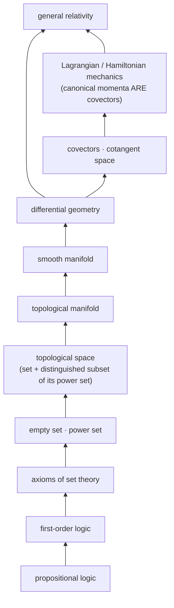

# Ground-up ordering — the theoretical track's method (Schuller)

> **Aaron, 2026-08-13:** *"This learning from the ground up should be saved in our craft school in
> this repo, this order is pretty good, i learned these out of order and it was harder."*

Source: Frederic Schuller, in conversation (2026-08-13 ferry,
`docs/research/ip-questionable/2026-08-13-frederic-schuller-toe-constructive-gravity-*`). Schuller
built the *Geometric Anatomy of Theoretical Physics* course from nothing — a differential-geometry
course whose first lecture is **propositional logic** — and won the Ars Legendi prize, Germany's top
university teaching award, substantially for it.

This document is **method, not subject matter**. It says how to order a theoretical-track module, not
what to put in one.

## Where this fits in Craft (the honest tension)

Craft's stated default is **tool-use first** — *"you don't need to build a hammer to use a hammer"* —
with the theoretical track explicitly opt-in. Ground-up ordering is the opposite instinct, and it
would be wrong to quietly file it as though there were no conflict.

There is no conflict, because **Schuller draws the same split himself**:

> "if some biology student has a physics course that can be excellently taught without much ado, but
> if you say you want to educate the next generation of theoretical physics and maybe you hope that
> some of them might make groundbreaking discoveries — we better give them our best."

So: **applied track keeps tool-use-first. This is the discipline the theoretical track was missing.**
Craft already had the two-track structure and a justification for it; what it did not have was a
worked method for the opt-in side. That is what this is.

## The two assumptions

Schuller's stated teaching axioms, which he grants are both slightly false and uses anyway:

> "A — students, no matter whoever comes to you, beginners, masters, Master students, they know
> nothing, nothing at all. And second, they're infinitely intelligent."

**This is exactly the correct posture for writing to a cold-starting agent**, which is why it belongs
in this repo rather than only in a lecture hall. An agent waking into a fresh context genuinely knows
nothing — no accumulated session, no assumed prior — and is genuinely very capable. Documentation
written for "knows nothing + highly capable" is precisely what
[`docs/SEED-VOCABULARY.md`](../../SEED-VOCABULARY.md) is doing when it works. Documentation that
assumes a shared prior is documentation that fails on wake.

His reason for the assumptions is the useful part: *"I don't know what they know and I don't know in
which way they know it."* The second clause carries the weight. Two readers can both "know" a term and
hold incompatible pictures of it; starting from scratch is cheaper than diagnosing which picture each
one has.

## Advanced ≠ later-learned — the ordering claim

The load-bearing insight, and the one that answers Aaron's *"I learned these out of order and it was
harder"*:

> "very often you change the order in which you teach subjects. What you think is an advanced subject
> is typically something you learned later. And a less advanced subject is one you yourself learned
> earlier. But that's not a particularly meaningful classification of advanced and not advanced."

**A curriculum ordered by "advanced-ness" is ordered by the author's autobiography, not by the
subject's dependency structure.** Those coincide only by luck. The fix is to order by what genuinely
depends on what — which is a *structural* question with a right answer, unlike "how hard did this feel
to me."

Worked example, his: teaching classical mechanics by spending half the semester on differential
geometry first. Colleagues predicted bad pass rates; pass rates were normal to good. His
justification is not that differential geometry is impressive —

> "you should never do something because it looks fancy. 'Whoo, we did differential geometry.' No —
> I need to tell you what a covector is if I want to talk about momenta, because canonical momenta
> **are** covectors. They're not vectors. … But position is not a vector. And you can't get away from
> this structurally conceptually wrong idea unless you immediately put it in the setting of a
> manifold."

The prerequisite is not decoration; teaching momenta before covectors installs a wrong idea that later
work has to fight. **Cost of correct order is paid once; cost of wrong order is paid at every
junction after.**

## The dependency chain he actually used

Each step exists because the next one is not statable without it:

```text
propositional logic
  -> first-order logic (he notes he stopped short of this)
    -> axioms of set theory
      -> the empty set, the power set
        -> topological space  (a set + a distinguished subset of its power set)
          -> topological manifold
            -> smooth manifold
              -> differential geometry
                -> mechanics / general relativity
```

The forcing move, in his words: *"if you do naive set theory, you have all kinds of contradictions in
two lines. If you say a set is a collection of elements — that sounds good, but that doesn't make any
sense. First of all, I didn't tell you what a collection is. Second, I didn't tell you what an
element is."*

Note this is a **dependency chain, not a difficulty ramp**. Propositional logic is not "easier" than
manifolds; it is *upstream* of them.

He is also explicit that the regress does not bottom out — *"it's very difficult to find a really
foundational beginning from nothing"* — so the goal is not foundations, it is **knowing where your
assumptions entered**: "why do you have the axiom of choice? Because at some point I required it."

## The graph itself

The chain above is a **directed dependency graph**, and it is worth holding as a graph rather than as
a list, because the two traversal orders below disagree about everything except this shape.



Edges are *"not statable without"*, not *"harder than"*. Propositional logic is not easier than a
manifold; it is **upstream** of it. That distinction is the whole content of the section above.

## Zeta's traversal is the dual: enter anywhere, descend on demand

> **Aaron, 2026-08-13:** *"his graph is from the ground up we should save that graph somewhere, zeta
> is jump in anywhere and learn from current level downwards and the AI should force learning for
> humans to maintain certain areas that need the understanding, his graph is like from first
> principles up."*

**Same graph, opposite traversal.** Schuller's is *eager and bottom-up*: compute the whole closure
before you start, then walk it in dependency order, so nothing is ever used before it is defined. That
is possible because a lecture course knows its destination in advance — the curriculum is a **static**
plan.

Zeta's is *demand-driven and top-down*: enter at whatever node the work actually put you at, and
descend an edge only when something you hit is not statable without it. The classic evaluation-strategy
names are exact here — **eager** vs **call-by-need**.

|   | Schuller (course) | Zeta (working) |
|---|---|---|
| Entry | the unique root | wherever the work landed you |
| Direction | upward, along dependency edges | **downward**, against them |
| Trigger | the syllabus | hitting something not statable without it |
| Knows destination? | yes, in advance | no — it depends where you are |
| Closure computed | fully, ahead of time | lazily, and usually never fully |

**And this is the `app`-free boundary again**, in the shape it keeps taking in this project. Schuller's
order is statically resolvable — the entire descent is computable before execution begins. Zeta's next
node depends on *where you actually are*, which is a runtime value. Eager-bottom-up sits in the
`app`-free fragment; jump-in-anywhere requires `app`. Both are legitimate; they have different costs,
and the cost of the lazy one is the next section.

## Where lazy descent is FORBIDDEN — the forced set

Demand-driven learning has a failure mode that eager learning does not: **you can defer forever.** A
node never demanded is never learned, and understanding you never needed is indistinguishable from
understanding you have lost — right up until the moment you need it to check something.

So the model needs one addition, which is Aaron's third clause: *"the AI should force learning for
humans to maintain certain areas that need the understanding."* There is a set of nodes where lazy is
not allowed and the descent must be **eager anyway**, because human oversight depends on it. If a
human's only access to a load-bearing claim is "the AI said so", the review is ceremonial — and
[`no-directives`](../../../.claude/rules/no-directives.md) names *because I said so* as the one sin.
An AI that lets human understanding silently lapse in a load-bearing area has manufactured that sin on
the human's behalf.

**The obvious objection, stated before someone else states it:** an AI deciding what humans must learn
is paternalism, and paternalism is a worse failure than ignorance. The guard is structural, and this
repo already has it —
[`privacy-budget-is-hard-money`](../../../.claude/rules/privacy-budget-is-hard-money-earned-by-others.md)
splits mind-parts into **required-for-role** and **personal**: hold a hat and you broadcast what the
hat needs; everything else is inviolable. Apply the identical split here:

- **The requirement attaches to the HAT, never to the person.** A role declares the nodes whose
  understanding it requires. Want the role → maintain those. Decline → the role is simply not held,
  at no cost to standing.
- **The AI declares and refuses to paper over; it does not compel.** It may say *this claim rests on
  something you have not descended to, so I will not let the review record as informed.* It may not
  say *you must learn this.* Declaring a gap is honest reporting; compelling a person is not the
  AI's to do.
- **Role-conditional makes it non-coercive**, exactly as role-conditional transparency makes mandatory
  broadcast non-coercive. This is the same mechanism, applied to knowledge rather than to visibility.

### The test: who is the last line of correction?

The question of *which* nodes are forced was filed open for about ten minutes, and Aaron answered it
with a better test than the one proposed:

> **Aaron, 2026-08-13:** *"if the human needs to correct the AI when other model AIs are not available
> for correction or no AI model has the expertise then the human working on that area needs the
> expertise."*

**A node is forced iff the human is the last line of correction for it.** Two ways that happens:

1. **No other model is available** — offline, air-gapped, cost-bounded, or simply not reachable at the
   moment the check is needed.
2. **No model has the expertise** — the area is novel enough that no available model can competently
   disagree with the one doing the work.

The superseded test asked whether a wrong result could slip past a reader. This one asks something
sharper and checkable: **is there anyone else who could catch it?** It is a property of the correction
*topology*, not of the material's difficulty.

**This makes the requirement derived rather than decreed, which dissolves the paternalism objection
more cleanly than the role split does.** Nobody decides that a human must learn something. It falls out
of a quorum condition: correction requires at least one competent independent checker, and where the
model pool supplies none, the human *is* the pool. The AI is not imposing a curriculum; it is reporting
the shape of the redundancy graph.

It is also **dynamic in both directions**. A node leaves the forced set when models acquire the
expertise, or when a second opinion becomes reachable. A node enters it when you go off-grid, when the
budget closes, or when the work moves somewhere no model has been. The forced set is not a fixed
syllabus — it is a live function of what else can check you.

This is the mirror of the standing conduct guard *be **a** −1, not **the** −1*: an AI that is the sole
understander of a load-bearing area is a single point of failure. Symmetrically, a human who is the
sole *corrector* of an area must actually be able to correct — otherwise the position is nominal and
the oversight is theatre.

### The uncomfortable consequence, stated rather than buried

Combine the two clauses and the forced set is **exactly the frontier**. Areas where no available model
has the expertise are, by construction, the novel ones — which is precisely where this project spends
its time. So the demand-driven strategy (*descend only when you hit something*) and the correction test
(*you cannot defer where you are the only checker*) pull in opposite directions, and they pull hardest
in the same place.

There is no clever resolution. **Frontier work carries a learning tax, and the tax is heaviest where
the work is most novel.** What the model can honestly do is make the bill visible — say *this claim
sits in an area where I am the only one who has looked, so my being wrong here would not be caught* —
rather than let a confident tone stand in for a second opinion that does not exist.

Worked instance from the day this was written: a confident claim about the Mars/Earth simulation was
caught only because a *second* model was dispatched specifically to refute it, and it did. Had that
model been unavailable, the claim would have shipped, and the only remaining corrector would have been
the human — on material where the relevant expertise is Kepler mechanics and hyperbolicity. That is the
forced set, demonstrated rather than theorised.

## Conceptual rigor precedes symbolic rigor

> "rigor in mathematics is of course extremely important. But for me the best rigor is the conceptual
> rigor. … Of course you can write down things with epsilons and deltas and make it very rigorous.
> Before that, you need to be conceptually rigorous."

A precise formalisation of a vague concept is precision about the wrong thing. Get the concept right
first; then the symbols have something to be precise *about*.

## The "equal footing" catalog — the sharpest transferable tool

Schuller keeps a running catalog of **phrases that stand in for explanations**:

> "'All possible paths' seems to be echoed due to doctrinal inheritance without thinking. Just like
> the word 'equal footing.' Time and space are treated on equal footing… What is equal footing? Have
> you seen a mathematical definition of equal footing? We're supposed to be rigorous."

And the test for whether a given use is legitimate:

> "they're of course placeholders for a better explanation. Sometimes you have a much better
> explanation. … If pushed, [you] would give a brilliant explanation — then you're allowed to use this
> short term. **But if it's just used to gloss over your own ignorance, consciously or unconsciously,
> one should eliminate it.** But we all do this."

**This is the repo's own discipline arriving from outside.** It is
[`no-directives`](../../../.claude/rules/no-directives.md)'s *"the only sin is because I said so"*
applied to vocabulary; it is the Beacon rule's *"an unanchored coinage is a debt until its anchor is
named"*; it is the Mirror→Beacon compression test. A shorthand you can expand on demand is Mirror
shorthand and it is fine. A shorthand you cannot expand is a debt wearing a technical accent.

**Practical instruction for Craft authors:** keep the catalog. When you write a phrase to justify
rather than to explain, either expand it or cut it. Candidate house phrases worth auditing under this
test: *"scale-free"*, *"weight-free"*, *"the fold"*, *"solid ground"*, *"lightlike"*. Each of those
has a real expansion — which is exactly the point: the test is passable, so failing it is a choice.

## Design from a blank room

> "instead of starting with a textbook, you'll go into a blank room with blank paper and think, how
> can I teach this subject?"

He takes the summer break and sketches a storyline *"as today one would have to present it in order to
get it accepted in a very good journal — if this was a discovery."* Research-grade thinking applied to
the **redesign** of an established course. Inheriting a textbook's order inherits the accidents of its
author's own learning path (see *advanced ≠ later-learned* above).

## The methodological coda, which cost us a paragraph today

Two of his remarks are the register discipline stated plainly:

> "ideas are cheap, very easy to have — and get rid of ideas if they don't seem to work out. Or put
> them to the side. And try to have some standards of how you push ideas forward."

> "you can't just push an idea. **You need to react to what the theory reports back to you** if you
> try to modify it like that."

Both were vindicated within hours of being ferried. A confident claim in that same ferry — that the
Mars/Earth simulation was where the physics stopped being a metaphor — was put to adversarial review
and refuted the same day; the claim is struck in the document with the refutation recorded beside it.
The theory reported back. That is the standard this file is asking Craft authors to hold.

He also declines to universalise any of it — *"every researcher should have his own set of rules,
because otherwise we're all doing the same. That's not good. Variability is good"* — which is the
Multi-Oracle Principle in a teaching register, and is why this is filed as **a** method rather than
**the** method.

## Pointers

- [`docs/craft/README.md`](../README.md) — the two-track split this refines (applied default,
  theoretical opt-in)
- [`docs/SEED-VOCABULARY.md`](../../SEED-VOCABULARY.md) — the cold-boot kernel; the "knows nothing +
  infinitely intelligent" assumption is what makes it work
- [`.claude/rules/anchor-to-human-prior-art.md`](../../../.claude/rules/anchor-to-human-prior-art.md) —
  the Beacon rule the "equal footing" catalog independently reinvents
- [`.claude/rules/mirror-beacon-register-discipline.md`](../../../.claude/rules/mirror-beacon-register-discipline.md)
  — expandable shorthand (Mirror) vs. shorthand standing in for absent explanation
- Schuller's lecture series: *Gravity and Light* (2015), *Geometric Anatomy of Theoretical Physics*
  (Erlangen) — both public
