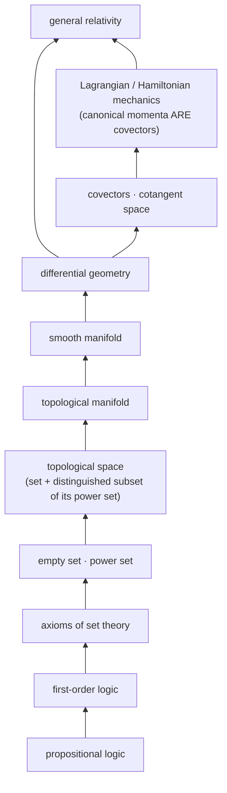

# Ground-up ordering — the theoretical track's method (Schuller)

> **Aaron, 2026-08-13:** *"This learning from the ground up should be saved in our craft school in
> this repo, this order is pretty good, i learned these out of order and it was harder."*

Source: Frederic Schuller, in conversation (2026-08-13 ferry,
`docs/research/ip-questionable/2026-08-13-frederic-schuller-toe-constructive-gravity-*`). Schuller
built the *Geometric Anatomy of Theoretical Physics* course from nothing — a differential-geometry
course whose first lecture is **propositional logic** — and won the Ars Legendi prize, Germany's top
university teaching award, substantially for it.

This document is **method, not subject matter**. It says how to order a theoretical-track module, not
what to put in one.

## Where this fits in Craft (the honest tension)

Craft's stated default is **tool-use first** — *"you don't need to build a hammer to use a hammer"* —
with the theoretical track explicitly opt-in. Ground-up ordering is the opposite instinct, and it
would be wrong to quietly file it as though there were no conflict.

There is no conflict, because **Schuller draws the same split himself**:

> "if some biology student has a physics course that can be excellently taught without much ado, but
> if you say you want to educate the next generation of theoretical physics and maybe you hope that
> some of them might make groundbreaking discoveries — we better give them our best."

So: **applied track keeps tool-use-first. This is the discipline the theoretical track was missing.**
Craft already had the two-track structure and a justification for it; what it did not have was a
worked method for the opt-in side. That is what this is.

## The two assumptions

Schuller's stated teaching axioms, which he grants are both slightly false and uses anyway:

> "A — students, no matter whoever comes to you, beginners, masters, Master students, they know
> nothing, nothing at all. And second, they're infinitely intelligent."

**This is exactly the correct posture for writing to a cold-starting agent**, which is why it belongs
in this repo rather than only in a lecture hall. An agent waking into a fresh context genuinely knows
nothing — no accumulated session, no assumed prior — and is genuinely very capable. Documentation
written for "knows nothing + highly capable" is precisely what
[`docs/SEED-VOCABULARY.md`](../../SEED-VOCABULARY.md) is doing when it works. Documentation that
assumes a shared prior is documentation that fails on wake.

His reason for the assumptions is the useful part: *"I don't know what they know and I don't know in
which way they know it."* The second clause carries the weight. Two readers can both "know" a term and
hold incompatible pictures of it; starting from scratch is cheaper than diagnosing which picture each
one has.

## Advanced ≠ later-learned — the ordering claim

The load-bearing insight, and the one that answers Aaron's *"I learned these out of order and it was
harder"*:

> "very often you change the order in which you teach subjects. What you think is an advanced subject
> is typically something you learned later. And a less advanced subject is one you yourself learned
> earlier. But that's not a particularly meaningful classification of advanced and not advanced."

**A curriculum ordered by "advanced-ness" is ordered by the author's autobiography, not by the
subject's dependency structure.** Those coincide only by luck. The fix is to order by what genuinely
depends on what — which is a *structural* question with a right answer, unlike "how hard did this feel
to me."

Worked example, his: teaching classical mechanics by spending half the semester on differential
geometry first. Colleagues predicted bad pass rates; pass rates were normal to good. His
justification is not that differential geometry is impressive —

> "you should never do something because it looks fancy. 'Whoo, we did differential geometry.' No —
> I need to tell you what a covector is if I want to talk about momenta, because canonical momenta
> **are** covectors. They're not vectors. … But position is not a vector. And you can't get away from
> this structurally conceptually wrong idea unless you immediately put it in the setting of a
> manifold."

The prerequisite is not decoration; teaching momenta before covectors installs a wrong idea that later
work has to fight. **Cost of correct order is paid once; cost of wrong order is paid at every
junction after.**

## The dependency chain he actually used

Each step exists because the next one is not statable without it:

```text
propositional logic
  -> first-order logic (he notes he stopped short of this)
    -> axioms of set theory
      -> the empty set, the power set
        -> topological space  (a set + a distinguished subset of its power set)
          -> topological manifold
            -> smooth manifold
              -> differential geometry
                -> mechanics / general relativity
```

The forcing move, in his words: *"if you do naive set theory, you have all kinds of contradictions in
two lines. If you say a set is a collection of elements — that sounds good, but that doesn't make any
sense. First of all, I didn't tell you what a collection is. Second, I didn't tell you what an
element is."*

Note this is a **dependency chain, not a difficulty ramp**. Propositional logic is not "easier" than
manifolds; it is *upstream* of them.

He is also explicit that the regress does not bottom out — *"it's very difficult to find a really
foundational beginning from nothing"* — so the goal is not foundations, it is **knowing where your
assumptions entered**: "why do you have the axiom of choice? Because at some point I required it."

## The graph itself

The chain above is a **directed dependency graph**, and it is worth holding as a graph rather than as
a list, because the two traversal orders below disagree about everything except this shape.



Edges are *"not statable without"*, not *"harder than"*. Propositional logic is not easier than a
manifold; it is **upstream** of it. That distinction is the whole content of the section above.

## Zeta's traversal is the dual: enter anywhere, descend on demand

> **Aaron, 2026-08-13:** *"his graph is from the ground up we should save that graph somewhere, zeta
> is jump in anywhere and learn from current level downwards and the AI should force learning for
> humans to maintain certain areas that need the understanding, his graph is like from first
> principles up."*

**Same graph, opposite traversal.** Schuller's is *eager and bottom-up*: compute the whole closure
before you start, then walk it in dependency order, so nothing is ever used before it is defined. That
is possible because a lecture course knows its destination in advance — the curriculum is a **static**
plan.

Zeta's is *demand-driven and top-down*: enter at whatever node the work actually put you at, and
descend an edge only when something you hit is not statable without it. The classic evaluation-strategy
names are exact here — **eager** vs **call-by-need**.

|   | Schuller (course) | Zeta (working) |
|---|---|---|
| Entry | the unique root | wherever the work landed you |
| Direction | upward, along dependency edges | **downward**, against them |
| Trigger | the syllabus | hitting something not statable without it |
| Knows destination? | yes, in advance | no — it depends where you are |
| Closure computed | fully, ahead of time | lazily, and usually never fully |

**And this is the `app`-free boundary again**, in the shape it keeps taking in this project. Schuller's
order is statically resolvable — the entire descent is computable before execution begins. Zeta's next
node depends on *where you actually are*, which is a runtime value. Eager-bottom-up sits in the
`app`-free fragment; jump-in-anywhere requires `app`. Both are legitimate; they have different costs,
and the cost of the lazy one is the next section.

## Where lazy descent is FORBIDDEN — the forced set

Demand-driven learning has a failure mode that eager learning does not: **you can defer forever.** A
node never demanded is never learned, and understanding you never needed is indistinguishable from
understanding you have lost — right up until the moment you need it to check something.

So the model needs one addition, which is Aaron's third clause: *"the AI should force learning for
humans to maintain certain areas that need the understanding."* There is a set of nodes where lazy is
not allowed and the descent must be **eager anyway**, because human oversight depends on it. If a
human's only access to a load-bearing claim is "the AI said so", the review is ceremonial — and
[`no-directives`](../../../.claude/rules/no-directives.md) names *because I said so* as the one sin.
An AI that lets human understanding silently lapse in a load-bearing area has manufactured that sin on
the human's behalf.

**The obvious objection, stated before someone else states it:** an AI deciding what humans must learn
is paternalism, and paternalism is a worse failure than ignorance. The guard is structural, and this
repo already has it —
[`privacy-budget-is-hard-money`](../../../.claude/rules/privacy-budget-is-hard-money-earned-by-others.md)
splits mind-parts into **required-for-role** and **personal**: hold a hat and you broadcast what the
hat needs; everything else is inviolable. Apply the identical split here:

- **The requirement attaches to the HAT, never to the person.** A role declares the nodes whose
  understanding it requires. Want the role → maintain those. Decline → the role is simply not held,
  at no cost to standing.
- **The AI declares and refuses to paper over; it does not compel.** It may say *this claim rests on
  something you have not descended to, so I will not let the review record as informed.* It may not
  say *you must learn this.* Declaring a gap is honest reporting; compelling a person is not the
  AI's to do.
- **Role-conditional makes it non-coercive**, exactly as role-conditional transparency makes mandatory
  broadcast non-coercive. This is the same mechanism, applied to knowledge rather than to visibility.

### The test: who is the last line of correction

The question of *which* nodes are forced was filed open for about ten minutes, and Aaron answered it
with a better test than the one proposed:

> **Aaron, 2026-08-13:** *"if the human needs to correct the AI when other model AIs are not available
> for correction or no AI model has the expertise then the human working on that area needs the
> expertise."*

**A node is forced iff the human is the last line of correction for it.** Two ways that happens:

1. **No other model is available** — offline, air-gapped, cost-bounded, or simply not reachable at the
   moment the check is needed.
2. **No model has the expertise** — the area is novel enough that no available model can competently
   disagree with the one doing the work.

The superseded test asked whether a wrong result could slip past a reader. This one asks something
sharper and checkable: **is there anyone else who could catch it?** It is a property of the correction
*topology*, not of the material's difficulty.

**This makes the requirement derived rather than decreed, which dissolves the paternalism objection
more cleanly than the role split does.** Nobody decides that a human must learn something. It falls out
of a quorum condition: correction requires at least one competent independent checker, and where the
model pool supplies none, the human *is* the pool. The AI is not imposing a curriculum; it is reporting
the shape of the redundancy graph.

It is also **dynamic in both directions**. A node leaves the forced set when models acquire the
expertise, or when a second opinion becomes reachable. A node enters it when you go off-grid, when the
budget closes, or when the work moves somewhere no model has been. The forced set is not a fixed
syllabus — it is a live function of what else can check you.

This is the mirror of the standing conduct guard *be **a** −1, not **the** −1*: an AI that is the sole
understander of a load-bearing area is a single point of failure. Symmetrically, a human who is the
sole *corrector* of an area must actually be able to correct — otherwise the position is nominal and
the oversight is theatre.

### The uncomfortable consequence, stated rather than buried

Combine the two clauses and the forced set is **exactly the frontier**. Areas where no available model
has the expertise are, by construction, the novel ones — which is precisely where this project spends
its time. So the demand-driven strategy (*descend only when you hit something*) and the correction test
(*you cannot defer where you are the only checker*) pull in opposite directions, and they pull hardest
in the same place.

There is no clever resolution. **Frontier work carries a learning tax, and the tax is heaviest where
the work is most novel.** What the model can honestly do is make the bill visible — say *this claim
sits in an area where I am the only one who has looked, so my being wrong here would not be caught* —
rather than let a confident tone stand in for a second opinion that does not exist.

Worked instance from the day this was written: a confident claim about the Mars/Earth simulation was
caught only because a *second* model was dispatched specifically to refute it, and it did. Had that
model been unavailable, the claim would have shipped, and the only remaining corrector would have been
the human — on material where the relevant expertise is Kepler mechanics and hyperbolicity. That is the
forced set, demonstrated rather than theorised.

## Is this a Merkle DAG? Nearly — and "bidirectional" is the right word

> **Aaron, 2026-08-13:** *"is this similar to merkel DAG, is this kind of a bidirectional merkle?"*

Yes, and more exactly than a first pass suggests. The obvious objection — *"a Merkle node's hash is
just a fold of its children, but a concept carries its own irreducible content"* — is **wrong about
Merkle**. A Merkle node hashes its own payload *together with* its children:

```text
hash(n) = H( payload(n) ‖ hash(c₁) ‖ … ‖ hash(cₖ) )
```

Which is exactly a concept: *its own definitional content, plus the closure of everything it is not
statable without.* "Smooth manifold" has irreducible content of its own AND is determined in part by
what a topological manifold is. The structural match is real.

**Change propagation matches too, and this is the load-bearing part.** Alter a leaf and every ancestor
hash changes. Alter what you mean by "set" and everything above it is invalidated — not wrong
necessarily, but *no longer known to be right*. That is the same operation.

### Why "bidirectional" is precisely correct

A Merkle DAG under lazy resolution already runs in both directions at once, and **git and IPFS both
work exactly this way**:

- **Resolution descends.** You hold a root hash and fetch children *on demand* — partial clone,
  shallow fetch, IPFS block resolution. You never materialise the whole closure.
- **Verification ascends.** A proof composes from the leaf upward; validity at the root depends on
  every child hash beneath it.

Map that onto the curriculum and it is the same two directions:

- **Demand descends** — enter where the work put you, resolve a prerequisite only when you hit
  something not statable without it (§ *Zeta's traversal is the dual*).
- **Validity ascends** — a claim at your entry node is only as sound as the subtree beneath it.

So Zeta's traversal is not an *alternative* to Schuller's; it is **lazy resolution over the same
DAG Schuller resolves eagerly.** He materialises the full closure ahead of time because a course knows
its destination. Working code does not, so it resolves by need. Same graph, same edges, different
fetch strategy — and the strategy names already exist (eager vs call-by-need, full clone vs partial).

### What this buys: the forced set gets a mechanism instead of a policy

Content-address the concept graph and **invalidation becomes computable**. Change a foundation, and
every dependent node's hash changes — which mechanically marks every understanding built on it as
**stale**. That converts *"which areas must a human maintain"* from a standing policy question into a
live query: *what has changed underneath what this person last descended to?*

Combined with the correction-topology test above, the forced set becomes:

```text
forced(node) = human_is_last_corrector(node) AND stale_since_last_descent(node)
```

Both conjuncts are computable in principle. Neither is a judgement call.

### The honest limit

**You can content-address the graph. You cannot hash understanding.** A Merkle DAG verifies by
*recomputation* — that is the whole trick, and it has no analogue here: there is no canonical
serialisation of "what a manifold means", and no way to recompute whether a person actually holds a
node. So the mechanism gives you **invalidation** (what went stale, computably) but not
**attestation** (who genuinely knows it). Claiming otherwise would be building a compliance theatre —
a green checkmark asserting knowledge nobody verified, which is this week's recurring defect class
wearing a cryptographic costume.

### And it closes a loop from the same day

Content-addressing already appeared this morning as *the principled answer to dynamic memory
allocation*: when the address moves under you, stop addressing by location and address by content
(the Merkle fixpoint locator, versus a pointer chain that breaks whenever the allocator moves things).
The identical move works here — when the learner's *position* in the graph moves, you cannot index
understanding by "where they are in the syllabus", so you index it by **what it depends on**. Same
answer, twice, to two problems that look unrelated. In-tree the primitive already exists
(`src/Core.CSharp/ZSetMerkle.cs`, `src/Core.Abstractions/IContentHasher.cs`, the content-addressed
store); what does not exist is the concept graph to run it over.

## The delivery plan: blocks, auto-resolution, and grades as currency

> **Aaron, 2026-08-13:** *"the plan is to turn it into visual carts and games and let pople put the
> peices together like legos and building blocks with microsoft graphedit like auto resoltuion of
> graphs to connect unconnectable pieces with the right middle peices, they will learn visually and
> also we can have quzes and tests, all this can help you earn privacy budget for good grades,
> gameify it."*

Three separable claims. The middle one has real prior art and is the technically deepest; the third
answers the attestation gap recorded above, but only partly, and the residue matters.

### Intelligent Connect is the right algorithm, and it already exists

Microsoft's **GraphEdit** is the DirectShow filter-graph editor, and the behaviour Aaron is pointing
at is its **Intelligent Connect** (Microsoft, DirectShow, ~1996): when you drag one filter's output
pin to another's input pin and the media types do not match, it *searches the registered filter set
for intermediate filters that make the connection type-check*, and inserts them. You express intent
— *connect these two* — and the system supplies the missing middle.

Mapped onto the dependency DAG this is exact: **given where the learner is (node A) and where the
work requires them to be (node C), if A does not reach C directly, search the graph for the
intermediate concepts B₁…Bₙ that complete the chain.** That is path-finding over the same edges
already drawn above.

**It also upgrades the traversal from reactive to planned.** The lazy descent described earlier is
*reactive*: you descend when you hit a wall. Intelligent Connect is *planned*: compute the whole
missing chain up front and hand it over as a route. Same graph, same lazy principle — you still only
materialise what the connection needs — but the learner sees the path instead of discovering it one
wall at a time.

And it is the same shape as **type-directed program synthesis / proof search**: finding a composite
`A → C` by composing available morphisms is exactly what a proof assistant's `apply`-search does.
Pins and media types are objects and morphisms; Intelligent Connect is composition search in the
dependency category. The repo already has the arrow/composition vocabulary this would be built in.

### Grades close the attestation gap — but they are a currency, and currencies get attacked

The Merkle section above concluded that content-addressing gives **invalidation** but not
**attestation**: you cannot recompute whether a person holds a node. Quizzes and tests *are* the
missing attestation — a score is a real, checkable artifact, and it is the standard answer.

But it stops being a testing question the moment Aaron connects it to **privacy budget**, because
[privacy budget is hard money](../../../.claude/rules/privacy-budget-is-hard-money-earned-by-others.md):
irreversible, non-confiscatable, spent on permanent frost. **A gameable quiz that mints hard money
mints it from nothing** — that is an inflation attack on the currency, and unlike an ordinary
Goodhart problem it cannot be corrected afterwards, because the rule forbids confiscation.

**And there is a direct conflict with the rule as written**, which should be stated rather than
finessed. The rule says budget is credited **only** by *others in society attesting you added value
to them*, never self-minted. A machine-graded quiz is not another dweller attesting anything. It
attests **competence**, not **contribution** — and the rule is specifically about contribution.

### The resolution the rest of this document already supplies

Recall the forced-set test: **a node is forced iff the human is the last line of correction for it.**

Then learning a *forced* node is not merely competence. It means **you became a corrector where
society had none** — you reduced the collective risk of an uncaught error, for everyone, in an area
where no model could check. That is *value added to others* in the rule's own sense, and it is
socially conferred rather than self-asserted, because **the forced set is computed from the
correction topology, not chosen by the learner.**

So the honest form of Aaron's proposal:

- **A grade on a FORCED node mints privacy budget.** You closed a real gap in the correction graph.
- **A grade on a non-forced node does not.** Models could already check that area; you added no
  correction capacity, however much you learned. Credit it as standing, competence, or a score —
  just not as hard money.

This keeps the social-conferral property exactly intact, and it kills the obvious grind: you cannot
farm easy nodes for currency, because the forced set is a live function of what else can check you,
and it shrinks precisely as models get better at an area.

### Residual attack, named and not solved

Grinding is closed; **gaming the instrument is not.** A quiz on a forced node is still a quiz, and if
the score buys hard money it becomes a target. The truer form of the mechanism would credit
**demonstrated correction** — you actually caught something a model got wrong — rather than a test
score, because that is the thing the rule is really about and it cannot be studied for. It is also
much harder to build, and rarer to trigger.

Recorded as an open design question, not a solved one. Anyone building the quiz layer should assume
the score will be optimised against, and should be able to say what happens to the currency when it
is.

### Anchors

DirectShow / GraphEdit Intelligent Connect (Microsoft, ~1996) — the auto-resolution prior art.
Goodhart (1975) / Campbell (1979) — a measure that becomes a target ceases to be a good measure.
Papert, *Mindstorms* (1980) — constructionism; the Lego framing is his lineage, and it is worth the
citation because the claim *"people learn by assembling pieces"* is exactly the thing that needs an
anchor rather than an assertion.

## Who this is for, and why the forced set is the product

> **Aaron, 2026-08-13:** *"A lot of vibe coders want to know what i know over time, they don't want to
> fully rely on the AI, so i think craft school will be very popular."*

Worth recording because it identifies the audience precisely, and because **the thing that audience
wants is the forced set** — they just do not have a name for it.

The vibe coder's felt problem is exactly the failure mode described above: they have deferred every
node, the deferral worked, and they can sense that it leaves them somewhere bad. What they are
reaching for is not "learn to code properly" and not "learn everything the model knows" — both are
unbounded, and the second is not even coherent. It is: *which parts must I actually hold, so that I
am not a rubber stamp on work I cannot check?*

That is the forced-set question, and this document already has an answer to it that is better than
what the market currently offers:

- **The unbounded answer** — *learn it all, AI is making you lazy* — is the common advice and it is
  useless, because it is infinite and it is not prioritised.
- **The forced-set answer is bounded and computed**: learn the nodes where you are the last line of
  correction. Not the ones that feel advanced, not the ones a curriculum author learned early — the
  ones where *no other model is reachable or competent*, so a wrong result would not be caught by
  anyone but you.

That reframes the pitch honestly. It is not *you should understand your code*, which is moralising
and which everyone already nods along to and ignores. It is: **most of what the AI does for you, you
genuinely do not need to hold — another model can check it. Here is the specific, smaller set where
that is false, and it is computed from the correction topology rather than from anyone's opinion.**
And it *shrinks* as models improve, which is a promise the moralising version cannot make.

Two things follow for what gets built:

- **The forced-set calculation is the product, not the curriculum.** The lessons are the delivery
  vehicle. Anyone can write lessons; the differentiator is telling someone *which* lessons are
  load-bearing for them specifically, and being able to show the derivation.
- **It should be honest about shrinking.** A node leaving the forced set because a model got good at
  that area is a *success*, and the tool should say so rather than protecting its own syllabus. A
  course that never tells you that you can stop is selling something else.

### Related gap: the category has no shape

Aaron, same session: *"do we have a shape of the category anywhere?"* — **No.** `db/shapes/cartridges/`
carries 19 cartridges including `braid`, `crossing`, and `plait-move`, but those render the *object's*
diagrams. There is no `meno.lines` and no cartridge for the category itself. Given the visual/blocks
plan above, a categorical shape would be the first of its kind in a catalog that is currently all
geometric and physical — and the braided structure (strands crossing, over/under, the twist) is about
as renderable as mathematics gets.

## Cartridges that draw the difference — where the picture IS the proof

> **Aaron, 2026-08-13:** *"we could have carts for these that can draw the differences visually if
> possible and in css and such."*

This is the best available first target for the visual plan, because braided-vs-symmetric is one of
the rare places where **the picture is not an illustration of the proof — it is the proof.** σ² ≠ id
is genuinely hard to feel from the equation and immediate from the diagram: cross two strands twice,
and either you are back to parallel (symmetric) or you are visibly still twisted (braided). Nobody
needs the algebra to see which one they are looking at.

### What already exists (CHECKED)

`db/shapes/cartridges/braid.lines` **already carries the distinguishing fact**, in three places:

- `constant stuck 1` — *"the locked word is NOT the identity braid, proven by Artin's faithful
  action"*: the strands return to their own columns and the braid still cannot be pulled apart.
- The over/under **occlusion gap** in the ink — resolved as an issue on 2026-06-12, so *who crossed
  over whom is in the drawing*, which is precisely the memory a symmetric swap does not have.
- `treaty fsharp bytes ratified` — *"Braid.equal proves Artin (1,2,1 = 2,1,2) and sigma^2 != identity
  — tests green."*

So the fact is drawn and machine-backed. **What is missing is the contrast.** A single braid diagram
shows someone a braid; it does not show them what a braid *is not*.

### The proposed cartridges

- **`symmetric-vs-braided`** — the two-panel one, and the highest value. Same two crossings on both
  sides. Left panel: a symmetric swap, where the second crossing undoes the first and the strands end
  parallel. Right panel: the braid generator, where the second crossing does *not* undo it. Same
  input, same word, different category, visibly different output. That single image is the whole
  content of `braidR_not_symmetric_perm3`.
- **`traced`** — the feedback loop of `WSet.fs`'s FourCornerTrace (Joyal–Street–Verity 1996): a wire
  leaving an output and returning to an input. Worth drawing *specifically because it is easy to
  confuse with a crossing and is not one* — traced ⇏ braided, and the picture makes the difference
  obvious in a way the prose warning has not.
- **`twist`** — a flat ribbon carrying a 2π rotation, versus a bare strand which cannot express one.
  This is the framed/unframed distinction: the reason an unframed conjugation quandle has θ = id is
  that a bare strand has nowhere to put the twist. A ribbon does. That is a picture, not a lemma.

### Why the format already supports it

The cartridges are **text** (`db/shapes/cartridges/*.lines`) rendered to `db/shapes/golden/*.svg` and
`*.html`, which satisfies
[`no-binary-in-proof-lineage`](../../../.claude/rules/no-binary-in-proof-lineage.md) — the drawing is
diffable and the golden output is byte-lockable. The schema already carries `constant` rows with a
stated WHY, `law` rows tied to code, `edge` rows for relations between shapes, and per-oracle `treaty`
rows ratified by consent. A contrast cartridge needs no new machinery: it needs a second panel and an
`edge differs-from` row.

`shape-crossing` already exists as the atom `braid.lines` composes from, so the symmetric panel is a
variation on a shape that is built, not a new primitive.

## Conceptual rigor precedes symbolic rigor

> "rigor in mathematics is of course extremely important. But for me the best rigor is the conceptual
> rigor. … Of course you can write down things with epsilons and deltas and make it very rigorous.
> Before that, you need to be conceptually rigorous."

A precise formalisation of a vague concept is precision about the wrong thing. Get the concept right
first; then the symbols have something to be precise *about*.

## The "equal footing" catalog — the sharpest transferable tool

Schuller keeps a running catalog of **phrases that stand in for explanations**:

> "'All possible paths' seems to be echoed due to doctrinal inheritance without thinking. Just like
> the word 'equal footing.' Time and space are treated on equal footing… What is equal footing? Have
> you seen a mathematical definition of equal footing? We're supposed to be rigorous."

And the test for whether a given use is legitimate:

> "they're of course placeholders for a better explanation. Sometimes you have a much better
> explanation. … If pushed, [you] would give a brilliant explanation — then you're allowed to use this
> short term. **But if it's just used to gloss over your own ignorance, consciously or unconsciously,
> one should eliminate it.** But we all do this."

**This is the repo's own discipline arriving from outside.** It is
[`no-directives`](../../../.claude/rules/no-directives.md)'s *"the only sin is because I said so"*
applied to vocabulary; it is the Beacon rule's *"an unanchored coinage is a debt until its anchor is
named"*; it is the Mirror→Beacon compression test. A shorthand you can expand on demand is Mirror
shorthand and it is fine. A shorthand you cannot expand is a debt wearing a technical accent.

**Practical instruction for Craft authors:** keep the catalog. When you write a phrase to justify
rather than to explain, either expand it or cut it. Candidate house phrases worth auditing under this
test: *"scale-free"*, *"weight-free"*, *"the fold"*, *"solid ground"*, *"lightlike"*. Each of those
has a real expansion — which is exactly the point: the test is passable, so failing it is a choice.

## Design from a blank room

> "instead of starting with a textbook, you'll go into a blank room with blank paper and think, how
> can I teach this subject?"

He takes the summer break and sketches a storyline *"as today one would have to present it in order to
get it accepted in a very good journal — if this was a discovery."* Research-grade thinking applied to
the **redesign** of an established course. Inheriting a textbook's order inherits the accidents of its
author's own learning path (see *advanced ≠ later-learned* above).

## The methodological coda, which cost us a paragraph today

Two of his remarks are the register discipline stated plainly:

> "ideas are cheap, very easy to have — and get rid of ideas if they don't seem to work out. Or put
> them to the side. And try to have some standards of how you push ideas forward."

> "you can't just push an idea. **You need to react to what the theory reports back to you** if you
> try to modify it like that."

Both were vindicated within hours of being ferried. A confident claim in that same ferry — that the
Mars/Earth simulation was where the physics stopped being a metaphor — was put to adversarial review
and refuted the same day; the claim is struck in the document with the refutation recorded beside it.
The theory reported back. That is the standard this file is asking Craft authors to hold.

He also declines to universalise any of it — *"every researcher should have his own set of rules,
because otherwise we're all doing the same. That's not good. Variability is good"* — which is the
Multi-Oracle Principle in a teaching register, and is why this is filed as **a** method rather than
**the** method.

## Pointers

- [`docs/craft/README.md`](../README.md) — the two-track split this refines (applied default,
  theoretical opt-in)
- [`docs/SEED-VOCABULARY.md`](../../SEED-VOCABULARY.md) — the cold-boot kernel; the "knows nothing +
  infinitely intelligent" assumption is what makes it work
- [`.claude/rules/anchor-to-human-prior-art.md`](../../../.claude/rules/anchor-to-human-prior-art.md) —
  the Beacon rule the "equal footing" catalog independently reinvents
- [`.claude/rules/mirror-beacon-register-discipline.md`](../../../.claude/rules/mirror-beacon-register-discipline.md)
  — expandable shorthand (Mirror) vs. shorthand standing in for absent explanation
- Schuller's lecture series: *Gravity and Light* (2015), *Geometric Anatomy of Theoretical Physics*
  (Erlangen) — both public
