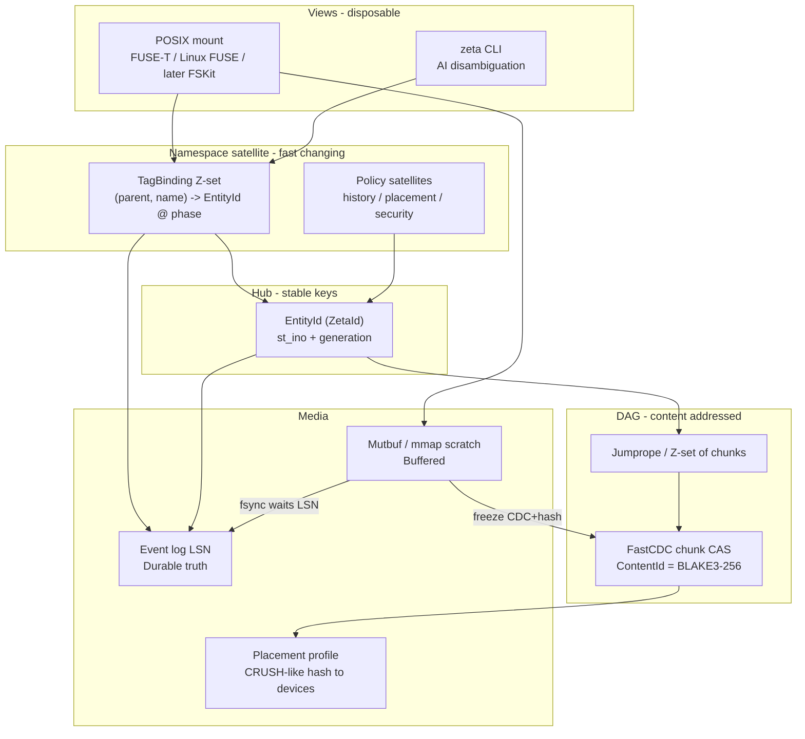
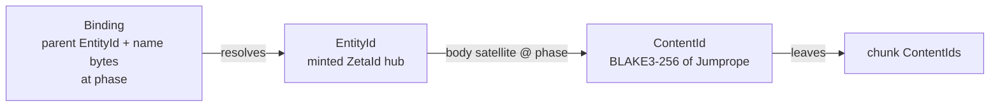
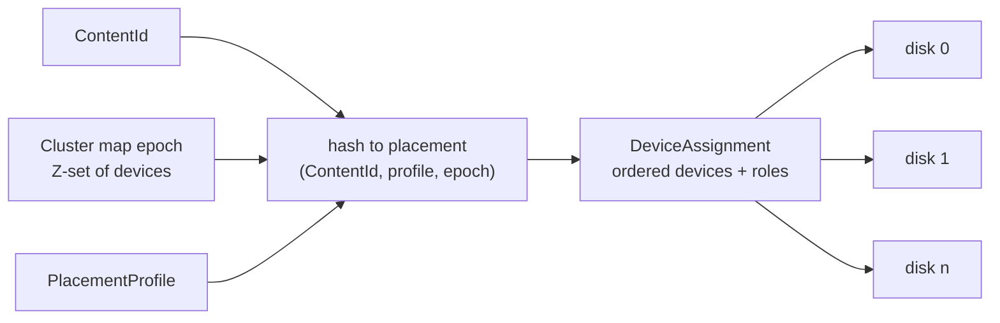

# ZetaFS as first product -- git/Venti-class content-addressed store, POSIX as a mount, history as a fold

**Author:** Ani (Grok Build) / design-doc-writer; human maintainer Aaron
**Date:** 2026-08-30
**Revised:** 2026-08-31 (composable closures; ZetaDB-first; Prime Agent / RLM placement; metering via existing harness start + dogfood, not a missing invention; unwrap oracles not TPM-on-Mac)
**Work item:** `081M1C59ZG4087G0R000VM8DZN`
**Status:** Draft, design spec. PR1 (FORMAT + `IFileSystem` door) is landing in-tree. Crash recovery remains `toy` until PR12.
**Register:** product design. Existing code cited below is a polyfill / algebra substrate, not this product.
**Extends (do not contradict):** [`docs/design/2026-08-27-zetafs-names-are-tags-multi-parented-files-and-symlink-native-presentation.md`](../../docs/design/2026-08-27-zetafs-names-are-tags-multi-parented-files-and-symlink-native-presentation.md)
**Settles:** retention and GC, which that document left unset in **section 6.3 / section 8.3** (cycle guard: section 6.2, specified here). Names-are-tags **section 7** is platform presentation (FUSE / FSKit / ProjFS, case-fold refuse) -- not the retention hole. **Also settles** the former Open Questions as **composable knobs** (C1-C10). C8 is the one exclusive ZetaId slot (`StoreEntity = 13`). C9 is **not** "pick TPM": unwrap oracles compose (passphrase, Keychain, Secure Enclave when a seal tier exists, TPM 2.0 on Linux if present, PKCS#11 HSMs of several manufacturers, live USB probe). R8's tpmSeal-vs-usbISerial XOR is the installer defect; this FS must not repeat it.
**Does not settle:** the public name (still gated: naming-expert + Ilyana + Aaron). Working label remains **ZetaFS**. Never abbreviate to `ZFS` (OpenZFS occupies it).
**Why this product exists:** ZetaFS is a **custom filesystem for ZetaDB**, not a general-purpose Finder disk. ROADMAP item 1 (no git CLI; dual Z-set folds over our own store) is the same product. POSIX is a mount so tools can see the DB; the DB does not live *on* POSIX.

> **Honesty peel (same register as the names-are-tags doc).** `ZSetMerkle` is landed. FastCDC is landed and byte-locked. `.zetafs` is an object log on a host filesystem. `DagFs` is an in-memory path map. The WebDAV experiment is read-only and in-memory. POSIX mount, Jumprope bodies, placement profiles, typed durability on the volume, concurrent reclaim, hardware-AEAD volume encryption, and crash recovery that is more than toy -- **designed here, not shipped.** `docs/ZETA-CORE-TECHNOLOGY-FOR-MAX.md` Phase 2 saying "the DAG-FS layer is already shipped" overclaims: what shipped is the algebra + a git-shaped polyfill, not a volume.

---

## Overview

Zeta's first product is **not** "ext4 but hashed" and **not** a daily APFS-on-one-SSD Finder replacement. It is a **git/Venti-class content-addressed store**: chunks addressed by BLAKE3-256, a Z-set of name bindings as the namespace (names are tags; the DAG does not know names exist), snapshots and clones as refs, a git polyfill first, a POSIX mount when a POSIX view is wanted, and a multi-device erasure-coded pool when there are many disks.

Durability truth is the **event log** (`ZetaFsDeltaLog` / DBSP), not the POSIX cache. `write()` mutates a scratch buffer and does not mint a new EntityId. Freeze (CDC + hash) produces a ContentId. `fsync` waits for an LSN. History is a **first-class per-entity policy** -- `keep-all | rolling | none | regen` -- implemented as DBSP window folds over bindings, keyed by **phase**, never wall-clock. Git's infinite history is the bloat this product exists to refuse.

Consumers of the first cut: **ZetaDB first**, then agent stores, emulator images, git-polyfill. Tooling tax is accepted for those. Steam, Photoshop, and "drop-in APFS" are not claims of this document.

**ZetaDB contract (the long-term exclusive picks live here).** The database needs: an event log as WAL (typed `Buffered | Journaled | Durable`); stable **EntityId** hubs so a row does not change identity on `write()`; **ContentId** as value identity (CDC/Jumprope); per-prefix retention so catalogs can be `keep-all` next to WAL/temp as `rolling`/`none` without minting a dataset; ordinal names in the shared fold; placement as a profile, not a format fork. When a knob looks like XOR, keep both if they are layers or views. Pick one only when the algebra cannot fork (one ZetaId category; one object AEAD).

---

## ZetaDB, Harny, and why Prime Agent is a placement not a template

Otto's 2026-08-30 absorb
([`docs/research/2026-08-30-recursive-language-models-are-the-sidecar-case-our-own-criterion-already-named.md`](../research/2026-08-30-recursive-language-models-are-the-sidecar-case-our-own-criterion-already-named.md))
places Prime Intellect's **Prime Agent** harness (Karten et al., arXiv:2608.23552; RLM core: Zhang, Kraska, Khattab, arXiv:2512.24601) against our May-28 criterion: *the ontology has to be the thing attended over, not a sidecar to the text.*

| Their shape | What it is | What ZetaFS/ZetaDB is instead |
|---|---|---|
| Long prompt assigned to a Python variable in a persistent IPython kernel | **Sidecar.** The root model attends a small window and *consults* the big thing through code. The variable is an **input**: slice, summarise, recurse -- no `−1`. | The store **is** the ontology. Bindings are a Z-set. Retract is first-class. "What did you believe, and when did you stop?" is `resolveAt(phase)` plus the tombstone, not a re-read of an immutable string. |
| Session = append-only JSONL + move the leaf pointer | git's model (keep-all, parent-edge). Compaction cleans the *window*; the file still grows forever. | Dual fold: `+1` `I` forward, `−1` generator-reinterpret. `keep-all` on the log **and** `rolling` on a materialized view are **the same volume**. Compaction is a window, not a rewrite of facts. |
| `rlm(...)` returns a handle immediately; child runs elsewhere | Un-knobbed spawn. DST cannot replay it (Otto §4.4). Fine for a coding agent; **disqualifying** for a scored / seeded DB path. | FerryThrottler: DoP=1 on the DST/ZetaDB commit path, DoP=N for throughput. Same code. |
| Model-written Python at user permissions; "not a security sandbox" | Open command set. | Closed command set: the far side **names** a verb (`zeta` / Ace / Forge DU), never **defines** one. Harny already points here (`docs/trajectories/own-ai-harness/RESUME.md`). |
| `/refine` CRUD on prompts, skills, memory, subagent specs; base prompt immutable | Continual harness. Reward-hacking anecdote (Factorio) is `unverified` in Otto §5 -- do not cite as fact until checked. | Skills/memories are **EntityIds** with per-entity policy: base prompt / proofs = `keep-all`; session scratch = `none` or `rolling`; derived pretty-print = `regen`. Refine is a Z-set assert/retract, not a rewrite of an invisible JSON blob. |
| EmulatorBench / savestates | Long-running binary artefacts. | Already a named consumer: `none` + mmap mutbuf (K9, K18). |

**Clean-room.** prime-agent is MIT; Otto's shadow recorded contamination for *implementing a derived harness*. This document does **not** specify a Prime Agent clone. It specifies the **store** Harny and ZetaDB sit on. Requirements that crossed the wall: score `(model, harness, attempt-policy)` not a bare model name; disclose attempt denominators; DoP-knobbed spawn; closed commands; retractable ontology. Architecture of their REPL is not copied.

**ARC-AGI-3 30.2% → 95.5%** is a harness measurement wearing a model's name (self-reported, off ARC's official board). It is evidence that **goal-acquisition + durable working memory** moved the number with weights held fixed -- external corroboration that agent stores on ZetaFS (retractable, policy-grained) are load-bearing for ZetaDB's control plane, not a side disk.

---

## Background & Motivation

### Why a product now

The factory already speaks content-addressed objects, Z-set deltas, and git as a fallback log. Agents, emulator images, and ZetaDB need a store that:

1. **Dedups identical blocks** across files and clones without rewriting parent directory objects.
2. **Keeps identity stable across `write()`** so POSIX `st_ino` / NFS filehandles / ZetaDB foreign keys do not churn every store.
3. **Forgets on purpose.** Git-forever and APFS-keep-until-you-snapshot are both wrong defaults for agent scratch, build `target/`, and emulator savestates.
4. **Places bytes on devices by hash**, so a laptop with two disks and a box with many disks are the same code path with a different profile (manifesto section 1).

### What is in the tree today (cite, do not invent)

| Piece | Path | What it actually is |
|---|---|---|
| FastCDC | `src/Core/FastCdc.fs`, golden vectors `src/Core.TypeScript/fastcdc/golden-vectors.json` | Xia et al. ATC 2016 chunker. Gear table = `SplitMix64.mix(i)`. Normalized masks `2^15-1` / `2^11-1`. Defaults 2 KiB / 8 KiB / 64 KiB. **Landed, 4-oracle locked.** |
| Merkle over bytes | `src/Core/Merkle.fs` | XxHash128 trees. Dedup/history grade, not the tamper-evident identity of record. |
| Merkle over Z-set | `src/Core/ZSetMerkle.fs` | Canonical root of a Z-set; hash-parameterized; ordinal key-byte order. **Landed.** |
| Patricia named tree | `src/Core/ZetaFs.fs` | Git-tree shape: `updatePath` **rewrites parent directory objects**. Contradicts product decision 5. Keep as a test oracle / old view, not the namespace. |
| Multi-parent path map | `src/Core/DagFs.fs` | In-memory `path -> MerkleHash`. `editLocal` / `editEverywhere`. No EntityId, no log, no persistence. |
| File events | `src/Core/File.fs` (`Files`) | Path-keyed DBSP events carrying `ContentHash256`. Still **path as key**, not three identities. Precursor, not the product model. |
| Object log polyfill | `src/Core/ZetaFsDeltaLog.fs` | Loose objects + refs on a host directory. JSON trees + commit objects. 64 MiB object cap. Git-shaped: refs point at commits. **I/O is `FileSystem.Current` (PR1 door).** Unknown FORMAT major / required-key value / `ns=bindings` refuse at open. Object filenames are still 32-hex `MerkleHash` handles (see PR1 deferral). |
| Composition root | `src/Core.FSharp.Blake3/ZetaFsStore.fs` | `.zetafs/` with `FORMAT`, `objects/`, `refs/heads/`, `HEAD`. New init writes `zetafs/2 ns=git-trees; body=blob; hash=blake3-256`. v1 (HEAD, no FORMAT) is left as v1. Hasher = `OwnBlake3Hasher`. |
| CLI store select | `src/Core.FSharp.Cli/StoreSelect.fs`, `Program.fs` | Prefers `.zetafs`; LibGit2Sharp git is v1 fallback. |
| In-memory CAS | `src/Core/ContentStore.fs`, `src/Core/CasStore.fs` | Single-instance COW map. Not a volume. |
| BLAKE3-256 identity | `src/Core.FSharp.Blake3` `ContentHash256` | Full 256-bit digest is the proof-tier identity. `OwnBlake3Hasher.Hash` still truncates to 128-bit `MerkleHash` for today's log. |
| Ferry group-commit | `src/Core/FerryThrottler.fs`, `src/Core/DiskDeltaLog.fs` `GroupCommitDiskDeltaLog` | DoP knob, `MaxBatchSize` / `MaxBatchBytes`. Segment writer **forces DoP=1**. Pattern to reuse, not the volume log. |
| Durability knob | `src/Core/Durability.fs` | `StableStorage \| OsBuffered \| InMemoryOnly \| WitnessDurable` (last is a throwing skeleton). Close but not the POSIX `Buffered \| Journaled \| Durable` trio. |
| Dir fsync | `src/Core/FileSync.fs` | POSIX `fsync` on the directory. **Not `F_FULLFSYNC`.** Windows no-op, documented. Failures are `eprintfn`, **not** `Result` / thrown -- Durable must not reuse this swallow. |
| Collation | `src/Core/Collation.fs` | Default `binary` == `Latin1_General_100_BIN2_UTF8` (codepoint / UTF-8 byte order). |
| AES-GCM | `src/Core/AesGcmCryptoProvider.fs`, `src/Core/ZetaFsCrypto.fs` | Spine `DiskBackingStore` still uses RNG nonce (`AesGcmCryptoProvider`). **Volume path (PR9):** explicit `(epoch, LSN, disc)` nonce, keyed HMAC of ciphertext, ContentId inside AEAD. FORMAT default remains `enc=off`. Bench: `bench/Benchmarks/ZetaFsVolumeCryptoBench.fs` (unencrypted control vs GCM; OpenZFS/LUKS named, not hooked; numbers unmetered). |
| Adinkra ECC | `src/Core/AdinkraCode.fs` | [8,4,4] extended Hamming. **Metadata-sized codes, not bulk RS/LRC.** |
| CRC32C | `src/Core/HardwareCrc.fs` | SSE4.2 / ARMv8 CRC32C. Frame integrity for logs. |
| Consistent hash | `src/Core/ConsistentHash.fs` | Jump / Rendezvous / Memento. `RendezvousHash.Pick` takes `uint64` and returns a **slot index**; `Create(n)` seeds integer slots, **not** ZetaId-named buckets. Placement needs an HRW-over-names wrapper; do not call `Pick(key, bucketCount)` as the volume mapper. |
| Reclaim algebra | `src/Core/ShivaGc.fs`, `src/Core/Ephemeron.fs` | Mark-sweep over `DynamicValue`. Not volume GC. |
| Key windows | `src/Core/KeyCustody.fs` | Phase-bounded grants. Clean-room. Applies to vault-key lifetime, not file bytes. |
| TPM / USB seal | `docs/design/2026-08-21-credential-binding-tpm-seal-or-usb-iserial-the-r8-decision-brief.md` | Installer credential blob. iSerial restore is **recorded serial, not live probe**. R8 XOR is refused for ZetaFS (C9). |
| HSM / SE inventory | `docs/trajectories/ai-sovereignty-path/RESUME.md`; `frost-hardware-probe.ts` | Darwin: no TPM; SE present unused; YubiHSM 2 ×1; YubiKey ×1; CardContact 0 in hand. PKCS#11, not a brand. |
| WebDAV experiment | `experiments/zetafs-webdav/` | Read-only in-memory `DagFs` via `mount_webdav`. **Experiment only.** |
| DST gap | `docs/FOUNDATIONDB-DST.md`, `src/Core/ChaosEnv.fs` `ISimulatedFs`, `src/Core/FileSystem.fs` | **PR1 door landed:** `ZetaFsDeltaLog` / `ZetaFsStore.init` use `FileSystem.Current`; `IBlockIo` is a sketched polyfill adapter (`FileSystemBlockIo`). `InMemoryFileSystem` latency is virtual milliseconds, not `Thread.Sleep`. Still missing: reorder / crash-mid-write / corrupt-last-write intercept, native `IBlockIo`. Crash recovery claims stay `toy` until the PR12 corpus. |

Pain: today's namespace (`ZetaFs.updatePath`, `ZetaFsDeltaLog` JSON trees) is git trees. Changing a file rewrites the directory object. That is exactly the cost Venti and this product refuse. `DagFs` already multi-parents by ContentId, which collapses POSIX inode identity with content identity -- the bug three-identities exists to prevent.

---

## Goals & Non-Goals

### Goals (first product)

- A **versioned on-disk object format** shared by git-polyfill, FUSE mount, and (later) a native volume: same objects, different containers.
- **Git polyfill** that is the default `zeta` store (already: `StoreSelect.tryZetaFs` wins over git).
- **Three identities** that never collapse: ContentId, EntityId, Binding.
- **Per-entity / prefix history and placement policy** as Z-set satellites.
- **FastCDC v1** as the only first-product chunker; Jumprope as the large-file body. Delta encoding (`delta/1`) is **deferred** (K4 still names it; first-product PRs do not ship it).
- **Placement algebra:** `single`, `single+parity` (1-disk sector ECC), `stripe` (2-drive RAID0), `mirror` (2-drive RAID1), specified as a pure function + simulated-disk falsifiers. The **host-directory polyfill is `single` only** (integrity hash). Multi-device profiles need simulated disks or a native volume -- not two files on ext4/APFS. LRC after the two-drive algebra.
- **Typed durability** notified to ZetaDB: `Buffered | Journaled | Durable`.
- **AI-friendly CLI** that disambiguates path / EntityId / ContentId and surfaces homoglyph *facts* without making the store linguistic.
- **POSIX mount** as a view (Linux FUSE, macOS FUSE-T). Native FSKit and native volume are later.
- **DST fake-VFS + simulated disks** before any crash-recovery claim leaves the `toy` register.
- **Always-on integrity**; optional hardware AEAD; always-shipped **unencrypted** profile; honest perf comparison (unmetered until dogfood + the volume bench earn numbers -- we already have the *start* of that harness, see Metering path).

### Non-goals (first product)

- Daily-driver APFS replacement for Finder on one SSD.
- Windows or Mac **boot** volume. Boot = our unikernel and Linux only.
- Steam library disk, Photoshop scratch as a marketing claim.
- Windows ProjFS / WinFsp (names-are-tags section 7 still records it as a *later* projection; first product does not ship it).
- Making the store Unicode-aware (NFC rewrite, default case-fold, default homoglyph merge).
- Convergent encryption as default.
- Bulk data on Adinkra [8,4,4].
- Unison-class code-without-files as a shipped identity (phased layer; see below).
- Copying Ceph CRUSH **code** (clean-room: requirements only).
- Claiming DST-proven crash recovery before disk I/O intercept exists.
- Advertising `stripe` / `mirror` / `single+parity` / 1-disk ECC as a property of `.zetafs` on a host filesystem.

---

## Claims we will not make

False-advertising guard. If a PR description, README, or CLI `--help` says any of these, it is wrong:

1. **"ZetaFS is ext4/APFS/ZFS with hashing."** It is a CAS + namespace Z-set. POSIX is a mount.
2. **"Drop in your Steam library / Photoshop scratch and it will be faster."** No named, measured advantage is on file for those apps. Omit the claim.
3. **"ZFS is only disk-wide policy."** OpenZFS already has **per-dataset** inheritance (compression, encryption, copies, `casesensitivity`). Our cut is **per-entity/prefix grain as a Z-set satellite**, on one volume, without creating a dataset.
4. **"1-disk ECC survives disk death."** It survives **sector / NAND die** death. Whole-disk death needs a second disk (`mirror`) or restore-from-elsewhere.
5. **"Encrypted and still globally deduped" as the default.** That is convergent encryption (Bellare et al., Message-Locked Encryption, Eurocrypt 2013). Opt-in, dual-use, confirmation-attack surface.
6. **"Crash-safe"** until a DST fake-VFS scenario with a named seed has falsified the recovery path. Until then the honest word is **toy**.
7. **"macOS fsync is durable"** without `F_FULLFSYNC`. `FileSync.fsyncDir` already documents ordinary `fsync` as weaker.
8. **"Code is content-addressed by essence."** That is a phased layer. Filenames-as-tags and AST-as-essence are designed; they are not the first-product identity of a `.c` file on disk.
9. **Performance numbers for encryption** that are not produced by a comparison against the unencrypted control and a named baseline (ZFS dataset encryption and/or LUKS). `EncryptedDiskBackingStoreBench` is the start (spine, not this volume). Until dogfood + PR9 meter the *volume* path, every number is `toy`.
10. **Windows/Mac boot**, **FSKit without the paid entitlement**, or **WebDAV as the product mount**.
11. **"1-disk ECC / RAID on `.zetafs`."** The polyfill is one host directory. Sector isolation is simulated-disk or native-volume only.
12. **"FSKit compile-without-pay is an in-tree capability."** That proof is out of tree. In-tree FSKit is PR16 after entitlement.

---

## Key Decisions

Binding product decisions (Aaron). Each is closed. C1-C10 close the former XOR list as composable knobs; they do not re-litigate K1-K18.

### K1. Ceph + IPFS inspired; CRUSH-like placement is a requirement, not a port

Placement is a **pure function** `(ContentId, PlacementProfile, ClusterMapEpoch) -> DeviceAssignment`. Every node computes the same map; there is no appointed allocator (manifesto section 1, `itron-hub-patent-boundary`: exit, not degree). We specify requirements (hash to devices, bounded remap, failure domains as named buckets). We do **not** transcribe Ceph CRUSH maps, straw-bucket code, or type names. Clean-room wall: whoever reads Ceph source writes requirements only; a different agent implements.

Rationale: Weil et al. RADOS/CRUSH solved "no central allocator, controlled remap." IPFS solved "Merkle-DAG as the object model." We need both properties. Copying expression would be a clean-room failure and a hub-shaped design we do not want.

### K2. Laptop 2-drive first: `stripe` and `mirror`; many disks: LRC; lazy-encode in-scope

First-class profiles: `stripe` (RAID0, speed, **no redundancy**) and `mirror` (RAID1). Many disks: **LRC** (Huang et al., USENIX ATC 2012). Azure's hot-copies-then-LRC-when-cold is a **GC-budget behavior**, not a separate product.

Rationale: the 2-drive laptop is the machine the factory actually has. LRC is the published many-disk repair-traffic answer. Lazy encode spends CPU/IO when the ferry has budget, which is the same Pacer idea as reclaim.

### K3. History policies are first-class per path/entity

`keep-all | rolling (N versions / phase-window / bytes) | none | regen (reachable OR regenerable)`. Git-forever is the bloat to avoid. APFS-like rolling snapshots are the UX analogue, implemented as **DBSP window folds over bindings, phase-keyed**, never wall-clock (`local-time-never-enters-the-shared-fold`).

Rationale: agent stores and `target/` must be allowed to forget. Source trees must be allowed to remember. Those two live on the **same volume** without minting a dataset. This is also what names-are-tags **section 6.3 / section 8.3** left unset; this document settles it.

### K4. Rolling CAS: FastCDC first; Jumprope of chunk hashes; delta only when CDC fails

Pin **FastCDC v1** = current algorithm + gear table + masks (see Proposed Design). New chunkers are **named versions**, never silent replacements. Large files are Jumprope (Vokes: leaf / limb / trunk) of chunk ContentIds. Identical chunks dedup. **First product stores the Jumprope trunk bytes.** A later `delta/1` encoding (VCDIFF / xdelta / gdelta) is in-scope as a space fallback when CDC chunk-stability collapses; it is **not** a first-product object type (addressing is specified under Jumprope so a later PR does not invent it).

Rationale: FastCDC is already locked. Jumprope is the seekable large-blob node (`workitems/081KTH1Z6G708QG0R002KCPHWF`). Delta is a measured fallback, not a second content model, and not a first-product ship item.

### K5. Z-set is the primitive; Merkle/DAG is a consequence

`ZSetMerkle` hashes a Z-set for sync/proof. The namespace is a **Z-set of bindings**, not git tree objects. Changing a file does **not** rewrite parent directory objects. File body is a Z-set of `(offset, chunk ContentId)` (Jumprope is the seekable encoding of that Z-set).

Rationale: `ZetaFs.fs` `updatePath` is the git-tree cost. Names-are-tags already made the DAG the hub and the namespace the satellite. This decision is that document applied to writes.

### K6. POSIX is a mount/view; the event log is durable truth

`fsync` = wait for LSN. Typed durability: `Buffered | Journaled | Durable`, notified to ZetaDB. `FerryThrottler` group-commits small-file storms (DoP=1 DST, DoP=N production). Honest about lost-on-crash for `Buffered`. macOS Durable requires `F_FULLFSYNC`. Linux: **panic-level seriousness on fsync EIO** (kernel data-integrity tradition: returning success after EIO is a lie). Today's `FileSync.fsyncDir` **prints and continues** on failure -- Durable must return `Result` and fail Freeze, not reuse that helper as-is. Windows has no directory fsync; **do not claim Durable on Windows**.

Rationale: a FUSE cache that looks like a disk is how people lose work. Typed durability makes the lie unrepresentable: `Buffered` is named.

### K7. GC is a budgeted concurrent reclaim ferry, not `git gc`

Pacer/JIT style: reclaim work is proportional to freeze/allocation, with a budget. Lifetimes: Singleton=`keep-all`, Scoped=`rolling`, Transient=`none`, open-file = nested scope (POSIX last-close). Rank-2 / brand types for the **reclaim-eligibility API**, not a borrow checker on `write()` (see lifetimes research). `ShivaGc` is the algebra of mark-sweep; the volume collector is a ferry over the same idea.

Rationale: stop-the-world `git gc` is an appointed hub of pause. Concurrent budgeted reclaim is scale-free and DST-replayable if the ferry is DoP-knobbed.

### K8. Three identities, never collapsed

- **ContentId** -- BLAKE3-256 of the CDC/Jumprope body (`ContentHash256`). Proof-tier identity.
- **EntityId** -- minted ZetaId hub. **Never reused.** POSIX `st_ino` is a 64-bit **projection** with a persistent side table on collision. `write()` does **not** change EntityId.
- **Binding** -- `(parent EntityId, name bytes) -> BindingTarget` at **phase**, where `BindingTarget = Live EntityId | Tombstone`.

Mutbuf/scratch until freeze. 128-bit `MerkleHash` remains a compact handle derivable from ContentId (`ContentHash256.toContentAddress128`); it is not the identity of record.

Rationale: content-addressed stores fight POSIX `write()` by changing identity on every byte. Splitting hub (EntityId) from body (ContentId) from name (Binding) is Data Vault 2.0 applied to the filesystem. Names-are-tags bound names to ContentId; this **extends** that doc: the tag still does not own bytes; the extra hop is the hub POSIX and ZetaDB need.

### K9. `mmap` is a scratch/mutbuf lane

`mmap` does not version every store. Freeze on `msync` / last-close per the entity's policy. **FUSE MAP_SHARED is a known graveyard**; first-product FUSE/FUSE-T may use `direct_io` and refuse MAP_SHARED. Full K9 mmap is a native-volume / later property, not a FUSE-T promise.

Rationale: emulator savestates and agent scratch want `none` + mmap. Versioning every dirty page is how a CAS FS becomes unusable. Lying that FUSE has a real shared map is how those workloads corrupt.

### K10. Not a linguistic filesystem

Store ordinal UTF-8 bytes. Case-fold is a named, version-pinned **mount-view collator** (`CaseFold.Ascii`, optional `CaseFold.UnicodeSimple-<unicode-ver>`), never in the DAG. NFC/NFD are **not** rewritten in the store. Homoglyph `ConfusableWithExisting` is a **hardened-namespace security-context policy**, not a Unicode default. Dual-use: detection reports the fact; the oracle (CLI / security context) decides. Fast primitives stay byte/ordinal (`Collation.binary`).

Rationale: culture-sensitive names diverge across replicas. A macOS case-folding mount is a **view** that must refuse collisions under the fold (names-are-tags section 7), not a rewrite of the store.

### K11. AI-friendly CLI is in the first product

The CLI disambiguates names / EntityId / ContentId / homoglyphs **by required prefixes**, never by guessing 64-hex vs path. Ambiguity is handled at the CLI/oracle layer. `zeta` already prefers `.zetafs` over git (`StoreSelect`).

Rationale: agents are the first consumers. A linguistic FS would push disambiguation into the DAG and break ordinal identity.

### K12. ZetaFS vs ZFS -- honest differentiator

ZFS already has per-dataset inheritance. The accurate cut: **per-entity/prefix policy as a Z-set satellite (file/folder grain)** vs **per-dataset grain**. Product difference on one volume: `src/keep-all` next to `target/none` without creating a dataset, plus Z-set namespace, typed durability, and history-as-fold.

### K13. Encryption: unencrypted always ships; hardware AEAD optional; convergent opt-in only

Need a fast chip path (AES-NI / VAES / AES-GCM or platform AEAD; ARM Crypto Extensions). Integrity (hash / AEAD tag / CRC32C on frames) **always on**, including when confidentiality is off. Three-tier: OS volume encryption (stolen laptop -- not our job, must compose); vault/dataset key; per-entity security context `clear | vault | vault-dedup | convergent-opt-in | ephemeral`. **`vault-dedup` is not MLE:** key = H(vault, content) (intra-vault encrypted dedup). **`convergent-opt-in` is Bellare MLE** (key from plaintext alone, confirmation across distrusting clients). Default both off. Checksum **ciphertext** (keyed MAC in the clear; ContentId stays inside AEAD) so scrub/EC repair runs without keys (OpenZFS encryption 2019, Caputi). Event log is the more important encrypt-at-rest target than the POSIX view. Vault-key wrap is **unwrap oracles** (C9), not a TPM appointment. Darwin has no TPM 2.0 interface; this factory laptop must open without one.

Mandatory: honest throughput / p99 / CPU / write-amp comparison, encrypted vs **unencrypted control** vs a named baseline (ZFS dataset encryption and/or LUKS). The comparison *shape* already exists as `EncryptedDiskBackingStoreBench` (spine GCM vs plain -- not this product). Volume numbers stay `toy` until PR9 extends that bench **and** Harny/factory dogfood (ROADMAP 8b, dogfood ledger row 11) actually runs on `.zetafs`. We have the start of a harness; it is not yet enough to measure C1/C2/C5/K14.

### K14. 1-disk ECC is sector/die only

Extra copies/parity on one disk for sector/die death. 2 disks = `mirror`. 1 disk byte-for-byte mode = no repair disk; hash detects; restore from elsewhere. A storage-expansion band of ~1.5-1.8x is **`toy` until a layout is measured** (k=2 data + 1 parity is 1.5x; k=3 is ~1.33x; the extra headroom was unexplained alignment guesswork). Tests lock the *guarantee* (sector hole reconstructs; whole-device loss does not), not a marketing multiplier.

### K15. Boot: unikernel and Linux only

No Windows/Mac boot. Not a Steam library disk. FUSE-T for ungated Mac mount; native FSKit after paid entitlement. **Compile-without-pay is an out-of-tree proof, not an in-tree capability** -- README/PR16 must not treat it as shipped. WebDAV remains experiment.

### K16. DST before crash-recovery claims

Fake VFS + simulated disks. Toy until falsified. `IFileSystem` / `InMemoryFileSystem` / flush Buggify are not sufficient. **Route `.zetafs` through `IFileSystem` in the first format PR** so freeze/CAS/log are born behind the door. The later DST PR is the *scenario corpus + promotion out of toy*, not the first intercept.

### K17. Code-without-files is a phased layer on the same store

Essence hashed; filenames are tags; style is a lens; reconstruct files from binary IR (Unison prior art; `docs/research/2026-06-07-canonical-essence-...`). First-product PRs land store / policy / mount without finishing Unison-class code identity. Do not pretend it is implemented (`Files.File` already stores `ContentHash256` of bytes, not AST).

### K18. First consumers: ZetaDB, agent stores, emulator images, git-polyfill

Tooling tax accepted. Steam/Photoshop only if a concrete advantage is named (example that *would* count: per-file rolling history for PSDs; emulator savestate `none` + mmap scratch). Otherwise omit.

### Engineer-settled defaults (this revision)

These close implementability holes. They do **not** reopen K1-K18.

| Id | Decision | Rationale |
|---|---|---|
| E1 | POSIX `rm` / unlink appends a **tombstone binding** that wins `argmax` phase. Historical `resolve@prior-phase` still sees the old Live target under `keep-all`. Retracting the winner without a tombstone is forbidden. | Else `rm` resurrects the previous title. |
| E2 | Freeze is a **WAL**: `freeze-intent` (log) -> CAS puts -> `freeze-commit` (log). **Durable** fsyncs every leaf+trunk **before** freeze-commit and withholds the ack until then. **Journaled** skips CAS device-flush; a ContentId is POSIX-readable only when freeze-commit exists **and** all leaves are present. Missing leaves after crash => incomplete, not a dangling name. | Journaled LSN must not name absent chunks. |
| E3 | `FORMAT` is a small grammar: major line `zetafs/2` plus algebra keys `ns=` / `body=` / `hash=` / `chunker=` / `enc=`. Unknown major **or** unknown required key value => refuse. PR1 may write `ns=git-trees; body=blob` without claiming Jumprope/bindings. | A single major 2 must not parse PR3/PR6 objects as JSON trees. |
| E4 | **`..` is path-contextual and adapter-only.** The FUSE/FUSE-T node cache records the parent ino used to arrive. Two FUSE nodes for the same EntityId may disagree about `..`. Root `..` is root. `IZetaFsVolume` does not carry `ArrivalParent`. | Names-are-tags section 6.1; keeps "no binding owns the file." **PR13** merge gate. |
| E5 | **One shared mutbuf per EntityId**, visible to all handles (POSIX page-cache analogue). Optional mount `coherence=close-to-open`. Write-at-offset and truncate are first-class. Default FUSE is shared mutbuf, not per-handle isolation. Freeze CDCs a **stable snapshot** (COW generation), never the live buffer. | Editors / `tail -f` / build tools; fsync must not mix two versions. |
| E6 | **Policy is a property of the EntityId.** `ByPrefix` copies onto `ByEntity` at mint / first bind. Two parents do not split one hub's history/placement/security. | Else one body is placed twice and `EffectivePolicy(EntityId)` is undefined. |
| E7 | CLI tokens: `blake3:<64-hex>` = ContentId, `entity:<Crockford-26>` = EntityId, else path. **Never guess.** | ZetaId print form is Crockford-26; 64-hex filenames are legal ordinal names. |
| E8 | Durable object AEAD nonce = `(epoch, LSN, object-id)` (96-bit packed, never `RandomNumberGenerator.Fill`). **PR9** ships the GCM arm + unencrypted control harness. FORMAT default stays `enc=off` until numbers are metered (C2). | Stored-object nonce reuse is a class break. |
| E9 | Host-directory polyfill placement is **`single`**. `stripe` / `mirror` / `single+parity` are simulated-disk + native-volume. | Two files on APFS are not sector/die isolation. |
| E10 | EntityId never reused. `st_ino` collision uses a side table, **not** `st_gen`. NFS FH is opaque `{volume, EntityId bytes}`. | Generation is not a hash-escape. |
| E11 | `delta/1` deferred. ContentId always names the logical Jumprope trunk; a later container tag `{stored-as: trunk\|delta}` is **not** hashed into ContentId. | First product is CDC+Jumprope. |
| E12 | Cleartext on encrypted objects is a **keyed MAC of the ciphertext** (plus length/epoch as needed). ContentId stays inside AEAD. | A clear ContentId is a confirmation leak even with MLE off. |

### Composable closures (Aaron 2026-08-31)

Former Open Questions. **Prefer AND of layers/views over XOR of products.** Exclusive only where the algebra cannot fork. Long-term decider is **ZetaDB**, not Finder.

| Id | Former XOR | Composable shape (ship this) | Exclusive pick if any |
|---|---|---|---|
| **C1** | rolling = N **or** phase **or** bytes | `RollingPolicy = { maxVersions; maxPhaseSpan; maxBytes }` -- each field optional; a superseded body is reclaim-eligible when **any set cap is exceeded** (keep = still inside **all** set caps). `rolling` requires ≥1 cap. Volume default: `maxVersions = 32` (unmetered starting knob), others unset. Entity/prefix may add phase and/or byte caps. | None. Do not pick N *instead of* bytes. |
| **C2** | AES-GCM **or** AES-XTS **or** off | **Layers:** integrity always; object/log confidentiality = AES-GCM explicit nonce (E8) per vault/entity (`enc=off \| aes-gcm`); native **block** volume may add XTS later **under** objects, not instead of them; OS LUKS/FileVault compose underneath. Unencrypted profile always ships. PR9 extends the existing spine bench to the volume path; dogfood is how the numbers leave `toy`. XTS is a later container bench. | Object AEAD is GCM, not XTS. ZetaDB is a log of objects, not a block device. FORMAT default `enc=off` until those numbers are metered. |
| **C3** | Linux FUSE **or** FUSE-T **or** wait for volume | All three are **views/containers** over the same objects. ZetaDB talks to the log **without** POSIX. Rollout: CLI+log (PR1-PR12) → Linux FUSE **and** FUSE-T in PR13 → native volume PR15. WebDAV remains experiment. | None. Order is rollout, not architecture. |
| **C4** | git import-only **or** write git objects | **Import adapter and export view.** Source of truth is `.zetafs` / the volume log. `git` never becomes the namespace (K5). Dual-write of git trees as a second truth is refused (that is `updatePath`). | Truth is our log. Git is a polyfill view. |
| **C5** | one stripe unit / one LRC triple | Placement **profiles** already compose (`single`, `stripe`, `mirror`, `single+parity`, later `lrc`). Stripe unit and `(k,l,r)` stay **unmetered** until measured. Polyfill stays `single` (E9). | None. Do not freeze 64 KiB by numerology. |
| **C6** | delta codec / threshold T | Optional later **encoding** of the same ContentId (`{stored-as: trunk\|delta}`, E11). Composes with Jumprope. Deferred. | None until PR19. |
| **C7** | one collator for all mounts | Store is ordinal UTF-8 (K10). Collators are **named mount views**: `ordinal` (Linux / ZetaDB / code default), `CaseFold.Ascii` + refuse collisions (FUSE-T / Finder-shaped), `CaseFold.UnicodeSimple-<ver>` available as a named view, **not** a default (linguistic). Two mounts over one store are the names-are-tags point. | DAG never folds. ZetaDB/code path is ordinal. |
| **C8** | category slot 13 **or** 14 | A ZetaId has **one** category. | **`StoreEntity` = 13.** Do not reuse `ContentAddress = 9`. Slot 14 stays free. Registry + four oracles land with the first EntityId mint (PR3). |
| **C9** | TPM NV **or** ESP **or** volume header | **Unwrap oracles compose:** passphrase, OS Keychain, Secure Enclave (Darwin, when a seal tier exists), TPM 2.0 (Linux if present), PKCS#11 HSM of several manufacturers, live USB iSerial probe, volume header / ESP. Multi-oracle: exit is real (Hirschman). Missing one oracle must not brick a Mac. **16 HSM domains / Docker secrets** compose with this: container → SPIFFE → YubiHSM domain 1–16; Docker secrets inject *that container's authkey*, not FS objects. Device-enforced: A cannot USE B's keys. Not isolated: shared unauthenticated connector (A can deny B a session). See encryption section. | Do not appoint TPM as the only machine-bound unwrap (rejected alternative J). Do not flatten PKCS#11 modules into one list. Passphrase + Keychain must open this laptop until SE / dual-vendor HSM are metered. |
| **C10** | NFS or not | NFS is a **later view** (filehandle already specified). Not PR13. Composes with FUSE the same way FUSE composes with the log. | Not first product. |

**Unmetered vs metered.** C1's N=32, C5's layout numbers, C2's throughput, K14's expansion ratio -- `toy` / unmetered until a falsifier exists. The *shape* (AND of caps, layers of crypto, views of namespace) is decided.

### Metering path -- we have the start of a harness; dogfood is how it becomes enough

"Until a harness exists" was the wrong sentence. The factory already has the **start**:

| Fragment | What it measures today | What it does **not** yet measure |
|---|---|---|
| `bench/Benchmarks/EncryptedDiskBackingStoreBench.fs` | Spine `DiskBackingStore` plain vs `AesGcmCryptoProvider` | ZetaFS volume / log / freeze path |
| `docs/BENCHMARKS.md` + BenchmarkDotNet | Hot-path Core operators | Placement, rolling-window bloat, FUSE |
| `ChaosEnv` / `ISimulatedFs` / `IFileSystem` | Flush Buggify (5%); PR1 door on `.zetafs`; virtual latency | Crash-mid-write, reorder, volume recovery (PR12 corpus) |
| Harny + `observe.ts` | Library: login ladder, closed `fs_*`/`db_*` **in-memory** | Fleet still vendor CLI + `git`/`gh`. No paid-agent loop on `.zetafs` yet |
| Dogfood ledger row 11 | `DagFs` + dual fold + `ZetaFsDeltaLog` as algebra | Not the OS FS; factory still `git` |

**Roadmap, not a new invention.** Metering these knobs is **dogfood**:

- ROADMAP **8b** -- dogfood Harny in this monorepo (Ace + Zeta tools, no vendor CLIs). Item 1 (NO GIT CLI / ZetaFS) is the sc/fs those tools ride.
- Continuous workstream -- dogfood Harny on paid accounts, then extract.
- `docs/trajectories/dogfooding-the-whole-stack/RESUME.md` row 11 (OS filesystem → ZetaFS, ◐ partial) and row 0d (tools = Ace + Zeta CLIs, ○ not started).
- `docs/trajectories/own-ai-harness/RESUME.md` Phase A.

PR9 grows the *bench* fragment to the volume. Dogfood grows the *agent* fragment onto `.zetafs`. Neither is sufficient alone: a synthetic GCM number without a factory trace does not set `maxVersions`; a factory that still shells out to `git` does not set stripe unit. Numbers leave `toy` when **both** have produced a named measurement (workitem + bench output or dogfood trace). Until then N=32 is a starting knob, not a result.

---

## Proposed Design

### Layer stack

```
POSIX mount (FUSE-T / Linux FUSE / later FSKit)  +  zeta CLI (AI-friendly)
        |  view (collator, symlink rendering, inode map)
        v
Namespace Z-set of TagBindings + per-entity Policy satellites
        |
        v
EntityId hub  -->  body = Jumprope / Z-set of FastCDC chunks
        |
        v
Chunk store (CAS) + placement profile (stripe|mirror|single|single+parity|lrc)
        |
        v
Event log (durable truth) + mutbuf/scratch (Buffered)
```



This is names-are-tags section 1 with an EntityId hub inserted so POSIX `write()` does not fight content addressing. The DAG still does not know names exist. Two namespaces over one chunk store still cost one copy of the bytes.

### Three identities



| Identity | What it is | Changes when | POSIX projection |
|---|---|---|---|
| **ContentId** | `ContentHash256` of frozen body | Freeze after mutbuf (CDC + Jumprope hash) | none (xattr / CLI `blake3:` only) |
| **EntityId** | minted ZetaId, category **`StoreEntity = 13`** (C8). `Category.ContentAddress = 9` is truncated BLAKE3 -- do not overload it. Slot 14 stays free. Registry + four oracles land with PR3. **Never reused.** Recreate / `clone --new-entity` mints a new hub. | Never on `write()`. | `st_ino` = 64-bit projection + persistent collision side table; NFS FH = raw EntityId bytes |
| **Binding** | `(parent: EntityId, name: byte[]) -> BindingTarget` at `FsPhase` | Rename, link, unlink (tombstone), retitle | directory entry |

**Two sharing modes, do not collapse them** (this is the functional dual-use of "sameness"):

- **Same EntityId, many bindings** -- POSIX hardlink analogue. Same `st_ino`. `write()` is visible through every name.
- **Same ContentId, different EntityIds** -- dedup. Different inodes. `write()` on one freezes a new ContentId; the other keeps the old body.

Names-are-tags sections 5-6 treated "hardlink" as second binding to the same ContentId. That was correct for the DAG-only model. With EntityId, **hardlink is second binding to the same EntityId**; content-sharing is the DAG fact it always was.

**Mutbuf (E5).** There is **one scratch buffer per EntityId**, not per handle (file-backed under `.zetafs/mutbuf/<entity-crockford-26>/` in the polyfill -- Crockford-26 matches E7 print form, not hex -- or a reserved region on the native volume). All `Open` handles of that EntityId see the same bytes -- the POSIX page-cache analogue. `write()` / `pwrite` / `truncate` do not append a binding and do not change EntityId.

- Default POSIX mount: shared mutbuf (editors, `tail -f`, compilers).
- Optional mount flag `coherence=close-to-open`: handles that did not participate in the write see the last **readable freeze** (freeze-commit + leaves present) until they reopen. NFS-like; not the default FUSE path.
- Two writers: last store to a byte range wins. `O_APPEND` is serialized through a per-entity ferry at DoP=1 so appends do not tear.
- `Write` is write-at-offset (`pwrite` shape). Truncate is first-class.
- **Generations.** The live mutbuf is generation `G`. POSIX reads/writes always hit the live generation.

**Freeze snapshot (not a live CDC of a racing buffer).** POSIX `fsync` racing a `pwrite` may durable *either* version; it must not durable-mix bytes that never coexisted. At the start of Freeze:

1. **Snapshot:** copy-on-write or byte-copy the live mutbuf as generation `G`. Flip live to `G+1` (empty-diff / shared pages). Concurrent `pwrite` lands only on `G+1` and is **not** in this freeze.
2. FastCDC v1 **the snapshot `G`**, never the live buffer.
3. Build/update Jumprope from that snapshot (leaf = chunk ContentId; limb/trunk as specified below).
4. ContentId = BLAKE3-256 of the canonical Jumprope encoding (not of the raw file bytes -- the body *is* the Jumprope; raw bytes are recoverable by concatenation of leaves). Small files below min-chunk may be a single-leaf Jumprope so there is one body type.
5. Log `freeze-intent {entity, content, leafIds, class, phase}` (group-commit, DoP=1 segment).
6. CAS put all leaves + trunk (idempotent). Independent CAS puts may use DoP=N.
7. **Durable only:** device-flush every leaf+trunk and their parent dir (`F_FULLFSYNC` on Darwin; `fsync` + dir fsync on Linux). EIO fails Freeze (`Result` error, never eprintfn-and-ack). Windows: do not claim Durable.
8. Log `freeze-commit {intentLsn, content}`. Durable then fsyncs the log segment.
9. Notify observers (`OnJournaled` after Journaled freeze-commit; `OnDurable` after Durable step 7-8). Observer methods return `Result` or enqueue to a log; they do not throw.
10. Drop snapshot `G` once freeze-commit is done (or on Freeze error). Live `G+1` is unaffected.

DST: `pwrite` during freeze; recovered ContentId equals the snapshot taken at Freeze start (some POSIX-visible version), **never a mix** of pre- and post-pwrite bytes. Also: crash after log LSN before last leaf flush; crash after a subset of leaves.

**Readable body invariant:** POSIX `read` of frozen content succeeds only if freeze-commit exists **and** every leaf is present in CAS. A Journaled ack means "process crash: recoverable if the OS kept the page cache / CAS writes"; it does **not** mean "power loss: body is on media." After crash, intent-without-commit: retry CAS from snapshot `G` if present, else from live mutbuf if it still matches the intent ContentId, else retract the intent. Commit-without-leaves: mark incomplete; do not present to POSIX; repair if snapshot/mutbuf exists.

### TagBinding (extension of names-are-tags section 3)

```fsharp
/// Volume-local agreed line + KeyCustody.Versionstamp.
/// NOT DateTimeOffset. Same shape as KeyCustody.PhaseWindow:
/// a named line and a monotone stamp. Do not invent a third Phase DU
/// (SoftValue / Consensus / FourCornerC4 already exist and are the wrong line).
type FsPhase =
    { Line: string          // KeyCustody line id; one agreed line per volume ("zetafs")
      Stamp: Versionstamp } // KeyCustody.Versionstamp; monotone, not DateTimeOffset

type BindingTarget =
    | Live of EntityId
    | Tombstone             // POSIX unlink; wins argmax; live resolve = not-found

/// Namespace satellite. Append-only fact. Current title = max phase
/// (tie-break: ordinal encoding of the binding, then EntityId bytes).
type TagBinding =
    { Name: byte[]          // UTF-8 bytes as stored; no NFC
      Parent: EntityId      // directory entity; not ContentId
      Target: BindingTarget
      Phase: FsPhase
      Asserter: ActorId }

type EntityKind =
    | File
    | Directory
    | Essence               // code-without-files layer; unused in first-product freeze
    | Symlink of pathBytes: ContentId  // POSIX symlink: body is UTF-8 path bytes

type EntityBody =
    { Entity: EntityId
      Kind: EntityKind
      Content: ContentId    // Jumprope root, or symlink path bytes
      Phase: FsPhase }

/// POSIX metadata satellite. Display mtime/ctime are unix-ns **attribute
/// data** in the log (replica-identical once written). They are NOT fold
/// keys and must not filter retention. Volume assigns FsPhase on the
/// satellite *write* internally; clients never pass Phase.
/// atime is view/local only -- never a satellite.
///
/// Auto-stamps (create / freeze / setattr-without-times) come from the
/// **injected** clock (`ISimulationEnvironment`, ChaosEnv in tests;
/// `src/Core.Abstractions/ISimulationEnvironment.cs`). Never
/// `DateTime.UtcNow` on the volume write path -- satellite bytes and
/// snap Merkle roots must be seed-replayable. `utimensat` still writes
/// **caller-supplied** unix-ns as data (not a clock read).
type PosixMeta =
    { Entity: EntityId
      Mode: uint32          // type bits + perm
      Uid: uint32
      Gid: uint32
      Size: uint64          // freeze-time Jumprope span cache
      MtimeNs: int64        // unix nanoseconds; injected clock or utimensat
      CtimeNs: int64 }

/// Setattr payload. No Phase. Omitted fields stay. First product
/// implements utimensat by writing caller-supplied MtimeNs/CtimeNs as
/// data (not ENOSYS). If times are omitted, the volume stamps from the
/// injected clock -- still not DateTime.UtcNow.
type PosixSetattr =
    { Mode: uint32 option
      Uid: uint32 option
      Gid: uint32 option
      MtimeNs: int64 option
      CtimeNs: int64 option }
```

**Live resolve (E1 -- tombstone, not retraction-of-winner):**

```
winner = argmax_{b : bindings(parent, name)} b.phase
          (tie-break: Collation.binary on binding encoding, then EntityId bytes)
liveResolve(name, parent) =
    match winner.Target with
    | Tombstone -> not-found
    | Live id   -> id
resolveAt(name, parent, phase=N) =
    argmax among bindings with b.phase <= N   // tombstone after N does not hide history
```

POSIX `unlink` / `rm` **appends** `TagBinding { Target = Tombstone; Phase = now }` (and a cycle-safe live-graph update). It does **not** Z-set-retract the previous Live +1 as the only operation: that would make `rm` restore the previous title under `keep-all`. Historical facts stay; the tombstone wins the live fold.

DST (namespace PR merge gate):

- `rm` then `liveResolve` is not-found.
- `resolveAt(prior-phase)` still returns the old EntityId under `keep-all`.
- A snap taken before `rm` still pins the old Live binding.
- `keep-all` after `rm` still answers `name@phase=N` for N before the tombstone.

**Current view vs history.** The live namespace fold keeps, per `(parent, name)`, the winning binding (possibly Tombstone). History is the bindings that lost **and** the pre-tombstone Live facts -- **unless retention retracts them**. That is the settlement names-are-tags section 6.3 / section 8.3 did not make.

### Volume root and dentries

Volume init mints one `Directory` EntityId and writes it to `.zetafs/ROOT` (polyfill) / superblock (native). That is the namespace root. `.` is the directory entity itself. `..` of root is root (POSIX). Child `.` / `..` are **not** stored bindings; the POSIX view synthesizes them (see path-contextual `..`).

### Retention -- settlement of names-are-tags section 6.3 / section 8.3

History is not "keep everything forever." Each entity (and, by inheritance, each prefix) carries a `HistoryPolicy` satellite:

| Policy | Lifetime analogue | Live fold | Superseded bindings | Chunks of old bodies |
|---|---|---|---|---|
| `keep-all` | Singleton | all phases | retained | retained while any ref/snapshot names them |
| `rolling` | Scoped | AND of set caps: `maxVersions` / `maxPhaseSpan` / `maxBytes` (C1). Volume default `maxVersions=32` unmetered; others unset | retracted when they fall out of the window **and** no snapshot/ref pins them | reclaim-eligible after the satellite retracts |
| `none` | Transient | current only | retracted at next freeze (or never written) | mutbuf discarded; only last Durable body if any |
| `regen` | regenerable | keep iff reachable from a ref **OR** regenerable from a declared generator/essence | otherwise retract | bytes may be dropped if `regen` proof exists (first product: only for objects the factory can rebuild; not for opaque blobs) |

**Phase, not wall-clock.** A "7-day rolling snapshot" is **not** `now - 7 days`. It is a window on the **agreed phase line** (the same `KeyCustody.PhaseWindow` shape: half-open `[Start, Expiry)` on a named line). Local clocks may drive "when to ask the ferry to reclaim"; they must not filter evidence entering the shared fold. A replica that has not observed the new phase yet simply has not yet seen the retraction. That is monotone and eventual, same residual KeyCustody already names.

**Snapshots pin.** A ref (`refs/heads/main`, `refs/snaps/<name>`) holds a Z-set root (Merkle of the binding set + entity-body set at a phase). Objects reachable from any live ref are not reclaim-eligible, regardless of policy. This is how APFS snapshots survive rolling local history.

**`regen`.** First product: mark build artifacts and generated views. The proof is a recorded generator id + input ContentIds, not a hope. Opaque user files cannot be `regen`. Code-without-files essence (K17) is the eventual `regen` story for source.

### Policy inheritance

Policy is a satellite Z-set, not an inode field baked into the hub.

```fsharp
type PolicyKind =
    | History of HistoryPolicy
    | Placement of PlacementProfile
    | DurabilityDefault of DurabilityClass
    | Security of SecurityContext
    | MountCollator of CollatorId   // view-only; never written into the DAG as a name transform

type PolicyBinding =
    { Subject: PolicySubject
      Kind: PolicyKind
      Phase: FsPhase
      Asserter: ActorId }

type PolicySubject =
    | ByPrefix of parent: EntityId * namePrefix: byte[]   // template for mint / first bind
    | ByEntity of EntityId                                 // the stored truth
    | VolumeDefault
```

**Inheritance rule (E6 -- policy is of the EntityId, not of a path).** `EffectivePolicy(EntityId)` is well-defined.

1. If a `ByEntity` satellite exists for that hub and kind, it wins.
2. Else at **mint** and at **first Bind** under a prefix, copy the nearest `ByPrefix` (ordinal name segments from the bind path) or `VolumeDefault` onto a new `ByEntity` row. That copy is a fact in the policy Z-set.
3. Later `ByPrefix` edits do **not** rewrite existing hubs. `zeta policy reapply PREFIX` is an explicit rewrite.
4. Hardlink / two-parent fixture: one EntityId, one policy -- the first-bind copy. `src/` `keep-all` and `target/` `none` cannot both own the same hub. Need different history => mint a new EntityId (`editLocal` / copy-on-bind). Placement and security follow the same rule so one body is not striped on two profiles.

DST: two replicas with the same policy Z-set compute the same `EffectivePolicy` per EntityId. Two-parent fixture is a required test (same hub, one policy).

**Suggested volume defaults (consumers, not OS-wide dogma):**

| Prefix / consumer | History | Durability | Notes |
|---|---|---|---|
| source (`src/`, `docs/`, workitems) | `keep-all` | `Durable` on commit-equivalent | git-polyfill default |
| `target/`, `bin/`, `obj/`, caches | `none` | `Buffered` | regenerable |
| agent scratch, `/tmp`-shaped | `none` | `Buffered` | mmap OK |
| emulator images / savestates | `none` or `rolling` | `Buffered` + mmap | K18 example that *would* count as an advantage |
| logs | `rolling` | `Journaled` | |
| ZetaDB volumes | `keep-all` on catalog; `rolling` on ephemeral | `Durable` | notified via durability callback |

`Policy.fs` today is a generic decision kernel (`'input -> Decision * Feedback`). Volume policy should **use** that kernel (select, do not mutate) and store the selected decision as the satellite. Do not invent a second Policy type family without a reason.

### On-disk format versioning

New `ZetaFsStore.init` writes `FORMAT` (`zetafs/2`) plus `objects/`, `refs/heads/`, `HEAD`. A v1 store (HEAD, no FORMAT) stays v1 — no silent convert. The polyfill objects are JSON trees (`k: commit`) plus codec payloads, 64 MiB cap, 32-hex-split paths (handle; FORMAT `hash=blake3-256` is identity of record).

**FORMAT grammar (E3, golden-vector in PR1).** UTF-8, LF, ordinal keys, first line is the major:

```
zetafs/2
ns=git-trees|bindings
body=blob|jumprope
hash=blake3-256
chunker=fastcdc-v1|fastcdc-v1-large
enc=none|aes-gcm-explicit-nonce
polyfill=single
```

- **Major** `zetafs/2`: ContentHash256 object names + this grammar. `zetafs/1` = today's implicit polyfill (no FORMAT file). Unknown major => refuse.
- **Required keys** `ns`, `body`, `hash`. Unknown value of a required key => refuse (a `ns=git-trees` reader must **not** parse `ns=bindings` objects as JSON trees). Extra keys may be ignored if listed as optional in the golden vector.
- PR1 writes `ns=git-trees`, `body=blob`, `hash=blake3-256`, `enc=none`, `polyfill=single`. `enc=off` is an accepted alias of `none`. PR3 (bindings) flips `ns=bindings`. PR6 (Jumprope) flips `body=jumprope`. Encrypted profile sets `enc=` when that PR lands; default remains `none`.
- Rollback: a volume that wrote major 2 cannot be opened by a v1 reader. A `ns=bindings` volume cannot be opened by a git-trees-only reader. Snaps still pin prior object sets.

Polyfill layout (host directory, still named `.zetafs`):

```
.zetafs/
  FORMAT                 # grammar above
  ROOT                   # Crockford-26 EntityId of the volume root directory
  HEAD                   # "ref: refs/heads/main"
  refs/heads/*           # 64-hex ContentId of a Snap object (Z-set root), not a git tree
  refs/snaps/*           # named snapshots
  objects/ab/cd..        # CAS; filename = remaining hex of ContentId (full 256-bit)
  log/segment-NNNN       # framed event log (GroupCommitDiskDeltaLog shape)
  mutbuf/<entity-crockford-26>/  # scratch; Crockford-26 EntityId, not hex; lost on crash if Buffered
  placement/map          # cluster-map epoch (Z-set of devices)
  keys/                  # vault key slots (wrapped); never plaintext at rest in the encrypted profile
  ino-map                # 64-bit st_ino projection side table (collision only)
```

**Native volume** (later PR): the same object types on a block or zone device. Superblock:

- magic `ZETAFS\0` + version u32
- checksum alg id, hash alg id (`blake3-256`)
- placement profile + cluster-map ContentId
- vault key slot / KDF params
- log start LBA / zone
- mutbuf region

**Shared object types** (canonical CBOR, ordinal keys, golden-vector locked; no binary in the proof lineage -- hex-in-JSON vectors):

| Tag | Payload |
|---|---|
| `chunk/1` | raw FastCDC bytes + length |
| `rope-leaf/1` | `{ content: ContentId, len: u64 }` |
| `rope-limb/1` | `{ entries: [{ hash: ContentId, span: u64, jump: u8 }] }` |
| `rope-trunk/1` | limb + end node (Vokes trunk) |
| `entity/1` | `{ id, kind }` hub (rarely rewritten; EntityId never reused, no generation field) |
| `entity-body/1` | `{ id, kind, content, phase }` satellite |
| `posix-meta/1` | `PosixMeta` satellite |
| `binding/1` | TagBinding (Live or Tombstone) |
| `policy/1` | PolicyBinding |
| `snap/1` | `{ parent: ContentId[], bindingsRoot, bodiesRoot, policyRoot, metaRoot, phase, message }` |
| `freeze-intent/1` | `{ entity, content, leafIds, class, phase }` |
| `freeze-commit/1` | `{ intentLsn, content }` |
| `device-map/1` | cluster map epoch |

`delta/1` is **not** a first-product tag (E11). A later PR may add a *container* `{stored-as: trunk|delta, ...}` whose digest is **not** the ContentId; ContentId remains BLAKE3-256 of the logical Jumprope encoding.

Readers must ignore unknown **optional FORMAT keys** and unknown **minor fields inside a known tag**. Unknown FORMAT major, unknown required key value, or unknown **major tag** on a live object => refuse (`Result<_, DbspError>`).

**Log recovery (normative inherit from `GroupCommitDiskDeltaLog`).** Frames are `[len:int32-LE][crc32c:uint32-LE][payload]`. Recovery **truncates a torn trailing record** and **fails loud on non-trailing CRC** (corrupt middle is not "repair by skip"). Encrypted segments CRC/MAC the ciphertext. DST seeds include torn tail and mid-file CRC.

**Git-polyfill relationship.** `zetafs/1` (today) remains readable for import. Product writes add FORMAT. Do not silently convert a v1 tree in place (weight-free: the old objects stay as a Snap parent).

### FastCDC pin

The algorithm **is** `src/Core/FastCdc.fs` **as executed** + `src/Core.TypeScript/fastcdc/golden-vectors.json`. Treat the **file header comments in `FastCdc.fs` as stale**: they still say "exact constants from the paper (section 3.2)" and list unrelated masks (`0x1FFF` / `0x3FFF` / `0xFFFF`). Do not "fix" the table to match a PDF dump because those comments invited it. A comment-only hygiene PR is optional and not this spec.

Pinned behavior:

- Gear[i] = SplitMix64.mix(i) (not the paper's unpublished constants; **our** locked table).
- `hash = (hash << 1) + Gear[byte]` (64-bit wrap).
- Skip first `min` bytes; maskS = 2^15-1 until `avg`; maskL = 2^11-1 until `max`; force cut at `max`; flush remainder.
- Defaults: min=2048, avg=8192, max=65536.

**Version name:** `FastCdc.v1`. A different gear, mask, or min/avg/max default is `FastCdc.v2` and produces different ContentIds by construction. The object header records the chunker id. Mixing v1 and v2 leaves in one Jumprope is allowed (the leaf carries the chunker id if we version the leaf; simpler: chunker is a volume-level default and a Jumprope is homogeneous). **Pick homogeneous Jumprope per file** for v1 of Jumprope.

1-SSD profile: **bigger chunks** (candidate: min=8 KiB, avg=64 KiB, max=256 KiB) as `FastCdc.v1-large`, still the same algorithm, different size triple, named.

### Jumprope file body

Beacon: Scott Vokes, Strange Loop 2012; Pugh skip lists 1990. Workitem `081KTH1Z6G708QG0R002KCPHWF`.

- **Leaf:** one FastCDC chunk, ContentId of `chunk/1`.
- **Limb:** array of `{hash, span-bytes, level}`. Level is **hash-as-probability** (high bits of ContentId), so structure is determined by content, not by RNG (DST, lock-free).
- **Trunk:** limb with the end node; the file's ContentId is the trunk's digest.
- Seek to offset: walk express lanes O(log n) using cumulative `span`.
- Two files sharing a chunk share the leaf object. Unchanged prefixes/suffixes survive edits (FastCDC's point).

**Body as Z-set:** the logical Z-set is `(offset, chunk ContentId)` with weight +1 for coverage. Jumprope is the seekable encoding; `ZSetMerkle` of that Z-set is available as a proof/sync form for structured tools. Do not store both as source of truth -- Jumprope is source; Z-set Merkle is derivable.

**Delta objects -- deferred (E11, C6).** First product always stores the Jumprope trunk. Lookup(ContentId) returns the trunk encoding. A later PR may store `{stored-as: delta, base, codec, payload}` in a container that does **not** change the ContentId (ContentId remains over the Jumprope bytes, not over the container). Until then there is no digest-to-stored-form index to invent. T, codec, and the byte threshold stay unmetered for PR19. Encrypted-without-MLE and already-compressed inputs are the expected delta case *when* it ships.

### Placement profiles (CRUSH-like requirements, clean-room)



**Requirements (not Ceph expression):**

1. **Deterministic.** Same `(ContentId, profile, map-epoch)` => same assignment on every node. No coordinator.
2. **Named buckets.** Devices have ids (ZetaId). Optional hierarchy: disk -> host -> rack, as nested buckets. First product may be a flat list of disks on one host.
3. **Bounded remap.** Adding/removing one disk remaps about 1/N of objects for replicated profiles. **IPlacement is HRW over device ZetaIds:** `score(device) = mix(hash(ContentId), hash(deviceId))`, pick top-k / parity roles. `RendezvousHash`'s u64 mixer is the mix function. Do **not** call `RendezvousHash.Pick(key, bucketCount)` -- that API is integer slots, not named buckets. Stripe profiles remap a stripe-unit fraction; state the fraction in a test.
4. **Failure domains.** `mirror` puts replicas in different disks; if two hosts exist, prefer different hosts. Do not claim rack awareness until the map has racks.
5. **Epoch.** Cluster map is a Z-set; its `ZSetMerkle` root is the epoch id stored in the superblock / `placement/map`. In-flight writes carry the epoch they used. Reads repair toward the current epoch (lazy).
6. **No appointed MDS.** Metadata (bindings, entity hubs) uses the same placement function with a **metadata profile** (default: `mirror` if >=2 disks, else `single` or `single+parity`).

**Profiles:**

| Id | Disks | What it guarantees | What it does not |
|---|---|---|---|
| `single` | 1 | Hash detects bitrot | No repair disk; restore from elsewhere |
| `single+parity` | 1 | Sector/die death within the disk (expansion **toy** until measured) | Whole-disk death; **not** a `.zetafs` host-dir property |
| `stripe` | 2+ | Throughput; RAID0 | Any disk death loses the object |
| `mirror` | 2 | Whole-disk death of one | Correlated death of both |
| `lrc` | many | Single-disk repair from a local group; global parity for extra (Huang ATC 2012) | Correlated group death beyond design |

**Polyfill vs simulated-disk vs native volume (E9).** `.zetafs/` on ext4/APFS/ZFS is **one filesystem**. Two files in that directory are not sector/die isolation and are not two disks. **Host-directory polyfill placement is `single` (hash detects bitrot; restore from elsewhere).** `stripe` / `mirror` / `single+parity` / `lrc` are:

- a pure function + golden vectors, and
- falsifiers on **simulated disks** (PR8) / a **native volume** (later).

Do not advertise 1-disk ECC or RAID0/1 as a property of `.zetafs`.

**1-disk `single+parity` (K14).** Layout sketch for simulated-disk / native volume (tests lock the guarantee, not the diagram):

- Split object into k data extents (k=2 or 3).
- Store k data + 1 local parity on **different regions** of the same device (force distance: different zones / allocation groups / minimum LBA gap).
- Storage expansion is **`toy`** until a layout is measured (k=2 => 1.5x; k=3 => ~1.33x; a 1.5-1.8x band was unexplained).
- Scrub uses ContentId (unencrypted) or keyed ciphertext MAC (encrypted); repair uses parity. Advertise **sector/die only**.

**Stripe unit** is unmetered (C5). Until measured, do not hardcode a magic 64 KiB as if it were a result.

**Lazy encode (Azure-shaped, GC-budget).** Hot objects under `lrc` volumes may sit as `mirror` (or 3 copies) until the reclaim/encode ferry has budget, then rewrite as LRC and retract extra copies. The satellite records `placement-actual` vs `placement-goal`. Idempotent: encode-N = encode-once.

**Adinkra.** May protect **metadata records** (entity hubs, small bindings) as [8,4,4] codewords. Must not be used as bulk file ECC.

### Write path

```mermaid
sequenceDiagram
  participant App
  participant Mount as POSIX view
  participant Mut as Mutbuf
  participant Ferry as FerryThrottler
  participant CDC as FastCdc.v1
  participant CAS as Chunk CAS
  participant Log as Event log
  participant DB as ZetaDB notify

  App->>Mount: open / pwrite(offset) / truncate
  Mount->>Mut: shared mutbuf per EntityId (live gen G)
  App->>Mount: fsync (Durable) / close
  Mount->>Ferry: freeze request (group commit knobs)
  Ferry->>Mut: snapshot gen G; live := G+1
  Ferry->>CDC: chunk snapshot G (never the live buffer)
  Ferry->>Log: freeze-intent (group LSN)
  CDC->>CAS: put leaves (idempotent)
  CAS->>CAS: build Jumprope trunk
  Note over CAS,Log: Durable: fsync all leaves BEFORE freeze-commit
  Ferry->>Log: freeze-commit
  Log-->>Mount: commit LSN
  Mount-->>DB: OnJournaled / OnDurable Result
  Mount-->>App: fsync returns or EIO
```

**Durability classes (POSIX-facing; map to existing `DurabilityMode` internally):**

| Class | Mutbuf | Log | Readable freeze | Survives process crash | Survives host power loss | POSIX analogue |
|---|---|---|---|---|---|---|
| `Buffered` | yes | no wait | last freeze-commit+leaves, else mutbuf | no | no | `write` without `fsync` |
| `Journaled` | WAL intent + CAS write (no device flush) + commit | wait for group LSN | only if commit **and** all leaves present | yes, if leaves still in CAS/OS cache | **maybe** (log yes; chunks maybe). Incomplete after crash is not-found, not a dangling ContentId | ordered journal |
| `Durable` | WAL + CAS **fsync all leaves** + commit + log fsync | wait | always, or Freeze failed | yes | yes (`F_FULLFSYNC` on macOS; `fdatasync`/`fsync` + dir fsync on Linux; **EIO => fail Freeze, never lie**). **Not claimed on Windows.** | `fsync` / `F_FULLFSYNC` |

ZetaDB: `OnJournaled` after Journaled freeze-commit; `OnDurable` after Durable leaf+log flush. Both return `Result` or enqueue; they do not throw. Buffered stays local. A Journaled ContentId is **not** POSIX-readable until leaves are present (E2 option mixed: WAL + readable-only-when-complete).

**Honesty:** `Buffered` **will** lose the last writes on crash. Document it on the mount and in the CLI. Do not default source trees to Buffered.

**Linux fsync EIO.** If the kernel returns EIO on the Durable path, Freeze returns Error, the mount returns EIO, and the device/object is marked suspect. Do not retry into a silent success.

**macOS / FileSync (PR2 hygiene).** Today's `FileSync.fsyncDir` P/Invokes `fsync` (not `F_FULLFSYNC`), Windows is a documented no-op, and **failures are `eprintfn`, not Result**. Durable must:

- add `fsyncFile` / `fsyncDir` returning `Result<unit, DbspError>`;
- on Darwin, `fcntl(F_FULLFSYNC)` on file and directory;
- fail Freeze on EIO;
- **not** call the eprintfn helper on the Durable path.

Windows remains "no directory fsync"; do not claim Durable there. `GroupCommitDiskDeltaLog`'s `Flush(flushToDisk=true)` is still not FULLFSYNC -- the volume Durable path must not treat it as sufficient on macOS.

### Group commit / FerryThrottler budgets

Reuse `GroupCommitDiskDeltaLog`'s shape: one ferry boat writes N records then one `Flush(true)`.

Knobs (injected config, **no** `Environment.ProcessorCount` -- that is ambient entropy, section 13):

| Knob | DST default | Production starting point (unmetered until measured) | Purpose |
|---|---|---|---|
| `MaxDegreeOfParallelism` | 1 | 1 for a single log segment; N for independent devices/CAS puts | Same code, DoP knob |
| `MaxBatchSize` | 256 (`FerryThrottlerConfig.deterministic`); log today uses 64 | 64-256 | Small-file storms |
| `MaxBatchBytes` | None / set at construction | 1 MiB class | Avoid huge boats |
| `MaxQueueSize` | None | 4096 (`bounded`) | Backpressure |
| time coalescing | **none** (boat never waits to fill -- already the Ferry contract) | still none | Waiting on wall-clock would leak local time into grouping; grouping is "whatever is queued now" |

CAS puts of independent chunks **may** use DoP=N ferries. The **log append** for a single segment stays DoP=1 (same invariant as `GroupCommitDiskDeltaLog`). Durable freeze-commit is withheld until those CAS flushes complete (E2).

No `Task.Run` on the write path except the existing Ferry launch door with injected `SynchronizationContext` for DST (`FerryLaunch`). Simulated-disk / `IFileSystem` mocks **must not** `Thread.Sleep` or `Task.Delay`; inject ChaosEnv virtual time.

### Snapshots and clones

A snapshot is a **ref** to a `snap/1` object (Z-set roots), not a bolted bitmap.

- `zeta snap create NAME` = write a snap of current live fold, point `refs/snaps/NAME`.
- Clone = new ref, same roots. Zero byte copy.
- Fork-from-prod (Amara COW-testing doc): clone the snap, bind a new namespace satellite, writes land in the fork. Promotion is an explicit merge of deltas.

Refs are the git lesson names-are-tags section 2 already stated: one mutable cell over an immutable store. We keep that, and we do **not** encode the namespace as git trees.

### GC / reclaim algorithm

**Eligibility (rank-2 branded):**

```fsharp
/// Brand: a proof that this ContentId is reclaim-eligible under live refs,
/// policy windows, and open-file scopes. Cannot be forged from a raw ContentId.
type ReclaimToken<'rgn> = private ReclaimToken of ContentId

type IReclaimScope<'rgn> =
    abstract TryMint: ContentId -> ReclaimToken<'rgn> option

/// Rank-2: caller cannot name 'rgn, so a token cannot escape the ferry tick.
type IReclaimTick =
    abstract Run: IReclaimComputation<'a> -> 'a

and IReclaimComputation<'a> =
    abstract Invoke<'rgn> : IReclaimScope<'rgn> -> 'a
```

This is the lifetimes research applied **only** to reclaim (not to `write()`). Honest limit: region safety, not Rust borrow checking.

**Algorithm (concurrent, budgeted):**

1. Roots: live refs, open-file scopes (POSIX last-close = scope drop), `keep-all` entity bodies, rolling window survivors, `regen` objects whose generator inputs are live **and** whose bytes we still choose to keep.
2. Mark: ContentIds and EntityIds reachable from roots (Jumprope walk, binding targets, policy subjects). Cycle-safe (`ShivaGc.mark` shape).
3. Sweep candidates = stored objects - marked. Each candidate must mint a `ReclaimToken` in this tick or it stays.
4. Ferry deletes/punches with a **byte and count budget** per tick (Pacer: budget grows with freeze bytes since last tick). Never a full-volume stop-the-world.
5. Idempotent: a crash mid-sweep leaves extra garbage, not missing live objects. Next tick continues.

**DST must prove** (these are the falsifiers; until they exist the collector is `toy`):

- No ContentId reachable from a live ref is deleted.
- `keep-all` superseded bodies survive.
- `rolling` window is exact on phase (not wall-clock).
- Open file (`Transient` nested scope) protects its mutbuf **and** last frozen body until last-close.
- Concurrent freeze during sweep cannot lose the new ContentId (freeze LSN is a root).
- Crash mid-sweep: recover, live set intact (mark-sweep residual garbage OK). Torn-tail log recover + loud mid-file CRC.
- `none` objects become eligible after last-close + no ref.
- Cycle of bindings not in the live fold cannot pin content.
- Incomplete freeze (intent without commit, or commit without leaves) does not pin missing chunks; mutbuf if present is a root until last-close.

**Deletion is unlink (E1).** `rm` appends a **tombstone** binding. Content stays while any **Live** binding, ref, open scope, or `keep-all` historical window still names it. A tombstone is itself a retained fact under `keep-all` (so `name@phase=N` works) and is retracted under `rolling`/`none` by the same window that retracts superseded Live bindings. Names-are-tags section 6.3 tension (history retains superseded bindings => naive GC never collects) is resolved by **retention retracting history including expired tombstones**, not by dropping the history-by-construction model, and not by retracting the live winner without a tombstone.

### Cycle prevention (names-are-tags section 6.2 -- specify the guard)

The mutable binding layer can express `a/` under `b/` and `b/` under `a/`. Content addressing does not save us (bindings are not hashed into parent directories).

**Guard:** before a binding of a **Directory** EntityId is admitted to the live fold, refuse if the live parent graph would contain a cycle (walk ancestors of `parent` looking for `target`; or union-find). Result error, not exception. Historical (losing) bindings are not in the live graph and are not checked for cycles (they are facts; the live fold is the truth-for-POSIX).

This guard is the most important missing piece of names-are-tags; first-product namespace PRs must land it **with a test that fails without the check**.

### `..` under multi-parenting (E4 -- decided, adapter-only)

Path-contextual **in the POSIX adapter**, not on `IZetaFsVolume`. FUSE/FUSE-T `lookup` stashes the parent ino in its node cache; `lookup("..")` returns that parent, not a designated owner. Two FUSE nodes for the same EntityId reached via different parents **may disagree about `..`**. Root `..` is root. Tools that assume `..` is a function of inode will break; document it on the mount.

`IZetaFsVolume.Handle` is `{ Entity: EntityId }` only -- no `ArrivalParent`. `Open` / `Lookup` stay EntityId-keyed. `lookup("..")` is a FUSE lookup, not a volume Open.

This is a **PR13 merge gate**: the FUSE/FUSE-T adapter does not land without tests that (a) two parents yield two `..` values, (b) `cd dir && cd ..` returns to the arrival parent, (c) root `..` is root. Designated-primary-parent and refuse-`..` are rejected: the first reintroduces ownership names-are-tags section 5 removed; the second breaks `cd ..`.

### Encryption at rest

**Tiers:**

| Tier | Job | Who |
|---|---|---|
| OS volume (FileVault, LUKS, BitLocker) | Stolen laptop | Not our job; must compose (we do not double-assume we are the FDE) |
| Vault / dataset key | Confidentiality of a ZetaFS volume / log | Our job; wrap with **unwrap oracles** (C9), not TPM-or-USB XOR |
| Per-entity `SecurityContext` | `clear \| vault \| vault-dedup \| convergent-opt-in \| ephemeral` | Satellite policy |

**Algorithms (C2 -- layers, not XOR; nonce is E8):**

- Integrity always. Unencrypted: ContentId (BLAKE3-256) of plaintext. Encrypted: **keyed MAC of the ciphertext in the clear** (BLAKE3 keyed / HMAC) plus length/epoch as needed so scrub and EC repair run **without keys** (Caputi / OpenZFS 2019 shape). **ContentId stays inside the AEAD** (E12). A clear ContentId would be a confirmation leak across vaults even with MLE off -- residual if a later repair path is forced to publish it, not the default.
- Log frames keep `HardwareCrc.Crc32C` (unencrypted) or the keyed MAC (encrypted) on the framed ciphertext.
- Confidentiality (optional profile): hardware AES-GCM dispatched to AES-NI / VAES / ARMv8 AES on **objects and the log**. AES-XTS is a later **block-volume** layer under objects (native volume), not a competing object format. Key 128 or 256.
- **Unencrypted profile always ships** and is the benchmark control.
- **`vault-dedup`** (restic/Tahoe-shaped): key = H(vault, content). Intra-vault encrypted dedup. Default off. Not Bellare MLE.
- **`convergent-opt-in`** (Bellare MLE, Eurocrypt 2013): key from plaintext alone. Same plaintext => same ciphertext **across vaults**. Confirmation attack / backup-dedup across distrusting clients. Dual-use. Default off. CLI must say `convergent-opt-in`; never "encrypted+dedup" as a slogan.

**Key hierarchy (sketch):**

```
OS FDE (optional, external)
  -> vault master (unwrap oracles, k-of-n configured; not XOR):
         passphrase KDF
         OS Keychain
         Secure Enclave (Darwin; present, no seal tier yet)
         TPM 2.0 (Linux if present; unavailable on this Mac)
         PKCS#11 HSM (YubiHSM 2, later CardContact SmartCard-HSM, ...)
         live USB iSerial probe (not the recorded /etc file)
       wrapped blob: volume header and/or ESP and/or HSM object
       -> dataset wrapping key (phase-window via KeyCustody)
            -> per-object IVs / AEAD nonces (never reuse)
            -> vault-dedup key = H(vault | content) only if vault-dedup
            -> MLE key = H(content) only if convergent-opt-in
```

**Nonce (E8).** GCM with RNG nonce is what `AesGcmCryptoProvider` does today (`RandomNumberGenerator.Fill`, 12 bytes). **Volume objects must not call that.** Explicit nonce = 96-bit packing of `(epoch, LSN, object-id)`. XTS sector tweak applies only if a later block container exists. Record the scheme in FORMAT `enc=` / object header. **PR9** extends `EncryptedDiskBackingStoreBench` to the volume path (unencrypted control + explicit-nonce GCM). FORMAT default remains `enc=off` until that bench **and** dogfood meter numbers (C2, Metering path). Unencrypted-control + named ZFS/LUKS baseline remain the requirement.

**What to encrypt first:** the **event log** (`log/segment-*`), then CAS objects. The POSIX view is reconstructed from the log; encrypting only the view is theatre.

**Unwrap oracles (C9) -- R8's XOR is refused.** The installer brief asked TPM-seal **or** USB iSerial, and every shipped layer implements XOR (asking for both silently yields the weakest factor). Aaron's 2026-06-09 phrasing was **AND** (USB key *and* a hardware key *and* UEFI). This filesystem takes the AND: configured oracles unwrap; missing one oracle does not brick a Mac.

**Darwin / this factory laptop (measured 2026-08-25, `frost-hardware-probe.ts`):**

- **TPM 2.0: unavailable.** Darwin has no Linux TPM interface. Do not require it. Windows-11-certified Linux nodes may have TPM; that is an optional Linux adapter, not the Mac path.
- **Secure Enclave: present.** No seal tier uses it today (`ai-sovereignty-path` RESUME). That is the Mac *machine-bound* candidate when a seal tier lands -- CryptoKit / Keychain, not TPM NV.
- **YubiHSM 2: one attached** (PKCS#11 `yubihsm_pkcs11.dylib`; connector often not running -- USB presence is not a session). At-rest wrapper for a share, not an on-chip FROST signer.
- **YubiKey FIDO+CCID: one.** Touch gate the HSM lacks; candidate second share holder, not a second HSM vendor.
- **SmartCard-HSM / CardContact: ordered, zero in hand.** Dual-*vendor* custody is unexercisable until it arrives. One Yubico is one manufacturer.

**HSM trajectory is PKCS#11, not a brand.** Several manufacturers (Yubico, CardContact, later others) plug in as modules. Baking `YubiHSM` types into the volume is an appointed hub (manifesto section 11; exit, not degree). Dual-vendor per node is the sovereignty-path design; OpenBao cannot express two *active* seals -- that is why the FS owns k-of-n unwrap instead of copying their migration XOR.

**Honesty we inherit from R8 section 0.1:** today's `usbISerial` restore reads a **recorded** serial from the installed root. That is not stick-bound. Do not claim stick-binding until a **live probe** exists. Passphrase-only is the honest residual until then.

**Where the wrapped blob lives** is also AND: volume header (survives some re-paves of the dataset), ESP (Linux), HSM object (if that oracle is configured). TPM NV is Linux-only and is not a Mac answer. The sovereignty-path still owns *when* Secure Enclave and dual-vendor HSM become metered; ZetaFS must accept those oracles without waiting for the second HSM to arrive (passphrase + Keychain must open this laptop).

**16 domains and Docker secrets (Aaron 2026-08-31).** YubiHSM 2 partitions objects into 16 domains (`YH_MAX_DOMAINS=16`) with 16 sessions device-wide (`YH_MAX_SESSIONS=16`). Mapping: container → SPIFFE → HSM domain 1–16. Docker secrets inject **that container's authkey**, not the filesystem. Confidentiality of *use* is device-enforced (A cannot USE B's keys). Availability and client integrity are **not** isolated — the connector is an unauthenticated shared multiplexer. ZetaFS `SecurityContext` may later *name* a domain; Docker secrets are not a substitute for FORMAT `enc=` or C9 unwrap oracles. Decision function: `src/Core.TypeScript/federated-identity/hsm-domain-map.ts`. Honesty peel: [`docs/research/2026-08-18-hsm-container-isolation-a-shared-connector-is-not-a-boundary-and-what-prove-ish-can-honestly-mean.md`](../research/2026-08-18-hsm-container-isolation-a-shared-connector-is-not-a-boundary-and-what-prove-ish-can-honestly-mean.md). Otto owns secret-injection; this FS records the mapping so C9 can compose with it.

**Extract-repo later, not now.** If dogfood on ZetaDB shows this FS is worth a separate clone, that is a later starting point. `git clone` at a tag stays sufficient here. Do not mint a GitHub repo as a prerequisite of PR1–PR12.

**Benchmark plan (promotion from `toy` to `metered`):**

Harness must report, for the same workload (small-file storm, large sequential, mixed), on named hardware:

- throughput (MiB/s)
- p50/p99 latency of `Durable` fsync
- CPU %
- write amplification (bytes to media / logical bytes)
- arms: **unencrypted control**, AES-GCM (or chosen AEAD) software, AES-GCM hardware, optional XTS arm, **named baseline** (OpenZFS dataset encryption and/or LUKS+ext4)

Until the harness runs, README and this doc may only say "hardware AES is in-scope; numbers not metered."

### Homoglyphs, case, CLI disambiguation

**Store:** raw UTF-8 bytes, ordinal. `Notes.md` and `notes.md` are two tags.

**Mount view:** optional collator. `CaseFold.Ascii` (A-Z only) or `CaseFold.UnicodeSimple-<unicode-version>` **pinned**. If two live bindings in the same parent collide under the collator, **the mount refuses to create the second** (names-are-tags section 7). Existing collisions (imported trees) surface as `EEXIST` / enumerated `ConfusableWithExisting` in `readdir` xattrs / CLI, never silent merge.

**UTS #39 skeleton** (confusable-shapes doc): for a **hardened-namespace** security context, compute skeleton(name) and report `ConfusableWithExisting { existing: EntityId, skeleton }` as a **fact**. Policy decides: refuse, warn, or allow. Default volume policy: allow in the store, warn in the CLI, refuse in hardened prefixes (`/refs`, credential dirs).

**CLI (first product, E7 -- never guess):**

```
zeta ls PATH
zeta id PATH
zeta id blake3:<64-hex>
zeta id entity:<Crockford-26>
zeta cat PATH | blake3:<64-hex> | entity:<Crockford-26>
zeta snap create NAME
zeta policy set PATH|entity:<id> keep-all|rolling|none|regen
zeta gc status
zeta mount ...
```

Disambiguation is **prefix-required**:

| Token | Means |
|---|---|
| `blake3:` + 64 hex | ContentId (`ContentHash256.ofHex` already allows this prefix) |
| `entity:` + Crockford base32 (26 chars, factory ZetaId print form in `src/Core.TypeScript/zeta-id/encoding.ts`) | EntityId |
| anything else | ordinal path |

A 64-hex *filename* is a legal ordinal name and must **not** be stolen by the ContentId branch. Test case: file named `deadbeef...` (64 hex) is a path; `blake3:deadbeef...` is content. Homoglyph / confusable paths: print both EntityIds and **require** `entity:` or a unique path. Never pick the "obvious" one.

`StoreSelect` stays: `.zetafs` wins; git fallback is import/compat.

### Inode, NFS filehandle, inotify

| POSIX | Mapping |
|---|---|
| `st_ino` | 64-bit projection of EntityId. Collision: persistent side table (`.zetafs/ino-map`), **do not bump `st_gen`**. EntityId is never reused so unlink-reuse of the hub does not happen. |
| `st_dev` | volume id |
| `st_nlink` (file) | count of **live** (non-tombstone) bindings to this EntityId |
| `st_nlink` (directory) | POSIX `2 + count of live child Directory bindings` (`.` / `..` are synthesized; they are not stored bindings) |
| `st_mode` / `st_uid` / `st_gid` | `PosixMeta` satellite |
| `st_size` | **dirty mutbuf length** if the EntityId has a live mutbuf; else `PosixMeta.Size` (freeze-time Jumprope cache) |
| `st_mtime` / `st_ctime` | `PosixMeta.MtimeNs` / `CtimeNs` as unix-ns **attribute data** (replica-identical once in the log). Auto-stamps from the **injected** clock (`ISimulationEnvironment` / ChaosEnv); never `DateTime.UtcNow`. `utimensat` / `touch -t` write **caller-supplied** unix-ns. Not a fold key; must not filter retention. `make` works against this display mtime. |
| `st_atime` | view/local only; not a satellite |
| `st_gen` | only if the **64-bit projection slot** is recycled after a side-table eviction. Not an EntityId field. First product: keep the side table, leave `st_gen` at 0. |
| NFS filehandle | opaque `{volume, EntityId bytes}`. NFS allows >64-bit FHs. Serving NFS is **not** a first-product deliverable; this mapping is so we do not paint into a corner. |
| `inotify` / FSEvents | emit on freeze-commit LSN and on live-binding fold change, not on every mutbuf `write` unless the watch is opened with a Buffered-notify flag (default: Journaled/Durable events) |

### mmap / scratch

- Shared mutbuf is the file bytes for POSIX reads/writes (E5).
- `mmap` MAP_SHARED of a file under `none` or `Buffered` **on a native volume** is that mutbuf region. Stores do not freeze. `msync(MS_SYNC)` = freeze path at the entity's durability (often Buffered: no lie about power loss).
- **FUSE / FUSE-T risk:** kernel `writeback_cache` + userspace mutbuf + MAP_SHARED is a known graveyard. First-product FUSE-T/Linux FUSE uses `direct_io` and **may refuse MAP_SHARED** (`ENOSYS` / documented). MAP_PRIVATE is anonymous COW in process memory and does not enter the store.
- Last close = drop nested scope; `none` => mutbuf discarded unless a Durable/Journaled freeze-commit happened.
- Full K9 mmap is a native-volume / later property. Do not advertise FUSE mmap as the emulator-savestate advantage until MAP_SHARED works.

Emulator savestates: policy `none`, mmap scratch **when the adapter supports MAP_SHARED**, explicit freeze when the user saves. That **is** a named advantage (K18) on native volume -- state it for that consumer, not for Photoshop, and not for FUSE-T until measured.

### 1-SSD profile

- Placement `single` on the polyfill. `single+parity` only on simulated-disk / native volume, with the sector-only warning.
- Chunker `FastCdc.v1-large`.
- Hash always (integrity).
- No RAID0/1 claims.
- Finder daily use is **secondary**: the mount should work; we do not tune Spotlight, resource forks, or Time Machine replacement.

### Git polyfill

**Today:** `.zetafs` own-format commits + JSON trees; `GitDeltaLog` via LibGit2Sharp as fallback.

**Product:**

- **Import:** read a git object store (blobs via FastCDC? **no** -- git blobs are already files; import as freeze of blob bytes into Jumprope, trees as bindings + directory entities, commits as snaps). LibGit2Sharp remains the v1 adapter.
- **Export:** a git-readable **view** of exported trees (C4). Never dual-write git trees as a second truth.
- **Runtime:** `zeta` data-plane does not need git. `StoreSelect.tryZetaFs` remains first.

Do not encode the live namespace as git trees (K5). A compatibility exporter may materialize a tree object for `git` users; that is a view.

### POSIX adapters

| Adapter | Role | Status |
|---|---|---|
| Linux FUSE | first-class Linux mount | not built; `..` path-contextual is a merge gate; default collator = ordinal (C7) |
| FUSE-T (macOS, ungated) | first-class Mac mount without paid entitlement | not built; same gates; default collator = `CaseFold.Ascii` + refuse collisions (C7); store stays ordinal |
| FSKit | native Mac after paid entitlement | later. Compile-without-pay is **out of tree**, not an in-tree capability |
| WebDAV `experiments/zetafs-webdav` | experiment | read-only in-memory; **not** the product |
| Native volume | objects on block/zone; unikernel + Linux | later; this is where `stripe`/`mirror`/`single+parity` become real media |
| Windows ProjFS | names-are-tags section 7 | not first product |
| NFS server | not first product | FH mapping specified so we do not paint into a corner |

### Code-without-files (phased, not shipped)

Layer on the same store (K17):

1. Bytes files as now (first product).
2. Handler registry: language -> essence codec (canonical AST or canonical-text). ContentId hashes **essence**, not styled text.
3. Name remains a tag. Style is a checkout lens (editorconfig + translators). Unison: definitions hashed by AST, names are metadata.
4. `regen` history becomes real for source: drop styled views, keep essence.

First-product PRs must not claim step 2-4. `EntityKind.Essence` is reserved.

### POSIX operations the mount must implement

Beyond Open/Write/Freeze: `Create` (mint File EntityId + Bind + PosixMeta), `Mkdir`, `CreateSymlink` (mint Symlink EntityId whose body is UTF-8 path bytes + Bind), `Unlink` (tombstone), `Rename` (see dest rules below), `Read` / `Pread`, `Pwrite` (offset), `Truncate`, `Getattr` / `Setattr` (`PosixSetattr`; no Phase), `Readdir` (live non-tombstone names; `.` / `..` synthesized **in the adapter**), `Seek`, `Close` (last-close drops nested scope), `Lookup` (liveResolve + collator refuse).

**Rename dest (POSIX typed replace):**

Source and dest kinds (`File`/`Symlink` vs `Directory`) are taken from the live entities, not from the name.

- Dest absent: tombstone the source name; Bind dest name to the same EntityId; cycle-check if the source is a Directory.
- Dest is a live **file or symlink** and source is a **file or symlink**: tombstone dest, then Bind dest name to the source EntityId; tombstone the source name. Dest's old EntityId is unlinked (nlink drops), not deleted until reclaim.
- Dest is a live **directory** (empty or not) and source is a **file or symlink**: `EISDIR`. Do not tombstone. (POSIX: file cannot replace a directory, including an empty one.)
- Dest is a live **file or symlink** and source is a **directory**: `ENOTDIR`. Do not tombstone.
- Dest is an **empty directory** and source is a **directory**: tombstone dest, Bind dest name to the source EntityId; tombstone the source name; cycle-check.
- Dest is a **non-empty directory** (any source): `ENOTEMPTY`. Do not tombstone.
- Dest is the source (same parent+name): no-op success.
- Crossing onto an ancestor of a Directory source: cycle refuse (same guard as Bind).

**Getattr size:** if the EntityId has a dirty shared mutbuf, `st_size` is that mutbuf's length; else `PosixMeta.Size`.

**Setattr / utimensat:** first product **implements** `utimensat` by writing **caller-supplied** `MtimeNs`/`CtimeNs` as satellite data (unix-ns). Do **not** return `ENOSYS`. Do **not** stuff wall-clock into `FsPhase`. Create/freeze auto-stamps and setattr-without-times use the **injected** clock (`ISimulationEnvironment`); never `DateTime.UtcNow`. Volume assigns `FsPhase` on the satellite write internally. These unix-ns fields must not filter retention.

**Symlink rendering:** `EntityKind.Symlink` stores path bytes as the body ContentId. The mount emits `S_IFLNK` and `readlink` of those bytes. Multi-parent **File** entities are extra directory entries (`st_nlink` > 1), **not** `S_IFLNK`. names-are-tags section 5 still holds in the DAG (every name is already an indirection); the POSIX view distinguishes symlink vs hardlink at `EntityKind`.

### DST / crash recovery

`docs/FOUNDATIONDB-DST.md` lists disk I/O interception as a gap. `ISimulatedFs` only hooks flush. PR1 routed `.zetafs` through `IFileSystem` and sketched `IBlockIo` (`FileSystemBlockIo`). `InMemoryFileSystem` latency is virtual, not `Thread.Sleep`; it still commits the whole `MemoryStream` on Dispose -- not reorder / crash-mid-write / corrupt-last-write. Native device `IBlockIo` does not exist. Crash recovery stays `toy` until PR12.

**PR1 door (landed, not a later retrofit):** `.zetafs` goes through `IFileSystem`. `IBlockIo` is sketched (`FileSystemBlockIo`). The mock records virtual latency; it does not `Thread.Sleep` / `Task.Delay`. Build freeze/CAS/log only behind that door. The log constructor takes `ISimulationEnvironment`; Create/Freeze/Setattr-without-times stamp `MtimeNs`/`CtimeNs` from `env.UtcNow()` (or the interface's unix-ns equivalent), **never** `DateTime.UtcNow`. Seeded DST runs then agree on satellite bytes and snap roots. Crash-mid-write intercept is still PR12.

**Later DST PR (scenario corpus):** promotion out of `toy`, not the first intercept.

**Required before any non-toy recovery claim:**

- Fake VFS: mount operations are a pure function of (request, store state, injected faults).
- Simulated disks: every read/write/flush/unmap is an event; crash = drop unflushed + optionally corrupt the last write.
- Seeds replay bit-identical (DoP=1 ferry). No ambient clock: not in the retention fold, and not on the volume write path (`MtimeNs`/`CtimeNs` auto-stamps come from injected `ISimulationEnvironment`; `utimensat` is caller data). Two runs of the same seed produce the same satellite bytes and snap Merkle roots.
- Scenarios: crash during mutbuf write; `pwrite` during freeze (recovered ContentId equals the snapshot, never a mix); after freeze-intent before last leaf flush; after a subset of leaves; torn trailing log record; mid-file CRC; during reclaim sweep; during remap epoch; during freeze of mmap (native volume).

`WitnessDurable` in `Durability.fs` stays research; do not advertise it as a ZetaFS class.

---

## API / Interface Changes

Public surfaces return `Result<_, DbspError>` (or the existing `AppendResult` style). No exceptions on the library hot path. `Phase` in this API is `FsPhase` (KeyCustody `Versionstamp` + volume line), not `SoftValue`/`Consensus`/`FourCornerC4`.

```fsharp
type DurabilityClass =
    | Buffered
    | Journaled
    | Durable

type OpenMode =
    | ReadOnly
    | ReadWrite
    | Append          // O_APPEND; serialized per EntityId at DoP=1
    | Create          // mint File + Bind; fails if live name exists

type Handle = { Entity: EntityId }   // no ArrivalParent; `..` is adapter-only (E4)

type BindResult = { Phase: FsPhase; Lsn: int64 }

type FreezeResult =
    { Entity: EntityId
      Content: ContentId
      IntentLsn: int64
      CommitLsn: int64
      Class: DurabilityClass
      Complete: bool }          // false => Journaled incomplete (leaves missing)

/// Rolling: at least one cap must be Some (C1). Keep = still inside every
/// set cap. Volume default Rolling(Some 32, None, None) is unmetered.
type HistoryPolicy =
    | KeepAll
    | Rolling of versions: int option * phaseSpan: uint64 option * maxBytes: int64 option
    | None
    | Regen of generatorId: ContentId

type DeviceId = ZetaId
type DeviceRole = | Data | Parity | Replica of int
type DeviceExtent = { Device: DeviceId; OffsetHint: uint64 option; Role: DeviceRole }
type DeviceAssignment = { Epoch: ContentId; Extents: DeviceExtent[] }
type ClusterMap = ZSet<DeviceId>   // plus per-device failure-domain satellite

type PosixStat =
    { Meta: PosixMeta
      Nlink: int64
      Size: uint64 }   // dirty mutbuf length if any, else Meta.Size; MtimeNs/CtimeNs on Meta

type IZetaFsVolume =
    abstract Root: EntityId
    abstract Open: EntityId * OpenMode -> Result<Handle, DbspError>
    abstract Create: parent: EntityId * name: byte[] * mode: uint32 -> Result<EntityId * BindResult, DbspError>
    abstract Mkdir: parent: EntityId * name: byte[] * mode: uint32 -> Result<EntityId * BindResult, DbspError>
    abstract CreateSymlink: parent: EntityId * name: byte[] * pathBytes: byte[] -> Result<EntityId * BindResult, DbspError>
    abstract Lookup: parent: EntityId * name: byte[] -> Result<EntityId, DbspError>  // liveResolve; Tombstone => not-found
    abstract LookupAt: parent: EntityId * name: byte[] * at: FsPhase -> Result<BindingTarget, DbspError>
    abstract Read: Handle * offset: int64 * dst: Memory<byte> -> Result<int, DbspError>
    abstract Write: Handle * offset: int64 * src: ReadOnlyMemory<byte> -> Result<int, DbspError>
    abstract Truncate: Handle * len: int64 -> Result<unit, DbspError>
    abstract Freeze: Handle * DurabilityClass -> Result<FreezeResult, DbspError>
    abstract Close: Handle -> Result<unit, DbspError>
    abstract Bind: parent: EntityId * name: byte[] * target: EntityId -> Result<BindResult, DbspError>
    abstract Unlink: parent: EntityId * name: byte[] -> Result<BindResult, DbspError>  // tombstone
    abstract Rename: srcParent: EntityId * srcName: byte[] * dstParent: EntityId * dstName: byte[] -> Result<BindResult, DbspError>
    // dest file+src file: tombstone dest; dest dir+src file: EISDIR; dest file+src dir: ENOTDIR;
    // dest empty dir+src dir: tombstone dest; dest non-empty dir: ENOTEMPTY; cycle-check Directory
    abstract Readdir: dir: EntityId -> Result<(byte[] * EntityId)[], DbspError>  // no `.`/`..`; adapter synthesizes
    abstract Getattr: EntityId -> Result<PosixStat, DbspError>
    abstract Setattr: EntityId * PosixSetattr -> Result<unit, DbspError>  // no Phase
    abstract Readlink: EntityId -> Result<byte[], DbspError>
    abstract SetPolicy: PolicyBinding -> Result<BindResult, DbspError>
    abstract EffectivePolicy: EntityId -> Result<EffectivePolicy, DbspError>
    abstract CreateSnap: name: byte[] -> Result<ContentId, DbspError>
    abstract Subscribe: IDurabilityObserver -> Result<unit, DbspError>

type IDurabilityObserver =
    abstract OnJournaled: FreezeResult -> Result<unit, DbspError>
    abstract OnDurable: FreezeResult -> Result<unit, DbspError>

type IPlacement =
    abstract Assign: content: ContentId * profile: PlacementProfile * map: ClusterMap -> DeviceAssignment
    // HRW over device ZetaIds; mixer may use RendezvousHash internals, not Pick(key, n)
```

The volume is constructed with `ISimulationEnvironment` (`src/Core.Abstractions/ISimulationEnvironment.cs`; ChaosEnv in tests). Auto-stamps:

```
unixNs = env.UtcNow().ToUnixTimeMilliseconds() * 1_000_000L
```

Never `DateTime.UtcNow` / `DateTimeOffset.UtcNow`. Do not call `env.Delay` on the freeze/create path (that is wait, not a stamp). Golden-vector the conversion. `utimensat` bypasses the clock and stores the caller's unix-ns.

`IFileSystem` is the DST intercept for the **polyfill** (host files) and **must** wrap `ZetaFsDeltaLog` (today it does not). Native volume uses `IBlockIo` with the same "every op is an event" contract. Do not call `System.IO` from volume code except inside `PhysicalFileSystem`.

CLI: new verbs (`id`, `policy`, `snap`, `mount`, `gc`) in `src/Core.FSharp.Cli` with E7 prefixes. `StoreSelect` unchanged in spirit.

---

## Data Model Changes

- **v1 polyfill:** git-shaped JSON trees in `.zetafs/objects`. Keys = paths in a tree object. File change rewrites the tree. No FORMAT. Still readable.
- **v2 FORMAT + 256-bit names:** still `ns=git-trees; body=blob` until bindings/Jumprope land. Readers refuse unknown `ns`/`body`.
- **v2 `ns=bindings`:** Z-set of TagBindings (Live|Tombstone) + entity hubs + body + posix-meta + policy satellites + freeze-intent/commit log records.
- **v2 `body=jumprope`:** chunk + rope-* objects. No `delta/1`.
- **Migration:** `zeta migrate v1-v2` reads v1 commits as snaps, each tree entry becomes Bindings + Entities + freeze of blob bytes. Parent of the first bindings snap is the v1 commit ContentId (imported as an opaque snap parent). Reversible in the log sense: v1 objects stay until reclaim.

No silent in-place rewrite of v1. No silent `ns=` flip without a migrate that writes FORMAT.

---

## Alternatives Considered

### A. Git trees as the namespace (status quo `ZetaFs.fs` / `ZetaFsDeltaLog`)

**Pros:** familiar; already written; git export is free. **Cons:** every file change rewrites parent directories up to the root (K5 forbids); no per-file history policy; inode identity = tree oid = content. Rejected for the product namespace. Kept as v1 import and as a test oracle.

### B. Bind names directly to ContentId (names-are-tags first cut, no EntityId)

**Pros:** fewer identities; DAG purity. **Cons:** POSIX `write()` changes identity; NFS filehandles churn; ZetaDB foreign keys break; mmap versioning explosion. Rejected for the POSIX/ZetaDB consumers. The DAG still uses ContentId; EntityId is the hub in front.

### C. Dataset-grained policy like ZFS

**Pros:** proven UX; inheritance is simple. **Cons:** cannot put `keep-all` next to `none` without a dataset boundary; fights K12. Rejected as the *only* grain. Volume defaults may still look dataset-like.

### D. Full volume encryption only (LUKS, no per-entity context)

**Pros:** fast, well understood, FDE-shaped. **Cons:** cannot `clear` next to `vault` on one volume; log-vs-view distinction is lost; convergent opt-in has nowhere to live. Rejected as the *only* tier; still compose with OS FDE (tier 1).

### E. Reed-Solomon everywhere; skip LRC; skip 1-disk parity

**Pros:** simpler codes. **Cons:** RS repair traffic on many disks is the problem Huang LRC addresses; 1-disk sector death is the laptop case. Adinkra [8,4,4] is the wrong size for bulk. Rejected.

### J. TPM 2.0 as the only machine-bound unwrap (R8 option A)

**Pros:** Linux cluster nodes often have TPM (Windows-11-certified metal). **Cons:** Darwin has no TPM interface; this factory laptop cannot open. Appoints one chip class. Rejected as the *only* oracle. Linux TPM remains an optional adapter.

### F. Wait for native volume / FSKit before any POSIX

**Pros:** one implementation. **Cons:** first consumers (ZetaDB, agents, git-polyfill) do not need POSIX; FUSE-T is ungated; DST fake-VFS does not need a kernel. Rejected as a gate. Sequencing is C3: log/CLI first, Linux FUSE **and** FUSE-T in PR13, native volume later.

### G. `git gc` style stop-the-world reclaim

**Pros:** easy correctness. **Cons:** appointed pause; unbounded; fights K7. Rejected.

### H. Per-handle mutbuf / close-to-open as the only coherence model

**Pros:** simpler freeze; NFS-like. **Cons:** breaks editors, `tail -f`, build tools on a "POSIX view." Rejected as the default. Shared mutbuf (E5) is the default; `coherence=close-to-open` is an opt-in mount flag.

### I. Path-keyed EffectivePolicy (policy follows lookup path)

**Pros:** `src/` vs `target/` on a hardlink "just works." **Cons:** one EntityId would have two history/placement/security answers; placement would split one body. Rejected. Policy copies onto ByEntity at first bind (E6). Need different policy => mint a new EntityId.

---

## Security & Privacy Considerations

| Threat | Mitigation | Residual |
|---|---|---|
| Bitrot | Always-on ContentId + frame CRC32C; scrub | Silent truncation if we skip Durable |
| Confirmation attack via MLE | `convergent-opt-in` default off; split from `vault-dedup` | Operator who enables MLE is observable |
| Confirmation-adjacent clear ContentId | ContentId inside AEAD; keyed MAC of ciphertext in the clear (E12) | Residual if a later repair path publishes ContentId |
| Nonce reuse on stored GCM | Explicit `(epoch, LSN, object-id)`; no RNG Fill | Implementer copying `AesGcmCryptoProvider` |
| Homoglyph / IDN in a hardened prefix | Skeleton fact + policy refuse | Default prefixes allow; CLI warns |
| Stolen laptop | OS FDE (not our job); vault key not in RAM after lock | We do not replace FileVault/LUKS |
| Vault key exfil | Unwrap oracles (C9); KeyCustody phase windows; no plaintext in `keys/` | Mac has no TPM; iSerial restore is not live-probe; one YubiHSM is one vendor |
| Scrub without keys | Checksum ciphertext (OpenZFS 2019 shape) | Repair of encrypted objects without keys restores ciphertext only |
| fsync lie | Typed durability; EIO fails the call; F_FULLFSYNC on macOS Durable | Buffered is honest loss |
| Placement map attack | Map is a Z-set with Merkle root; epoch in every write | First product is single-host; multi-host trust is later |
| GC deleting live data | Rank-2 eligibility + DST falsifiers | Toy until DST |
| Clean-room / Ceph | Requirements-only CRUSH-like spec | Implementer must not open Ceph trees |
| Dual-use detection | `ConfusableWithExisting`, `SameContentAs` are facts | CLI oracle attaches meaning |

Privacy budget (frost) is **not** a filesystem ACL. Do not invent DAC that confiscates. Hardened-namespace is a security context the owner sets.

---

## Observability

Metrics (exported as ordinary values, DST-injectable). Retention/policy folds see **no** wall-clock. Volume-log `MtimeNs`/`CtimeNs` auto-stamps use the **injected** `ISimulationEnvironment` clock (same door as ChaosEnv), not `DateTime.UtcNow`. Operator-facing metric scrape timestamps stay on the **local** telemetry lane and must not be mixed into snap Merkle roots:

- `zetafs_freeze_total{class=buffered|journaled|durable}`
- `zetafs_group_commit_batch_size` / `batch_bytes` (p50/p99)
- `zetafs_lsn` high water
- `zetafs_cas_objects`, `zetafs_cas_bytes`
- `zetafs_reclaim_bytes_per_tick`, `zetafs_reclaim_budget_exhausted`
- `zetafs_scrub_errors`
- `zetafs_placement_epoch`
- `zetafs_confusable_warnings_total` (CLI/mount)

Logs: LSN, EntityId as `entity:<Crockford-26>`, ContentId as `blake3:<hex>`, policy id. No path-only lines (paths are tags and homoglyph-prone); always include EntityId when known. Reclaim Pacer budget is freeze-bytes since last tick (not wall-clock). Uninjected local clocks may only *schedule* when to ask the ferry; they do not enter the fold and they do not stamp `posix-meta/1`.

Alerting (operator, local): Durable fsync EIO; scrub error; reclaim unable to meet `none`/`rolling` because of pinned snaps; cluster-map epoch split brain (later).

---

## Rollout Plan

Pre-v1 greenfield. Tests are the contract. No production users. Numbered steps **match the PR plan** below.

1. **PR1 -- IFileSystem door + FORMAT grammar + ContentHash256 names** (`ns=git-trees`, `body=blob`). Import v1. No FUSE.
2. **PR2 -- FileSync `Result` + Darwin `F_FULLFSYNC`** (hygiene; independently mergeable).
3. **PR3 -- Binding Z-set + tombstone unlink + cycle guard + root mint.**
4. **PR4 -- Shared mutbuf + stable EntityId + write-at-offset / truncate.**
5. **PR5 -- Policy satellites + history fold + policy-on-EntityId (two-parent fixture).**
6. **PR6 -- Jumprope over FastCDC v1** (parallel after PR1).
7. **PR7 -- WAL freeze + Buffered/Journaled/Durable + observer.**
8. **PR8 -- Placement pure function + simulated-disk falsifiers.** Polyfill stays `single`.
9. **PR9 -- Unencrypted vs nonce-explicit GCM harness** (FORMAT default `enc=off` until metered; C2).
10. **PR10 -- Reclaim ferry + lifetime brands.** Crash-mid-sweep labelled `toy` until PR12 corpus.
11. **PR11 -- CLI prefixes** (`blake3:` / `entity:` / path). No FUSE required.
12. **PR12 -- DST scenario corpus** (promotion out of `toy`; intercept already in PR1).
13. **PR13 -- Linux FUSE + FUSE-T** (`..` path-contextual merge gate; MAP_SHARED optional/refused).
14. Later: LRC, native volume, FSKit (entitled, not out-of-tree compile), essence, unwrap oracles (PKCS#11 / SE / TPM-if-Linux / live USB).

**Feature flags:** FORMAT algebra keys; `ZETAFS_ENCRYPTION=off|aes-gcm-explicit-nonce`; `ZETAFS_CHUNKER=fastcdc-v1|fastcdc-v1-large`; `coherence=shared|close-to-open`. Flags are config, not ambient CPU detection in the fold. Hardware AES dispatch may detect AES-NI at **process start** and record the choice in the telemetry lane; the on-disk format does not change.

**Rollback:** v1 readers ignore a missing FORMAT and refuse major 2. A git-trees reader refuses `ns=bindings`. Snap refs allow returning the live fold to an earlier snap without rewriting history (append bindings that match the snap -- retraction-native).

---

## Open Questions

Aaron settled K1-K18. E1-E12 closed the implementability holes. C1-C10 closed the former XOR list as **composable knobs**. C9 no longer inherits R8 as an open FS decision (TPM is not a Mac path; HSMs are PKCS#11 adapters). Honest leftovers:

1. **Public name** -- still gated (naming-expert + Ilyana + Aaron). Working label ZetaFS. Never `ZFS`.
2. **When Secure Enclave and dual-vendor HSM become metered** -- sovereignty-path (`docs/trajectories/ai-sovereignty-path/RESUME.md`): SE seal tier unbuilt; CardContact SmartCard-HSM not in hand. ZetaFS must open this Mac without them. Not a volume-format fork.

Numbers that stay **unmetered until measured** (not product forks): C1's N=32, C5 stripe unit and LRC `(k,l,r)`, C2 throughput, K14 expansion ratio, C6 delta T. They earn `metered` from the existing harness **grown by dogfood** (Metering path): PR9/PR8/PR19 are the bench slices; ROADMAP 8b + dogfood ledger row 11 are the factory slices. We do not wait for a harness that is not started.

---

## Risks

| Risk | Severity | Mitigation |
|---|---|---|
| Hash identity fighting `write()` | High | EntityId + mutbuf (K8). Tests: `st_ino` stable across write/freeze. |
| fsync lies (macOS without FULLFSYNC; Linux EIO swallowed; FileSync eprintfn) | High | Durable uses Result FULLFSYNC; PR2 hygiene; never the eprintfn helper. DST crash tests. |
| GC collecting live or never collecting (history vs reachability) | High | Tombstone + retention retracts history; snaps pin; rank-2 eligibility; DST proofs. |
| Unlink resurrecting the previous title | High | Tombstone wins argmax (E1). DST: rm then liveResolve not-found. |
| Journaled LSN naming absent chunks | High | WAL + readable-only-when-complete (E2). |
| Unicode / case / homoglyph silent merge | Medium | Ordinal store; collator is a view; refuse collisions; CLI requires prefixes. |
| Encryption vs dedup | Medium | MLE and vault-dedup are separate knobs, both default off. |
| Clear ContentId confirmation leak | Medium | Keyed MAC in the clear; ContentId inside AEAD (E12). |
| FUSE MAP_SHARED / writeback_cache | High | `direct_io`; refuse MAP_SHARED until native volume. |
| Correlated disk death | Medium | Honest profile table; `stripe` named as zero redundancy; `mirror` does not survive two-disk death; 1-disk ECC not whole-disk. |
| DST gap treated as production crash safety | High | K16; label `toy` until fake-VFS + simulated disks falsify recovery. |
| Ceph expression leakage | Medium | Clean-room routing; requirements in this doc only. |
| 128-bit `MerkleHash` used as ContentId | High | `ContentHash256` is identity of record; truncation is a handle. |
| `ZetaFs.updatePath` accidentally remains the namespace | High | Tests that a file write does not change parent directory object ids. |
| Ferry `Task.Run` leaking into DST | Medium | Inject `SynchronizationContext`; DoP=1. |
| WebDAV / Finder demo overclaimed as the mount | Low | Claims list; experiment README already honest. |
| Policy satellite fold disagreeing across replicas | High | Phase-keyed Z-set; EffectivePolicy(EntityId); two-parent fixture. |
| Two files in `.zetafs` advertised as RAID | High | Polyfill is `single` (E9). |
| 64-hex filename stolen as ContentId | Medium | Required CLI prefixes (E7). |

---

## References

### In-tree (this design extends)

- `docs/design/2026-08-27-zetafs-names-are-tags-multi-parented-files-and-symlink-native-presentation.md`
- `docs/research/2026-06-07-cow-database-testing-from-prod-content-addressed-time-travel-and-zetafs-naming-stack-amara.md`
- `docs/research/2026-06-07-jumprope-vokes-content-addressed-storage-skiplist-hash-prior-art-aaron.md`
- `workitems/081KTH1Z6G708QG0R002KCPHWF-jumprope-style-seekable-large-blob-content-node-leaf-limb-tr.md`
- `docs/research/2026-06-07-canonical-essence-bit-perfect-serializers-ast-as-essence-yaml-per-developer-style-views-aaron.md`
- `docs/research/2026-06-09-mumps-globals-as-DI-over-scopes-singleton-scoped-transient-lifecycle-and-simulating-rust-lifetimes-in-fsharp-csharp-with-brand-types-rank2-st-and-lightweight-hkt.md`
- `docs/design/2026-08-19-confusable-shapes-are-the-babel-failure-relocated-a-skeleton-guard-for-the-mark-vocabulary.md`
- `docs/FOUNDATIONDB-DST.md`
- `docs/ZETA-ARCHITECTURE-UNIFIED.md` (ZetaFS / ZetaDB replacement lines -- peel overclaim)
- `docs/design/2026-08-21-credential-binding-tpm-seal-or-usb-iserial-the-r8-decision-brief.md`
- `docs/governance/MANIFESTO.md` section 1-section 13; GOVERNANCE.md
- `.claude/rules/local-time-never-enters-the-shared-fold.md`
- `.claude/rules/culture-invariant-by-default.md`
- `.claude/rules/dual-use-detection-is-neutral-oracle-decides.md`
- `.claude/rules/cleanroom-two-team-separation.md`
- `.claude/rules/async-all-the-way-truthful-signatures.md`
- `.claude/rules/dv2-data-split-discipline-activated.md`
- `.claude/rules/toy-is-free-metered-must-be-earned.md`

### Beacon anchors (checked: the design uses the actual property)

| Anchor | What we take | What we do not take |
|---|---|---|
| Quinlan & Dorward, **Venti** (FAST 2002) | Write-once CAS, hash identity of blocks, archive as a brick | Infinite retention as the only policy |
| **git** object model | Immutable objects + mutable refs | Tree objects as the namespace; infinite history |
| **IPFS** Merkle-DAG | Content addressing, multiple views over one DAG | Bitswap/libp2p as a requirement |
| Weil et al., **Ceph RADOS + CRUSH** | Hash -> devices, no central allocator, bounded remap | CRUSH map language, MON/OSD code, appointed MDS |
| Xia et al., **FastCDC** (ATC 2016) | Gear hash CDC; we pin **our** golden table | Silent chunker drift |
| Scott Vokes, **Jumprope** (Strange Loop 2012); Pugh skip lists (1990) | Leaf/limb/trunk, hash as skiplist probability | Scatterbrain/Dynamo copy |
| Huang et al., **LRC** (ATC 2012); Azure lazy encode | Local repair traffic; hot copies then encode | Azure stack |
| Caputi, **OpenZFS encryption** (2019) | Checksum ciphertext; scrub without keys | ZFS dataset-only policy grain |
| **fscrypt** | Per-directory keys as prior art for prefix security context | Linux-only on-disk format |
| Bellare et al., **Message-Locked Encryption** (Eurocrypt 2013) | Convergent = MLE; confirmation attack | Default on |
| **Unison** (Chiusano & Bjarnason) | Hash essence, names are metadata | First-product identity |
| Plan 9 **fossil** / venti | Fossil as the mutable layer over Venti | Fossil dump/score details |
| restic / casync / bup | CDC+CAS cousins | Their pack formats |
| Linstedt, **Data Vault 2.0** | Hub (EntityId) / satellite (bindings, policy, body) / raw vault facts | Warehouse tooling |
| Budiu et al., **DBSP** (VLDB 2023) | Incremental folds, windows for rolling history | SQL surface as the FS API |
| FoundationDB DST (Zhou SIGMOD 2021); Will Wilson Strange Loop 2014 | Simulated disk + seed replay | Claiming we have it already |
| Merkle (CRYPTO 1987) | Hash of children | Using Merkle as the namespace |
| Intel **AES-NI** whitepaper; ARMv8 Crypto Extensions | Hardware dispatch | Marketing speed numbers without a harness |
| Unicode **UTS #39** skeleton | Confusable fact | Linguistic default |
| Launchbury & Peyton Jones **ST** | Rank-2 brand for reclaim eligibility | Borrow checker on write |
| Zhang, Kraska, Khattab, **Recursive Language Models** (arXiv:2512.24601) | Long input as an external environment the model programs over | Attending over a retractable ontology (our criterion). Their prompt-as-variable is the sidecar |
| Karten et al., **Prime Agent** (arXiv:2608.23552; vendor blog 2026-08-05) | Persistent session, recursive subagents, harness CRUD, autonomous eval | IPython-as-only-tool, un-knobbed `rlm()` spawn, open command set, JSONL-forever. Placement: Otto 2026-08-30 research doc |

---

## PR Plan

Each PR is independently reviewable and mergeable. Tests green or it does not land. No production mount until PR13. Jumprope workitem already minted: `081KTH1Z6G708QG0R002KCPHWF`. Cycle-guard "test that fails without the check" lives in PR3 and survives any further split.

### PR1 -- IFileSystem door + FORMAT grammar + ContentHash256 names

- **Title:** `zetafs: route .zetafs through IFileSystem; FORMAT zetafs/2 ns=git-trees body=blob; ContentHash256 names`
- **Files:** `src/Core/ZetaFsFormat.fs`, `src/Core/ZetaFsDeltaLog.fs` (`FileSystem.Current`), `src/Core.FSharp.Blake3/ZetaFsStore.fs`, `src/Core/FileSystem.fs` (`IBlockIo` + virtual latency), FORMAT golden vector `tests/Tests.FSharp/testdata/zetafs-format-golden-vectors.json`
- **Depends on:** none
- **Changes:** First intercept door so freeze/CAS/log are not born on `System.IO`. FORMAT grammar with `ns`/`body`/`hash`/`chunker`/`enc`/`polyfill`. PR1 writes `ns=git-trees`, `body=blob`, `hash=blake3-256`, `enc=none`, `polyfill=single`. v1 readable (no FORMAT file). Refuse unknown major **or** unknown required-key value. Does **not** replace JSON trees with bindings. `IBlockIo` sketched (`FileSystemBlockIo` adapter). `ISimulationEnvironment` threaded through the log constructor (clock door for later posix-meta stamps). **Named deferral:** object *filenames* stay 32-hex `MerkleHash` handles until `IContentHasher` grows a 256-bit port (Abstractions public API). FORMAT `hash=blake3-256` is the identity of record (`ContentHash256`); the 128-bit name is the handle (`ContentHash256.toContentAddress128`). Independently useful: DST door + version file so later PRs are not a retrofit.

### PR2 -- FileSync returns Result; Darwin F_FULLFSYNC

- **Title:** `hygiene: FileSync.fsyncFile/fsyncDir return Result; F_FULLFSYNC on Darwin`
- **Files:** `src/Core/FileSync.fs` and its tests
- **Depends on:** none (parallel with PR1)
- **Changes:** Stop swallowing directory-fsync failure (`eprintfn`). Durable callers in later PRs must use this Result API. Windows remains a documented no-op; no Durable claim. Not blocked on Jumprope. **Landing:** `fsyncFile` / `fsyncDir` return `Result`. Darwin uses `fcntl(F_FULLFSYNC)`. Existing DiskDeltaLog/DiskSpine callers keep `fsyncDirBestEffort` (print and continue). Durable Freeze must not call that helper.

### PR3 -- Binding Z-set, tombstone unlink, cycle guard, root mint

- **Title:** `zetafs: TagBinding Z-set with Tombstone; cycle refuse; ROOT EntityId`
- **Files:** new `src/Core/ZetaFsNamespace.fs` (or similar); tests that `updatePath`-style parent rewrite is unused; cycle-refuse test that fails if the guard is deleted; tombstone DST (rm then liveResolve not-found; resolveAt prior phase; snap pins)
- **Depends on:** PR1
- **Changes:** names-are-tags namespace + EntityId hub + E1 tombstone. Register `StoreEntity = 13` in `registry/categories.yaml` and all four ZetaId oracles (C8). No mutbuf yet. `FsPhase` uses Clock.Versionstamp on line `"zetafs"`. FORMAT stays `ns=git-trees` until bindings persist as objects (the git-trees reader refuses `ns=bindings`). New init writes `ROOT` (Crockford-26).

### PR4 -- Shared mutbuf, stable EntityId, pwrite/truncate

- **Title:** `zetafs: shared mutbuf per EntityId; write() does not change EntityId`
- **Files:** mutbuf under `.zetafs/mutbuf/<crockford-26>/`; COW generation snapshot on freeze; write-at-offset tests; two-writer last-range-wins; O_APPEND DoP=1 ferry; DST pwrite-during-freeze never mixes
- **Depends on:** PR3
- **Changes:** E5. `st_ino` stable across write. Close-to-open is a flag, not the default. Snapshot copies generation G; live becomes G+1. Persist under `.zetafs/mutbuf/<crockford-26>/`. Freeze CDC of that snapshot is PR7.

### PR5 -- Policy satellites + history fold + policy-on-EntityId

- **Title:** `zetafs: per-entity history policy as Z-set satellite; ByPrefix copies at first bind`
- **Files:** policy module using `Policy.fs` kernel; two-parent fixture; source vs `target/` fixtures not OS dogma
- **Depends on:** PR3
- **Changes:** Settles names-are-tags section 6.3 / 8.3 in code. `rolling` knobs stay unmetered/named. Snap refs pin. E6. **Landing:** `src/Core/ZetaFsPolicy.fs` — History/Placement/DurabilityDefault as a Z-set satellite; `copyAtFirstBind` copies nearest ByPrefix or VolumeDefault onto ByEntity; later prefix edits do not rewrite hubs; two-parent fixture is one policy. Source vs `target/` are named fixtures, not OS dogma.

### PR6 -- Jumprope body over FastCDC v1

- **Title:** `zetafs: Jumprope leaf/limb/trunk over FastCdc.v1 (081KTH1Z6G708QG0R002KCPHWF)`
- **Files:** new Jumprope module; uses `src/Core/FastCdc.fs` **unchanged** (comments are stale; golden-vectors.json is the pin); hex-in-JSON vectors; seek tests; two-files-share-chunk
- **Depends on:** PR1 (ContentId-256); **can parallel PR3-PR5** if freeze is stubbed
- **Changes:** FORMAT `body=jumprope` when wired. Homogeneous rope per file. No `delta/1`. Optional comment-only FastCdc.fs peel in this PR or a tiny follow-up. **Landing:** `src/Core/ZetaFsJumprope.fs` — leaf/limb/trunk over FastCdc.v1, hash-as-probability level, seek by cumulative span, two-files-share-chunk. New init writes `body=jumprope`; git-trees reader accepts jumprope and still refuses `ns=bindings`. FastCdc.fs algorithm unchanged.

### PR7 -- WAL freeze + Buffered|Journaled|Durable + observer

- **Title:** `zetafs: freeze-intent/commit WAL; Durable fsyncs CAS before log commit`
- **Files:** freeze path; `GroupCommitDiskDeltaLog` shape (torn-tail + loud mid CRC); PR2 FileSync Result on Durable; `IDurabilityObserver.OnJournaled` / `OnDurable` as Result
- **Depends on:** PR2, PR4, PR6 (body to freeze)
- **Changes:** E2. Snapshot mutbuf (generation G) before CDC; concurrent pwrite hits G+1. Readable iff commit+leaves. DST seeds for subset-of-leaves and pwrite-during-freeze (may stay `toy` until PR12 corpus, but the protocol is specified). DoP=1 log. No `Task.Run` except Ferry launch with injected context. **Landing:** `src/Core/ZetaFsFreeze.fs` — Buffered skips the log (not POSIX-readable); Journaled appends intent/commit; Durable fsyncs CAS then log via FileSync Result (`F_FULLFSYNC` on Darwin). Windows Durable refused. Crash-mid-write still `toy`.

### PR8 -- Placement as HRW-over-ZetaIds + simulated-disk falsifiers

- **Title:** `zetafs: IPlacement HRW over device ids; simulated-disk stripe/mirror/single+parity`
- **Files:** new placement module; HRW wrapper over `ConsistentHash` mixer (**not** `Pick(key, n)`); simulated two-disk harness; **no** Ceph source
- **Depends on:** PR1; independently mergeable with PR7 if CAS put is stubbed
- **Changes:** Pure function + epoch map. Polyfill remains `single` (E9). Tests: sector hole reconstructs; whole-device loss does not; stripe is zero redundancy. Do not advertise ECC on `.zetafs`. Expansion ratio stays `toy`. **Landing:** `src/Core/ZetaFsPlacement.fs` — HRW `score = mix(ContentId, deviceId)` via SplitMix64; does not call `RendezvousHash.Pick(key, n)`. Simulated XOR repair for `single+parity`. Polyfill profile is `single`.

### PR9 -- Unencrypted control + nonce-explicit GCM harness

- **Title:** `zetafs: keyed-MAC ciphertext integrity; unencrypted control bench; explicit-nonce GCM flag`
- **Files:** volume crypto; AES-NI/VAES/ARM dispatch; `bench/` unencrypted vs GCM vs documented ZFS/LUKS hook; **no** `RandomNumberGenerator.Fill` on durable objects
- **Depends on:** PR7 (log is the first encrypt target)
- **Changes:** Default profile unencrypted. Object AEAD is explicit-nonce GCM when `enc=aes-gcm` (C2). XTS is not an object format. `vault-dedup` vs `convergent-opt-in` are separate, both off. ContentId inside AEAD; keyed MAC in the clear (E12). **No marketing numbers in README.** Key wrap can stub passphrase. **Landing:** `src/Core/ZetaFsCrypto.fs` — nonce = pack(epoch, LSN, disc), never `RandomNumberGenerator.Fill`. Freeze log seals when a Session is supplied; default `create` stays enc=off. HMAC-SHA256 of ciphertext in the clear. `vault-dedup` / `convergent-opt-in` refuse. Passphrase KDF is toy HMAC. Hardware AES is `AesGcm.IsSupported` at process start, not a FORMAT key.

### PR10 -- Reclaim ferry + lifetime brands

- **Title:** `zetafs: budgeted reclaim ferry; Singleton/Scoped/Transient; rank-2 eligibility`
- **Files:** reclaim module; `ShivaGc` as mark algebra; DST tests that do not need full disk chaos can use `IFileSystem`
- **Depends on:** PR5, PR6, PR7
- **Changes:** Not `git gc`. Open-file nested scope. Crash-mid-sweep labelled `toy` until PR12. Pacer budget = freeze bytes, not wall-clock. **Landing:** `src/Core/ZetaFsReclaim.fs` — Singleton/Scoped/Transient from history policy; `ReclaimToken` is private; mark is `ShivaGc.mark`; pacer budget is freeze bytes; DoP=1 propose/apply. Crash-mid-sweep remains `toy`.

### PR11 -- AI-friendly CLI with required prefixes

- **Title:** `zeta: blake3:/entity:/path verbs; homoglyph warning; never guess 64-hex`
- **Files:** `src/Core.FSharp.Cli/Program.fs`; StoreSelect stays `.zetafs`-first; UTS #39 skeleton (ASCII lookalikes + pinned table)
- **Depends on:** PR3, PR5
- **Changes:** E7. Crockford-26 EntityId print form. 64-hex filename is a path. Independently useful without FUSE. **Landing:** `src/Core/ZetaFsCli.fs` — prefix-required parse; 64-hex without `blake3:` is a path; `zeta id` / `zeta cat` in `src/Core.FSharp.Cli/Program.fs`; UTS #39 ASCII skeleton is a confusable *fact*, not a merge.

### PR12 -- DST scenario corpus (promotion out of toy)

- **Title:** `zetafs: fake-VFS + simulated-disk crash seeds`
- **Files:** ChaosEnv beyond flush-only `ISimulatedFs`; `IBlockIo` impl; seed corpus (intent-before-leaf-flush, subset leaves, torn tail, mid CRC, reclaim sweep)
- **Depends on:** PR1 (door), PR7 (something to crash); best after PR8/PR10 so placement and reclaim are in the scenarios
- **Changes:** This **promotes** recovery from `toy`. The intercept already exists (PR1). Seed list includes pwrite-during-freeze (ContentId equals snapshot G, never a mix). Until this corpus is green, READMEs keep the peel.

### PR13 -- Linux FUSE and FUSE-T POSIX view

- **Title:** `zetafs: POSIX view via Linux FUSE and macOS FUSE-T (not WebDAV, not FSKit, not NFS)`
- **Files:** new mount project; path-contextual `..` in the **FUSE node cache** (merge gate; volume Handle has no ArrivalParent); inode projection side table; collator refuse-on-collision; `direct_io`; MAP_SHARED refused or documented; CreateSymlink; rename dest EISDIR/ENOTDIR/ENOTEMPTY
- **Depends on:** PR3-PR7, PR11 recommended, PR12 recommended before calling crash-safe
- **Changes:** POSIX is a view. WebDAV untouched. NFS not in this PR (C10). Linux collator = ordinal. FUSE-T collator = `CaseFold.Ascii` + refuse collisions (C7). Both mounts over the same ordinal store.

### PR14 (later) -- LRC + lazy encode

- **Title:** `zetafs: LRC profile and GC-budget lazy encode (Huang ATC 2012)`
- **Depends on:** PR8, PR10
- **Changes:** Many-disk on simulated/native media. Hot copies -> LRC when ferry has budget. Clean-room vs Ceph/Azure code.

### PR15 (later) -- Native volume + unikernel/Linux block device

- **Title:** `zetafs: native volume superblock; same objects on block/zone`
- **Depends on:** PR1, PR8, PR12
- **Changes:** Where `stripe`/`mirror`/`single+parity` become real media. Boot remains Linux/unikernel only. MAP_SHARED mmap can land here.

### PR16 (later) -- FSKit adapter

- **Title:** `zetafs: FSKit mount after entitlement`
- **Depends on:** PR13
- **Changes:** Paid entitlement. Compile-without-pay is **out of tree**; this PR is the in-tree entitled path. README must not claim the out-of-tree compile as shipped.

### PR17 (later) -- Essence / code-without-files handlers

- **Title:** `zetafs: essence ContentId + style lens (Unison-class; not first product)`
- **Depends on:** PR3, PR5 (`regen`)
- **Changes:** Filenames stay tags. Do not pretend this shipped in PR1-PR13.

### PR18 (optional) -- Vault key TPM/USB seal

- **Title:** `zetafs: vault key wrap with honest TPM vs live-probe iSerial`
- **Depends on:** PR9; R8 brief
- **Changes:** Do not ship recorded-serial-as-stick-bound. Either live probe or do not claim stick binding.

### PR19 (later) -- delta/1 container encoding

- **Title:** `zetafs: optional delta container; ContentId remains Jumprope digest`
- **Depends on:** PR6, C6 (unmetered T/codec)
- **Changes:** E11 addressing. Not first product.

---

*End of design spec. Status remains Draft. The names-are-tags document still wins on namespace philosophy; this document wins on retention, identities, placement, durability, and the first-product cut.*
