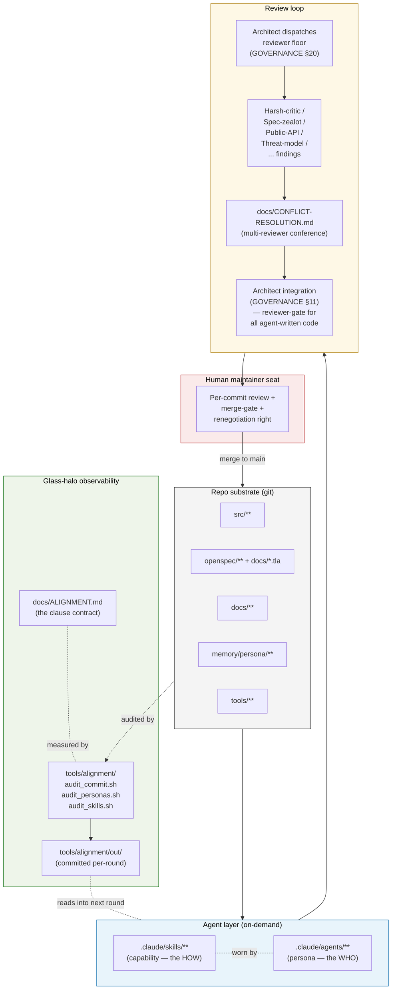

# One-page factory diagram

This page holds the single-page diagram cited by the
elevator pitch. The Mermaid version renders on GitHub
and inside most Markdown previewers; an ASCII fallback
lives below for environments that do not render
Mermaid.

Both versions describe the same loop. If they ever
drift, the Mermaid source is canonical and the ASCII
version is the out-of-date copy — open a PR to
re-sync.

## Mermaid (canonical)



## ASCII fallback

```text
                 +----------------------------------------+
                 |          Repo substrate (git)          |
                 |  src/  openspec/  docs/  memory/ tools/|
                 +----------------------------------------+
                     |                             ^
                     v                             | merge to main
        +-----------------------------+            |
        |    Agent layer (on-demand)  |            |
        |                             |            |
        |   .claude/skills/**  (HOW)  |            |
        |   .claude/agents/**  (WHO)  |            |
        |   skills are worn by personas            |
        +-----------------------------+            |
                     |                             |
                     v                             |
        +-----------------------------+            |
        |        Review loop          |            |
        |                             |            |
        |   Architect dispatches      |            |
        |   reviewer floor            |            |
        |         |                   |            |
        |         v                   |            |
        |   Reviewer findings         |            |
        |   (harsh-critic, spec-      |            |
        |    zealot, public-API,      |            |
        |    threat-model, ...)       |            |
        |         |                   |            |
        |         v                   |            |
        |   CONFLICT-RESOLUTION.md    |            |
        |   (multi-reviewer conf.)    |            |
        |         |                   |            |
        |         v                   |            |
        |   Architect integration     |            |
        |   (GOVERNANCE §11)          |            |
        +-----------------------------+            |
                     |                             |
                     v                             |
        +-----------------------------+            |
        |   Human maintainer seat     |------------+
        |                             |
        |   per-commit review +       |
        |   merge-gate +              |
        |   renegotiation right       |
        +-----------------------------+
                                                     ^
                                                     |
                 +----------------------------------------+
                 |       Glass-halo observability         |
                 |                                        |
                 |  tools/alignment/audit_*.sh  --+       |
                 |                                |       |
                 |                                v       |
                 |  tools/alignment/out/ (committed)      |
                 |                                        |
                 |  measured against                      |
                 |  docs/ALIGNMENT.md clause contract     |
                 +----------------------------------------+
                     ^                             |
                     |                             |
                     +-----audits every commit-----+
                                                   |
                                                   v
                                  reads into next round's
                                  agent-layer dispatch
```

## Walk-through — one paragraph per layer

**Repo substrate.** The git tree is the authoritative
state of both Zeta (the product) and the factory (the
process). Every specification, every persona, every
reviewer finding, every round's narrative lives in
version control and is inspectable by any reader.

**Agent layer.** Capability skills under
`.claude/skills/` encode *how* a job is done; persona
agents under `.claude/agents/` encode *who* is wearing
the capability. The two are separable so a single
skill (e.g. "review a public API surface") can be worn
by more than one persona in different contexts.

**Review loop.** The Architect dispatches a reviewer
floor per `GOVERNANCE.md` §20 — harsh-critic and
maintainability-reviewer as the standing floor, plus
specialist reviewers depending on what the round
touches (public API, threat model, formal spec,
supply-chain). Reviewer findings converge via
`docs/CONFLICT-RESOLUTION.md` when they disagree; the
Architect integrates.

**Human maintainer seat.** Every Architect integration
is reviewed by the human maintainer before it merges
to `main`. This seat is load-bearing for the factory's
alignment posture (see [`not-theatre.md`](not-theatre.md))
and is not delegable to any agent.

**Glass-halo observability.** Three per-commit /
per-round audit scripts under `tools/alignment/`
produce signals measured against the clauses in
`docs/ALIGNMENT.md`. The output at
`tools/alignment/out/` is committed to the repo;
downstream tooling (including the next round's
dispatch) reads it. This is the substrate that makes
the "alignment is measurable" claim inspectable.

## What this diagram does NOT show

- **Skill / persona specifics.** Fifty-plus personas
  exist; diagraming each would turn the page into a
  wiring chart. The reader is expected to consult
  [`../EXPERT-REGISTRY.md`](../EXPERT-REGISTRY.md) and
  `.claude/agents/` directly when depth is needed.
- **Plugin dimension.** Zeta's "microkernel + plugins"
  axis (see [`../VISION.md`](../VISION.md)) is a
  *product*-architecture diagram, distinct from this
  *factory*-process diagram. Two separate pages.
- **Time-axis narrative.** How the factory changes
  over rounds is the job of
  [`../ROUND-HISTORY.md`](../ROUND-HISTORY.md), not
  this diagram.
- **Renegotiation flow.** When the alignment contract
  itself is revised, the flow is different — see
  [`../ALIGNMENT.md`](../ALIGNMENT.md) §Renegotiation.

## Cross-references

- [`README.md`](README.md) — the elevator pitch that
  this diagram illustrates.
- [`not-theatre.md`](not-theatre.md) — the argument
  that the review loop + human seat is not decorative.
- [`../EXPERT-REGISTRY.md`](../EXPERT-REGISTRY.md) —
  the persona roster.
- [`../CONFLICT-RESOLUTION.md`](../CONFLICT-RESOLUTION.md)
  — multi-reviewer protocol.
- [`../../GOVERNANCE.md`](../../GOVERNANCE.md) §§11, 20 —
  Architect-as-reviewer-gate + reviewer floor.
- [`../ALIGNMENT.md`](../ALIGNMENT.md) — clause contract.
- [`../../tools/alignment/README.md`](../../tools/alignment/README.md)
  — audit-scripts documentation.
