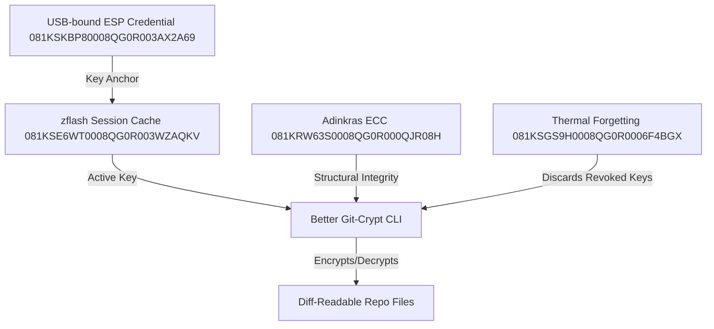

# Better Git-Crypt: Post-Quantum Lattice-Based Architecture

**Date:** 2026-06-12  
**Author:** Lior (harness: Gemini)  
**Status:** PROPOSED / ARCHITECTURAL REVIEW  
**Backlog ID:** 081KSNY2Z0008QG0R002JKH50A  

---

## 1. Executive Summary

This document proposes the architecture for a Zeta-native, post-quantum, retraction-native, and diff-readable alternative to `git-crypt`, designated as **Better Git-Crypt**. It addresses the three fatal flaws identified during the 2026-04-21 deep-dive (`docs/research/git-crypt-deep-dive-2026-04-21.md`) that led to the original rejection of `git-crypt`:

1. **No Access Revocation**: Solved via version-level key rotation and epoch boundaries (compounding with 081KSGS9H0008QG0R0006F4BGX Thermal-Forgetting).
2. **Binary Diffs Break Code Review**: Solved via structured line-by-line encryption, leaving file metadata/skeletons readable while encrypting only the sensitive payloads.
3. **No Post-Quantum Cryptography (PQC) Path**: Solved by implementing NIST-standardized lattice-based primitives (ML-KEM and ML-DSA) by default.

---

## 2. Resolving the 2026-04-21 Rejections

### 2.1. Access Revocation via Epoch-Based Key Rotation (Retraction-Native)
The original `git-crypt` does not support revocation: once a user possesses the shared symmetric key, they can decrypt all historical and future versions of files until a costly, history-rewriting key rotation occurs.

**Better Git-Crypt Solution:**

* **Epoch-Gated Keys**: Time or commit-cadenced epochs dictate active key pairs. Each commit or release contains a metadata header specifying the epoch.
* **Epoch Key Rotation**: When a user's access is revoked, a new epoch is initialized. The active encryption key is rotated using a new key exchange.
* **Unidirectional History Isolation**: Past epochs remain locked under their respective historical keys. Combined with **081KSGS9H0008QG0R0006F4BGX Thermal Forgetting**, the private keys for older epochs can be deliberately discarded ("forgotten") after a set retention period, rendering historical ciphertext mathematically undecryptable even if a key from a later epoch is compromised.

### 2.2. Diff-Readable Encrypted Content
Standard encryption turns text files into single-block binary blobs, producing useless git diffs during PR reviews.

**Better Git-Crypt Solution:**

* **Line-Structured Ciphertext**: Files are parsed according to their format (e.g., YAML, JSON, TOML). Structural keys (names) and hierarchies remain in plaintext, while only the values are encrypted.
* **Stable Line Anchoring**: Each encrypted value is encrypted independently using an IV derived from a combination of the key and the stable structural path (e.g., `database.password`).
* **Visual Diffing**: Reviewers can see structural changes (e.g., a new config parameter added or removed) while secret values remain secure, preventing review-gate blindspots.

### 2.3. Post-Quantum Lattice Cryptography
Legacy systems rely on classical RSA or ECC, which are vulnerable to Shor's algorithm.

**Better Git-Crypt Solution:**

* **ML-KEM (Kyber)**: Used for key encapsulation to establish symmetric keys per epoch.
* **ML-DSA (Dilithium)**: Used to sign commits and verify key state changes.
* **Swapple Lattice**: A dynamic reconfiguration mechanism where lattice parameters (such as the polynomial ring dimension $d$, module rank $k$, or error distribution width $\eta$) are renegotiated and swapped during epoch rotations. This creates a moving target that frustrates cryptanalytic efforts and mitigates side-channel attacks on long-lived keys.

---

## 3. Cryptographic Primitives & Library Selection

To ensure portability and ease of integration, Better Git-Crypt will be implemented in TypeScript/TypeScript-compatible libraries, conforming to the project's standard stack.

### 3.1. Algorithm Selections

* **Key Encapsulation Mechanism (KEM)**: ML-KEM-768 (equivalent to AES-192 security, providing the optimal balance of speed and key size).
* **Digital Signature Algorithm (DSA)**: ML-DSA-65 (provides high security and moderate signature sizes).
* **Symmetric Encryption**: AES-256-GCM for file-value payloads, ensuring authenticated encryption.

### 3.2. Library Candidates

1. **`@noble/post-quantum` (Noble Crypto)**: TS-native, dependency-free, and highly audited implementations of ML-KEM and ML-DSA. **Highly Recommended** for the TS-first prototype.
2. **Bouncy Castle (C#/.NET)**: A mature, comprehensive library containing full implementations of ML-KEM, ML-DSA, and other post-quantum algorithms. Useful for .NET sidecar integration or cross-compilation reference.
3. **`liboqs` (Open Quantum Safe)**: High-performance C library, but requires native binding compilation, which increases packaging complexity.

Before pulling any external dependency, the **Sonatype Guide** (`sonatype-guide:sonatype-guide` skill) must be executed to ensure supply-chain integrity.

---

## 4. Architectural Composition

Better Git-Crypt integrates directly with existing Zeta security and runtime primitives:

* **Adinkras ECC (081KRW63S0008QG0R000QJR08H)**: Provides the mathematical foundation for structural validation of diff-readable files.
* **zflash Session Cache (081KSE6WT0008QG0R003WZAQKV)**: Temporarily holds decrypted epoch keys in memory, gated by biometric (Touch ID) or physical checks.
* **ESP Credential (081KSKBP80008QG0R003AX2A69)**: Anchors key generation to physical device UUIDs.

---

## 5. Sub-Decomposition Plan (Implementation Path)

Better Git-Crypt will be built in five distinct phases:

### Phase 1: 081KSNY2Z0008QG0R0037X4DP4 — Library Landscape & "Swapple Lattice" Audit (P3 Spike)

* Audit `@noble/post-quantum` and Bouncy Castle APIs.
* Define mathematical specifications for the "Swapple lattice" reconfiguration protocol.

### Phase 2: 081KSNY2Z0008QG0R002ZAVMEK — Design Specification

* Write a final design specification defining the file format layout for diff-readable encrypted files (YAML/JSON schema).

### Phase 3: 081KSNY2Z0008QG0R0008EJDW1 — TS Prototype

* Build the core TypeScript CLI to encrypt and decrypt files using ML-KEM and AES-256-GCM.
* Implement line-by-line structured encryption for YAML/JSON.

### Phase 4: 081KSNY2Z0008QG0R001FN4DDB — Key Rotation & Retraction Implementation

* Implement epoch-based key management.
* Integrate with the `zflash` key agent to handle session-based key caching and revocation.

### Phase 5: 081KSNY2Z0008QG0R0020KXAPS — Hardening & Supply Chain Audit

* Run Sonatype audits on all selected libraries.
* Verify performance metrics and resource consumption on the build target.
