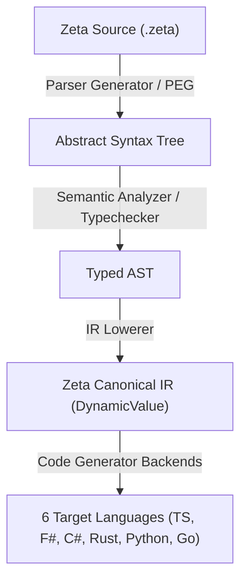

# Zeta Language & Canonical IR: Multi-Language Reactive Compiler Pipeline

## Goal
Design a custom programming language (**Zeta**) and a canonical intermediate representation (**Zeta IR**) that can be parsed and compiled down to our 6 target languages (TypeScript, F#, C#, Rust, Python, Go). 

The compiler pipeline will limit itself strictly to **interfaces and Rx stream query definitions**, treating deterministic values (`DynamicValue`), probabilistic values (`SoftValue`), and stream graphs (`Rx`) as homoiconic duals.

---

## 1. Architectural Pipeline

The compilation sequence flows through four distinct phases:



1. **Parser (Parser Generator)**: A Parsing Expression Grammar (PEG) tool (e.g., `pest` in Rust or `ohm` in TypeScript) reads the `.zeta` source and generates a structured AST.
2. **Lowerer**: Lowers the AST into the **Zeta Canonical IR**.
3. **IR (Homoiconic DynamicValue)**: The IR itself is represented as a `DynamicValue`/`SoftValue` tree (program as data). It is fully serializable to JSON/CBOR/YAML.
4. **Target Generator**: Translates the IR nodes into native reactive streams (Rx / DBSP operator flows) in each of the 6 languages.

---

## 2. Zeta Language Spec & Grammar

The Zeta language is a domain-specific, pure functional language for stream transformations. It has no loops or side effects; all execution flows through Rx stream queries and pure functions.

### Sample Syntax: `ZSetMerkle` in Zeta Language
```zeta
// Define the interface contract
interface ZSetMerkle<T> {
    fun leaf_bytes(key: Bytes, weight: Int64) -> Bytes
    fun root(stream: Stream<ZEntry<T>>) -> Stream<Hash>
}

// Implement the interface reactively
impl ZSetMerkle<T> for StandardHasher {
    fun leaf_bytes(key: Bytes, weight: Int64) -> Bytes {
        // Simple little-endian structural serialization
        pack_le_u32(length(key)) + key + pack_le_i64(weight)
    }

    fun root(stream: Stream<ZEntry<T>>) -> Stream<Hash> {
        stream
            // Map entries to hash leaves using leaf_bytes
            .map(|entry| {
                let serialized_key = serialize_utf8(entry.key);
                let bytes = leaf_bytes(serialized_key, entry.weight);
                xxhash3_128(bytes)
            })
            // Perform an order-independent tree fold
            .tree_fold(|h1, h2| combine_hashes(h1, h2))
    }
}
```

---

## 3. The Canonical IR (Homoiconic & Dual)

The Zeta IR is represented entirely as a `DynamicValue` tree. Because computation (`Rx`) and data are duals, an Rx operator pipeline is just another shape of value in this tree.

### Abstract Syntax of Zeta IR
Using F# union syntax to define the IR core:

```fsharp
type ZetaIR =
    | Value of DynamicValue
    | SoftValue of SoftValue
    | Param of name: string
    | Lambda of param: string * body: ZetaIR
    | Call of functionName: string * args: ZetaIR list
    // Rx stream operator nodes:
    | StreamInput of name: string
    | StreamMap of source: ZetaIR * transform: ZetaIR
    | StreamFilter of source: ZetaIR * predicate: ZetaIR
    | StreamFoldTree of source: ZetaIR * combiner: ZetaIR
```

Since `ZetaIR` is isomorphic to `DynamicValue`, a compiled Zeta program can be represented as a flat JSON/CBOR layout:
```json
{
  "node": "StreamMap",
  "source": { "node": "StreamInput", "name": "zset_updates" },
  "transform": {
    "node": "Lambda",
    "param": "entry",
    "body": {
      "node": "Call",
      "fn": "xxhash3_128",
      "args": [
        {
          "node": "Call",
          "fn": "leaf_bytes",
          "args": [
            { "node": "Call", "fn": "serialize_utf8", "args": [{ "node": "Param", "name": "entry.key" }] },
            { "node": "Param", "name": "entry.weight" }
          ]
        }
      ]
    }
  }
}
```

---

## 4. Compiler Backends (The 6 Targets)

Each target language receives the serialized `ZetaIR` and generates native code using its local Rx/stream framework:

### 1. TypeScript Target

* **Target Targetry**: Standard RxJS or Bun-native stream callbacks.
* **Codegen**: Emits class declarations implementing the TS interface, chaining pipeline operators:
  ```typescript
  export class StandardHasher implements ZSetMerkle<any> {
    leaf_bytes(key: Uint8Array, weight: bigint): Uint8Array { ... }
    root(stream: Observable<ZEntry<any>>): Observable<Hash> {
      return stream.pipe(
        map(entry => xxhash3_128(this.leaf_bytes(serialize_utf8(entry.key), entry.weight))),
        treeFold((h1, h2) => combine_hashes(h1, h2))
      );
    }
  }
  ```

### 2. F# Target

* **Target Targetry**: F# DBSP circuits (`circuit { ... }`).
* **Codegen**:
  ```fsharp
  type StandardHasher() =
      interface IZSetMerkle with
          member this.LeafBytes(key, weight) = ...
          member this.Root(stream) =
              circuit {
                  let! leaves = stream |> map (fun entry -> ...)
                  return! leaves |> treeFold combineHashes
              }
  ```

### 3. C# Target

* **Target Targetry**: System.Reactive (Rx.NET) or native DBSP C# runtime.
* **Codegen**: Generates C# expressions building up the IObservable stream graph.

### 4. Rust Target

* **Target Targetry**: `futures::stream` / Tokio stream or native Rust DBSP operators.
* **Codegen**: Generates zero-allocation stream combinators matching lifetimes correctly.

### 5. Python Target

* **Target Targetry**: ReactiveX (RxPY).
* **Codegen**: Generates clean Python pipelines adhering to `ruff format`.

### 6. Go Target

* **Target Targetry**: RxGo or channel-based pipelines.
* **Codegen**: Generates clean Go channels with concurrent workers for pipeline mapping.

---

## 5. Next Steps for Implementation

1. **Finalize the IR Schema**: Document `zeta-ir-v1-layout.yaml` defining all valid nodes.
2. **Write the Parser**: Build a grammar parser inside `src/Core.TypeScript/zeta-lang/` to translate `.zeta` scripts to the JSON IR.
3. **Build the Codegen Engine**: Implement templates in TypeScript that parse the IR and write files to each language directory, mimicking our `zeta-id-generator.ts` approach.
4. **Assert in CI**: Wire the new `.zeta` compiling step into `bun run preflight` so any change to source files automatically regenerates target implementations and validates them.
