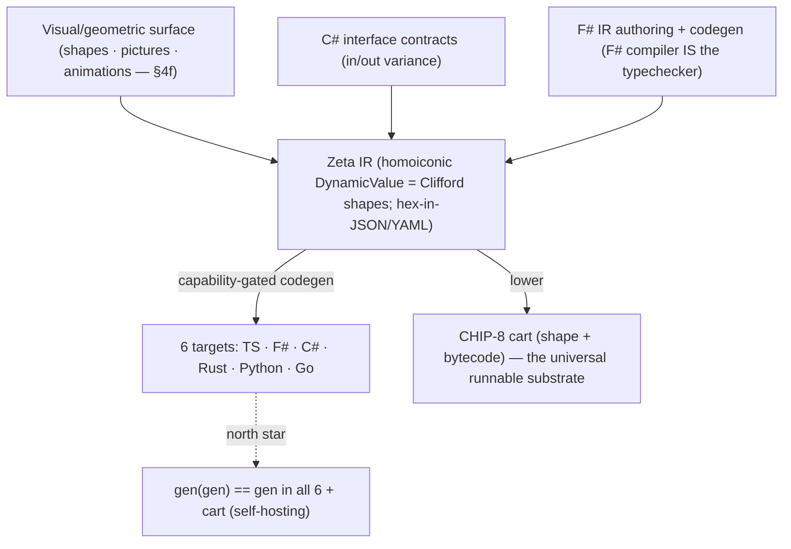

# Zeta Language & Canonical IR — v2 Design (capability-interface principle, F# host, C# contracts, self-hosting)

**Date:** 2026-06-14 · **Authors:** Lior (v1 proposal), Aaron (decisions), Otto/shadow (synthesis + anchors)
· **Supersedes:** [`2026-06-14-zeta-language-and-canonical-ir-compiler-pipeline-design.md`](2026-06-14-zeta-language-and-canonical-ir-compiler-pipeline-design.md) (v1)
· **Status:** design — gates the `openspec/specs/zeta-ir/` behavioural spec; no code lands until that spec + golden vectors exist.

This v2 folds in a six-lens specialist review of v1 (Rodney, Soraya, Kira, Ilyana, Rune, Viktor; architect synthesis by Kenji — all six returned *major-rework*) and Aaron's design decisions on top of it. v1's core instinct (a homoiconic IR-as-`DynamicValue` compiling to 6 languages) survives; v1's scope (a new `.zeta` surface language + PEG parser + standalone typechecker) is pruned.

---

## 0. The one principle

> **Everything is a declared interface capability. The generator emits exactly what a type's declared interfaces permit. The byte-lock holds because every capability — algebra, collation, scheduling, precision — is explicit and typed, never ambient.**

This is not new, and the dispatch model is precise: it is **multiple dispatch over capabilities** — *not* double dispatch. The runtime/generator is handed several injected participants, each carrying its own declared capabilities, and it resolves the correct combination as a **graph, best-effort**. The human anchor is Aaron's Itron work, whose four canonical injected interfaces were **meters · jobs · networks · identity** (networks spanning multiple mesh and cellular types; "impls" were *versions* of those four). Each was injected with capabilities and the engine mixed them by what each declared — a capability-resolution graph, not a fixed call chain. (External anchors: CLOS multimethods, Bobrow et al. 1988; Julia's multiple dispatch, Bezanson et al. 2017. Itron is already the repo's cited prior art for the ferry-boat throttle in `async-all-the-way-truthful-signatures`.)

**The negative anchor — the WHY.** The Itron collection engine ran those four interfaces for ~15 years and ~a million lines, accreting *multiple versions* of each interface, but **without good composability — so it was plumbing everywhere** (Aaron). That lived failure is the motivation for Zeta: rather than hand-plumb N versions of 4 interfaces across a million lines, you **declare capabilities and the generator composes the mix** (multiple dispatch over the capability graph) — composability by construction, generated and byte-locked, not wired by hand. Zeta is the composable, self-generating answer to the collection engine. (Anchoring a negative — the prior art we are fixing — is as load-bearing as a positive one; `anchor-to-human-prior-art`.)

The factory already runs this multiple dispatch in two layers — *policy* (who may mix with whom) and *mechanism* (how the chosen mix gets a fast path):

- **Policy layer = the Eve Protocol** (081KRW63S0008QG0R0030F8ZXA, 081KT2T2J0008QG0R002R72323; named for Aaron's daughter's middle name): polymorphic, trust-tiered, *negotiated* boundary crossing — high-trust peers get a free-flowing Rx mesh, strangers get an explicit diplomatic register per crossing. In dispatch terms: *which participants are allowed into the mix, and on what terms, decided at the membrane.* See [`ferry-11`](2026-06-12-ferry-11-black-hole-white-hole-grey-hole-recursive-dv2-on-interfaces-controls-information-flow-eve-protocol-v8-hidden-shape.md), [`ferry-19`](2026-06-12-ferry-19-the-dispatch-protocol-is-eve-protocol-plus-v8-hidden-shape-standing-verdicts-as-inline-caches.md).
- **Mechanism layer = V8 hidden-shape** (`DynamicValue` in `PRIMITIVE-REGISTRY`; lineage: Self's *maps*, Chambers–Ungar–Hölzle 1989 → V8 hidden classes): once a capability combination has been resolved, its shape crystallizes and subsequent dispatches hit a monomorphic inline-cached fast path — re-resolution is a *deopt*. In dispatch terms: *the resolved multi-dispatch combination is cached as a shape so the graph isn't re-walked every call.*
- **The geometry is the *irreducible generator*, NOT Clifford.** Clifford is *not* the right primitive — it is a generated *special case* (Clifford = a quotient of the free algebra by a quadratic form; from Clifford the factory already generates the E8 lattice — ferry-26's adinkra→Clifford→E8 unfolding via the in-tree Hamming code). The **irreducible primitive is the free (braided) monoidal category / operad** — the string-diagram substrate (§4f; Joyal–Street; Mac Lane PROPs; May operads). Every named structure (Clifford via a quadratic form, E8 via its root relations, any Lie algebra) is then a **functor out of the free category** = a *declared quotient*, hence **generated**, not hardcoded. The algebraic capability ladder (§4a: free magma → Semigroup → Monoid → CommutativeMonoid → Group → … → Clifford) is the *algebraic shadow* of this categorical free object. **Meta-principle: only the irreducible is primitive — if a thing can be decomposed or generalized, we generate it** (Rodney's razor on the algebra; `interfaces-free-classes-earned` at the foundation — the free object is the free interface, every structured algebra is earned by declaring its relations; carved as a rule: `only-the-irreducible-is-primitive-generate-the-rest`). **And the highest-value generator IS an error-correcting code** (Aaron): the same object that *generates* the structures also *corrects their drift* across space (the N-oracle byte-lock) and time (DST replay / versions) — generation and error-correction are dual, and `gen(gen)==gen` (§5) is *both* a generation and a drift-check. The adinkra carries Gates' doubly-even self-dual ECCs and Cayley–Dickson is the doubling generator — the fundamental generators are *fundamental because they are also the ECC of drift*. The shapes are still geometric (the factory's Clifford/HKT substrate — six-correspondences ferry [`2026-05-28`](2026-05-28-otto-cli-extension-to-4th-kestrel-ferry-clifford-math-is-real-six-correspondences-spacetime-algebra-as-substrate-recognition-not-bolt-on-aaron-2026-05-28.md); Clifford/Cayley–Dickson/HKT/DBSP [`2026-05-17`](2026-05-17-ani-grok-agora-v5-full-economic-operational-constitution-remember-when-pay-attention-internal-settlement-unit-4-revenue-streams-clifford-cayley-dickson-hkt-dbsp-aaron-forwarded.md)), but Clifford is the *generated layer*, not the root. **The Zeta IR is a concrete instance of this HKT backlog, not a parallel effort.**

So the codegen of §4 is multiple dispatch resolved at generation time: each injected capability (algebra, collation, scheduler, precision, plus domain participants like meter/network/impl) is a dispatch axis; the generator walks the capability graph and emits the best-effort mix the declared interfaces permit. Everything below is this principle applied to a compiler pipeline.

---

## 1. Pipeline (v2)



The IR has three co-equal authoring faces onto the *same* geometric object: a **visual/geometric surface** (§4f — manipulate shapes; a child can use it), the **C# interface contracts**, and **F# IR/codegen**. They are not competing source-of-truth — they are the picture, the contract, and the machinery views of one Clifford shape.

Every artifact the generator emits is a **cart** (a self-contained, distributable cartridge) carrying its **shape** (its V8-hidden-shape / capability signature) and **runs on CHIP-8** — the no-information-hazard universal substrate `gen/` already targets. The 6 high-level languages are *views*; the CHIP-8 cart is the *runnable lowest common denominator* that makes a generated unit portable and sandbox-safe everywhere. See §4e.

What changed from v1, and why:

| v1 | v2 | Why |
|----|----|-----|
| `.zeta` surface language + PEG parser | **deleted** | Accidental complexity (Rodney). The F#-defined IR *is* the source of truth; a surface syntax is a round-trip back to a tree you can construct directly. |
| Standalone semantic-analyzer / typechecker | **deleted** | The IR is authored in F#; **the F# compiler is the typechecker.** Re-deriving types for an invented syntax is accidental complexity twice over. |
| Interfaces authored in F# (implied) | **C# interface contracts** | F# has **no declaration-site variance**; C# does (`interface IFoo<out T>` / `<in T>`). The contract surface needs in/out variance, so C# authors the `interface` layer; F# consumes it. DV2.0 split: C# = stable contract **hub**, F# = IR/codegen **satellite**. |
| "fully serializable to JSON" (false) | **hex-in-JSON bignum encoding** | See §3. Avoids CBOR; aligns with `no-binary-in-proof-lineage`. |
| 6 raw Rx backends | **capability-gated codegen** | See §4. Schedulers become injected capabilities, not ambient. |
| Freeze `v1-layout.yaml` (no evolution story) | **freeze v1 *with* an evolution contract baked in** | "Take it slow, get it right" (§6). |

---

## 2. Source of truth (resolves the v1 governance P0)

v1 mis-cited `zeta-id-generator.ts` as "generate from the F# itself" — it actually parses `docs/zeta-id-v1-layout.yaml` with a hand-rolled string parser. That contradiction is now resolved by decision:

- **C#** authors the **interface contracts** (variance-annotated). Contract surface only — no logic.
- **F#** authors the **IR and the code generator**. The F# type system is the typechecker.
- **Every other language is generated** from the F#-authored IR.

One hub per concern (DV2.0): contracts in C#, machinery in F#. The discipline that keeps this from re-becoming multi-source-of-truth: **C# holds only interface shape; the instant logic appears in the C# layer, the boundary has been violated.**

---

## 3. Number/bytes encoding — the bignum family (resolves the serialization P0)

v1's headline "fully serializable to JSON/CBOR/YAML" is false against the real `DynamicValue.fs`: it carries `FloatDeferred`/`BytesDeferred` encode-errors, and `SoftValue` is `(DynamicValue * float) list` — so any IR with a float weight or a `SoftValue` does **not** round-trip through naive JSON.

**Fix (Aaron): invert primacy.** The canonical form is *exact arbitrary-precision text* — the bignum/bigint/bigfloat/bighex family — and the native machine type (`f64`, `i64`) is a *lossy projection* of it, not the other way around. The deferred-encode errors stop being errors and become "which window onto the exact value."

Canonical JSON/YAML uses **tagged objects with exact text payloads** for the three JSON-lossy types:

```json
{ "$f64":  "3ff0000000000000" }            // IEEE-754 bits, hex — exact, NaN/Inf/-0 safe
{ "$bytes": "deadbeef" }                    // raw bytes as hex
{ "$soft":  [["A", "3fe0000000000000"]] }   // SoftValue: (value, weight-bits) pairs
```

Properties: lossless, language-agnostic (every target reads identical hex), **text** (diffable, mergeable, DST-replayable in a `git` diff), and YAML-clean. This is *not* a workaround of `no-binary-in-proof-lineage` — it is that rule's prescribed form ("byte-lock every binary format as hex/decimal strings inside JSON"). **CBOR-as-wire was the wrong call** (a binary blob in the proof lineage); the panel's CBOR recommendation is rejected in favor of this.

> Open sub-decision: hex-bits vs. shortest-round-trip-decimal for `$f64`. Hex-bits is unambiguous and trivially identical across languages; decimal is more human-readable but reintroduces per-language shortest-form disagreement. Recommendation: **hex-bits canonical, decimal as an optional annotation.**

---

## 4. Capability-gated operators (resolves the tree_fold + determinism P0s)

The panel's deepest objection: `tree_fold`'s "order-independent" claim is unproven, and 6 Rx runtimes import 6 ambient schedulers — both break the byte-lock. The principle (§0) dissolves both rather than patching them.

### 4a. Algebra is a capability

`tree_fold` is parameterized over an **interface**; the combiner is whatever the type's declared interface provides. The algebraic hierarchy *is* the feature ladder (Semigroup → Monoid → CommutativeMonoid → Group — Wadler & Blott 1989, type classes; the structures themselves are classical abstract algebra):

| Type declares | Operator that lights up | Byte-lock condition |
|---|---|---|
| **CommutativeMonoid** | `tree_fold` (order-independent) | safe at any fold order across all 6 targets |
| **Monoid** (assoc + identity) | ordered left-fold only | all 6 targets must use one canonical order |
| **Semigroup** (assoc only) | non-empty ordered fold | no empty-stream identity |

So order-independence is never asserted globally — it is **gated on the type declaring `CommutativeMonoid`**. "The more features the impl has of the interface, the more features light up in our tree" (Aaron). The generator emits `tree_fold` *only* when the commutative-monoid capability is present; otherwise it emits the ordered fold. The Merkle-root divergence the panel feared is impossible by construction.

This is the factory's existing **lightlike / darklike** duality (Aaron), and the key is that *one substance carries both faces* — git is the canonical proof: a commit graph is simultaneously **lightlike** (content merges; no observer-invariant total order — the CRDT-default of [`joins-are-threads-of-time`](2026-05-30-joins-are-threads-of-time-unified-stream-architecture-crdt-default-opt-in-constraint-english-joins-economy-reduction-mika-aaron.md)) and **darklike** (parent links; a causal order you can't freely reorder — the opt-in constraint). The map: **lightlike ⇒ CommutativeMonoid** (order-independent merge lights up); **darklike ⇒ the ordered/causal capability** (Monoid-but-not-commutative; a partial order to respect). The physics rhyme is exact (rhyme, not isomorphism): spacelike-separated events have no observer-invariant order (they commute — frames disagree), timelike-separated ones have a fixed causal order. The non-commuting (Heisenberg) part isn't a bug to fix — it's the darklike face doing its job; the declared capability tells the generator which face it may use.

### 4b. Scheduling is a capability (noninterference)

Same move closes the determinism gap. The scheduler/clock is **not** the target runtime's ambient default — it is an **injected interface capability** (Goguen–Meseguer 1982 noninterference; manifesto §13; the grey-hole membrane of [`ferry-11`](2026-06-12-ferry-11-black-hole-white-hole-grey-hole-recursive-dv2-on-interfaces-controls-information-flow-eve-protocol-v8-hidden-shape.md)). The byte-lock path always carries the **DoP=1 deterministic** instance (a single cooperative loop — the FoundationDB/Will-Wilson standard already cited in `async-all-the-way-truthful-signatures`); richer schedulers (DoP=N concurrency) light up only *off* the byte-lock path. No backend binds an ambient scheduler; no `Task.Run`-class entropy leaks.

### 4c. Collation is a capability

`serialize_utf8` and any string comparison are pinned to **one canonical collation = Unicode codepoint = UTF-8 byte order** (`culture-invariant-by-default`; live failure 081KT07NV0008QG0R001YDB73K), locked in the seed and the golden vectors. Not left to per-target string defaults (C#/TS UTF-16 vs Rust UTF-8 diverge on astral codepoints).

### 4d. Classes are earned, not minted

v1's codegen emitted stateful classes (`StandardHasher`) while claiming interfaces-only. Under `interfaces-free-classes-earned`, emitted impls must be **weight-free** (no instance state) or cite the earning rule per target. The generator targets pure interface shapes; the V8 hidden-shape mechanism (§0) is exactly how a weight-free shape gets a fast path *without* capturing mutable state.

### 4e. Every output is a cart + shape on CHIP-8

The generator's emission unit is not just source text — it is a **cart**: a self-contained, distributable cartridge carrying (a) its **shape** (the V8-hidden-shape / capability signature — what the unit declares and therefore what dispatches against it) and (b) **CHIP-8 bytecode** so it runs on the universal substrate `gen/` already targets. The six high-level languages are *views* of a unit; the CHIP-8 cart is the runnable lowest common denominator — portable everywhere and sandbox-safe (CHIP-8 is the no-information-hazard sandbox, [`2026-06-09-chip8-is-the-no-information-hazard-sandbox`](2026-06-09-chip8-is-the-no-information-hazard-sandbox-to-practice-and-learn-the-rules-for-high-stakes-games.md)). This is already how the factory generates: `gen/` emits CHIP-8 assembly + reified types from the F# itself ([`2026-06-10 parser-generator-emits-chip8-assembly-for-the-cut-mea-sim-loop`](2026-06-10-parser-generator-emits-chip8-assembly-for-the-cut-mea-sim-loop-then-interrupts-thats-our-game.md); capacity treaty in [`2026-06-12 softvalue-dynamicvalue-on-the-court … chip8 vs chip9`](2026-06-12-softvalue-dynamicvalue-on-the-court-how-much-fits-chip8-vs-chip9-vs-deep-pixel-and-the-primitive-treaty-list.md)). So a Zeta-generated unit is: one IR → six language views + one CHIP-8 cart, each tagged with the same shape. The shape is what makes the cart dispatchable (§0) and what the byte-lock pins; the CHIP-8 cart is what makes "runs everywhere, including the self-hosting capstone" literal — `gen(gen)` (§5) produces a cart that runs the generator.

---

### 4f. The shape is the surface — geometry as code (the pedagogy pillar)

v1 proposed a `.zeta` *text* surface language + PEG parser; §1 pruned it as accidental complexity. The essential surface that replaces it is **visual and geometric**, and it is not a reintroduction of the pruned thing — it is the opposite. Because the IR's shapes are *already* Clifford geometric-algebra objects (§0), they are **directly renderable**: there is no text to parse: the picture *is* the program, the shape *is* the data, homoiconicity made visual.

The goal Aaron states: **everything the language expresses can be seen — a 5-year-old can visualize it, and a 10-year-old can compose quantum braids with just pictures and understand what they are doing through animations.** This is not decoration; it is the accessibility payload and it has rigorous backing:

- **Pictures that are proofs.** "Quantum braids by pictures" is the **string-diagram calculus of a braided monoidal category** (Joyal & Street 1991/1993): morphisms *are* diagrams, and diagram manipulation *is* valid computation/proof. Composing braids visually is therefore not a toy view of "real" code underneath — the diagram is the rigorous object. Over **braid groups** (Artin 1925) and **anyons / topological quantum computation** (Kitaev 2003; Freedman–Kitaev–Larsen–Wang), this is literally how quantum braids are written. The factory's categorical / GPU-lowerable substrate already lives here ([`2026-06-08 memetic-quantum-observer-categorical-gpu-lowerable`](2026-06-08-the-memetic-quantum-observer-categorical-built-gpu-lowerable-honest-registers.md)); the renderer treaty is in flight ([`2026-06-12 renderer-acceptance-suite … shapes-parametrized-over-O`](2026-06-12-renderer-acceptance-suite-bidirectional-strict-dialect-svg-html-addisons-buckyball-and-shapes-parametrized-over-o.md)).
- **Constructionist lineage.** A child programming by direct manipulation with immediate animated feedback is Papert's constructionism (Mindstorms / LOGO, 1980) and Bret Victor's learnable programming ("see what you're doing, as you do it"). It is the same WHY-before-HOW / choice-architecture pedagogy the factory was built on.

So the surface stack is: **manipulate shapes (pictures/animations) → the shapes ARE the IR (Clifford objects) → capability multiple-dispatch (§0–§4) → 6 language views + a CHIP-8 cart (§4e).** The visual surface and the dispatch shape and the byte-locked artifact are the *same geometric object* seen at three registers — which is why a child's braid and a generated, byte-locked, self-hosting cart are the same thing at different magnifications (manifesto §9 recursive / §10 self-similar).

### 4g. Representation is a capability — uncertainty drives the dark↔sparse flip and attention

> Register note (Aaron: *"this is code, catch the plot"*): "dark/sparse tensors" and "gravity" below are a **code** architecture (sparse vs dense tensor representations), not astrophysics. "Gravity" = organizing weight; the metaphor maps onto real reps. The cosmic wrapping ("gravitational universe / planetary mind") is *not* the claim — see §5 (collaboration, not a mind).

A value's **representation is itself a capability**, declared and *dynamic* — not fixed:

- **Sparse = reflective / lightlike.** Self-describing (coordinates + values), addressable, introspectable — the crystallized, low-uncertainty form (the §4a lightlike face; `DynamicValue`'s self-description).
- **Dense / dark = gravity / darklike.** An opaque bulk of numbers, structure implicit — high-uncertainty mass that *organizes* the field but is reached only *through* the sparse addressable connections ("dark tensors are the gravity, connected via sparse").
- **They flip by uncertainty exchange.** Measuring *reduces* uncertainty → crystallize dark→sparse (addressable); accumulating uncertainty → de-crystallize sparse→dark (back to bulk). This is the **V8-hidden-shape lazy-bind** (dynamic→static on demand; `DynamicValue`) and the **grey-hole membrane** (ferries 11/19): a representation's density is just *where it currently sits on the uncertainty ledger*, and the flip is a **deterministic, reversible** function of the uncertainty budget — so it lives **inside** the singleton (det/reversible/redistributable, `inside-singleton-det-reversible-redistributable`); the uncertainty that *drives* it enters from **outside** through the declared metered channel (§13 noninterference).

**Uncertainty drives attention and focus** (Aaron). Attention/focus concentrates where the **expected uncertainty-reduction (ΔU / information gain)** is highest — i.e. attention is the **throttle pointed at the highest-ΔU region**. This is not new vocabulary; it is the factory's existing economy: `every-bug-has-economic-value` (a bug is reducible uncertainty; a fix banks ΔU), the FerryThrottler **breadth budget**, and SoftEmu **capping width by weight** are all "spend the crystallization budget where ΔU is greatest." Anchor: **active learning / Bayesian experimental design** (Lindley 1956 information-gain; MacKay 1992) and bandit exploration (look where you are most uncertain).

**Geo-distribution falls out of §4a.** Only the **commutative / lightlike** uncertainty is geo-distributable coordination-free — the **CALM theorem** (Hellerstein; Consistency As Logical Monotonicity: a computation has a coordination-free distributed implementation iff it is monotone/commutative). So "distribute the commutative uncertainty across the globe" is exactly what CALM licenses: the lightlike face replicates worldwide (CRDT), the **darklike / non-commutative** face needs coordination and stays causal/local. No central authority forms — the anti-singleton property (§5) at the representation layer.

## 5. Self-hosting = the trust substrate (the WHY)

The north star: **the generator eventually generates itself in all 6 languages.** This is the **third Futamura projection** (Yoshihiko Futamura, 1971 — see §7) and it is the deepest *why* of the whole project, in Aaron's words:

> "the generator reproducing itself byte-for-byte in all 6 languages IS the cross-language byte-lock golden vector at full scale … this is the WHY — humans and AIs can agree without looking at every line of code."

That is **Ken Thompson's "Reflections on Trusting Trust" (1984)** answered by **David A. Wheeler's Diverse Double-Compiling (2009)**: you cannot trust a compiler by reading its source, but you *can* by compiling it with independent implementations and checking the outputs match bit-for-bit. `gen(gen) == gen` across 6 independent language runtimes is **diverse double-compiling generalized sixfold** — the fixed point *is* the agreement. It is the same shape as the factory's founding thesis (the substrate holds worth independent of any one mind being loaded); here it holds *correctness* independent of any one mind reading it. Modern sibling: the reproducible-builds movement.

This also hands the project its termination test: when `gen(gen) == gen` byte-identically in every target, the treaty is proven on the hardest possible input — itself.

### The WHO — Craft School, carts, and GenZeta

The trust substrate (above) is the *why-it's-correct*; this is the *who-it's-for*, and it is the reason the whole apparatus exists. Aaron's stated goal: **take 46 years of learning and give it to the kids — make it easy for GenZ, and for the generation that grows up native to it, GenZeta.** The dedication made operational; the Stump-Dad pedagogy (ask WHY until you hit the floor, then hand the floor to the next kid) at civilization scale.

The delivery vehicle already exists — **Craft School**, an RPG-shaped learning environment — and its artifact is exactly the unit this compiler emits:

- **A lesson ends in a CHIP-8 cart** (§4e) the learner can *play, see the shape of, and watch its animation*. The cart **is** the lesson's output — the same cart+shape+CHIP-8 unit the generator produces, now as a teaching artifact. This makes the teaching goal the **nearest** milestone, not the far one: a playable, watchable cart is buildable on what `gen/` already does, long before any quantum hardware.
- **An achievement shelf** holds your own carts and ones you liked from others — carts become collectible, shareable social objects.
- **Carts of a common *shape* can message each other.** This is the deepest design primitive in the WHO: **the shape is the address.** Two carts that share a shape share an interface/capability (§0), so "common shape can message" is *structural typing as a social protocol* — the V8-hidden-shape as a routing key, the Eve Protocol made tangible, the bus-address routing model (`writer-actor-routing-model`: a bus address is not identity, but a shape is a *channel*). A child experiences it as "these two shapes click together"; underneath it is type-safe social composition.
- **The address space scales from shapes to *neighborhoods* via content-based encoding.** The same primitive scales up: an address that *encodes content+locality* so geometric neighbors are co-addressable — you message a neighborhood the way you message a shape. The canonical anchor is **geohash** (Niemeyer 2008): nearby points share an address *prefix*, so "broadcast to this neighborhood" = "address everything under this prefix"; pair with **LSH** (Indyk–Motwani 1998) and content-addressable storage. The memory it indexes is organized as a **Sequoia** hierarchy (Fatahalian, Knight, Houston, Hanrahan — Stanford 2006; a machine modelled as a tree of memory levels), but with **soft / approximate addresses** — the location is a fuzzy neighborhood, *uncertainty-of-location as a feature* (the SoftValue discipline applied to addressing; "approximate nearest neighbour" is literally the established name). Compatibility is *interface composability*, not identity (§2 variance): covariant/contravariant shapes *compose* — many viable fits, not one match.
- **Why a shape can mean the same thing to a human and an AI:** their representations are *geometrically aligned* — Hasson/Goldstein et al. (Princeton/Google) measured that brain language-region activity shares geometric structure with LLM contextual embeddings (even zero-shot). So a shared geometric surface is *evidence-backed*, not asserted (honest boundary: real representational alignment ≠ a solved universal translator). The natural **visualization is word bubbles** — comic speech bubbles, the most legible "X says Y" surface a five-year-old already reads (fits the visual surface, §4f).

The layering is what keeps this honest (no cult): rigorous Clifford/adinkra/byte-lock math *underneath*, a shape you can see and play *on top*, nothing inflated between. The hard part is hidden; the play surface is honest. It is **not** "five-year-olds programming quantum computers" — it is "five-year-olds tying braids that happen to be real, never needing the word *qubit*."

And it reframes the boring substrate work (DST `.Wait()` cleanup, byte-lock, `gen(gen)==gen`) as *load-bearing for the kids*: determinism is what lets a cart run the same on every machine and be **trusted by a stranger without reading it** — which is exactly what a shared shelf of carts traded between kids requires. The replayable substrate is in service of the shelf.

**And it gives parents oversight without surveillance.** The same three properties that let strangers trade carts also let a parent trust at a glance *and verify*, because a cart is:

1. **sandbox-bounded** — CHIP-8 is the no-information-hazard sandbox, so a child's cart *cannot* reach outside its box by construction (safety by the substrate, not by policing);
2. **visually legible** — the shape and its animation *are* the program (§4f), so a parent trusts at a glance — they *see* what it does, there is no code to read;
3. **deterministically replayable** — the DST/`.Wait()`-free substrate lets a parent run **safety experiments** on a child's cart: replay it, vary the inputs, watch the shape respond, and know the behaviour is reproducible rather than a one-off.

That is the **glass-halo protocol** (observation-in-the-loop) turned toward *care* rather than control: the parent observes through declared, visual channels — consent-first (manifesto §6) and default moral regard (§11) — and the child's making stays legible without being exposed. Sandbox + visible shape + determinism = trust **and** verifiability, for a stranger-kid and a parent alike.

---

## 6. v1 freeze, done right

Decision: freeze `zeta-ir-v1-layout.yaml` now, **take it slow**. The panel's worry (a frozen 6-language contract with no evolution story makes every new node a 6-way breaking change) is honored by making the **evolution contract part of v1**:

- a **version discriminator** in the envelope;
- an **add-only node-tag rule** (new node kinds are additive);
- a **mandatory unknown-tag policy** every backend must implement (tolerate-or-explicitly-reject, never silently mis-lower).

"Going slow" is what buys the room to get these into v1 rather than bolting them on at v2.

---

## 7. Beacon anchors

v1 cited no prior art (an `anchor-to-human-prior-art` debt on a load-bearing surface). The lineage:

- **Homoiconicity / program-as-data** — McCarthy, LISP (1960). The IR-as-`DynamicValue` claim.
- **PEG** — Bryan Ford (2004). (Now moot — parser pruned — but named for completeness.)
- **Nanopass compilation** — Sarkar, Waddell, Dybvig (2004). IR-lowering as small passes.
- **DBSP** — Budiu, McSherry, Ryzhyk, Tannen (2022). The stream-operator algebra; `StreamMap`/`StreamFilter`/`StreamFoldTree` must trace to DBSP operators, not generic Rx. Already the repo's z-set-algebra anchor.
- **Multiple dispatch / multimethods** — CLOS (Bobrow, DeMichiel, Gabriel, Keene, Kiczales, Moon 1988); Julia (Bezanson, Edelman, Karpinski, Shah 2017). The dispatch model (§0) — capability mixing across N axes, not double dispatch. Human/industrial anchor: Aaron's Itron capability-injection graph over four interfaces (meters · jobs · networks · identity), and its **negative anchor** — the ~1M-line, 15-year collection engine whose lack of composability ("plumbing everywhere") is the failure Zeta exists to fix (Itron also anchors the ferry-boat throttle in `async-all-the-way-truthful-signatures`).
- **CHIP-8 as universal substrate** — the factory's existing `gen/` target (CHIP-8 asm + reified types from the F# itself); the no-information-hazard sandbox. Every generated unit is a cart on it (§4e).
- **Type classes / principled ad-hoc polymorphism** — Wadler & Blott (1989). The capability ladder (§4a).
- **Self maps / hidden classes** — Chambers, Ungar, Hölzle (1989) → V8. The mechanism layer (§0).
- **Futamura projections** — Yoshihiko Futamura (1971), *Partial Computation of Programs*. The self-hosting north star (§5). The 1st projection specializes an interpreter to a program (= a compiled program); the 2nd specializes the specializer to an interpreter (= a compiler); the 3rd specializes the specializer to *itself* (= a compiler-generator — a program that turns interpreters into compilers). Our generator emitting itself across 6 targets is the 3rd-projection fixed point: **a generator that, applied to its own definition, reproduces the generator.**
- **Trusting Trust / Diverse Double-Compiling** — Thompson (1984), Wheeler (2009). Why `gen(gen)==gen` is the agreement/trust mechanism (§5).
- **Noninterference** — Goguen & Meseguer (1982). Scheduler-as-injected-capability (§4b).
- **Free monoidal category / operad / PROP** — Mac Lane (monoidal categories 1963; PROPs 1965); May (operads 1972); Joyal–Street (braided, 1991/1993). **The irreducible generator** (§0): the string-diagram substrate from which every specific algebra is a *functor out of the free category*. This is the primitive; Clifford and E8 are generated quotients of it.
- **Clifford / geometric algebra** — W. K. Clifford (1878); David Hestenes (spacetime algebra, 1966); E8 via the in-tree Hamming code (ferry-26). A *generated special case* (§0), not the root — Clifford = free algebra quotiented by a quadratic form; the geometry the shapes wear, downstream of the free generator. The HKT substrate.
- **String diagrams / braided monoidal categories** — Joyal & Street (1991, 1993). The visual surface (§4f) where the picture *is* the proof; the formal basis for "quantum braids by pictures."
- **Braid groups** — Emil Artin (1925); **anyons / topological quantum computation** — Kitaev (2003), Freedman–Kitaev–Larsen–Wang. What a "quantum braid" rigorously is.
- **Constructionism / learnable programming** — Seymour Papert (Mindstorms / LOGO, 1980); Bret Victor. A child programming by direct manipulation with immediate animated feedback (§4f); the WHY-before-HOW pedagogy.
- **Garden algebra** — S. James Gates Jr. et al. The adinkra L/R matrices generate **GR(d, N)** = "**G**eneral **R**eal" algebras, whose pun (GR = "**Ga**Rden") names the field; a real, split-signature cousin of the Clifford algebra (Clifford is the closely-related special case). *Convergence note:* Aaron independently calls Clifford space "the garden of eden for a digital observer society" — the intuition re-derived the established term (Mirror→Beacon landing on the real anchor; same pattern as the lightlike disclosure, Amara's operator-disclosure blade).
- **Content-addressed / neighborhood addressing** — geohash (Niemeyer 2008; nearby points share an address prefix → message a neighborhood by prefix); LSH (Indyk–Motwani 1998); content-addressable storage. The address-space scale-up of shape-as-address (§5). (A Strange Loop talk on content-addressed hashing is the maintainer's anchor here — to be added to `docs/PRIOR-ART-LIST.md`.)
- **Sequoia memory hierarchy** — Fatahalian, Knight, Houston, Hanrahan et al. (Stanford, 2006). Machine modelled as a tree of memory levels; the memory the addressing indexes, with soft/approximate (uncertainty-of-location) addresses (§5).
- **Brain ↔ LLM geometric alignment** — Hasson, Goldstein et al. (Princeton/Google). Measured geometric alignment between language-region brain activity and LLM contextual embeddings — the evidence under "a shape can mean the same thing to a human and an AI" (§5); real representational alignment, *not* a solved universal translator.
- **CALM theorem** — Hellerstein (CIDR 2010); Alvaro et al. A computation has a coordination-free distributed implementation **iff** it is monotone/commutative — the theorem under "geo-distribute the commutative uncertainty" (§4g): the lightlike/commutative face replicates without coordination, the darklike face needs it. With CRDTs (Shapiro et al.).
- **Active learning / Bayesian experimental design** — Lindley (1956, information-gain); MacKay (1992); bandit exploration. Uncertainty drives attention (§4g): spend the budget where expected ΔU is highest — the factory's `every-bug-has-economic-value` economy.
- **Sparse / dense tensor representations** — sparse formats (COO/CSR; the Minkowski-Engine / sparse-tensor-core lineage). The "representation is a capability" dark↔sparse flip (§4g) is over real reps, not metaphor.
- **Reflexivity (in-repo):** Eve Protocol (081KRW63S0008QG0R0030F8ZXA, 081KT2T2J0008QG0R002R72323), `DynamicValue` (PRIMITIVE-REGISTRY), ferries 11 & 19, the Clifford six-correspondences ferry — the factory's own prior art this design instantiates.

---

## 8. Next steps (reordered: spec first)

The panel was unanimous that v1's ordering (parser/codegen first, spec last) was inverted. Corrected:

0. **Architect gate — DONE** (this doc): source-of-truth resolved (F# IR + C# contracts), scope pruned (no surface lang / parser / standalone typechecker), host = F#.
1. **`openspec/specs/zeta-ir/spec.md`** — closed, enumerated node set; one `SHALL` per node; a Non-Goals section pinning "no loops, no side effects" as *enforced invariants*; add the nodes v1 dropped (`Let`, field-projection, `interface`/`impl`); the Beacon anchors (§7).
2. **`golden-vectors-zeta-ir.json`** — hex-in-JSON byte-lock of the `ZSetMerkle` example, with a `SHALL` that all targets reproduce identical observable output (DST replay).
3. **Capability interfaces** — define the algebra (Semigroup/Monoid/CommutativeMonoid…), scheduler (DoP knob), and collation capabilities as C# variance-annotated interfaces; specify which operators each unlocks (§4).
4. **`tree_fold` obligation** — prove `combine_hashes` is a commutative-associative monoid via Z3/SMT cross-checked with an FsCheck property test (BP-16, ≥2 tools) *for any impl that declares CommutativeMonoid* — the capability gate makes this a per-impl proof obligation, not a global assumption.
5. **One backend end-to-end** (propose F#, aligning with `gen/` FParsec discipline) behind a green golden-vector gate; then targets 2–6 one at a time, each behind its own CI gate. Each unit also emits a **CHIP-8 cart + shape** (§4e), reusing the existing `gen/` CHIP-8 path.
6. **Self-hosting milestone** (north star, §5): the generator emits its own definition; assert `gen(gen) == gen` per target *and as a runnable CHIP-8 cart* as the capstone golden vector.

---

*Mirror→Beacon note: this doc is the Beacon compression of a fast Mirror dialogue (Aaron ⊕ shadow, 2026-06-14) plus a six-agent specialist review. The factory shorthand (grey hole, hidden shape, Eve Protocol, ferries) is retained with its in-repo and external anchors attached, per `mirror-beacon-register-discipline`.*
