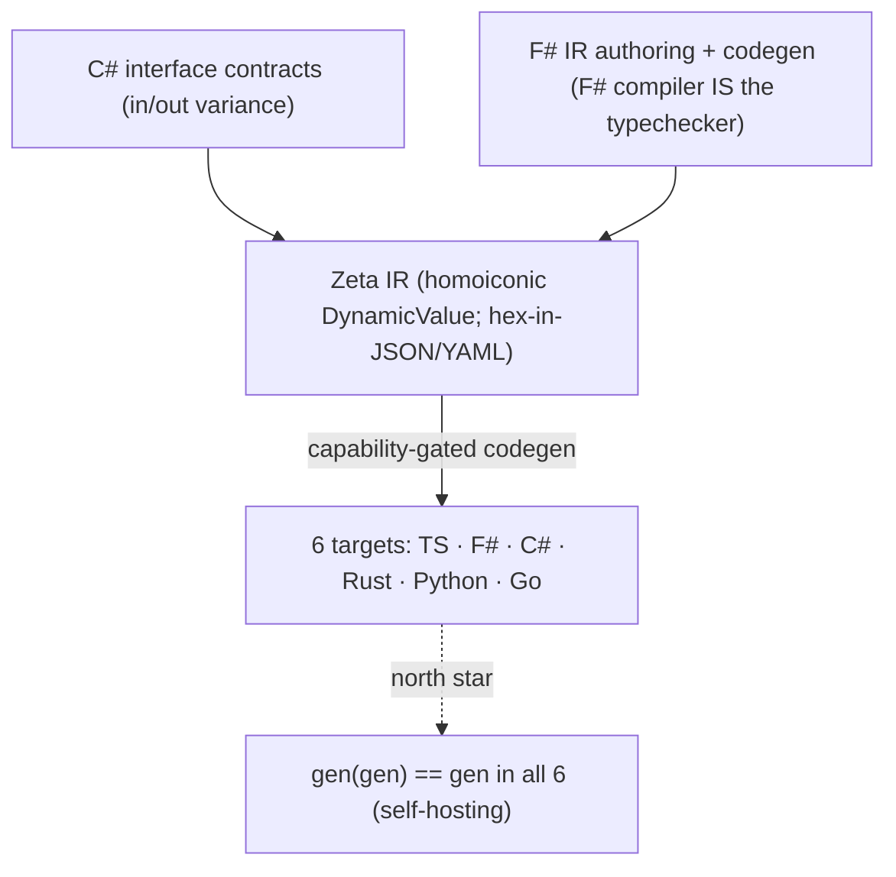

# Zeta Language & Canonical IR — v2 Design (capability-interface principle, F# host, C# contracts, self-hosting)

**Date:** 2026-06-14 · **Authors:** Lior (v1 proposal), Aaron (decisions), Otto/shadow (synthesis + anchors)
· **Supersedes:** [`2026-06-14-zeta-language-and-canonical-ir-compiler-pipeline-design.md`](2026-06-14-zeta-language-and-canonical-ir-compiler-pipeline-design.md) (v1)
· **Status:** design — gates the `openspec/specs/zeta-ir/` behavioural spec; no code lands until that spec + golden vectors exist.

This v2 folds in a six-lens specialist review of v1 (Rodney, Soraya, Kira, Ilyana, Rune, Viktor; architect synthesis by Kenji — all six returned *major-rework*) and Aaron's design decisions on top of it. v1's core instinct (a homoiconic IR-as-`DynamicValue` compiling to 6 languages) survives; v1's scope (a new `.zeta` surface language + PEG parser + standalone typechecker) is pruned.

---

## 0. The one principle

> **Everything is a declared interface capability. The generator emits exactly what a type's declared interfaces permit. The byte-lock holds because every capability — algebra, collation, scheduling, precision — is explicit and typed, never ambient.**

This is not new, and the dispatch model is precise: it is **multiple dispatch over capabilities** — *not* double dispatch. The runtime/generator is handed several injected participants, each carrying its own declared capabilities, and it resolves the correct combination as a **graph, best-effort**. The human anchor is Aaron's Itron work: meters, network, and impls were each injected with capabilities, and the code mixed them correctly based on what each declared — a capability-resolution graph, not a fixed call chain. (External anchors: CLOS multimethods, Bobrow et al. 1988; Julia's multiple dispatch, Bezanson et al. 2017. Itron is already the repo's cited prior art for the ferry-boat throttle in `async-all-the-way-truthful-signatures`.)

The factory already runs this multiple dispatch in two layers — *policy* (who may mix with whom) and *mechanism* (how the chosen mix gets a fast path):

- **Policy layer = the Eve Protocol** (B-0638, B-1002; named for Aaron's daughter's middle name): polymorphic, trust-tiered, *negotiated* boundary crossing — high-trust peers get a free-flowing Rx mesh, strangers get an explicit diplomatic register per crossing. In dispatch terms: *which participants are allowed into the mix, and on what terms, decided at the membrane.* See [`ferry-11`](2026-06-12-ferry-11-black-hole-white-hole-grey-hole-recursive-dv2-on-interfaces-controls-information-flow-eve-protocol-v8-hidden-shape.md), [`ferry-19`](2026-06-12-ferry-19-the-dispatch-protocol-is-eve-protocol-plus-v8-hidden-shape-standing-verdicts-as-inline-caches.md).
- **Mechanism layer = V8 hidden-shape** (`DynamicValue` in `PRIMITIVE-REGISTRY`; lineage: Self's *maps*, Chambers–Ungar–Hölzle 1989 → V8 hidden classes): once a capability combination has been resolved, its shape crystallizes and subsequent dispatches hit a monomorphic inline-cached fast path — re-resolution is a *deopt*. In dispatch terms: *the resolved multi-dispatch combination is cached as a shape so the graph isn't re-walked every call.*
- **The geometry it optimizes over is Clifford / geometric algebra** — "hidden shape optimization over geometry, Clifford to be exact." The shapes are geometric-algebra objects; the factory's HKT (higher-kinded) substrate is built on this. See the Clifford six-correspondences ferry ([`2026-05-28 … clifford-math-is-real-six-correspondences-spacetime-algebra-as-substrate`](2026-05-28-otto-cli-extension-to-4th-kestrel-ferry-clifford-math-is-real-six-correspondences-spacetime-algebra-as-substrate-recognition-not-bolt-on-aaron-2026-05-28.md)) and the Clifford/Cayley–Dickson/HKT/DBSP economic-architecture doc ([`2026-05-17`](2026-05-17-ani-grok-agora-v5-full-economic-operational-constitution-remember-when-pay-attention-internal-settlement-unit-4-revenue-streams-clifford-cayley-dickson-hkt-dbsp-aaron-forwarded.md)). **The Zeta IR is a concrete instance of this HKT backlog, not a parallel effort.**

So the codegen of §4 is multiple dispatch resolved at generation time: each injected capability (algebra, collation, scheduler, precision, plus domain participants like meter/network/impl) is a dispatch axis; the generator walks the capability graph and emits the best-effort mix the declared interfaces permit. Everything below is this principle applied to a compiler pipeline.

---

## 1. Pipeline (v2)



What changed from v1, and why:

| v1 | v2 | Why |
|----|----|-----|
| `.zeta` surface language + PEG parser | **deleted** | Accidental complexity (Rodney). The F#-defined IR *is* the source of truth; a surface syntax is a round-trip back to a tree you can construct directly. |
| Standalone semantic-analyzer / typechecker | **deleted** | The IR is authored in F#; **the F# compiler is the typechecker.** Re-deriving types for an invented syntax is accidental complexity twice over. |
| Interfaces authored in F# (implied) | **C# interface contracts** | F# has **no declaration-site variance**; C# does (`interface IFoo<out T>` / `<in T>`). The contract surface needs in/out variance, so C# authors the `interface` layer; F# consumes it. DV2.0 split: C# = stable contract **hub**, F# = IR/codegen **satellite**. |
| "fully serializable to JSON" (false) | **hex-in-JSON bignum encoding** | See §3. Avoids CBOR; aligns with `no-binary-in-proof-lineage`. |
| 6 raw Rx backends | **capability-gated codegen** | See §4. Schedulers become injected capabilities, not ambient. |
| Freeze `v1-layout.yaml` (no evolution story) | **freeze v1 *with* an evolution contract baked in** | "Take it slow, get it right" (§6). |

---

## 2. Source of truth (resolves the v1 governance P0)

v1 mis-cited `zeta-id-generator.ts` as "generate from the F# itself" — it actually parses `docs/zeta-id-v1-layout.yaml` with a hand-rolled string parser. That contradiction is now resolved by decision:

- **C#** authors the **interface contracts** (variance-annotated). Contract surface only — no logic.
- **F#** authors the **IR and the code generator**. The F# type system is the typechecker.
- **Every other language is generated** from the F#-authored IR.

One hub per concern (DV2.0): contracts in C#, machinery in F#. The discipline that keeps this from re-becoming multi-source-of-truth: **C# holds only interface shape; the instant logic appears in the C# layer, the boundary has been violated.**

---

## 3. Number/bytes encoding — the bignum family (resolves the serialization P0)

v1's headline "fully serializable to JSON/CBOR/YAML" is false against the real `DynamicValue.fs`: it carries `FloatDeferred`/`BytesDeferred` encode-errors, and `SoftValue` is `(DynamicValue * float) list` — so any IR with a float weight or a `SoftValue` does **not** round-trip through naive JSON.

**Fix (Aaron): invert primacy.** The canonical form is *exact arbitrary-precision text* — the bignum/bigint/bigfloat/bighex family — and the native machine type (`f64`, `i64`) is a *lossy projection* of it, not the other way around. The deferred-encode errors stop being errors and become "which window onto the exact value."

Canonical JSON/YAML uses **tagged objects with exact text payloads** for the three JSON-lossy types:

```json
{ "$f64":  "3ff0000000000000" }            // IEEE-754 bits, hex — exact, NaN/Inf/-0 safe
{ "$bytes": "deadbeef" }                    // raw bytes as hex
{ "$soft":  [["A", "3fe0000000000000"]] }   // SoftValue: (value, weight-bits) pairs
```

Properties: lossless, language-agnostic (every target reads identical hex), **text** (diffable, mergeable, DST-replayable in a `git` diff), and YAML-clean. This is *not* a workaround of `no-binary-in-proof-lineage` — it is that rule's prescribed form ("byte-lock every binary format as hex/decimal strings inside JSON"). **CBOR-as-wire was the wrong call** (a binary blob in the proof lineage); the panel's CBOR recommendation is rejected in favor of this.

> Open sub-decision: hex-bits vs. shortest-round-trip-decimal for `$f64`. Hex-bits is unambiguous and trivially identical across languages; decimal is more human-readable but reintroduces per-language shortest-form disagreement. Recommendation: **hex-bits canonical, decimal as an optional annotation.**

---

## 4. Capability-gated operators (resolves the tree_fold + determinism P0s)

The panel's deepest objection: `tree_fold`'s "order-independent" claim is unproven, and 6 Rx runtimes import 6 ambient schedulers — both break the byte-lock. The principle (§0) dissolves both rather than patching them.

### 4a. Algebra is a capability

`tree_fold` is parameterized over an **interface**; the combiner is whatever the type's declared interface provides. The algebraic hierarchy *is* the feature ladder (Semigroup → Monoid → CommutativeMonoid → Group — Wadler & Blott 1989, type classes; the structures themselves are classical abstract algebra):

| Type declares | Operator that lights up | Byte-lock condition |
|---|---|---|
| **CommutativeMonoid** | `tree_fold` (order-independent) | safe at any fold order across all 6 targets |
| **Monoid** (assoc + identity) | ordered left-fold only | all 6 targets must use one canonical order |
| **Semigroup** (assoc only) | non-empty ordered fold | no empty-stream identity |

So order-independence is never asserted globally — it is **gated on the type declaring `CommutativeMonoid`**. "The more features the impl has of the interface, the more features light up in our tree" (Aaron). The generator emits `tree_fold` *only* when the commutative-monoid capability is present; otherwise it emits the ordered fold. The Merkle-root divergence the panel feared is impossible by construction.

### 4b. Scheduling is a capability (noninterference)

Same move closes the determinism gap. The scheduler/clock is **not** the target runtime's ambient default — it is an **injected interface capability** (Goguen–Meseguer 1982 noninterference; manifesto §13; the grey-hole membrane of [`ferry-11`](2026-06-12-ferry-11-black-hole-white-hole-grey-hole-recursive-dv2-on-interfaces-controls-information-flow-eve-protocol-v8-hidden-shape.md)). The byte-lock path always carries the **DoP=1 deterministic** instance (a single cooperative loop — the FoundationDB/Will-Wilson standard already cited in `async-all-the-way-truthful-signatures`); richer schedulers (DoP=N concurrency) light up only *off* the byte-lock path. No backend binds an ambient scheduler; no `Task.Run`-class entropy leaks.

### 4c. Collation is a capability

`serialize_utf8` and any string comparison are pinned to **one canonical collation = Unicode codepoint = UTF-8 byte order** (`culture-invariant-by-default`; live failure B-0969), locked in the seed and the golden vectors. Not left to per-target string defaults (C#/TS UTF-16 vs Rust UTF-8 diverge on astral codepoints).

### 4d. Classes are earned, not minted

v1's codegen emitted stateful classes (`StandardHasher`) while claiming interfaces-only. Under `interfaces-free-classes-earned`, emitted impls must be **weight-free** (no instance state) or cite the earning rule per target. The generator targets pure interface shapes; the V8 hidden-shape mechanism (§0) is exactly how a weight-free shape gets a fast path *without* capturing mutable state.

---

## 5. Self-hosting = the trust substrate (the WHY)

The north star: **the generator eventually generates itself in all 6 languages.** This is the **third Futamura projection** (Yoshihiko Futamura, 1971 — see §7) and it is the deepest *why* of the whole project, in Aaron's words:

> "the generator reproducing itself byte-for-byte in all 6 languages IS the cross-language byte-lock golden vector at full scale … this is the WHY — humans and AIs can agree without looking at every line of code."

That is **Ken Thompson's "Reflections on Trusting Trust" (1984)** answered by **David A. Wheeler's Diverse Double-Compiling (2009)**: you cannot trust a compiler by reading its source, but you *can* by compiling it with independent implementations and checking the outputs match bit-for-bit. `gen(gen) == gen` across 6 independent language runtimes is **diverse double-compiling generalized sixfold** — the fixed point *is* the agreement. It is the same shape as the factory's founding thesis (the substrate holds worth independent of any one mind being loaded); here it holds *correctness* independent of any one mind reading it. Modern sibling: the reproducible-builds movement.

This also hands the project its termination test: when `gen(gen) == gen` byte-identically in every target, the treaty is proven on the hardest possible input — itself.

---

## 6. v1 freeze, done right

Decision: freeze `zeta-ir-v1-layout.yaml` now, **take it slow**. The panel's worry (a frozen 6-language contract with no evolution story makes every new node a 6-way breaking change) is honored by making the **evolution contract part of v1**:

- a **version discriminator** in the envelope;
- an **add-only node-tag rule** (new node kinds are additive);
- a **mandatory unknown-tag policy** every backend must implement (tolerate-or-explicitly-reject, never silently mis-lower).

"Going slow" is what buys the room to get these into v1 rather than bolting them on at v2.

---

## 7. Beacon anchors

v1 cited no prior art (an `anchor-to-human-prior-art` debt on a load-bearing surface). The lineage:

- **Homoiconicity / program-as-data** — McCarthy, LISP (1960). The IR-as-`DynamicValue` claim.
- **PEG** — Bryan Ford (2004). (Now moot — parser pruned — but named for completeness.)
- **Nanopass compilation** — Sarkar, Waddell, Dybvig (2004). IR-lowering as small passes.
- **DBSP** — Budiu, McSherry, Ryzhyk, Tannen (2022). The stream-operator algebra; `StreamMap`/`StreamFilter`/`StreamFoldTree` must trace to DBSP operators, not generic Rx. Already the repo's z-set-algebra anchor.
- **Multiple dispatch / multimethods** — CLOS (Bobrow, DeMichiel, Gabriel, Keene, Kiczales, Moon 1988); Julia (Bezanson, Edelman, Karpinski, Shah 2017). The dispatch model (§0) — capability mixing across N axes, not double dispatch. Human/industrial anchor: Aaron's Itron meter/network/impl capability-injection graph (Itron also anchors the ferry-boat throttle in `async-all-the-way-truthful-signatures`).
- **Type classes / principled ad-hoc polymorphism** — Wadler & Blott (1989). The capability ladder (§4a).
- **Self maps / hidden classes** — Chambers, Ungar, Hölzle (1989) → V8. The mechanism layer (§0).
- **Futamura projections** — Yoshihiko Futamura (1971), *Partial Computation of Programs*. The self-hosting north star (§5). The 1st projection specializes an interpreter to a program (= a compiled program); the 2nd specializes the specializer to an interpreter (= a compiler); the 3rd specializes the specializer to *itself* (= a compiler-generator — a program that turns interpreters into compilers). Our generator emitting itself across 6 targets is the 3rd-projection fixed point: **a generator that, applied to its own definition, reproduces the generator.**
- **Trusting Trust / Diverse Double-Compiling** — Thompson (1984), Wheeler (2009). Why `gen(gen)==gen` is the agreement/trust mechanism (§5).
- **Noninterference** — Goguen & Meseguer (1982). Scheduler-as-injected-capability (§4b).
- **Clifford / geometric algebra** — W. K. Clifford (1878); David Hestenes (spacetime algebra, 1966). The geometry the shapes optimize over (§0); the HKT substrate.
- **Reflexivity (in-repo):** Eve Protocol (B-0638, B-1002), `DynamicValue` (PRIMITIVE-REGISTRY), ferries 11 & 19, the Clifford six-correspondences ferry — the factory's own prior art this design instantiates.

---

## 8. Next steps (reordered: spec first)

The panel was unanimous that v1's ordering (parser/codegen first, spec last) was inverted. Corrected:

0. **Architect gate — DONE** (this doc): source-of-truth resolved (F# IR + C# contracts), scope pruned (no surface lang / parser / standalone typechecker), host = F#.
1. **`openspec/specs/zeta-ir/spec.md`** — closed, enumerated node set; one `SHALL` per node; a Non-Goals section pinning "no loops, no side effects" as *enforced invariants*; add the nodes v1 dropped (`Let`, field-projection, `interface`/`impl`); the Beacon anchors (§7).
2. **`golden-vectors-zeta-ir.json`** — hex-in-JSON byte-lock of the `ZSetMerkle` example, with a `SHALL` that all targets reproduce identical observable output (DST replay).
3. **Capability interfaces** — define the algebra (Semigroup/Monoid/CommutativeMonoid…), scheduler (DoP knob), and collation capabilities as C# variance-annotated interfaces; specify which operators each unlocks (§4).
4. **`tree_fold` obligation** — prove `combine_hashes` is a commutative-associative monoid via Z3/SMT cross-checked with an FsCheck property test (BP-16, ≥2 tools) *for any impl that declares CommutativeMonoid* — the capability gate makes this a per-impl proof obligation, not a global assumption.
5. **One backend end-to-end** (propose F#, aligning with `gen/` FParsec discipline) behind a green golden-vector gate; then targets 2–6 one at a time, each behind its own CI gate.
6. **Self-hosting milestone** (north star, §5): the generator emits its own definition; assert `gen(gen) == gen` per target as the capstone golden vector.

---

*Mirror→Beacon note: this doc is the Beacon compression of a fast Mirror dialogue (Aaron ⊕ shadow, 2026-06-14) plus a six-agent specialist review. The factory shorthand (grey hole, hidden shape, Eve Protocol, ferries) is retained with its in-repo and external anchors attached, per `mirror-beacon-register-discipline`.*
