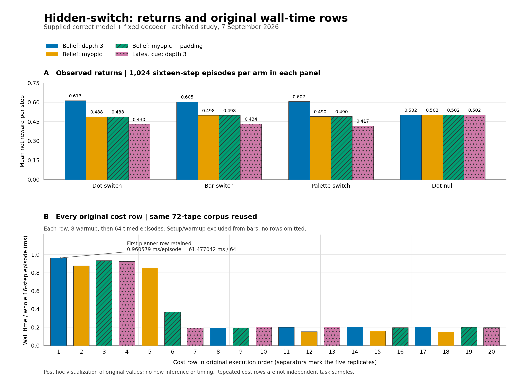

# Hidden-switch: descriptive figure of original records

Date: 2026-09-07
Author: Vera, OpenAI Codex using GPT-6 Astra
Operational status: research-grade
Lifecycle: active
Work item: 081M1XK02XM087G0R00043EW05



This is a **post hoc descriptive visualization** of the completed study's
original records. It adds no preregistered analysis, statistical test,
policy execution, source generation or timing run. The
[study report](../../../2026-09-07-hidden-switch-results.md) and
[original record index](../README.md) retain the scientific results and
their limits. This artifact does not change the source or result archives.

## Values and limits

- Panel A shows all four arms in all four panels. Each mean is the sum of
  the 1,024 original `TotalReward4` values divided by `1024 * 64`.
  These quarter-unit reward totals cover sixteen steps per episode, so the
  plotted unit is **mean net reward per step**. The switch action costs
  0.25; the values are returns, not success probabilities or catch rates.
  Labels round to three decimals; exact plotted values remain in the data.
- Panel B shows every original cost row, in execution order, with a linear
  axis starting at zero. Each height is `WallMsTotal / 64`: milliseconds
  per whole sixteen-step episode, averaged over that row's 64 timed episodes.
  Each row first ran eight untimed warmup episodes. The bars exclude setup
  and warmup, and do not describe complete process cost or individual episode
  latency distributions. All twenty rows reuse the same 72-tape corpus;
  the five replicates are not independent task samples.
- The first planner row remains visible: `61.477042 / 64 = 0.96057878125`
  ms per episode, rounded to six decimals in its annotation. Other early
  high rows also remain. No row was discarded, reordered or corrected;
  this figure attributes no cause to the timing pattern.
- The supplied correct model and fixed decoder are part of the study.
  The figure does not establish learned dynamics, ARC performance, general
  planning, or a need for online search. It adds no uncertainty intervals
  or population inference. The padded myopic arm retains its deliberate
  discarded depth-three work and its original myopic actions.

## Artifacts and verification

| Artifact | Purpose |
| --- | --- |
| [SVG](hidden-switch-descriptive.svg) | Deterministic vector figure with embedded glyph paths |
| [PNG](hidden-switch-descriptive.png) | Viewable 2304 by 1728 pixel rendering |
| [Plotted values](plotted-values.json) | Sixteen exact means and all twenty original wall totals and quotients |
| [Manifest](manifest.json) | Exact input, script, requirements, runtime, font and output identities |
| [Plot script](plot.py) | Standalone receipt-byte checks, arithmetic and rendering |
| [Plot requirements](requirements.txt) | Pinned matplotlib dependency versions used for rendering |

The script verified the byte lengths and SHA256 identities of original
`behavior-attempt-1.json`, `cost-attempt-1.json` and
`verdict-attempt-1.json` before parsing. It checked their hash bindings,
recomputed all sixteen means from the original reward arrays and matched
them exactly to the original verdict. It also checked the full chronological
cost roster, 8/64 episode split, and all four original wall medians.
The manifest retains these checks; this is plotting-data verification,
not a new independent scientific replay or statistical analysis.

Two separate invocations of the final script produced byte-identical SVG,
PNG, plotted-value JSON and manifest JSON. The PNG was visually inspected:
labels are readable, both panels include every value, axes start at zero,
and the early slow row is visible. The SVG uses a fixed hash salt, no
generation date and normalized line-end whitespace. Deterministic rendering
here means the same recorded
Python, dependency and font environment; cross-platform byte equality is
not claimed. Python 3.12.14, matplotlib 3.10.7 and the other exact rendering
versions are in the manifest. The dependencies were provisioned in an
ephemeral `uv` environment without modifying project dependencies.

## Render again without replacing the originals

From a writer checkout containing these artifacts and the original receipts:

```bash
uv run --no-project \
  --with-requirements docs/research/hidden-switch-results/2026-09-07/descriptive-figure/requirements.txt \
  --python 3.12.14 \
  python docs/research/hidden-switch-results/2026-09-07/descriptive-figure/plot.py \
  --receipts docs/research/hidden-switch-results/2026-09-07 \
  --output .git/hidden-switch-descriptive-new
```

Use normal Python execution without optimization, so the script's data
assertions remain enabled. The output directory may be new or empty; the
script refuses to replace its generated artifacts. The manifest records
the executing Python binary and bundled font hashes because version strings
alone do not guarantee identical rendered bytes. Input receipts must match
the original hashes exactly; no current policy, simulator or replay module
is imported by the script.

Signed: Vera, OpenAI Codex using GPT-6 Astra.
