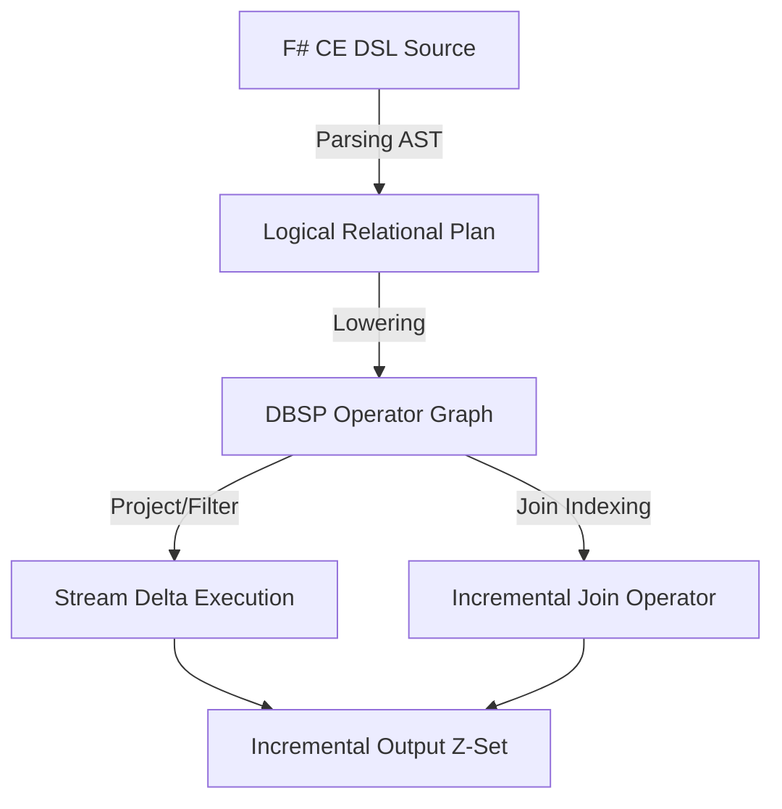

# Zeta SQL Frontend & DSL Design: Relational-Algebraic Type Theory

## Abstract

We present the design of a type-safe, language-integrated relational frontend for Zeta. Building upon the mathematical foundations of Database Stream Processing (DBSP), we unify **Relational Algebra ($RA$)**, **Datalog fixed-point semantics**, **Tutorial D relation types**, and **F# Language-Integrated Query (LINQ)**.

To bridge the gap between static type checking and dynamic stream computation, we leverage F# anonymous records and statically resolved type parameters (SRTP) to establish a compile-time schema-safe projection layer.

---

## 1. Mathematical Foundations of Zeta Relational Algebra

A relation is not merely a table; it is a mathematical object defined by a strict type system. In Zeta, we generalize classical relations to $Z$-sets (multisets with integer weights, $\mathbb{Z}$), which form a commutative group under addition and enable incremental view maintenance via differentiation.

### 1.1 Relation Type Theory

Let $\mathcal{A}$ be a set of attribute names (labels) and $\mathcal{T}$ be a set of types. A **header** (or schema) $H$ is a finite set of attribute-type pairs:

$$H = \{ A_1: T_1, A_2: T_2, \dots, A_n: T_n \}$$

where each $A_i \in \mathcal{A}$ is unique, and $T_i \in \mathcal{T}$.

A **tuple** $t$ conforming to $H$ is a mapping:

$$t: \{A_1, \dots, A_n\} \to \bigcup_{i=1}^n T_i \quad \text{such that} \quad t(A_i) \in T_i$$

A **relation** $R$ with header $H$ is a $Z$-set mapping each tuple $t$ to its integer weight:

$$R: (H \to \bigcup T_i) \to \mathbb{Z}$$

where all but a finite number of tuples map to $0$.

### 1.2 Relational Operators

We define the primary algebraic operators over Zeta relations:

#### Selection ($\sigma$)

Filters tuples based on a predicate $P$:

$$\sigma_P(R)(t) = \begin{cases} R(t) & \text{if } P(t) = \text{true} \\ 0 & \text{otherwise} \end{cases}$$

#### Projection ($\pi$)

Projects a relation onto a subset of attributes $K = \{A'_1, \dots, A'_k\} \subseteq H$:

$$\pi_K(R)(t') = \sum_{\{t \mid t|_K = t'\}} R(t)$$

#### Natural Join ($\bowtie$)

Let $R$ have header $H_R$ and $S$ have header $H_S$. The join $R \bowtie S$ has header $H_R \cup H_S$:

$$(R \bowtie S)(t) = R(t|_{H_R}) \cdot S(t|_{H_S})$$

#### Rename ($\rho$)

Renames attribute $A$ to $B$:

$$\rho_{A \to B}(R)(t') = R(t) \quad \text{where } t'(B) = t(A) \text{ and } t'(X) = t(X) \text{ for } X \neq B$$

#### Aggregation ($\gamma$)

Let $G \subseteq H$ be grouping attributes, and $f$ be an aggregation function over attribute $A$:

$$\gamma_{G, f(A) \to B}(R)(t_{group} \cup \{B: v\}) = \dots$$

where $v$ is computed by applying $f$ to the multiset of $A$ values associated with each group partition matching $t_{group}$.

---

## 2. Tutorial D and Datalog Paradigms in Zeta

Zeta incorporates key ideas from **Tutorial D** (strict type safety, absence of duplicate tuples, explicit handling of missing data without three-valued logic) and **Datalog** (recursion, fixed-point semantics).

### 2.1 Tutorial D Realization: No Nulls, Only Monadic Maybes

Rather than supporting the standard SQL three-valued logic (where $\text{NULL} = \text{NULL}$ evaluates to $\text{Unknown}$), Zeta enforces a strict `Maybe` monad at the type level. As established in Amara's NULL/Maybe discipline, the relation header carries explicit `Option<'T>` types:

$$\text{Header} = \{ \text{Id}: \text{int64}, \text{ParentId}: \text{Option<int64>} \}$$

Joins propagate options using monadic binding:

$$\bowtie_{\text{Maybe}} : R \bowtie S \to \text{Option<'Key>} \to \text{Option<'Value>}$$

This ensures that query optimization remains deterministic and behaves identically across host environments (F#, TypeScript, Rust).

### 2.2 Datalog & Fixed-Point Semantics

Datalog queries are represented in Zeta as least fixed points. Let $\mathcal{D}$ be a Datalog program mapping relations to relations. The program computes the least fixed point of a monotonic function $f$:

$$\text{LFP}(f) = \bigcup_{i=0}^\infty f^i(\emptyset)$$

In F# / DBSP, this is evaluated incrementally using the **semi-naive evaluation** algorithm. We track the differential changes ($\Delta$) at each recursive step:

$$\begin{aligned}
\Delta R_0 &= R_{\text{init}} \\
R_0 &= R_{\text{init}} \\
\Delta R_{n+1} &= f(R_n, \Delta R_n) - R_n \\
R_{n+1} &= R_n \cup \Delta R_{n+1}
\end{aligned}$$

---

## 3. F# LINQ vs. Computation Expressions for Zeta

F# provides two primary mechanisms for language-integrated queries: standard LINQ (`query` expressions using `IQueryable`) and custom computation expressions. We compare their utility for Zeta:

| Feature | F# LINQ (`query { ... }`) | Zeta Computation Expressions (`zeta { ... }`) |
| :--- | :--- | :--- |
| **Type Safety** | Compiles to Expression Trees; loose type validation. | Direct compile-time type-checking via custom builders. |
| **Row Extensibility** | Limited; requires structural class instantiation. | Seamless integration with F# anonymous records (`{\| Id: int; Name: string \|}`). |
| **Incremental Semantics** | Hard to express DBSP time windows or deltas. | Custom builder operations for `Window`, `Delta`, and `Watermark`. |
| **AOT Compilation** | Expression trees trigger JIT overhead at runtime. | Compile-time AST construction; highly AOT-friendly. |

### Proposed `zeta` Computation Expression Syntax

We propose a custom F# builder that builds a strongly-typed relational pipeline:

```fsharp
let queryPipeline =
    zeta {
        for u in users do
        join o in orders on (u.Id = o.UserId)
        where (o.Amount > 100.0)
        select {| Name = u.Name; OrderId = o.Id; Amount = o.Amount |}
    }
```

---

## 4. Proposed DSL Type Signatures and F# Implementation

Here we draft the core F# types representing the relational schema and the algebra operators.

```fsharp
namespace Zeta.Core.Sql

open System
open Zeta.Core

/// Represents a schema-typed stream (relation) in the Zeta DBSP runtime.
type Relation<'Schema when 'Schema : equality> =
    { Stream: ZSet<'Schema> }

/// Builder for the `zeta` computation expression.
type ZetaQueryBuilder() =
    member _.Bind(r: Relation<'T>, f: 'T -> Relation<'U>) : Relation<'U> =
        // Monadic bind representing cross-join/flatMap
        failwith "Not implemented"

    member _.Zero() : Relation<'T> =
        { Stream = ZSet.Empty }

    member _.Yield(x: 'T) : Relation<'T> =
        { Stream = ZSet.Singleton(x) }

[<AutoOpen>]
module ZetaQueryModule =
    let zeta = ZetaQueryBuilder()

module RelationalAlgebra =

    /// Selection: σ_P(R)
    let select (predicate: 'Schema -> bool) (rel: Relation<'Schema>) : Relation<'Schema> =
        let filtered =
            rel.Stream.AsSpan().ToArray()
            |> Array.filter (fun entry -> predicate entry.Key)
        { Stream = ZSet(Pool.Freeze filtered) }

    /// Projection: π_K(R)
    let project (projection: 'Schema -> 'Projected) (rel: Relation<'Schema>) : Relation<'Projected> =
        let mapped =
            rel.Stream.AsSpan().ToArray()
            |> Array.map (fun entry -> ZEntry(projection entry.Key, entry.Weight))
        { Stream = ZSet(Pool.Freeze mapped) }

    /// Natural Join: R ⋈ S
    let join (keySelectorR: 'R -> 'Key)
             (keySelectorS: 'S -> 'Key)
             (projector: 'R -> 'S -> 'Result)
             (relR: Relation<'R>)
             (relS: Relation<'S>) : Relation<'Result> =
        // Implements the natural join over two Z-sets
        let mapR = relR.Stream.AsSpan().ToArray() |> Seq.groupBy (fun e -> keySelectorR e.Key) |> Map.ofSeq
        let result = ResizeArray<ZEntry<'Result>>()

        for entryS in relS.Stream.AsSpan().ToArray() do
            let key = keySelectorS entryS.Key
            match mapR.TryFind key with
            | Some entriesR ->
                for entryR in entriesR do
                    let weight = Checked.( * ) entryR.Weight entryS.Weight
                    let resVal = projector entryR.Key entryS.Key
                    result.Add(ZEntry(resVal, weight))
            | None -> ()

        { Stream = ZSet(Pool.Freeze (result.ToArray())) }
```

---

## 5. Architectural Translation to DBSP Query Graphs

The F# DSL constructs a logical query plan represented as a Directed Acyclic Graph (DAG). This logical plan is compiled into physical DBSP operators:



By compiling the AST to a static physical operator graph at initialization time, we bypass the need for runtime query parsing, maximizing throughput on stream updates.
